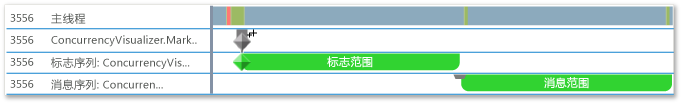
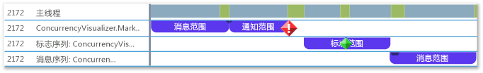

# <a name="how-to-use-the-concurrency-visualizer-markers-sdk"></a>如何：使用并发可视化工具标记 SDK
本主题演示如何使用并发可视化工具 SDK 来创建范围并编写标志、消息和警报。  
  
### <a name="to-use-c"></a>使用 C++  
  
1.  向应用程序添加并发可视化工具 SDK 支持。 有关详细信息，请参阅[并发可视化工具 SDK](../profiling/concurrency-visualizer-sdk.md)。  
  
2.  为该 SDK 添加 `include` 语句和 `using` 语句。  
  
    ```C++  
  
    #include <cvmarkersobj.h>  
    using namespace Concurrency::diagnostic;  
  
    ```  
  
3.  添加代码以在默认标记系列中创建三个范围，并编写一个标志、一条消息和一个警报（各自对应一个范围）。 用于编写标志、消息和警报的方法是 [marker_series](../profiling/marker-series-class.md) 类的成员。 [span](../profiling/span-class.md) 类的构造函数需要 `marker_series` 对象，以便让每个范围均与特定的标记系列相关联。 `span` 在被删除时结束。  
  
    ```C++  
  
    marker_series series;  
    span *flagSpan = new span(series, 1, _T("flag span"));  
    series.write_flag(_T("Here is the flag."));  
    delete flagSpan;  
  
    span *messageSpan = new span(series, 2, _T("message span"));  
    series.write_flag(_T("Here is the message."));  
    delete messageSpan;  
  
    span *alertSpan = new span(series, 3, _T("alert span"));  
    series.write_flag(_T("Here is the alert."));  
    delete alertSpan;  
  
    ```  
  
4.  在菜单栏上，依次选择“分析”、“并发可视化工具”、“从当前项目开始”以运行应用并显示并发可视化工具。 下图显示并发可视化工具中的三个范围和三种标记。  
  
       
  
5.  添加代码，以通过调用 `marker_series` 的构造函数（对标记系列采用字符串名称）来创建附加的自定义标记系列。  
  
    ```C++  
  
    marker_series flagSeries(_T("flag series"));  
    span *flagSeriesSpan = new span(flagSeries, 1, _T("flag span"));  
    flagSeries.write_flag(1, _T("flag"));  
    // Sleep to even out the display in the Concurrency Visualizer.  
    Sleep(50);  
    delete flagSeriesSpan;  
  
    marker_series messageSeries(_T("message series"));  
    span *messageSeriesSpan = new span(messageSeries, 1, _T("message span"));  
    messageSeries.write_message(1, _T("message"));  
    // Sleep to even out the display in the Concurrency Visualizer.  
    Sleep(50);  
    delete messageSeriesSpan;  
  
    ```  
  
6.  启动当前项目以显示并发可视化工具。 在“线程”视图中，两个标记系列显示在其各自的通道中。 下图显示两个新范围。  
  
       
  
### <a name="to-use-visual-basic-or-c"></a>使用 Visual Basic 或 C# #
  
1.  向应用程序添加并发可视化工具 SDK 支持。 有关详细信息，请参阅[并发可视化工具 SDK](../profiling/concurrency-visualizer-sdk.md)。  
  
2.  为该 SDK 添加 `using` 或 `Imports` 语句。  
  
    ```VB  
    Imports Microsoft.ConcurrencyVisualizer.Instrumentation  
  
    ```  
  
    ```CSharp  
    using Microsoft.ConcurrencyVisualizer.Instrumentation;  
    ```  
  
3.  添加代码以在默认标记系列中创建三个范围，并编写一个标志、一条消息和一个警报（各自对应一个范围）。 通过调用静态 [EnterSpan](assetId:///EnterSpan?qualifyHint=False&autoUpgrade=True) 方法创建 <xref:Microsoft.ConcurrencyVisualizer.Instrumentation.Span> 对象。 若要写入到默认系列，请使用 <xref:Microsoft.ConcurrencyVisualizer.Instrumentation.Markers> 类的静态写入方法。  
  
    ```VB  
  
    Dim flagSpan As Span = Markers.EnterSpan("flag span")  
    Markers.WriteFlag("Here is the flag.")  
    flagSpan.Leave()  
  
    Dim messageSpan As Span = Markers.EnterSpan("message span")  
    ' Sleep for a millisecond to even out the display in the Concurrency Visualizer.  
    System.Threading.Thread.Sleep(1)  
    Markers.WriteMessage("Here is a message")  
    messageSpan.Leave()  
  
    Dim alertSpan As Span = Markers.EnterSpan("alert span")  
    ' Sleep for a millisecond to even out the display in the Concurrency Visualizer.  
    System.Threading.Thread.Sleep(1)  
    Markers.WriteAlert("Here is an alert")  
    alertSpan.Leave()  
  
    ```  
  
    ```CSharp  
  
    Span flagSpan = Markers.EnterSpan("flag span");  
    Markers.WriteFlag("Here is the flag.");  
    flagSpan.Leave();  
  
    Span messageSpan = Markers.EnterSpan("message span");  
    // Sleep for a millisecond to even out the display in the Concurrency Visualizer.  
    System.Threading.Thread.Sleep(1);  
    Markers.WriteMessage("Here is a message");  
    messageSpan.Leave();  
  
    Span alertSpan = Markers.EnterSpan("alert span");  
    // Sleep for a millisecond to even out the display in the Concurrency Visualizer.  
    System.Threading.Thread.Sleep(1);  
    Markers.WriteAlert("Here is an alert");  
    alertSpan.Leave();  
    ```  
  
4.  在菜单栏上，依次选择“分析”、“并发可视化工具”、“从当前项目开始”以运行应用并显示并发可视化工具。 下图在并发可视化工具的“线程”视图中显示三个范围和三种标记。  
  
       
  
5.  添加代码，以使用静态 <xref:Microsoft.ConcurrencyVisualizer.Instrumentation.Markers.CreateMarkerSeries%2A> 方法创建自定义标记系列。 <xref:Microsoft.ConcurrencyVisualizer.Instrumentation.MarkerSeries> 类包含用于创建范围以及编写标志、消息和警报的方法。  
  
    ```VB  
  
    Dim flagSeries As MarkerSeries = Markers.DefaultWriter.CreateMarkerSeries("flag series")  
    Dim flagSeriesSpan As Span = flagSeries.EnterSpan("flag span")  
    System.Threading.Thread.Sleep(1)  
    flagSeries.WriteFlag(1, "flag")  
    System.Threading.Thread.Sleep(1)  
    flagSeriesSpan.Leave()  
  
    Dim messageSeries As MarkerSeries = Markers.DefaultWriter.CreateMarkerSeries("message series")  
    Dim messageSeriesSpan As Span = messageSeries.EnterSpan("message span")  
    messageSeries.WriteMessage("message")  
    System.Threading.Thread.Sleep(1)  
    messageSeriesSpan.Leave()  
    ```  
  
    ```CSharp  
  
    MarkerSeries flagSeries = Markers.DefaultWriter.CreateMarkerSeries("flag series");  
    Span flagSeriesSpan = flagSeries.EnterSpan("flag span");  
    System.Threading.Thread.Sleep(1);  
    flagSeries.WriteFlag(1, "flag");  
    System.Threading.Thread.Sleep(1);  
    flagSeriesSpan.Leave();  
  
    MarkerSeries messageSeries = Markers.DefaultWriter.CreateMarkerSeries("message series");  
    Span messageSeriesSpan = messageSeries.EnterSpan("message span");  
    messageSeries.WriteMessage("message");  
    System.Threading.Thread.Sleep(1);  
    messageSeriesSpan.Leave();  
    ```  
  
6.  启动当前项目以显示并发可视化工具。 在“线程”视图中，三个标记系列显示在其各自的通道中。 下图显示三个新范围。  
  
       
  
## <a name="see-also"></a>另请参阅  
 [并发可视化工具 SDK](../profiling/concurrency-visualizer-sdk.md)


<!--HONumber=Feb17_HO4-->


