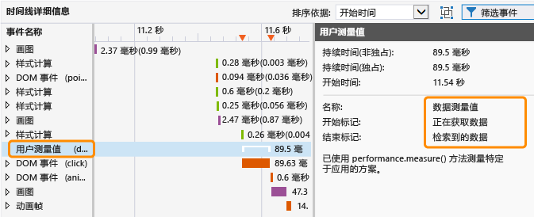
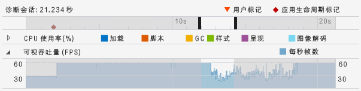
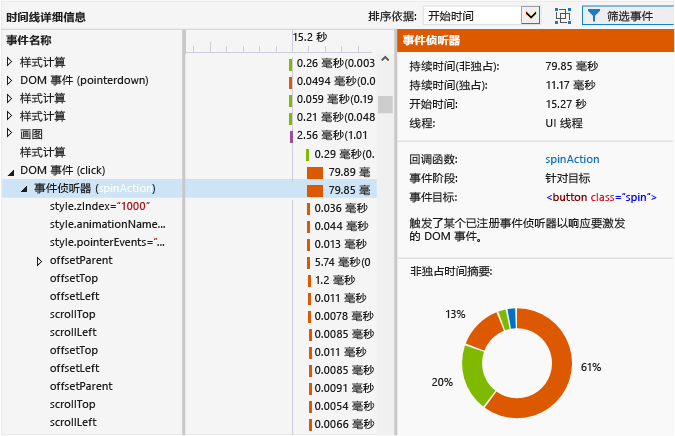
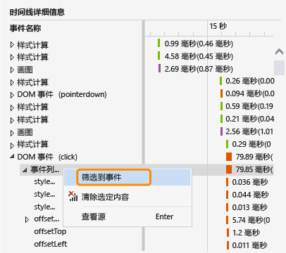
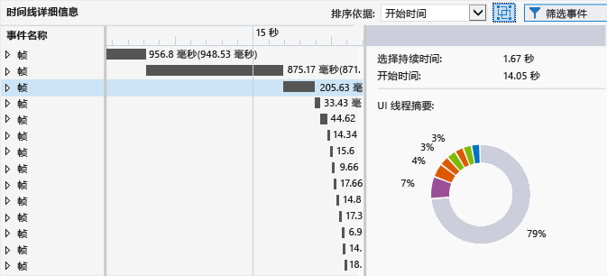

# <a name="analyze-html-ui-responsiveness-in-universal-windows-apps"></a>分析中通用 Windows 应用中的 HTML UI 响应能力
本主题介绍如何使用 UI 响应能力探查器（一种可用于 Windows 通用应用的性能工具）隔离应用中的性能问题。  
  
 UI 响应能力探查器可以帮助你隔离诸如 UI 响应问题或平台副效应等问题，它们通常具有以下症状：  
  
-   UI 中的响应能力不足。 如果 UI 线程阻塞，应用程序的响应速度可能很慢。 阻塞 UI 线程的事件包括，过多的同步 JavaScript 代码、过多的 CSS 布局或 CSS 计算工作、同步 XHR 请求、垃圾回收、过多的绘制时间或处理器密集型 JavaScript 代码。  
  
-   应用或页面加载速度缓慢。 这通常是由加载资源所花费的时间过长引起的。  
  
-   视觉对象更新频率比预期频率低。 如果 UI 线程太忙而无法保持平稳的帧速率，就会出现此情况。 例如，UI 线程忙碌时，可能会丢弃帧。 某些非 UI 线程工作（例如网络请求、图像解码和绘制工作）也会限制视觉对象更新频率。 （并非所有绘制工作都在 UI 线程上执行。  
  
##  <a name="RunningProfiler"></a> 运行 HTML UI 响应能力工具  
 如果工作的 Windows 通用或 Windows 应用商店应用在 Visual Studio 中打开或安装在运行 Windows 8 或更高版本的计算机上，则可使用 HTML UI 响应能力工具。  
  
1.  如果从 Visual Studio 中运行应用程序，请在 **“标准”** 工具栏上的 **“启动调试”** 列表中，选择一个部署目标，例如某个 Windows Phone 仿真器、 **“本地计算机”**、 **“模拟器”**或 **“远程计算机”**。  
  
2.  在“调试”  菜单上，选择“性能探查器...” 。  
  
     如果要更改探查器的分析目标，请选择“更改目标”。  
  
       
  
     以下选项可用于分析目标：  
  
    -   **“启动项目”**。 选择此选项可分析当前启动项目。 如果在远程计算机或设备上运行应用程序，则必须使用此设置，这是默认值。  
  
    -   **“正在运行的应用程序”**。 选择此选项可从正在运行的应用程序的列表中选择 Windows 应用商店应用。 在远程计算机或设备上运行应用程序时，不能使用此选项。  
  
         当你无权访问源代码时，可以使用此选项分析在计算机上运行的应用程序的性能。  
  
    -   **“已安装的应用程序”**。 选择此选项可选择要分析的已安装应用程序。 在远程计算机或设备上运行应用程序时，不能使用此选项。  
  
         当你无权访问源代码时，可以使用此选项分析在计算机上安装的应用程序的性能。 如果要分析你自己的应用程序开发之外的任何应用程序的性能，也可使用此选项。  
  
3.  从 **“可用工具”**中，选择 **“HTML UI 响应能力”**，然后选择 **“启动”**。  
  
4.  启动 UI 响应能力探查器时，可能会显示一个用户帐户控制窗口，要求您提供运行 Visual Studio ETW Collector.exe 的权限。 选择 **“是”**。  
  
     与应用程序交互，测试相关的性能方案。 有关详细工作流，请参阅 [隔离 UI 响应能力问题](#Workflow) 和 [Isolate a visual throughput problem](#IsolateVisualThroughput)。  
  
5.  按 Alt+Tab 切换到 Visual Studio。  
  
6.  若要停止分析探查器收集的应用程序和视图数据，请选择 **“停止收集”**。  
  
##  <a name="IsolateAnIssue"></a> 隔离问题  
 下一节会提供帮助你隔离性能问题的建议。 有关如何通过使用样本性能测试应用来标识和修复性能问题的分步说明，请参阅[演练：改进 UI 响应能力 (HTML)](../profiling/walkthrough-improving-ui-responsiveness-html.md)。  
  
###  <a name="Workflow"></a> 隔离 UI 响应能力问题  
 以下是建议的工作流步骤，可帮助你更有效地使用 UI 响应能力探查器：  
  
1.  在 Visual Studio 中打开应用程序。  
  
2.  测试应用程序的 UI 响应能力问题。 （按 Ctrl+F5 以启动应用程序而不进行调试。  
  
     如果发现问题，请继续测试以尝试缩小发生问题的时间范围，或尝试确定导致该行为的触发器。  
  
3.  切换回 Visual Studio（按 Alt+Tab），并停止应用程序 (Shift+F5)。  
  
4.  或者，使用 performance.mark [标记要分析的代码](#ProfileMark)。  
  
    > [!TIP]
    >  在查看探查器数据时，用户标记可帮助你确定响应能力问题。 例如，可以在导致响应能力问题的代码部分的开头和结尾添加用户标记。  
  
5.  按照上一节中的说明运行 UI 响应能力探查器。  
  
6.  将该应用程序置于导致 UI 响应能力问题的状态。  
  
7.  切换到 Visual Studio（按 Alt+Tab），在 UI 响应能力探查器的“探查器”选项卡中选择 **“停止收集”** 。  
  
8.  如果你已添加用户标记，它们将显示在探查器的 [查看诊断会话时间线](#Ruler) 中。 下图显示了一个用于指定你的代码中某一特定操作的用户标记。  
  
       
  
9. 可使用用户标记、应用程序生命周期事件或图中可见的数据，确定时间线和探查器图中相关的区域。 以下是一些帮助你分析和使用图中的数据的准则：  
  
    -   使用 [查看诊断会话时间线](#Ruler) 查看 [标记要分析的代码](#ProfileMark)、应用生命周期事件和这些事件的关联时间线以及其他图中数据的时间线。  
  
    -   使用 [CPU utilization graph](#CPUutilization) 查看关于特定时间段内 CPU 活动及其处理的工作类型的一般信息。 CPU 活动过多的时间段更有可能导致响应能力问题和丢弃的帧。  
  
    -   如果你正在开发游戏或富媒体应用，请使用 [查看可视吞吐量 (FPS)](#VisualThroughput) 确定帧速率下降的时间段。  
  
10. 通过单击这两个图中的任一个图的某个部分并拖动指针（或通过使用 Tab 键和箭头键）进行选择，在图中选择相关的区域。 通过以上方法选择一个时间段后，探查器下方窗格中的“时间线详细信息”图将更改为仅显示选定时间段。  
  
     下图显示了 CPU 使用率图，突出显示了相关的区域。  
  
       
  
11. 使用 [查看时间线详细信息](#TimelineDetails) 获取有关运行太过频繁或要花费太多时间来完成的事件的详细信息。 例如，查找以下内容：  
  
    -   事件侦听器、计时器和动画帧回调。 根据特定事件，已提供的数据可能包含已修改的 DOM 元素的 ID、已修改的 CSS 属性的名称、源位置的链接和关联事件或回调函数的名称。  
  
    -   导致渲染元素的布局或脚本事件，例如对 `window.getComputedStyles`的调用。 提供事件的关联的 DOM 元素。  
  
    -   应用程序加载的页面或 URL 资源，例如 HTML 分析事件的脚本计算。 提供文件名或资源。  
  
    -   在以下部分中指定的其他事件： [Profiler event reference](#ProfilerEvents)。  
  
    > [!TIP]
    >  探查器中的大部分有用信息显示在“时间线详细信息”图中。  
  
12. 在“CPU 使用率”或“可视吞吐量”(FPS) 图中选择一个区域后，选择 **“放大”** （按钮或上下文菜单）可获取更为详细的信息。 此图的时间线将更改为仅显示选定时间段。  
  
13. 放大后，选择“CPU 使用率”或“可视吞吐量”图的一部分。 做出选择后，探查器下方窗格中的“时间线详细信息”图将更改为仅显示选定时间段。  
  
###  <a name="IsolateVisualThroughput"></a> Isolate a visual throughput problem  
 CPU 利用率过高的时间段可能会导致帧速率较低或不一致。 如果开发富媒体应用程序和游戏，“可视吞吐量”图可能会比“CPU 使用率”图提供更重要的数据。  
  
 若要隔离可视吞吐量问题，请按照上节所述的步骤操作，但要使用“可视吞吐量”图作为其中一个关键数据点。  
  
###  <a name="ProfileMark"></a> 标记要分析的代码  
 若要隔离与图中所显示数据关联的应用程序代码部分，你可以在应用程序中添加一个函数调用，指示探查器在函数执行时向时间线中插入一个用户标记（倒三角形）。 你添加的所有用户标记均显示在“CPU 使用率”图、“可视吞吐量”图和“时间线详细信息”图的时间线中。  
  
 若要添加用户标记，请将以下代码添加到你的应用程序中。 此示例使用“getting data”（获取数据）作为事件说明。  
  
```javascript  
if (performance && performance.mark) {  
    performance.mark("getting data");  
}  
  
```  
  
 将鼠标指针停留在用户标记上时，该事件说明将会作为工具提示显示。 可以根据需要添加许多用户标记。  
  
> [!NOTE]
>  `console.timeStamp`，Chrome 命令，也显示为用户标记。  
  
 下图显示了包含一个用户标记及其工具提示的诊断标尺。  
  
   
  
 你还可以在时间线详细信息视图中创建工具生成的事件，以显示两个用户标记之间所经过的持续时间。 以下代码添加第二个用户标记和在两个用户标记的执行之间所经过的时间度量（上面的代码显示第一个用户标记）。  
  
```javascript  
if (performance.mark && performance.measure) {  
    performance.mark("data retrieved");  
    performance.measure("data measure", "getting data", "data retrieved");  
}  
```  
  
 如果未指定第二个用户标记，则 `performance.measure` 使用时间戳作为第二个用户标记。 第一个用户标记是必需的。  
  
 持续时间度量在时间线详细信息视图中显示为 **“用户测量”** 事件，并且在选中时显示详细信息。  
  
   
  
##  <a name="AnalyzeData"></a> 分析数据  
 以下各节提供了有助于解释在探查器中显示的数据的信息。  
  
###  <a name="Ruler"></a> 查看诊断会话时间线  
 探查器顶部的标尺将显示已分析信息的时间线。 此时间线适用于“CPU 使用率”图和“可视吞吐量”图。  
  
 下面是诊断会话时间线的外观，其中包含为几个应用程序生命周期事件显示的工具提示：  
  
   
  
 时间线显示应用程序生命周期事件（例如激活事件）的发生时间，并显示可添加到代码中的用户标记（用户标记三角形）。 可选择事件以显示包含更多信息的工具提示。 有关用户标记的详细信息，请参阅本主题中的 [标记要分析的代码](#ProfileMark) 。  
  
 应用程序生命周期事件显示为菱形符号。 这些事件为 DOM 事件，包括：  
  
-   `DOMContentLoaded` 和 `Load` 事件，通常出现在代码中激活的事件处理程序中。 此事件的工具提示显示特定事件和 URL。  
  
-   导航事件，在导航到其他页面时发生。 此事件的工具提示显示目标页面 URL。  
  
###  <a name="CPUUtilization"></a> 查看 CPU 使用率  
 通过“CPU 使用率”图可确定 CPU 活动过多的时间段。 该图提供一段时间内应用程序的 CPU 平均消耗量信息。 信息使用了彩色编码来表示以下具体类别： **“加载”**、 **“脚本”**、垃圾回收（**“GC”**）、 **“样式”**、 **“呈现”**和 **“图像解码”**。 有关这些类别的详细信息，请参阅本主题后面部分的 [Profiler event reference](#ProfilerEvents) 。  
  
 “CPU 使用率”图显示在所有应用程序线程上花费的时间，它将一个或多个 CPU 的 CPU 使用率值合并为一个百分比值。 当多个 CPU 正在使用时，CPU 使用率值可能超过 100%。  
  
> [!NOTE]
>  图中不显示 GPU 利用率。  
  
 下例显示了“CPU 使用率”图的外观：  
  
   
  
 使用此图可以：  
  
-   识别一般关注区域。  
  
-   选择要显示在“时间线详细信息”图中的特定时间段。 若要选择一个时间段，请选择此图的一部分并拖动指针进行选择。  
  
-   通过选择 **“放大”** 按钮可获取选定时间段的更详细的视图。  
  
 有关使此图的详细信息，请参阅本主题中的 [Isolate a UI responsiveness problem](#Workflow) 。  
  
###  <a name="VisualThroughput"></a> 查看可视吞吐量 (FPS)  
 通过“可视吞吐量”图可确定帧速率下降的时间段。 该图显示应用程序的每秒帧数 (FPS)。 此图最适于游戏和富媒体应用程序的开发。  
  
 显示的 FPS 值可能与实际帧速率不同。 检查此图中的数据时，请记住以下信息：  
  
-   此图显示应用程序在任何特定时间均可达到的 FPS。 应用程序空闲时，FPS 与监视器刷新频率相同。  
  
-   应用程序执行需要视觉对象更新的工作时，此图显示实际的 FPS。  
  
-   如果丢弃帧，此图显示零值。  
  
 下例显示了“可视吞吐量”图的外观：  
  
   
  
 使用“可视吞吐量”图可以：  
  
-   识别一般关注区域。  
  
-   选择要显示在“时间线详细信息”图中的特定时间段。 若要选择一个时间段，请选择此图的一部分并拖动指针进行选择。  
  
-   通过选择 **“放大”** 按钮可获取选定时间段的更详细的视图。  
  
###  <a name="TimelineDetails"></a> 查看时间线详细信息  
 “时间线详细信息”图显示在 UI 响应能力探查器的底部窗格中。 该图提供关于选定时间段内消耗最多 CPU 时间的事件的顺序和分层信息。 该图可帮助你确定触发特定事件的原因，对于某些事件，还可确定如何找到与事件对应的源代码。 该图还有助于确定在屏幕上绘制视觉对象更新所需的时间。  
  
 该图显示 UI 线程工作并关注可导致视觉对象更新缓慢的后台线程。 此图不显示 JavaScript JIT 工作、异步 GPU 工作、在宿主进程之外执行的工作（例如 RuntimeBroker.exe 和 dwm.exe 工作），或尚未基于分析目的而检测的 Windows 运行时方面的工作（例如磁盘 I/O）。  
  
> [!TIP]
>  当后台线程发生事件时，事件名称旁边的括号内将显示线程 ID。  
  
 下例显示了选择 DOM Click 事件的事件侦听器后，“时间线详细信息”图的外观：  
  
   
  
 在此图中， **“事件名称”** 列中的 **“spinAction”** 事件处理程序是一个链接，选择该链接后，将转至源代码中的事件处理程序。 在右窗格中， **“回调函数”** 属性提供源代码的相同链接。 其他属性也提供了有关此事件的信息，例如，关联的 DOM 元素。  
  
 如果选择“CPU 使用率”图和“可视吞吐量”(FPS) 图的时间线的一部分，则“时间线详细信息”图将显示选定时间段的详细信息。  
  
 “时间线详细信息”图中的事件使用彩色编码表示“CPU 使用率”图中所示的相同类别的工作。 有关事件类别和特定事件的更多信息，请参阅本主题中的 [Profiler event reference](#ProfilerEvents) 。  
  
 使用“时间线详细信息”图可以：  
  
-   在时间线和网格视图中查看事件的大致启动时间、持续时间和结束时间。 “时间线详细信息”图可根据缩放状态在网格视图中显示从 30 毫秒到 30 秒不等的时间段。 对于持续时间值：  
  
    -   非独占时间表示包含事件子级在内的事件持续时间。 在网格视图中，首先显示此值。  
  
    -   独占时间表示不包含事件子级在内的事件持续时间。 在网格视图中，此值显示在括号中。  
  
-   展开层次结构中的一个事件可查看其子级。 事件子级为由父事件引发的其他事件。 例如，DOM 事件可能包含显示为子级的事件侦听器。 事件侦听器可能包含由其导致的其他事件，如布局事件。  
  
-   按启动时间（默认）或持续时间对事件排序。 使用 **“排序方式”** 列表可以选择一个排序方法。  
  
-   在详细信息窗格（右窗格）中查看每个事件的详细信息。 属性因特定事件而异，如以下示例所示：  
  
    -   对于计时器、事件侦听器（DOM 事件）和动画帧回调， **“回调函数”** 属性提供源代码位置的链接以及事件处理程序或回调函数的名称。  
  
    -   对于计时器、事件侦听器（DOM 事件）、布局事件和动画帧回调， **“非独占时间摘要”** 部分（彩色编码环）中会显示选定事件及其所有子项的彩色编码摘要。 图像中彩色编码的每一片都表示一个事件类型。 工具提示提供事件类型名称。  
  
    > [!TIP]
    >  时间线详细信息图和 **“包含时间摘要”** 可帮助你识别需要优化的方面。 如果其中一个视图显示有大量的小型任务，则事件可能需要优化。 例如，应用可能会频繁刷新 DOM 元素，造成大量布局和 HTML 解析事件。 你或许能够通过批处理此工作来优化性能。  
  
###  <a name="FilterTimelineDetails"></a> 筛选时间线详细信息  
 通过从指定事件的上下文菜单中选择 **“筛选到事件”** ，可以在时间线详细信息中将视图筛选到特定事件。 当选择此选项时，时间线和网格视图的范围限于所选事件。 “CPU 使用率”图中选定内容的范围也限于特定事件。  
  
   
  
###  <a name="FilterEvents"></a> 筛选事件  
 可以从“时间线详细信息”图中筛选出一些事件以对数据降噪，或为性能方案去除不相关的数据。 你可以按事件名称或事件持续时间或者此处所述的特定筛选器来进行筛选。  
  
 若要筛选出图像解码、推理下载和 GC 事件，请从下窗格中的筛选器图标中清除 **“后台活动”** 选项。 由于这些事件不是很好操作，因此默认情况下已将其隐藏。  
  
   
  
 若要筛选出 HTTP 请求事件，请从下窗格中的筛选器图标中清除 **“网络流量”** 选项。 默认情况下，这些事件显示在“时间线详细信息”图中。  
  
 若要筛选出 UI 线程活动，请清除 **“UI 活动”** 选项。  
  
> [!TIP]
>  清除此选项并选择“网络流量”选项以调查与网络延迟相关的问题。  
  
 若要筛选出用户度量，请清除 **“用户测量”** 选项。 用户测量是无子项的顶级事件。  
  
###  <a name="GroupFrames"></a> 通过框为事件分组  
 你可以将时间线详细信息视图中显示的事件分组为单个帧。 这些帧事件是工具生成的事件，并且代表所有在绘制事件之间发生的 UI 线程工作的顶级事件容器。 若要启用此视图，请选择 **“按帧为顶级事件分组”**。  
  
   
  
 当按帧为事件分组时，时间线详细信息视图中的每个顶级事件代表一帧。  
  
   
  
##  <a name="SaveSession"></a> 保存诊断会话  
 在 Visual Studio 中，你可以在关闭与诊断会话关联的选项卡时保存此会话。 保存的会话以后可以重新打开。  
  
##  <a name="ProfilerEvents"></a> Profiler event reference  
 UI 响应能力探查器中对探查器事件进行了分类和彩色编码。 事件类别如下：  
  
-   **加载。** 指示应用程序首次加载时检索应用程序资源和解析 HTML 与 CSS 所用的时间。 这可能包括网络请求。  
  
-   **脚本。** 指示解析和运行 JavaScript 所用的时间。 这包括 DOM 事件、计时器、脚本计算和动画帧工作。 其中包含用户代码和库代码。  
  
-   **GC。** 指示垃圾回收所用的时间。  
  
-   **样式。** 指示解析 CSS 和计算元素呈现与布局所用的时间。  
  
-   **呈现。** 指示绘制屏幕所用的时间。  
  
-   **图像解码。** 指示对图像进行解压缩和解码所用的时间。  
  
 对于脚本和样式类别，UI 响应能力探查器可能提供你在“时间线详细信息”图中可操作的数据。 如果识别出脚本问题，你可以运行 CPU 采样探查器与 UI 响应能力探查器。 或者，可以使用 Visual Studio 函数探查器以获取更详细的数据。 有关详细信息，请参阅 [JavaScript 内存](../profiling/javascript-memory.md)。  
  
 对于其他事件类别，你也许能够识别出由于向应用程序中添加功能而导致的平台副效应，但在这些情况下，可能无法使用 UI 响应能力探查器解决特定的性能问题。  
  
 下表显示了事件及其说明：  
  
|Event|事件类别|在出现以下情况时发生|  
|-----------|--------------------|-----------------|  
|CSS 解析|“加载”|发现了新 CSS 内容，而且尝试解析 CSS 内容。|  
|HTML 解析|“加载”|发现了新 HTML 内容，而且尝试将此内容解析到节点并将内容插入到 DOM 树。|  
|HTTP 请求|“加载”|在 DOM 中找到了远程资源，或者创建了生成 HTTP 请求的 XMLHttpRequest。|  
|推理下载|“加载”|已在页面的 HTML 内容中搜索所需的资源，以便快速调度对资源的后续 HTTP 请求。|  
|动画帧回调函数|“脚本”|浏览器即将呈现另一个帧，这触发了应用程序提供的回调函数。|  
|DOM 事件|“脚本”|已发生并执行 DOM 事件。<br /><br /> DOM 事件的 `context` 属性（例如  `DOMContentLoaded` 或 `click`）显示在括号中。|  
|事件侦听器|“脚本”|已调用并执行事件侦听器。|  
|媒体查询侦听器|“脚本”|已注册的媒体查询无效化，这导致了其关联的侦听器的执行。|  
|转变观察器|“脚本”|已修改一个或多个观察到的 DOM 元素，这导致执行与 MutationObserver 关联的回调。|  
|脚本计算|“脚本”|在 DOM 中找到了新的脚本元素，并且尝试解析和执行此脚本。|  
|计时器|“脚本”|计划的计时器过时，从而导致执行其关联的回调函数。|  
|Windows 运行时异步回调函数|“脚本”|Windows 运行时对象完成了触发 `Promise` 回调函数的异步操作。|  
|Windows 运行时事件|“脚本”|Windows 运行时对象上发生的事件触发了注册侦听器。|  
|垃圾回收|“GC”|收集不再使用的对象的内存所用的时间。|  
|CSS 计算|“样式”|已对 DOM 进行更改，要求重新计算所有受影响的元素的样式属性。|  
|布局|“样式”|已对 DOM 进行更改，要求重新计算所有受影响的元素的大小和/或位置。|  
|画图|“呈现”|已对 DOM 进行可视更改，并且尝试重新呈现页面的各部分。|  
|呈现层|“呈现”|已对 DOM 的独立呈现片段（称为层）进行可视更改，这些更改要求呈现此页面的一个部分。|  
|“图像解码”|“图像解码”|向 DOM 中加入了一个图像，并且尝试将该图像从其原始格式解压缩并解码成位图。|  
|Frame|不可用|对需要重新提取页面的所有受影响部分的 DOM 进行了可视更改。 这是用于分组的工具生成的事件。|  
|“用户测量”|不可用|使用 `performance.measure` 方法测量应用特定的方案。 这是用于分析代码的工具生成的事件。|  
  
##  <a name="Tips"></a> 其他信息  
  
-   观看 [此视频](http://channel9.msdn.com/Events/Build/2013/3-316) （来自 Build 2013 大会，介绍了 UI 响应能力探查器）。  
  
-   阅读关于使用 JavaScript 为 Windows 生成的 Windows 应用商店应用程序的性能提示。 有关更多信息，请参阅 [采用 JavaScript 的 Windows 应用商店应用的性能最佳做法](http://msdn.microsoft.com/library/windows/apps/hh465194.aspx)。  
  
-   若要了解单线程代码执行模型和性能，请参见 [执行代码](http://msdn.microsoft.com/library/windows/apps/hh781217.aspx)。  
  
## <a name="see-also"></a>另请参阅  
 [分析工具](../profiling/profiling-tools.md)
