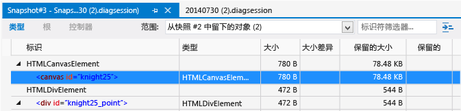
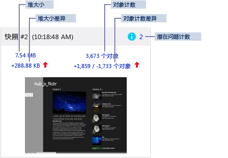
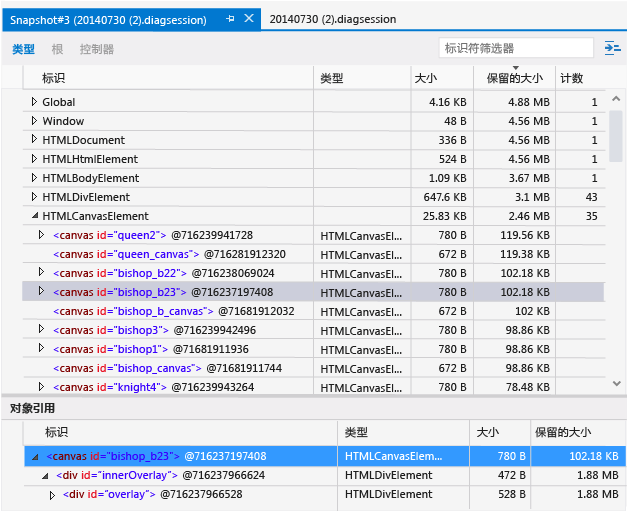

# <a name="analyze-javascript-memory-usage-in-uwp-apps"></a>分析 UWP 应用中的 JavaScript 内存使用情况
JavaScript 内存分析器在 Visual Studio 中提供，旨在帮助你了解内存使用情况，在使用 JavaScript 为 Windows 构建的应用商店应用中查找内存泄漏。 受支持的应用包括通用 Windows 应用的应用。
  
 JavaScript 内存分析器可以为你执行以下操作：  
  
-   通过强调最相关的数据帮助你在应用程序中快速查找内存使用情况问题。  
  
     你将以快照摘要形式收到此数据，其显示两个快照之间的差异，并提供指向更详细视图的链接。  
  
-   提供控制器、类型和根的视图来帮助隔离问题。  
  
-   减少 JavaScript 堆数据中的不可操作的信息。  
  
     不是直接在应用程序代码中创建的对象将被自动筛选出来。 还可按对象名称筛选数据。  
  
 有关引导用户在正在运行的应用中完成内存泄露查找过程的教程，请参阅[演练：查找内存泄漏 (JavaScript)](../profiling/walkthrough-find-a-memory-leak-javascript.md)。  
  
 在本主题中：  
  
 [运行 JavaScript 内存分析器](#Run)   
 [检查内存使用量](#Check)   
 [Isolate a memory leak](#Isolate)   
 [查看实时内存使用量摘要](#LiveMemory)   
 [View a snapshot summary](#SnapshotSummary)   
 [查看快照详细信息](#SnapshotDetails)   
 [查看快照差异](#SnapshotDiff)   
 [按控制器查看对象](#FoldObjects)   
 [按标识符筛选数据](#Filter)   
 [在对象树中查找对象](#ShowInRootsView)   
 [查看共享对象引用](#References)   
 [显示内置对象](#BuiltInValues)   
 [保存诊断会话文件](#Save)   
 [Associate source code with memory usage data](#JSConsoleCommands)   
 [确定内存问题的提示](#Tips)  
  
##  <a name="Run"></a> 运行 JavaScript 内存分析器  
 如果工作的 Windows 应用商店应用在 Visual Studio 中打开或安装在运行 [!INCLUDE[win8](../debugger/includes/win8_md.md)] 或更高版本的计算机上，则可使用内存分析器。  
  
#### <a name="to-run-the-memory-analyzer"></a>运行内存分析器  
  
1.  打开 Visual Studio。  
  
2.  如果从 Visual Studio 中运行应用，请在 **“标准”** 工具栏上的 **“启动调试”** 列表中，选择项目的调试目标：Windows Phone 仿真程序或 Windows 应用商店应用、 **“本地计算机”**、 **“模拟器”**或者 **“远程计算机”**。  
  
     有关这些选项的详细信息，请参阅[从 Visual Studio 运行应用](../debugger/run-store-apps-from-visual-studio.md)。  
  
3.  在菜单栏上，选择“调试”、“性能探查器...”。  
  
     默认情况下，将分析当前启动项目。 如果要更改分析目标，请选择 **“更改目标”**。  
  
       
  
     以下选项可用于分析目标：  
  
    -   **“启动项目”**。 分析当前启动项目。 如果你要在远程计算机上运行应用程序，则必须选择此选项，这是默认值。  
  
    -   **“正在运行的应用程序”**。 允许你从正在运行的应用列表中选择 Windows 应用商店应用。 在远程计算机上运行应用程序时，不能使用此选项。  
  
         当你无权访问源代码时，请使用此选项分析计算机上运行的应用程序的内存使用量。  
  
    -   **“已安装的应用程序”**。 允许你选择要分析的已安装的 Windows 应用商店应用。 在远程计算机上运行应用程序时，不能使用此选项。  
  
         当你无权访问源代码时，请使用此选项分析计算机上安装的应用程序的内存使用量。 如果要分析你自己的应用程序开发之外的任何应用程序的内存使用量，此选项也很有用。  
  
4.  从 **“可用工具”**中，选中 **“JavaScript 内存”** 复选框，然后选择 **“启动”**。  
  
5.  启动内存分析器时，可能会显示一个“用户帐户控制”窗口，要求你提供运行 Visual Studio ETW Collector.exe 的权限。 选择 **“是”**。  
  
     与应用程序交互以测试相关的内存使用量方案并查看内存关系图，如以下各节所述。  
  
6.  按 Alt+Tab 切换到 Visual Studio。  
  
7.  若要查看内存分析器正在收集的数据，请选择 **“拍摄堆快照”**。 请参阅本主题后面部分的 [View a snapshot summary](#SnapshotSummary) 。  
  
##  <a name="Check"></a> 检查内存使用量  
 可以尝试通过在 JavaScript 内存分析器使用不同的视图来确定内存泄漏。 如果你已怀疑应用正在泄露内存，请参阅 [Isolate a memory leak](#Isolate) 获取建议的工作流。  
  
 使用以下视图来帮助确定应用程序中的内存泄漏：  
  
-   [查看实时内存使用量摘要](#LiveMemory). 使用内存使用量图来查找内存使用量的突然增长或由特定操作导致的连续增长的内存使用量。 使用实时内存使用量摘要视图来拍摄堆的快照。 这些快照在内存使用量图中显示为一个集合。  
  
    > [!TIP]
    >  你在拍摄快照时将看到出现内存使用高峰。 使用快照摘要可获取更准确的增长指示信息。  
  
-   [View a snapshot summary](#SnapshotSummary). 可以在内存分析会话期间或之后查看快照摘要信息。 使用快照摘要可链接到快照详细信息和快照差异视图。  
  
    > [!TIP]
    >  通常，快照差异视图将提供有关内存泄漏的最有用的信息。  
  
-   [查看快照详细信息](#SnapshotDetails). 显示单个快照的详细内存使用量数据。  
  
-   [查看快照差异](#SnapshotDiff). 显示快照之间的差异值。 这些视图将显示对象大小和对象计数方面的差异。  
  
##  <a name="Isolate"></a> Isolate a memory leak  
 以下是可帮助你更有效地使用 JavaScript 内存分析器的工作流步骤。 如果你怀疑你的应用程序有内存泄漏，这些步骤将非常有用。 有关引导用户在正在运行的应用中完成内存泄露查找过程的教程，请参阅[演练：查找内存泄漏 (JavaScript)](../profiling/walkthrough-find-a-memory-leak-javascript.md)。  
  
1.  在 Visual Studio 中打开应用程序。  
  
2.  运行 JavaScript 内存分析器。 有关更多信息，请参见 [运行 JavaScript 内存分析器](#Run)。  
  
3.  通过要测试的方案运行应用。 例如，方案可能涉及大型 DOM 转变、加载特定页时或启动应用时。  
  
4.  再重复执行该方案 1-4 次。  
  
    > [!TIP]
    >  通过重复执行测试方案多次，将有助于确保从结果中筛选出初始化工作。  
  
5.  切换到 Visual Studio（按 Alt+Tab）。  
  
6.  通过选择 **“拍摄堆快照”**拍摄基线堆快照。  
  
     下图演示了一个基线堆快照示例：  
  
       
  
    > [!TIP]
    >  若要对快照计时进行更精确的控制，则可以在代码中使用 [Associate source code with memory usage data](#JSConsoleCommands) 命令。  
  
7.  切换到你的应用并重复执行正在测试的方案（仅重复执行一次）。  
  
8.  切换到 Visual Studio 并拍摄第二个快照。  
  
9. 切换到你的应用并重复执行正在测试的方案（仅重复执行一次）。  
  
10. 切换到 Visual Studio 并拍摄第三个快照。  
  
     下图演示了第二个和第三个快照的示例：  
  
       
  
     通过拍摄此工作流中的基线快照、第二个和第三个快照，可以更轻松地筛选出与内存泄漏不相关的更改。 例如，预计可能有一些更改（如在页面上更新页眉和页脚）会造成内存使用量的更改，但可能与内存泄漏不相关。  
  
11. 从第三个快照中，选择指向某个差异视图的链接：  
  
    -   差异堆大小（堆大小下的左侧链接）。 此链接文本显示当前快照的堆大小和前一个快照的堆大小之间的差异。  
  
    -   差异对象计数（对象计数下的右侧链接）。 此链接文本将显示两个值（例如，+1858 / -1765）：第一个值是自前一个快照以来添加的新对象的数量，第二个值是自前一个快照以来移除的对象的数量。  
  
     这些链接将打开堆上类型差异快照详细信息视图，该视图按保留大小或对象计数排序，具体取决于你打开的链接。  
  
12. 选择以下 **“范围”** 筛选器选项之一以帮助确定内存使用情况问题：  
  
    -   **“从快照 #2 中留下的对象”**。  
  
    -   **在快照 #2 和快照 #3 之间添加的对象**  
  
    > [!TIP]
    >  使用从上一个快照留下的对象筛选出的对象的视图，来调查内存泄漏。 例如，如果差异对象计数为 +205 / -195，则该视图将显示 10 个被留下的对象，并且这些对象表明可能存在内存泄漏。  
  
     下图显示了一个从快照 #2 留下的对象的差异视图。  
  
       
  
     在上图中，我们可以看到从上一个快照留下的两个对象。 调查这是否是特定应用的预期行为。 若不是，则可能指示内存泄漏。  
  
13. 若要查看差异视图中的对象植根于全局对象中的位置，以防止将其作为垃圾回收，请打开对象的快捷菜单，然后选择 **“在根视图中显示”**。 大量对象可能保留在内存中，因为它们由单个对象（或几个对象）引用，并且它们植根于全局对象中。  
  
14. 如果留下的对象视图中的对象太多，请尝试进一步隔离发生内存泄漏的期间，然后重新拍摄这三个快照。 若要进一步隔离内存泄露，请使用 [将源代码与内存使用量数据关联](#JSConsoleCommands)、 [将源代码与内存使用量数据关联](#JSConsoleCommands)以及内存分析器中提供的其他内存使用量数据。  
  
##  <a name="LiveMemory"></a> 查看实时内存使用量摘要  
 实时内存使用量摘要视图提供了正在运行的应用程序的内存使用量图，以及所有快照摘要图块的集合。 在此视图中，可以执行拍摄快照、分析摘要信息和导航到其他视图等基本任务。 当你停止收集数据时，内存关系图将消失，你将只看到 [View a snapshot summary](#SnapshotSummary) 视图。  
  
 内存关系图显示应用程序进程内存的活动视图，包括专用字节、本机内存和 JavaScript 堆。 内存关系图是进程内存的可滚动视图。 如下所示：  
  
   
  
 如果你已将用户标记添加到应用代码（请参阅 [Associate source code with memory usage data](#JSConsoleCommands)），将在内存使用量图中显示一个插入的三角形以指示何时达到该代码部分。  
  
 内存关系图中显示的一些内存是由 JavaScript 运行时分配的。 你无法在应用程序中控制此内存使用量。 当你拍摄第一个快照时，关系图中显示的内存使用量会增加，之后该使用量会对每个附加的快照按最低限度增加。  
  
##  <a name="SnapshotSummary"></a> View a snapshot summary  
 若要拍摄应用程序内存使用量的当前状态的快照，请从内存关系图中选择 **“拍摄堆快照”** 。 快照摘要图块会同时出现在实时内存使用量摘要（在应用程序运行时）和快照摘要（在应用程序停止时）中，它提供了有关 JavaScript 堆的信息和指向更详细的信息的链接。 如果拍摄了两个或更多快照，则快照将提供更多信息以将其数据与前一个快照的数据进行比较。  
  
> [!NOTE]
>  JavaScript 内存分析器会在拍摄每个快照之前强制进行垃圾回收。 这有助于确保各个运行中的结果更加一致。  
  
 以下是你拍摄多个快照时的快照摘要的示例。  
  
   
  
 快照摘要包括：  
  
-   快照标题和时间戳。  
  
-   潜在问题计数（用蓝色信息图标标记）。 此数字（如果存在）标识潜在内存问题（例如，节点未附加到 DOM）的数目。 此计数将链接到快照的类型视图，此视图按照问题类型进行排序以突出显示潜在问题。 工具提示中将显示问题的说明。  
  
-   堆大小。 此数量包括由 JavaScript 运行时引擎添加到 JavaScript 堆的 DOM 元素和对象。 堆大小将链接到快照的类型视图。  
  
-   堆大小差异。 此值显示当前快照的堆大小和前一个快照的堆大小之间的差异。 如果内存增加，则该值后跟一个红色向上箭头；如果内存减少，则该值后跟一个绿色向下箭头。 如果快照间的堆大小未发生更改，则将显示文本 **“无更改”** 而不是数字。 对于第一个快照，将显示文本 **“基线”**。 差异堆大小将链接到快照差异的类型视图。  
  
-   对象计数。 此计数仅显示在应用程序中创建的对象，并筛选出由 JavaScript 运行时创建的内置对象。 对象计数链接到快照详细信息的类型视图。  
  
-   对象计数差异。 这将显示两个值：第一个值是自前一个快照以来添加的新对象的数量；第二个值是自前一个快照以来移除的对象的数量。 例如，此图显示自快照 #1 以来，总共添加了 1,859 个对象，移除了 1,733 个对象。 如果对象总计数增加，则此信息后面会跟一个红色向上箭头；如果对象总计数减少，则此信息后面将跟一个绿色向下箭头。 如果对象计数未发生更改，则将显示文本 **“无更改”** 而不是数字。 对于第一个快照，将显示文本 **“基线”**。 对象计数差异链接到快照差异的类型视图。  
  
-   在拍摄快照时屏幕的快照。  
  
##  <a name="SnapshotDetails"></a> 查看快照详细信息  
 可以在快照详细信息视图中查看有关每个快照的内存使用量的详细信息。  
  
 从快照摘要视图中，选择一个链接来查看快照详细信息。 例如，默认情况下，堆大小链接将在类型视图打开的情况下打开快照详细信息。  
  
 此图显示了快照详细信息的类型视图，以及按保留的大小排序的内存使用量数据。  
  
   
  
 在快照详细信息视图中，你可以通过从工具栏中选择相应的选项来按类型、根或控制器查看内存使用量数据：  
  
-   **类型**。 显示堆上对象的实例计数和总大小（按对象类型分组）。 默认情况下，它们按实例计数排序。  
  
    > [!TIP]
    >  通常，对象堆上的类型差异视图是最有用的视图，它们可用于确定内存泄露；这些视图提供了 **“范围”** 筛选器以帮助确定被留下的对象。  
  
-   **根**。 显示从根对象到子引用的对象的分层视图。 默认情况下，子节点按保留的大小列排序，最大的排在顶部。  
  
-   **控制器**。 显示具有其他对象独占引用的堆上对象列表。 控制器按保留大小排序。  
  
    > [!TIP]
    >  从内存中移除控制器后，将会回收对象所保留的全部内存。 对于一些应用，控制器视图可能有助于表明保留的内存大小，因为你可以对完整的对象引用链进行调查。  
  
 所有三个视图都显示了类似的值类型，包括：  
  
-   **标识符**。 最能标识对象的名称。 例如，对于 HTML 元素，快照详细信息显示 ID 特性值（如果使用）。  
  
-   **类型**。 对象类型（例如，HTML 链接元素或 div 元素）。  
  
-   **大小**。 对象大小，不包括任何引用对象的大小。  
  
-   **保留的大小**。 对象大小加上所有没有其他父对象的子对象的大小。 从实用的角度而言，这是对象保留的内存量，因此，如果你删除对象，则将回收指定的内存量。  
  
-   **计数**。 对象实例的数量。 此值仅显示在类型视图中。  
  
##  <a name="SnapshotDiff"></a> 查看快照差异  
 在 JavaScript 内存分析器中，可以在快照差异视图中将一个快照与前一个快照进行比较。  
  
 在快照摘要视图中，如果拍摄了两个或更多快照，则可以通过选择差异堆大小或差异对象计数链接来查看差异快照的详细信息。  
  
 可以查看有关类型、根和控制器的差异信息。 快照差异显示添加到两个快照之间的堆中的对象等信息。  
  
 此图显示快照差异中的类型视图。  
  
   
  
 在快照差异窗口中，控制器、类型和根视图与 [查看快照详细信息](#SnapshotDetails) 窗口中的视图相同。 快照差异显示与快照详细信息相同的信息，并具有以下附加值：  
  
-   **大小差异**。 当前快照中对象的大小及其在之前的快照中的大小之间的差异，不包括任何引用对象的大小。  
  
-   **保留的大小差异**。 当前快照中对象的保留的大小及其在上一个快照中的保留的大小之间的差异。 保留的大小包括对象大小加上其所有没有其他父对象的子对象的大小。 从实用的角度而言，保留大小是对象保留的内存量，因此，如果你删除对象，则你回收指定的内存量。  
  
 若要筛选快照之间的差异信息，可在差异视图顶部选择一个 **“范围”** 筛选器。  
  
-   **从快照 #\<编号> 中留下的对象**。 此筛选器通过与基线快照和上一个快照进行比较，以显示添加到堆的对象与从堆中移除的对象之间的差异。 例如，如果快照摘要在对象计数中显示 +205 / -195，则此筛选器将显示已添加（而非移除）的 10 个对象。  
  
    > [!TIP]
    >  若要在此筛选器中显示最有用的信息，请按照以下部分中所述的步骤进行操作： [Isolate a memory leak](#Isolate).  
  
-   **在快照 #\<编号> 和快照 #\<编号> 之间添加的对象**。 此筛选器显示从上一个快照添加到堆的所有对象。  
  
-   **快照 #\<编号> 中的所有对象**。 此筛选器设置不会筛选出堆上的任何对象。  
  
 若要显示不匹配当前“范围”筛选器的对象引用，请选择窗格右上角的设置列表  中的“显示不匹配的引用”。 如果启用此设置，将以灰色文本显示非匹配引用。  
  
> [!TIP]
>  建议按照以下部分中的步骤进行操作： [Isolate a memory leak](#Isolate) ，然后使用留下的对象 **“范围”** 筛选器帮助标识正在泄露内存的对象。  
  
##  <a name="FoldObjects"></a> 按控制器查看对象  
 在类型和控制器视图中，你可以选择是否查看折叠到其控制器的对象（这是“控制器”选项卡中的默认视图）。 当选中此视图时，仅控制器在对象的顶级视图中显示。 （非全局对象的派生对象从顶级视图中隐藏。）对于某些应用，这可以通过减少数据中的噪点来澄清哪些对象正在导致内存泄露。  
  
 若要按控制器切换对象的视图，请选择 **“按控制器折叠对象”** 按钮。   
  
 有关控制器的详细信息，请参阅 [查看快照详细信息](#SnapshotDetails).  
  
##  <a name="Filter"></a> 按标识符筛选数据  
 在控制器视图和类型视图中，你可以通过搜索特殊标识符来筛选出数据。 若要搜索标识符，请在右上角的 **“标识符筛选器”** 文本框中键入标识符名称。 在开始键入时，不包含键入字符的标识符会被筛选出来。  
  
 由于每个视图都有其自己的筛选器，因此当你切换到另一个视图时，不会保留上一个视图的筛选器。  
  
##  <a name="ShowInRootsView"></a> 在对象树中查找对象  
 在类型视图和控制器视图中，你可看到特定对象与 `Global` 对象的关系。 植根于 `Global` 对象的对象不会被作为垃圾回收。 你可在根视图中轻松找到已知对象，而无需搜索 `Global` 对象树。 为此，请在控制器或类型视图中打开对象的快捷菜单，然后选择 **“在根视图中显示”**。  
  
##  <a name="References"></a> 查看共享对象引用  
 在类型视图和控制器视图中，下窗格包含显示共享引用的对象引用列表。 当你在上窗格中选择一个对象时，对象引用列表将显示指向该对象的所有对象。  
  
> [!NOTE]
>  使用星号 (*) 和信息性工具提示显示循环引用，并且无法展开。 否则，它们将阻止你向上遍历引用树并标识正在保留内存的对象。  
  
 如果需要额外的帮助来标识等效对象，请在上窗格右上角的设置列表  中选择“显示对象 ID”。 此选项将在 **“标识符”** 列表中的对象名称旁显示对象 ID（ID 将显示在所有视图中，而不只是显示在对象引用列表中）。 具有相同 ID 的对象是共享引用。  
  
 下图显示了选定项目的对象引用列表以及显示的 ID。  
  
   
  
##  <a name="BuiltInValues"></a> 显示内置对象  
 默认情况下，控制器和类型视图仅显示你在应用程序中创建的对象。 这可帮助你筛选出不需要的信息，并隔离应用程序相关的问题。 但是，有时查看由 JavaScript 运行时为你的应用程序生成的所有对象可能会很有用。  
  
 若要显示这些对象，请在窗格右上角的设置列表  中选择“显示内置对象”。  
  
##  <a name="Save"></a> 保存诊断会话文件  
 诊断快照摘要与其关联的详细信息视图一起保存为 .diagsession 文件。 **“解决方案资源管理器”** 在诊断会话文件夹中显示前几个诊断会话。 在 **“解决方案资源管理器”**中，可以打开前几个会话或者删除或重命名文件。  
  
##  <a name="JSConsoleCommands"></a> Associate source code with memory usage data  
 为帮助隔离具有内存问题的代码部分，请使用下列方法：  
  
-   在详细信息视图和差异视图中查找 DOM 元素的类名称和 ID。  
  
-   在详细信息视图和差异视图中查找可能与你的源代码相关联的字符串值。  
  
-   使用 [在对象树中查找对象](#ShowInRootsView) 命令向上遍历对象树。 这可能有助于确定关联的源代码。  
  
-   将内存分析器命令添加到你的源代码。  
  
 你可以在源代码中使用以下命令：  
  
-   `console.takeHeapSnapshot` 采用出现在 JavaScript 内存分析器中的堆快照。 此命令是 [JavaScript Console commands](../debugger/javascript-console-commands.md).  
  
-   `performance.mark` 设置一个用户标记（倒三角形），该标记在应用程序运行时显示在摘要视图中的内存关系图的时间线上。 此命令采用一个描述事件并且在内存关系图中显示为工具提示的字符串参数。 此说明不能超过 100 个字符。  
  
> [!TIP]
>  重复内存使用量方案时，请使用 `console.takeHeapSnapshot` 来加速分析。  
  
 如果你将这两条命令添加到应用程序中并在 JavaScript 内存分析器的外部运行应用程序，则这两条命令将引发异常。 但是，你可在使用这两条命令之前测试它们是否存在。 （这两条命令在会话启动阶段的早期不存在。）若要检查是否可以安全调用 `takeHeapSnapshot`，请使用此代码：  
  
```javascript  
if (console && console.takeHeapSnapshot) {  
    console.takeHeapSnapshot();  
}  
```  
  
 若要检查是否可以安全调用 `performance.mark`，请使用此代码：  
  
```javascript  
if (performance && performance.mark) {  
    performance.mark("message_string");  
}  
  
```  
  
 以下是具有多个用户标记和当前选定用户标记的工具提示的内存关系图，其中， `performance.mark` 字符串参数设置为“data generated”：  
  
   
  
##  <a name="Tips"></a> 确定内存问题的提示  
  
-   遵循[隔离内存泄漏](#Isolate)中所述的工作流，在差异视图中使用“从快照 #\<编号> 中留下的对象”筛选器确定内存泄漏的可能原因。  
  
-   重复内存使用量方案时，请使用 [在对象树中查找对象](#ShowInRootsView) 查看在内存层次结构中引用对象的位置。 根视图显示如何将某个对象植根于全局对象中，以防止将其作为垃圾回收。  
  
-   当内存问题的原因时难以确定时，使用各种视图（例如控制器和类型）可找到共性，特别是可帮助确定某个对象（或一些对象），这个/这些对象可能包含对显示在视图中的许多其他对象的引用。  
  
-   在用户导航到新页后，查找无意间保留在内存中的对象，这是导致出现内存问题的一个常见原因。 例如：  
  
    -   [URL.CreateObjectUrl](http://msdn.microsoft.com/library/windows/apps/hh453196.aspx) 函数的使用不当可能导致此问题。  
  
    -   某些对象可能会提供 `dispose` 方法和建议以供使用。 例如，若调用列表的 `dispose` 方法，则应在 [WinJS.Binding.List](http://msdn.microsoft.com/library/windows/apps/Hh700774.aspx) 上调用 `createFiltered` ，然后离开页面。  
  
    -   可能需要移除一个或多个事件侦听器。 有关更多信息，请参见 [View DOM event listeners](../debugger/view-dom-event-listeners.md)。  
  
-   观看 [此视频](http://channel9.msdn.com/Events/Build/2013/3-316) （来自 Build 2013 大会，与 JavaScript 内存分析器相关）的后半部分。  
  
-   阅读 [管理 Windows 应用商店应用程序中的内存](http://msdn.microsoft.com/magazine/jj651575.aspx)。  
  
-   考虑临时修改代码来隔离问题。 例如，你可能希望：  
  
    -   对内存分析器使用 `console.takeSnapshot` 和 `performance.mark`命令。 （请参阅 [Associate source code with memory usage data](#JSConsoleCommands)。）  
  
         可以使用这两条命令来帮助隔离无法通过手动拍摄堆快照进行隔离的问题。  
  
    -   创建一个测试对象，并在 JavaScript 内存分析器视图（如类型视图）中跟踪该对象。 例如，可以将一个极大对象附加到另一个对象以查明特定对象或组件是否已进行垃圾回收。  
  
## <a name="see-also"></a>另请参阅  
 [演练：查找内存泄漏 (JavaScript)](../profiling/walkthrough-find-a-memory-leak-javascript.md)
