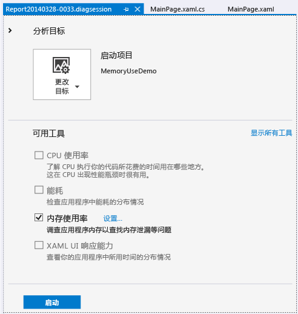
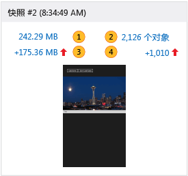
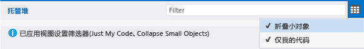
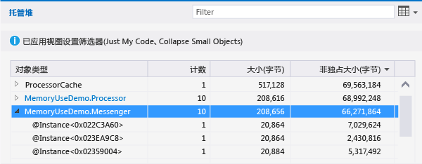
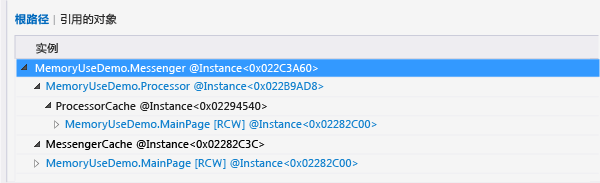
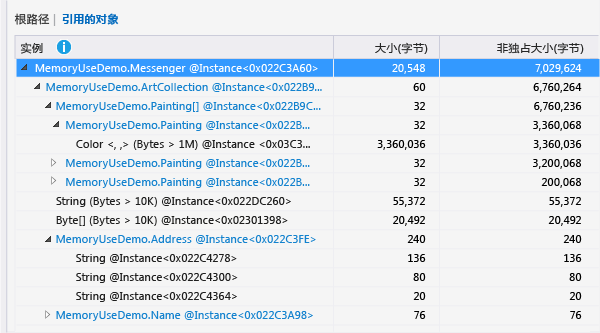
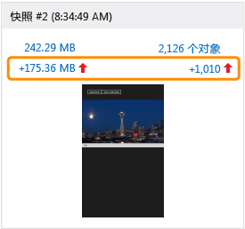

# 不调试的内存使用情况
可以在不调试的情况下使用**内存使用率**执行以下操作  
  
-   监视在制订方案时 Visual Studio 中应用的内存使用情况。  
  
-   创建应用的内存状态的详细快照。  
  
-   通过比较快照，找出内存问题的根本原因。  
  
 本主题介绍如何使用“内存使用率”工具分析 Windows Universal XAML 应用。 如果想要在使用 JavaScript 和 HTML 的 Windows 通用应用中分析内存使用情况，请参阅[分析内存使用率 (JavaScript)](http://msdn.microsoft.com/library/windows/apps/jj819176.aspx)。  
  
##  启动内存使用率诊断会话  
  
1.  在 Visual Studio 中打开 C# 通用 Windows 项目。  
  
2.  在菜单栏上，选择“调试/性能探查器...”。  
  
3.  选择“内存使用率”，然后选择页面底部的“启动”按钮。  
  
       
  
##  监视内存使用率  
 虽然可以使用**内存使用率**工具生成可用于查找并修复问题的详细报告，但也可以使用它来研究主动制订的方案的实时内存效果。  
  
 启动诊断会话时，应用将启动，并且“诊断工具”窗口将显示此应用的内存使用情况的时间线关系图。  
  
   
  
 时间线关系图显示了应用运行时其内存中的波动情况。 该关系图中的峰值通常表明一些代码正在收集或创建数据，然后在处理完成后放弃它。 较大的峰值表明能够进行优化的区域。 更需关注的是未返回的内存消耗中出现增加，因为这可能表明低效的内存使用情况或甚至表明出现内存泄露。  
  
###  关闭监视会话  
   
  
 若要在不创建报告的情况下监视会话，只需关闭诊断窗口。 若要在拍摄内存快照后生成报告，请选择“停止”。  
  
##  拍摄应用的内存状态快照  
 如果发现要调查的内存问题，可以在诊断会话期间拍摄快照，以在特定时刻捕获内存中的对象。 由于应用使用大量不同类型的对象，因此你可能希望集中分析某一种情况。 还有一个较好的办法是，在出现内存问题之前获取应用的基线快照，首次出现问题后获取另一个快照，并且在重复执行该方案时获取一个或多个其他快照。  
  
 若要收集快照，请启动新的诊断会话。 在想要捕获内存数据时选择“拍摄快照”。 若要生成报告，请选择“停止”。  
  
##  “内存使用率”概述页  
 在停止收集数据后，内存使用量工具将停止应用并显示概述报告。  
  
   
  
###  “内存使用率”快照视图  
 使用快照视图以在新的 Visual Studio 窗口中打开详细的报告。 存在两种类型的快照视图：  
  
-   [快照详细报告](../profiling/memory-usage-without-debugging2.md#BKMK_Snapshot_details_reports)显示某个快照中的类型和实例。  
  
-   [快照差异报告](../profiling/memory-usage-without-debugging2.md#BKMK_Snapshot_difference__diff__reports)比较两个快照中的类型和实例。  
  
   
  
 快照视图图片中带编号的项是可以打开内存使用量报告视图的链接。  
  
|||  
|-|-|  
||链接文本显示了在拍摄快照后内存中的总字节数。   选择此链接以显示快照详细信息报告，该报告按类型实例的总大小进行排序。|  
||链接文本显示了在拍摄快照后内存中的对象总数。   选择此链接以显示快照详细信息报告，该报告按类型实例的计数进行排序。|  
||该链接文本显示拍摄此快照时内存中对象的总大小和上一个快照的总大小之间的差异。   如果此快照的内存大于上一个快照的内存，则该链接文本将显示正数，反之，该链接文本将显示负数。 链接文本**基线**表明此快照是诊断会话中的第一个快照；**无差异**表明差异为零。   选择此链接以显示快照差异报告，该报告按类型实例的总大小中的差异进行排序。|  
||此链接文本显示此快照中内存对象的总数与上一个快照中对象总数之间的差异。   选择此链接以显示快照差异报告，该报告按类型实例的总计数中的差异进行排序。|  
  
##  快照报告  
   
  
###  快照报告树  
  
####  托管堆  
 托管堆树[托管堆树（快照详细信息）](../profiling/memory-usage-without-debugging2.md#BKMK_Managed_Heap_tree__Snapshot_details_)和[托管堆树（快照差异）](../profiling/memory-usage-without-debugging2.md#BKMK_Managed_Heap_tree__Snapshot_diff_)显示报告中的类型和实例。 通过选择类型或实例，可以显示选定项的**根路径**和**引用的对象**树。  
  
####  根路径  
 [根路径树（快照详细信息）](../profiling/memory-usage-without-debugging2.md#BKMK_Paths_to_Root_tree__Snapshot_details_)和[根路径树（快照差异）](../profiling/memory-usage-without-debugging2.md#BKMK_Paths_to_Root_tree__Snapshot_diff_)显示引用类型或实例的对象链。 .NET Framework 垃圾回收器仅在释放对某个对象的所有引用后清理该对象的内存。  
  
####  引用的对象  
 [引用的对象树（快照详细信息）](../profiling/memory-usage-without-debugging2.md#BKMK_Referenced_Objects_tree__Snapshot_details_)和[引用的对象树（快照差异）](../profiling/memory-usage-without-debugging2.md#BKMK_Referenced_Objects_tree__Snapshot_diff_)显示所选类型或实例引用的对象。  
  
###  对象类型和实例字段  
 当“对象类型”项具有子项时，可以选择箭头图标来显示它们。 如果“对象类型”文本的颜色为蓝色，则可以选择它来导航至其源代码文件中的对象。 该源文件已在单独的窗口中打开。  
  
 实例名是由内存使用量工具生成的唯一 ID。  
  
 如果注意到不能轻易标识的类型或如果不知道它是如何涉及在代码中，它很可能是内存使用情况工具显示的 .NET Framework、操作系统或编译器中的对象，因为它涉及对象的所有权链。  
  
###  报告树筛选器  
 大多数应用都包含超乎想像的大量类型，然而应用开发人员对其中的大多数类型都不是很感兴趣。 **内存使用情况**工具定义了两个筛选器，它们可用于隐藏**托管堆**和**根路径**树中的大多数类型。 还可按类型名称筛选树。  
  
   
  
####  筛选器  
 在“筛选器”框中输入字符串，以将树显示的内容限制为包含指定文本的类型。 筛选器不区分大小写，并且可识别类型名称任意部分中指定的字符串。  
  
####  折叠小对象  
 在应用此筛选器后，其“大小(字节)”小于快照内存总大小的 0.5% 的类型将在**托管堆**列表中隐藏。  
  
####  仅我的代码  
 **仅我的代码**筛选器将隐藏外部代码生成的大多数实例。 外部类型属于操作系统或 Framework 组件，或者由编译器生成。  
  
##  快照详细信息报告  
 可以使用快照详细信息报告专注于诊断会话中的某个快照。 若要打开详细信息报告，可在快照视图中选择一个链接，如下图所示。 这两个链接打开的都是相同的报告；唯一的差异是在报告中**托管堆**树的启动排序顺序不同。 在这两种情况下，你可以在报告打开后更改排序顺序。  
  
   
  
-   **MB** 链接按“非独占大小(字节)”列对报告进行排序。  
  
-   **对象**链接按“计数”列对报告进行排序。  
  
###  托管堆树（快照详细信息）  
 **托管堆**树列出了内存中保存的对象类型。 你可以展开类型名称以查看十大类型示例（按大小排列）。 通过选择类型或实例，可以显示选定项的**根路径**和**引用的对象**树。  
  
   
  
|||  
|-|-|  
|“对象类型”|类型或对象实例的名称。|  
|“计数”|类型的对象实例数。 对于实例，该数量始终为 1。|  
|“大小(字节)”|对于类型，则为内存快照中所有类型实例的大小，排除实例中包含的对象的大小。   对于实例、类型，则为对象的大小，排除实例中包含的对象大小。 实例。|  
|“非独占大小(字节)”|类型实例的大小或单个实例的大小，其中包括所含对象的大小。|  
  
###  根路径树（快照详细信息）  
 **根路径树**显示引用类型或实例的对象链。 .NET Framework 垃圾回收器仅在释放对某个对象的所有引用后清理该对象的内存。  
  
   
  
 当在**根路径**树中查看某个类型时，将在“引用计数”列中显示保留此类型引用的类型对象的数量。 当你分析实例时，该列不会显示。  
  
###  引用的对象树（快照详细信息）  
 **引用的对象**树显示已选类型的对象或实例引用的对象。  
  
   
  
|||  
|-|-|  
|“对象类型/实例”|类型或对象实例的名称。|  
|“大小(字节)”|对于类型，则为所有类型实例的大小，排除类型中包含的对象的大小。   对于实例，则为对象的大小，排除实例中包含的对象大小。|  
|“非独占大小(字节)”|类型实例的总大小或实例的大小，其中包括所包含的对象的大小。|  
  
##  快照差异报告  
 快照差异报告显示主要快照和紧接着在它之前拍摄的快照之间的更改。 若要打开差异报告，可在快照视图中选择一个链接，如下图所示。 这两个链接打开的都是相同的报告；唯一的差异是在报告中**托管堆**树的启动排序顺序不同。 你可以在报告打开后更改排序顺序。  
  
   
  
-   **MB** 链接按“非独占大小(字节)”列对报告进行排序。  
  
-   **对象**链接按“计数”列对报告进行排序。  
  
###  托管堆树（快照差异）  
 **托管堆**树列出了内存中保存的对象类型。 你可以展开类型名称以查看十大类型示例（按大小排列）。 通过选择类型或实例，可以显示选定项的**根路径**和**引用的对象**树。  
  
   
  
 请注意，在该图片中，“计数”、“大小(字节)”和“非独占大小(字节)”列已折叠。  
  
|||  
|-|-|  
|“对象类型”|类型或对象实例的名称。|  
|“计数”|主要快照中的类型实例的数量。 对于实例，“计数”始终为 1。|  
|“计数差异”|对于类型，则为主要快照与上一个快照之间的类型实例数的差异。 对于实例，字段是空白的。|  
|“大小(字节)”|主要快照中对象的大小，排除对象中包含的对象的大小。 对于类型，“大小(字节)”和“非独占大小(字节)”为类型实例的总大小。|  
|“总大小差异(字节)”|对于类型，则为主要快照和上一个快照之间的类型实例总大小的差异，排除实例中包含的对象的大小。 对于实例，字段是空白的。|  
|“非独占大小(字节)”|主要快照中对象的大小，其中包括对象中包含的对象的大小。|  
|“非独占大小差异(字节)”|对于类型，则为主要快照和上一个快照之间的所有类型实例大小的差异，其中包括对象中包含的对象的大小。 对于实例，字段是空白的。|  
  
###  根路径树（快照差异）  
 **根路径树**显示引用类型或实例的对象链。 .NET Framework 垃圾回收器仅在释放对某个对象的所有引用后清理该对象的内存。  
  
   
  
###  引用的对象树（快照差异）  
 **引用的对象**树显示主要类型的对象或实例引用的对象。  
  
   
  
|||  
|-|-|  
|“对象类型/实例”|类型或对象实例的名称。|  
|“大小(字节)”|对于实例，则为主要快照中的对象大小，排除该实例中包含的对象大小。   对于类型，则为主要快照中类型实例的总大小，排除实例中包含的对象的大小。|  
|“非独占大小(字节)”|主要快照中对象的大小，其中包括对象中包含的对象的大小。|  
  
## 另请参阅  
 [JavaScript 内存](../profiling/javascript-memory.md)
 [分析工具](../profiling/profiling-tools.md)
 [使用 C++、C# 和 Visual Basic 的 Windows 应用商店应用的性能最佳做法](http://msdn.microsoft.com/library/windows/apps/hh750313.aspx)   
 [Diagnosing memory issues with the new Memory Usage Tool in Visual Studio](http://go.microsoft.com/fwlink/p/?LinkId=394706)（在 Visual Studio 中使用新的内存使用情况工具诊断内存问题）

<!--HONumber=Feb17_HO4-->

