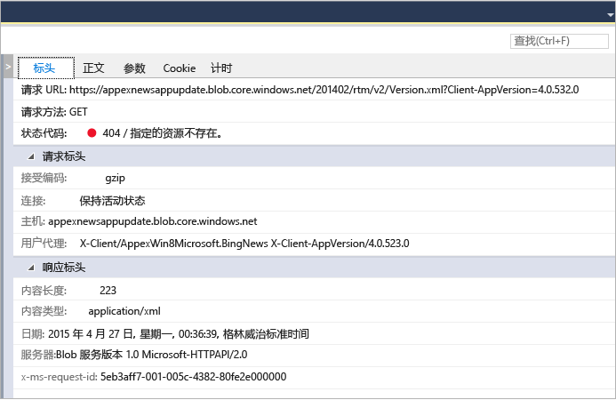

# 分析 UWP 应用中的网络使用情况
Visual Studio“网络”诊断工具用于收集有关使用 [Windows.Web.Http API](https://msdn.microsoft.com/library/windows/apps/windows.web.http.aspx) 执行的网络操作的数据。 分析数据可以帮助你解决问题（如访问和身份验证问题、不正确的缓存用法和不良的显示和下载性能）。  
  
 “网络”工具仅支持 Windows 通用平台应用。 目前不支持其他平台。  
  
> [!NOTE]
>  有关该网络工具的更完整说明，请参阅 [Visual Studio 的网络工具简介](http://blogs.msdn.com/b/visualstudio/archive/2015/05/04/introducing-visual-studio-s-network-tool.aspx)。  
  
## 收集网络工具数据  
 你应在 Visual Studio 计算机上打开的 Visual Studio 项目中运行“网络”工具。  
  
1.  在 Visual Studio 中打开项目。  
  
2.  在菜单上，单击“调试/性能探查器...”。 选择“网络”，然后选择“启动”。  
  
3.  网络工具开始收集应用的 HTTP 流量。  
  
     当运行应用时，左窗格中的摘要视图将自动显示捕获的 HTTP 操作列表。 在摘要视图中选择一个项，以在右窗格的“详细信息”面板中查看详细信息。  
  
4.  选择“停止”关闭应用。  
  
 “报表”窗口应类似于以下形式：  
  
   
  
## 分析数据  
 通过选择摘要视图上显示的任何网络操作，可在运行应用的同时（甚至在已关闭应用后）分析捕获的 HTTP 流量。  
  
 “网络”摘要视图显示了应用运行过程中每个网络操作的数据。 选择一个列标题以对列表进行排序，或选择要在“内容类型”筛选器视图中显示的内容类型。  
  
 选择“另存为 HAR”创建可供第三方工具（如 Fiddler）使用的 JSON 文件。  
  
 “网络”详细信息视图显示了关于摘要视图中所选网络操作的详细信息。  
  
   
  
|||  
|-|-|  
|**标头**|请求的事件标头的信息。|  
|**正文**|请求和响应负载数据。|  
|**参数**|查询字符串参数名称和值。|  
|**Cookie**|响应和请求的 cookie 数据。|  
|**计时**|获取所选资源的各个阶段图。|  
  
 “网络摘要”栏显示了在任何给定点显示的网络操作数目、已传输的数据量、下载这些数据所用的时间和可见的错误（带有 4xx 或 5xx 响应的请求）数目。  
  
### 分析提示  
 此工具突出显示运行网络相关分析时可能有用的某些区域：  
  
1.  完全来自缓存的请求在“已接收”列中显示为“(来自缓存)”。 这有助于你确定你是否在有效地使用缓存来节省用户的带宽，或是否在错误地缓存响应并为应用程序最终用户提供过时的数据。  
  
2.  “结果”列中使用红色状态代码显示错误响应（4xx 或 5xx），这些错误响应在“摘要”栏中突出显示。 这有助于轻松发现应用程序上众多潜在请求中的错误。  
  
3.  响应整齐打印按钮（位于“正文”选项卡内）可通过提高内容的可读性帮助你分析 JSON、XML、HTML、CSS、JavaScript 和 TypeScript 响应负载。  
  
## 另请参阅  
 [运行带或不带调试器的分析工具](../profiling/running-profiling-tools-with-or-without-the-debugger.md)
 [Visual Studio 博客：Visual Studio 的网络检查器简介](http://go.microsoft.com/fwlink/?LinkId=535022)   
 [第 9 频道视频：VS 诊断工具 – 新的网络探查器](http://channel9.msdn.com/Series/ConnectOn-Demand/206)
