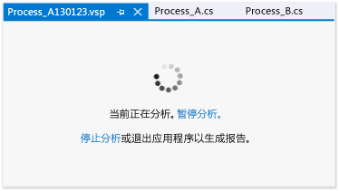

# 设置性能会话的常规选项
[!INCLUDE[vs2017banner](../code-quality/includes/vs2017banner.md)]

可以在性能会话的属性对话框的**“常规”**页上设置 [!INCLUDE[vsprvs](../code-quality/includes/vsprvs_md.md)] 分析工具性能会话的收集方法和分析数据命名约定。  若要从**“性能资源管理器”**中打开此对话框，请右击性能会话，然后单击**“属性”**。  
  
 **要求**  
  
-   [!INCLUDE[vsUltLong](../code-quality/includes/vsultlong_md.md)], [!INCLUDE[vsPreLong](../code-quality/includes/vsprelong_md.md)], [!INCLUDE[vsPro](../code-quality/includes/vspro_md.md)]  
  
## 选择数据收集方法  
 通过选择**“分析数据收集”**下的某个选项来设置基本收集方法。  下表中介绍了以下各个选项：  
  
|||  
|-|-|  
|**采样**。  采样方法每隔一定时间收集分析信息。  此方法对于查找处理器利用率问题很有用，并且大多数性能调查都建议以此方法开始。|-   [使用采样收集性能统计信息](../profiling/collecting-performance-statistics-by-using-sampling.md)|  
|**检测**。  检测方法注入模块分析代码的副本中，这段代码记录分析运行期间模块中各个函数的每次进入、退出和函数调用。  此方法适用于收集有关代码中某个部分的详细计时信息，以及了解输入和输出操作对应用程序性能的影响。|-   [使用检测收集详细计时数据](../profiling/collecting-detailed-timing-data-by-using-instrumentation.md)|  
|**并发**。  并发方法收集阻止代码执行（如线程等待释放对应用程序资源的锁定访问时）的每个事件的数据。  此方法对分析多线程应用程序很有用。|-   [收集线程和进程并发数据](../profiling/collecting-thread-and-process-concurrency-data.md)|  
  
 可以使用采样或检测方法收集 .NET 内存数据。  在**“.NET 内存分析”**下选择数据的类型。  
  
|||  
|-|-|  
|**收集 .NET 对象分配信息**。  默认情况下，数据包括所分配对象的数量和大小。  选中或清除此复选框可启用或禁用 .NET 内存数据收集。   **还收集 .NET 对象的生存期信息**。  选中此复选框可包括有关用于回收内存对象的各代垃圾回收的数据。|-   [收集 .NET 内存分配数据和生存期数据](../profiling/collecting-dotnet-memory-allocation-and-lifetime-data.md)|  
  
 您开始分析应用程序时会显示分析会话页，您可以暂停，继续和停止分析。  
  
   
  
## 设置分析数据文件选项  
  
|||  
|-|-|  
|**报告**。  默认情况下，向分析数据 \(.vsp\) 文件授予被分析应用程序的名称，该文件位于解决方案或项目文件夹中。  还在名称后追加日期字符串，并向数据文件添加递增的数字，否则会产生重名现象。  您可以更改这些选项。|-   [如何：设置分析数据文件名选项](../profiling/how-to-set-performance-data-file-name-options.md)|