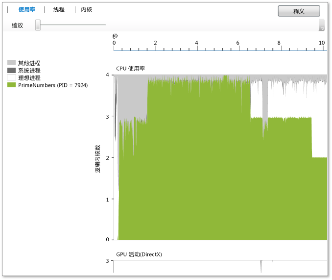

# 使用率视图
[!INCLUDE[vs2017banner](../code-quality/includes/vs2017banner.md)]

有关 CPU , GPU **使用率视图** 显示信息，并使用当前进程的其他系统资源。  它显示一段时间内已分析进程、空闲进程、系统进程以及在系统上运行的其他进程所带来的平均内核使用率。  从此视图中看不出在任意给定时间哪个特定内核处于活动状态。  举例来说，如果两个内核在某一给定时间段内均以 50% 的功率运行，那么此视图将显示正在使用一个逻辑内核。  该视图通过将分析时间分成较短的时间段而生成。  对于每个时间段，该图形会指出在此间隔内逻辑内核上执行的平均进程线程数。  
  
   
  
 图形显示时间 \(在 X 轴上\)，因此目标进程使用的平均逻辑内核，空闲进程、系统进程。\(空闲处理显示空闲内核。  系统进程是中可以代表其他进程执行任务的窗口的进程。）系统上运行的其余进程占用了所有其余内核的使用率。  
  
 逻辑内核数在 Y 轴上显示。  Windows将通过硬件实现的多线程并行处理支持（例如超线程）视为逻辑内核。  因此，每个内核支持两个硬件线程的四核处理器系统将显示为八逻辑内核系统。  此原则也适用于内核视图。  有关详细信息，请参阅[内核视图](../profiling/cores-view.md)。  
  
 GPU 活动图显示一段时间内的 DirectX 引擎数在使用中。则处理 DMA 数据包，引擎仍在使用中。图表不显示特定 \(DirectX 引擎，例如三维引擎，视频的引擎及其他\)。  
  
## 用途  
 当时用并发可视化工具时，建议使用率视图作为使用并发可视化工具进行性能调查的起点。  因为它随提供的概述。应用的并发，您可以快速识别使用它需要进行性能优化或并行化的区域。  
  
 如果您对性能优化感兴趣，可以尝试找出与期望不同的行为。  您还可以尝试找到逻辑 CPU 内核使用率低的区域及其原因。  您还可以查找在 CPU 和 GPU 之间的使用模式。  
  
 如果您对实现应用程序并行化感兴趣，通常可以查找 CPU 被大量占用的执行区域或 CPU 未被使用的区域。  
  
 CPU 的区域为绿色。  图显示使用的核心应用，则序列化的。  
  
 CPU 未被使用的区域以灰色表示。  这些区域可能表示应用程序空闲或执行阻塞 I\/O 操作的点，将其他大量占用 CPU 的工作叠加在这些区域上就可以实现并行化。  
  
 找到您感兴趣的行为后，可以通过选择来放大相应区域。  进行缩放之后，您可以切换到线程视图或内核视图，以进行更详细的分析。  
  
 使用 C\+\+ AMP 或 DirectX，如果使用 GPU，您可能有兴趣标识 GPU 意外空闲的 GPU 引擎在使用或区域的数量感兴趣。  
  
## 缩放  
 若要放大 CPU 使用率图形或GPU活动图，选择区域或使用图形上方的缩放滑块工具。  当切换到其他视图时，缩放设置保持不变。  若要再次缩小，请同样使用缩放滑块工具。  您也可以通过使用Ctrl\+scroll放大。  
  
## 请参阅  
 [并发可视化工具](../profiling/concurrency-visualizer.md)   
 [内核视图](../profiling/cores-view.md)