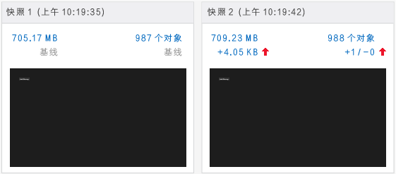
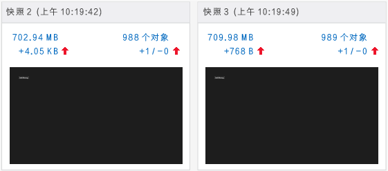
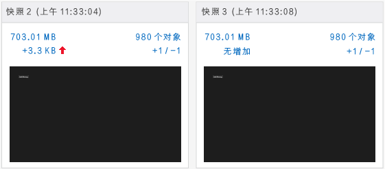

# <a name="walkthrough-find-a-memory-leak-javascript"></a>演练：查找内存泄漏 (JavaScript)
  
  
 本演练带领你完成使用 JavaScript 内存分析器确定并修复简单内存问题的过程。 JavaScript 内存分析器在 Visual Studio 中提供，适用于使用 JavaScript 为 Windows 生成的 Windows 应用商店应用。 在此方案中，你将创建一个在内存中错误保留 DOM 元素，而非以创建这些元素时的相同速率将其释放的应用。  
  
 尽管此应用中内存泄露的原因非常具体，但此处显示的步骤演示了在隔离泄露内存的对象时通常有效的工作流。  
  
### <a name="running-the-javascript-memory-analyzer-test-app"></a>运行 JavaScript 内存分析器测试应用  
  
1.  在 Visual Studio 中，依次选择 **“文件”**、 **“新建”**、 **“项目”**。  
  
2.  在左窗格中选择“JavaScript”  ，选择“Windows” 、“Windows 8” ，然后选择“通用”  或“Windows Phone 应用” 。  
  
    > [!IMPORTANT]
    >  本主题中显示的内存使用量结果是针对 Windows 8 应用进行测试的。  
  
3.  在中间窗格中选择 **“空白应用”** 项目模板。  
  
4.  在“名称”  框中指定名称（例如 `JS_Mem_Tester`），然后选择“确定” 。  
  
5.  在“解决方案资源管理器”中，打开 default.html，并将以下代码粘贴到 \<body> 标记之间：  
  
    ```html  
    <div class="wrapper">  
        <div id="item"></div>  
        <button class="memleak" style="display: block" >Leak Memory</button>  
    </div>  
    ```  
  
    > [!IMPORTANT]
    >  如果你正在使用 Windows 8.1 通用应用模板，你需要在 .Windows 和 .WindowsPhone 项目中更新 HTML 和 CSS 代码。  
  
6.  打开 default.css，然后添加以下 CSS 代码：  
  
    ```css  
    .memleak {  
        position: absolute; top: 100px; left: 100px;  
    }  
    ```  
  
7.  打开 default.js，并用以下代码替换所有代码：  
  
    ```javascript  
    (function () {  
        "use strict";  
  
        var app = WinJS.Application;  
        var activation = Windows.ApplicationModel.Activation;  
  
        var wrapper;  
        var elem;  
  
        app.onactivated = function (args) {  
            if (args.detail.kind === activation.ActivationKind.launch) {  
                if (args.detail.previousExecutionState !== activation.ApplicationExecutionState.terminated) {  
                } else {  
                }  
                args.setPromise(WinJS.UI.processAll());  
  
                elem = document.getElementById("item");  
                wrapper = document.querySelector(".wrapper");  
                var btn = document.querySelector(".memleak");  
                btn.addEventListener("click", btnHandler);  
                run();  
            }  
        };  
  
        app.oncheckpoint = function (args) {  
        };  
  
        app.start();  
  
        function run() {  
            initialize();  
            load();  
        }  
  
        function initialize() {  
  
            if (wrapper != null) {  
                elem.removeNode(true);  
            }  
        }  
  
        function load() {  
  
            var newDiv = document.createElement("div");  
  
            newDiv.style.zIndex = "-1";  
            newDiv.id = "item";  
  
            wrapper.appendChild(newDiv);  
        }  
  
        function btnHandler(args) {  
            run();  
        }  
  
    })();  
    ```  
  
8.  选择 F5 键开始调试。 验证 **“泄漏内存”** 按钮是否显示在此页中。  
  
9. 切换回 Visual Studio (Alt+Tab)，然后按 Shift+F5 停止调试。  
  
     现在你已验证该应用没有问题，可以检查内存使用量。  
  
### <a name="analyzing-the-memory-usage"></a>分析内存使用量  
  
1.  在 **“调试”** 工具栏上的 **“启动调试”** 列表中，选择已更新的项目的调试目标：某个 Windows Phone 仿真程序或 **“模拟器”**。  
  
    > [!TIP]
    >  对于 Windows 应用商店应用，也可以选择该列表中的 **“本地计算机”** 或 **“远程计算机”** 。 但是，使用仿真器或模拟器的优点是，你可以将其放置在 Visual Studio 旁，并且在正在运行的应用和 JavaScript 内存分析器之间轻松切换。 有关更多信息，请参阅[从 Visual Studio 运行应用](../debugger/run-store-apps-from-visual-studio.md)和[在远程计算机上运行 Windows 应用商店应用](../debugger/run-windows-store-apps-on-a-remote-machine.md)。  
  
2.  在“调试”  菜单上，选择“性能探查器...” 。  
  
3.  在 **“可用工具”**中，选择 **“JavaScript 内存”**，然后选择 **“启动”**。  
  
     在本教程中，你将把内存分析器连接到启动项目。 有关其他选项的信息，如将内存分析器连接到所安装的应用，请参阅 [JavaScrip 内存](../profiling/javascript-memory.md)。  
  
     当您启动内存分析器时，可能会发现用户帐户控制正在请求运行 VsEtwCollector.exe 的权限。 选择 **“是”**。  
  
4.  连续选择 **“泄露内存”** 按钮&4; 次。  
  
     当选择此按钮时，default.js 中的事件处理代码将起作用，导致内存泄漏。 你将使用此内存泄漏用于诊断目的。  
  
    > [!TIP]
    >  通过重现要测试是否存在内存泄漏情况的场景，可以更轻松地筛选掉不相关的信息，例如，在应用程序初始化期间或在加载页面时添加到堆中的对象。  
  
5.  从正在运行的应用程序中，切换到 Visual Studio (Alt+Tab)。  
  
     JavaScript 内存分析器在 Visual Studio 的新选项卡中显示信息。  
  
     此摘要视图中的内存图显示一段时间内的进程内存使用量。 此视图还提供诸如 **“拍摄堆快照”**等命令。 快照提供特定时刻有关内存使用量的详细信息。 有关详细信息，请参阅 [JavaScript 内存](../profiling/javascript-memory.md)。  
  
6.  选择 **“拍摄堆快照”**。  
  
7.  切换到应用并选择 **“泄漏内存”**。  
  
8.  切换到 Visual Studio 并再次选择 **“拍摄堆快照”** 。  
  
     下图显示了基线快照 (#1) 和快照 #2。  
  
       
  
    > [!NOTE]
    >  在拍摄快照时，Windows Phone 仿真程序不显示应用程序的屏幕快照。  
  
9. 切换到应用并再次选择 **“泄漏内存”** 按钮。  
  
10. 切换到 Visual Studio 并第三次选择 **“拍摄堆快照”** 。  
  
    > [!TIP]
    >  通过拍摄此工作流中的第三个快照，可以筛选出与内存泄漏不相关的、从基线快照到第二个快照的更改。 例如，预计可能有一些更改（如在页面上更新页眉和页脚）会造成内存使用量的更改，但可能与内存泄漏不相关。  
  
     下图显示了快照 #2 和快照 #3。  
  
       
  
11. 在 Visual Studio 中，选择 **“停止”** 以停止分析。  
  
12. 在 Visual Studio 中比较快照。 快照 #2 显示以下内容：  
  
    -   与快照 #1 相比，堆大小（左侧的红色向上箭头指示）增加了几 KB。  
  
        > [!IMPORTANT]
        >  堆大小的准确内存使用率值取决于调试目标。  
  
    -   与快照 #1 相比，堆上的对象数量（右侧的红色向上箭头指示）有所增加。 添加了一个对象 (+1)，未移除任何对象 (-0)。  
  
     快照 #3 显示以下内容：  
  
    -   与快照 #2 相比，堆大小再次增加了几百字节。  
  
    -   与快照 #2 相比，堆上的对象数量再次增加。 添加了一个对象 (+1)，未移除任何对象 (-0)。  
  
13. 在快照 #3 中，选择位于右侧红色向上箭头旁的链接文本，该文本显示值 +1/-0。  
  
       
  
     这会打开一个名为 **“快照 #3 - 快照 #2”**的堆上对象差异视图，默认显示“类型”视图。 默认情况下，你会在快照 #2 和快照 #3 之间看到添加到堆的对象列表。  
  
14. 在 **“范围”** 筛选器中，选择 **“从快照 #2 中留下的对象”**。  
  
15. 打开对象树顶部的 HTMLDivElement 对象（如此处所示）。  
  
       
  
     此视图显示有关内存泄漏的有用信息，例如：  
  
    -   此视图显示 ID 为 `item`的 DIV 元素，并且对象的保留大小为几百字节（具体值将有所不同）。  
  
    -   此对象是快照 #2 中的剩余对象，说明可能存在内存泄漏。  
  
     此时对该应用的一些了解可提供帮助：选择 **“泄漏内存”** 按钮应能移除 DIV 元素和添加元素，因此代码似乎不起作用（也就是说，泄漏了内存）。 下一部分将说明如何修复此问题。  
  
    > [!TIP]
    >  有时，定位与 `Global` 对象相关的对象可能有助于确定此问题。 为此，请打开标识符的快捷菜单，然后选择 **“在根视图中显示”**。  
  
##  <a name="a-namefixingmemorya-fixing-the-memory-issue"></a><a name="FixingMemory"></a>修复内存问题  
  
1.  通过使用探查器显示的数据，可以检查负责移除 ID 为“item”的 DOM 元素的代码。 它将出现在 `initialize()` 函数中。  
  
    ```javascript  
    function initialize() {  
  
        if (wrapper != null) {  
            elem.removeNode(true);  
        }  
    }  
    ```  
  
     `elem.removeNode(true)` 可能无法正常运行。 检查代码如何缓存 DOM 元素并发现问题；未更新对缓存元素的引用。  
  
2.  调用 `appendChild`前，在 default.js 中添加以下加载函数代码行：  
  
    ```javascript  
    elem = newDiv;  
    ```  
  
     此代码将更新对缓存元素的引用，以便在你选择 **“泄漏内存”** 按钮时正确移除元素。 加载函数的完整代码现在如下所示：  
  
    ```javascript  
    function load() {  
  
        wrapper = document.querySelector(".wrapper");  
  
        var newDiv = document.createElement("div");  
  
        newDiv.style.zIndex = "-1";  
        newDiv.id = "item";  
        elem = newDiv;  
  
        wrapper.appendChild(newDiv);  
    }  
    ```  
  
3.  在 **“调试”** 菜单上，选择 **“性能和诊断”**。  
  
4.  在 **“可用工具”**中，选择 **“JavaScript 内存”**，然后选择 **“启动”**。  
  
5.  按照与前面相同的步骤来拍摄三张快照。 步骤摘要如下：  
  
    1.  在应用程序中，连续选择 **“泄露内存”** 按钮&4; 次。  
  
    2.  切换到 Visual Studio 并选择 **“拍摄堆快照”** 以拍摄基线快照。  
  
    3.  在应用中，选择 **“泄漏内存”** 按钮。  
  
    4.  切换到 Visual Studio 并选择 **“拍摄堆快照”** 以拍摄第二张快照。  
  
    5.  在应用中，选择 **“泄漏内存”** 按钮。  
  
    6.  切换到 Visual Studio 并选择 **“拍摄堆快照”** 以拍摄第三张快照。  
  
     快照 #3 现在显示堆大小从快照 #2 开始 **“未增加”** ，并且对象计数为 +1/-1，这说明添加了一个对象，并且移除了一个对象。 这是正常行为。  
  
     下图显示了快照 #2 和快照 #3。  
  
       
  
## <a name="see-also"></a>另请参阅  
 [JavaScript 内存](../profiling/javascript-memory.md)
