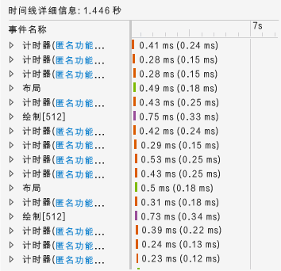
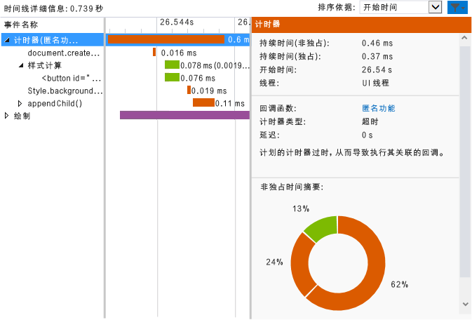

# <a name="walkthrough-improving-ui-responsiveness-html"></a>演练： 改进 UI 响应能力 (HTML)
本演练引导你使用 [HTML UI 响应能力探查器](../profiling/html-ui-responsiveness.md)确定并修复性能问题。 探查器可用于 Visual Studio 中的使用 JavaScript 的 Windows Universal 和 Windows 应用商店应用。 在此方案中，你将创建一个过于频繁地更新 DOM 元素的性能测试应用，并使用探查器确定并修复此问题。  
  
### <a name="creating-and-running-the-performance-test-app"></a>创建并运行性能测试应用  
  
1.  在 Visual Studio 中，创建一个新的 Windows Universal JavaScript 项目。 （选择“文件”/“新建”/“项目”。 在左窗格中选择“JavaScript”，然后选择“Windows”、“Windows 10”，再选择“通用”或“Windows Phone”。  
  
2.  > [!IMPORTANT]
    >  本主题中显示的诊断结果是针对 Windows 8 应用显示的。  
  
3.  在中间窗格中选择一个空白项目模板，如“空白应用”。  
  
4.  在“名称”  框中指定名称（例如 `JS_Perf_Tester`），然后选择“确定” 。  
  
5.  在“解决方案资源管理器”中，打开 default.html，并将以下代码粘贴到 \<body> 标记之间：  
  
    ```html  
    <div class="wrapper">  
        <button id="content">Waiting for values</button>  
    </div>  
    ```  
  
6.  打开 default.css，然后添加以下 CSS 代码：  
  
    ```css  
    #content {  
        margin-left: 100px;  
        margin-top: 100px;  
    }  
    ```  
  
7.  打开 default.js，并用以下代码替换所有代码：  
  
    ```javascript  
    (function () {  
        "use strict";  
  
        var app = WinJS.Application;  
        var activation = Windows.ApplicationModel.Activation;  
  
        var content;  
        var wrapper;  
  
        app.onactivated = function (args) {  
            if (args.detail.kind === activation.ActivationKind.launch) {  
                if (args.detail.previousExecutionState !== activation.ApplicationExecutionState.terminated) {  
  
                    content = document.getElementById("content");  
                    wrapper = document.querySelector(".wrapper");  
  
                    content.addEventListener("click", handler);  
  
                } else {  
                }  
  
                args.setPromise(WinJS.UI.processAll());  
            }  
        };  
  
        app.oncheckpoint = function (args) {  
        };  
  
        app.start();  
  
        var idx = 0;  
        var count = 0;  
        var max = 5000;  
        var text = ["what", "is", "the", "Matrix?"];  
        var color = ["red", "crimson", "maroon", "purple"];  
  
        function increment() {  
  
            setTimeout(function () {  
  
                idx++;  
                count++;  
  
                if (idx > 3) { idx = 0; }  
                if (count < max) { increment(); }  
  
            }, 1000);  
        }  
  
        function setValues() {  
  
            content = document.getElementById("content");  
            content.removeNode(true);  
  
            var newNode = document.createElement("button");  
            newNode.id = "content";  
            newNode.textContent = text[idx];  
            //newNode.textContent = getData();  
            newNode.style.backgroundColor = color[idx];  
            //newNode.style.animationName = "move";  
            //count++;  
  
            wrapper.appendChild(newNode);  
  
        }  
  
        function update() {  
  
            setTimeout(function () {  
  
                setValues();  
                if (count < max) { update(); }  
            });  
        }  
  
        function handler(args) {  
  
            content.textContent = "eenie";  
            increment();  
            update();  
        }  
  
    })();  
  
    ```  
  
8.  选择 F5 键开始调试。 确认“等待值”按钮显示在此页中。  
  
9. 选择“等待值”，并验证按钮文本和颜色是否约每秒更新一次。 这是设计使然。  
  
10. 切换回 Visual Studio (Alt+Tab)，然后按 Shift+F5 停止调试。  
  
     现在你已验证应用没有问题，可以使用探查器检查其性能。  
  
### <a name="analyzing-performance-data"></a>分析性能数据  
  
1.  在“调试”工具栏上的“开始调试”列表中，选择一个 Windows Phone 仿真器或“模拟器”。  
  
2.  在 **“调试”** 菜单上，选择 **“性能和诊断”**。  
  
3.  在“可用工具”中，选择“HTML UI 响应能力”，然后选择“启动”。  
  
     在本教程中，你将把探查器连接到启动项目。 有关其他选项的信息（例如将探查器连接到所安装的应用），请参阅 [HTML UI 响应能力](../profiling/html-ui-responsiveness.md)。  
  
     当你启动探查器时，可能会显示“用户帐户控制”，要求你提供运行 VsEtwCollector.exe 的权限。 选择 **“是”**。  
  
4.  在正在运行的应用中，选择“等待值”并等待大约 10 秒。 验证按钮文本和颜色是否约每秒更新一次。  
  
5.  从正在运行的应用程序中，切换到 Visual Studio (Alt+Tab)。  
  
6.  选择“停止收集”。  
  
     探查器在 Visual Studio 的新选项卡中显示信息。 查看 CPU 使用率和可视吞吐量 (FPS) 数据时，可以轻松确定一些趋势：  
  
    -   CPU 使用率在按下“等待值”按钮后大约 3 秒显著提高，并显示从此时起所发生的事件（脚本编写、样式设置和绘制事件的一致组合）的清晰模式。  
  
    -   可视吞吐量不受影响，FPS 保持在 60 吞吐量（即不丢弃帧）。  
  
     我们来看看“CPU 使用率”图的典型部分，了解应用在此高活动量期间的工作。  
  
7.  在“CPU 使用率”图的中间选择一个一到两秒的部分（单击并拖动或使用 Tab 键和箭头键）。 下图显示了做出选择后的“CPU 使用率”图。 非共享区域为选定内容。  
  
       
  
8.  选择“放大”。  
  
     此图将更改，更详细地显示选定时间段。 下图显示了放大后的“CPU 使用率”图。 （具体数据可能不同，但常规模式是明显的。）  
  
       
  
     下方窗格中的“时间线详细信息”显示选定时间段的详细信息的示例。  
  
       
  
     “时间线详细信息”中的事件可确认“CPU 使用率”图中的明显趋势：在短时间内发生大量事件。 “时间线详细信息”显示这些事件是 `Timer`、`Layout` 和 `Paint` 事件。  
  
9. 从上下文菜单中选择（或右键单击）下方窗格中的某个 `Timer` 事件，然后选择“筛选到事件”。 下图显示了此测试应用程序中的某个 `Timer` 事件的特定详细信息的示例。  
  
       
  
     可以从此数据中收集各种事实。 例如：  
  
    -   每个 `Timer` 事件，这些事件经过彩色编码以标识为脚本事件，包括对 `document.createElement` 的调用，后跟样式计算和对 `style.backgroundColor` 和 `appendChild()` 的调用。  
  
    -   在选定的短时间范围（约一到两秒）内，有大量 `Timer`、`Layout` 和 `Paint` 事件发生。 `Timer` 事件发生的频率远高于每秒一次更新，这在运行应用并选择“等待值”按钮后非常明显。  
  
10. 要进行调查，请对左下方窗格中的一个 `Timer` 事件选择匿名函数的链接。 以下函数将在 default.js 中打开：  
  
    ```javascript  
    function update() {  
  
        setTimeout(function () {  
  
            setValues();  
            if (count < max) { update(); }  
        });  
    }  
    ```  
  
     此递归函数将设置一个名为 `setValues()` 函数的循环，用于更新 UI 中的按钮。 通过探查器检查不同的计时器事件，你会发现由于此代码运行太过频繁而产生大部分或全部的计时器事件，因此问题可能源自此代码。  
  
### <a name="fixing-the-performance-issue"></a>修复性能问题  
  
1.  使用以下代码替换 `update()` 函数：  
  
    ```javascript  
    function update() {  
  
        setTimeout(function () {  
  
            setValues();  
            if (count < max) { update(); }  
        }, 1000 );  
    }  
    ```  
  
     此代码的修复版本中包括 1000 毫秒延迟，这在代码的先前版本中被省略，导致使用默认延迟值。 通过探查器数据可以看出，默认值为零毫秒，这将导致过于频繁地运行 `setValues()` 函数。  
  
2.  再次运行“HTML UI 响应能力”探查器，然后查看“CPU 使用率”图。 你将看到过多事件已消失，CPU 使用率降到接近零值。 问题已修复！  
  
## <a name="see-also"></a>另请参阅  
 [HTML UI 响应能力](../profiling/html-ui-responsiveness.md)
