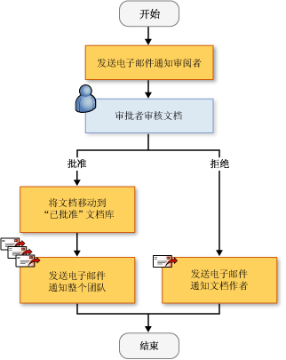
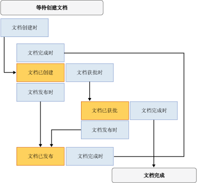

# 创建 SharePoint 工作流解决方案
  [!INCLUDE[vsprvs](../sharepoint/includes/vsprvs-md.md)] 提供了一些工具，可帮助您创建自定义工作流来管理 SharePoint 网站中的文档和列表项的生命周期。  提供的项包括设计器、一组活动控件集以及必需的程序集引用。  [!INCLUDE[vsprvs](../sharepoint/includes/vsprvs-md.md)] 还包括**“SharePoint 自定义向导”**，可帮助创建和配置工作流。  
  
 有关在 [!INCLUDE[vsprvs](../sharepoint/includes/vsprvs-md.md)] 中创建 SharePoint 项目的系统必备的列表，请参见[开发 SharePoint 解决方案的要求](../sharepoint/requirements-for-developing-sharepoint-solutions.md)。  有关 SharePoint 的更多信息，请参见[Microsoft SharePoint 产品和技术](http://go.microsoft.com/fwlink/?LinkId=178470)。  
  
## SharePoint 中的工作流  
 在向 SharePoint 库或列表添加工作流时，将对该库或列表中的所有项强制执行业务过程。  工作流描述系统或用户必须对每个项执行的操作，例如发送项以供编辑和评审。  这些操作称为“活动”，它们是工作流的生成块。  
  
 可以在 [!INCLUDE[vsprvs](../sharepoint/includes/vsprvs-md.md)] 中创建 SharePoint 工作流并将其部署到 SharePoint 网站中。  将工作流部署到 SharePoint 中之后，请将工作流与库或列表关联起来。  然后，既可以由进程自动启动工作流，也可以由用户手动启动工作流。  有关工作流操作的更多信息，请参见 [使用工作流管理的进程](http://go.microsoft.com/fwlink/?LinkId=79757)。  
  
## 创建自定义 SharePoint 工作流  
 [!INCLUDE[vsprvs](../sharepoint/includes/vsprvs-md.md)] 中提供了两个 SharePoint 工作流项目：**“顺序工作流”**和**“状态机工作流”**。  
  
 顺序工作流表示一系列步骤。  这些步骤依次执行，直到最后一个活动完成。  顺序工作流始终严格按顺序执行。  由于顺序工作流可以接收外部事件，并且可以包含并行逻辑流，因此确切的执行顺序可能会有所变化。  下面的插图演示一个顺序工作流示例。  
  
   
  
 状态机工作流表示一组状态、转换和操作。  状态机工作流中的步骤以异步方式执行。  这意味着，这些步骤不一定依次执行，而是由操作和状态触发。  将其中一个状态指定为启动状态，然后根据事件转换到另一个状态。  状态机可以具有一个确定工作流结束的最终状态。  下面的关系图显示了一个状态机工作流示例。  
  
   
  
 有关工作流类型的更多信息，请参见[工作流类型](http://go.microsoft.com/fwlink/?LinkId=178995)。  
  
### 使用向导  
 在 [!INCLUDE[vsprvs](../sharepoint/includes/vsprvs-md.md)] 中创建 SharePoint 工作流项目时，首先应在**“SharePoint 自定义向导”**中指定项目的设置。  向导将使用这些设置在**“解决方案资源管理器”**中创建项目。  此项目包含一个代码文件、若干用于部署工作流的文件以及对创建自定义 SharePoint 工作流所需的程序集的引用。  
  
 创建工作流之后，可以在“属性”窗口中修改工作流的属性。  尽管大多数工作流属性都可以直接在“属性”窗口中进行更改，但有些属性需要您单击省略号按钮 \(\) 来更改其值。  此按钮将重新启动**“SharePoint 自定义向导”**。  更改完属性值后，选择**“完成”**按钮来完成更改。  
  
> [!NOTE]  
>  **“工作流类型”**属性是只读的，无法更改。  如果要更改工作流类型，您必须另外创建一个工作流。  
  
## 设计 SharePoint 工作流  
 在定义业务过程中的所有步骤之后，可使用 [!INCLUDE[vsprvs](../sharepoint/includes/vsprvs-md.md)] 工作流设计器来设计 SharePoint 工作流。  若要打开设计器，请在 **解决方案资源管理器**中双击 Workflow1.cs 或 Workflow1.vb 或打开这些文件任何一个的快捷菜单。然后选择 **打开**。  
  
### 活动  
 若要设计工作流，请将**“工具箱”**中的活动添加到设计器上的工作流时间表。  工作流时间表包含按照执行顺序排列的活动序列。  
  
 有两种类型的活动：  
  
-   “简单活动”执行单个工作单元，例如“延迟 1 天”或“启动 Web 服务”。  
  
-   “复合活动”包含其他活动；例如，条件活动可能包含两个分支。  
  
 **“工具箱”**中提供了这两种类型的活动。  
  
 活动可以有属性、方法和事件。  使用**“属性”**窗口可以设置活动的属性。  
  
 还可以创建自定义活动。  有关详细信息，请参阅[演练：创建自定义网站工作流活动](../sharepoint/walkthrough-create-a-custom-site-workflow-activity.md)。  
  
 各个活动被组织到**“工具箱”**的以下选项卡中：  
  
-   **SharePoint 工作流**  
  
-   **Windows Workflow v3.0**  
  
-   **Windows Workflow v3.5**  
  
 并非所有核心工作流活动都受 SharePoint 支持。  有关更多信息，请参见 [Windows SharePoint Services 概述的工作流活动](http://go.microsoft.com/fwlink/?LinkID=156094)。  
  
#### SharePoint 工作流活动  
 **“SharePoint 工作流”**选项卡包含专供在 [!INCLUDE[wss_14_long](../sharepoint/includes/wss-14-long-md.md)] 中使用的活动。  这些活动可简化文档生命周期工作流的开发，提高效率。  有关**“SharePoint 工作流”**选项卡中列出的活动的更多信息，请参见[Workflow Activities for Windows SharePoint Services 的工作流活动概述](http://go.microsoft.com/fwlink/?LinkID=156094)。  
  
#### Windows 工作流活动  
 **“Windows 工作流”**选项卡包含 [!INCLUDE[TLA#tla_workflow](../sharepoint/includes/tlasharptla-workflow-md.md)] 提供的活动。  使用这些活动可以为任何种类的 Windows 工作流应用程序创建工作流时间表。  
  
 有关**“Windows 工作流”**选项卡中列出的活动的更多信息，请参见[Windows Workflow Foundation 活动](http://go.microsoft.com/fwlink/?LinkID=156096) 。  有关 Windows Workflow Foundation 的更多信息，请参见[Windows Workflow Foundation 概述](http://go.microsoft.com/fwlink/?LinkID=128632)。  
  
### 在设计器中使用活动  
 工作流时间表可以包含 Windows 工作流活动和 SharePoint 工作流活动的组合。  
  
 设计器会显示可视化提示，以帮助您正确地定位和配置活动。  当您将活动拖动或复制到工作流时间表上时，设计器会显示绿色加号 \(\+\) 图标，为您指示该活动在工作流中的有效位置。  不能将活动定位到无效的位置。  例如，不能将“发送”活动定位为“侦听”活动分支中的第一个活动。  有关详细信息，请参见 [SharePoint 设计开发者中心](http://go.microsoft.com/fwlink/?LinkId=178476)。  
  
## 在工作流执行过程中收集信息  
 您可能希望在工作流中的预定义时间收集用户的信息。  使用窗体或项属性可以收集信息。  
  
### 窗体  
 窗体与包含问题并为用户提供回答问题的方式的对话框相似。  
  
 可以在工作流中使用四种类型的窗体：  
  
-   Association  
  
-   启动  
  
-   修改  
  
-   任务  
  
 在这些窗体中，[!INCLUDE[vsprvs](../sharepoint/includes/vsprvs-md.md)] 提供了关联窗体和启动窗体的项目模板。  可供安装工作流的管理员输入与工作流相关的参数（例如费用工作流的支出限制）的窗体就是关联窗体的一个示例。  *启动窗体的* 示例是一个让费用工作流程的用户输入他们花到工作流的金额。  有关此类表格的更多信息，请参见[SharePoint 项目和项目项模板](../sharepoint/sharepoint-project-and-project-item-templates.md)。  
  
### 项属性  
 您还可以使用 SharePoint 库或列表中的项的属性来收集用户的信息。  主代码文件（Workflow1.cs 或 Workflow1.vb）声明 Microsoft.SharePoint.Workflow.SPWorkflowActivationProperties.WorkflowProperties 类的一个名为 `workflowProperties` 的实例。  使用 `workflowProperties` 对象可在代码中访问库或列表的属性。  有关示例，请参见[演练：创建和调试 SharePoint 工作流解决方案](../sharepoint/walkthrough-creating-and-debugging-a-sharepoint-workflow-solution.md)。  
  
## 调试 SharePoint 工作流模板  
 可以按照调试其他 [!INCLUDE[vsprvs](../sharepoint/includes/vsprvs-md.md)] 基于 Web 的项目的相同方式，调试 SharePoint 工作流项目。  当您启动 [!INCLUDE[vsprvs](../sharepoint/includes/vsprvs-md.md)] 调试器时，[!INCLUDE[vsprvs](../sharepoint/includes/vsprvs-md.md)] 使用您在**“SharePoint 自定义向导”**中指定的设置打开相应的 SharePoint 网站，并自动将工作流模板与相应的库或列表相关联。   [!INCLUDE[vsprvs](../sharepoint/includes/vsprvs-md.md)] 还将 [!INCLUDE[vsprvs](../sharepoint/includes/vsprvs-md.md)] 调试器附加到名为 w3wp.exe 的 [!INCLUDE[wss_14_long](../sharepoint/includes/wss-14-long-md.md)] 进程中。  
  
 若要测试工作流，必须手动启动该工作流。  有关更多信息，请参见[调试 SharePoint 解决方案](../sharepoint/debugging-sharepoint-solutions.md)中的“调试工作流”一节。  有关 [!INCLUDE[vsprvs](../sharepoint/includes/vsprvs-md.md)] Web 应用程序调试的更多信息，请参见[调试 Web 应用程序和脚本](../debugger/debugging-web-applications-and-script.md)。  
  
## 部署 SharePoint 工作流模板  
 可以像部署其他 [!INCLUDE[vsprvs](../sharepoint/includes/vsprvs-md.md)] SharePoint 项目那样部署 [!INCLUDE[vsprvs](../sharepoint/includes/vsprvs-md.md)] SharePoint 工作流项目。  有关详细信息，请参阅[打包和部署 SharePoint 解决方案](../sharepoint/packaging-and-deploying-sharepoint-solutions.md)。  
  
## 导入全局可重用工作流  
 除了创建网站特定的可重用工作流之外，SharePoint Designer 还使您能够创建“全局可重用工作流”，它们是可由 SharePoint 网站使用的工作流。  [!INCLUDE[vsprvs](../sharepoint/includes/vsprvs-md.md)] 中的“导入可重用工作流”项目不支持导入全局可重用工作流。  但可以使用 SharePoint Designer 将全局可重用工作流转换为可重用工作流，也可以将此工作流作为不可转换的声明性工作流导入。  有关详细信息，请参阅[从现有的 SharePoint 网站导入项](../sharepoint/importing-items-from-an-existing-sharepoint-site.md)。  
  
## 相关主题  
  
|标题|说明|  
|--------|--------|  
|[演练：创建和调试 SharePoint 工作流解决方案](../sharepoint/walkthrough-creating-and-debugging-a-sharepoint-workflow-solution.md)|分步指导您创建和调试简单的 [!INCLUDE[vsprvs](../sharepoint/includes/vsprvs-md.md)] 工作流。|  
|[演练：创建带有关联窗体和启动窗体的工作流](../sharepoint/walkthrough-creating-a-workflow-with-association-and-initiation-forms.md)|分步指导您创建包含关联窗体和启动窗体的功能更全面的 [!INCLUDE[vsprvs](../sharepoint/includes/vsprvs-md.md)] 工作流。|  
|[演练：向工作流中添加应用程序页](../sharepoint/walkthrough-add-an-application-page-to-a-workflow.md)|通过添加报告输入到工作流中的数据的附加 .aspx 应用程序页，以[演练：创建带有关联窗体和启动窗体的工作流](../sharepoint/walkthrough-creating-a-workflow-with-association-and-initiation-forms.md)主题为基础进行构建。|  
|[演练：创建自定义网站工作流活动](../sharepoint/walkthrough-create-a-custom-site-workflow-activity.md)|演示如何执行两项关键任务：创建网站级工作流和创建自定义工作流活动。|  
|[演练：将 SharePoint Designer 可重用工作流导入 Visual Studio](../sharepoint/walkthrough-import-a-sharepoint-designer-reusable-workflow-into-visual-studio.md)|演示如何将在 SharePoint Designer 2010 中创建的可重用的声明性工作流导入到 [!INCLUDE[vsprvs](../sharepoint/includes/vsprvs-md.md)] SharePoint 项目中。|  
  
## 请参阅  
 [开发 SharePoint 解决方案](../sharepoint/developing-sharepoint-solutions.md)   
 [生成和调试 SharePoint 解决方案](../sharepoint/building-and-debugging-sharepoint-solutions.md)   
 [为 SharePoint 创建应用程序页](../sharepoint/creating-application-pages-for-sharepoint.md)  
  
  