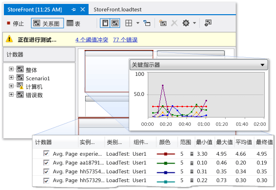

# 分析 SharePoint 应用程序的性能
  如果您的 SharePoint 应用程序运行速度缓慢或效率低下，可以使用 Visual Studio 中的分析功能以确定有问题的代码和其他元素。  通过使用负载测试功能，您可以确定 SharePoint 应用程序在压力下（例如在许多用户同时访问该应用程序时）的运行方式。  通过运行 Web 性能测试，您可以估量程序在 Web 上执行的如何。  通过使用编码的 UI 测试，您可以验证整个 SharePoint 应用程序（包括其用户界面）是否能正确运行。  当您一起使用这些测试时，它们可帮助您在部署应用程序前识别性能问题。  
  
## 分析工具概述  
 分析参考观察和记录您的应用程序运行时性能的过程。  通过分析应用程序，您可以找到问题，例如瓶颈、低效代码和内存分配问题，这些问题会导致应用程序运行缓慢或占用大量内存。  例如，可以通过使用分析来识别代码中的热点，这些热点是一些代码片段，且被频繁调用，并会降低应用程序的总体性能。  确认作用点后，您通常可以优化或消除它们。  
  
 您可使用集成开发环境 \(IDE\) 中的若干分析工具来识别和查找这类性能问题。  这些工具在 SharePoint 项目中的使用方法与在其他类 Visual Studio 项目中使用的方法相同。  分析工具性能向导将引导您创建使用指定测试的性能会话。  性能会话是用于收集应用程序的性能信息以及一个或多个分析运行结果的一组配置数据。  性能会话存储在项目文件夹中，您可以在“性能资源管理器”中查看它们。  有关详细信息，请参阅 [了解分析方法](../profiling/understanding-performance-collection-methods.md)。  
  
 在应用程序上创建并运行配置文件分析后，报表会提供有关其性能的详细信息。  此报表可包含各种项（例如，在一段时间内的 CPU 使用率关系图、调用堆栈或调用树的分层函数关系图）。  该报表的确切内容可能有所不同，具体取决于运行的测试类型（例如采样或检测）。  有关更多信息，请参阅[分析工具报告概述](http://go.microsoft.com/fwlink/?LinkId=224689)。  
  
## 性能会话进程  
 若要分析应用程序，可通过使用“分析工具性能向导”创建性能会话开始。  在菜单栏上，选择“分析”、“启动性能向导”。  完成向导后，输入性能会话所需的信息，例如您想要的配置文件方法和您想概述的应用程序。  有关详情，请参阅[如何使用性能向导对网站或 Web 应用程序进行分析](http://go.microsoft.com/fwlink/?LinkId=224692)。  或者，您可以使用命令行选项设置并运行性能会话。  有关更多信息，请参阅[使用命令行中的分析工具](http://go.microsoft.com/fwlink/?LinkId=224703)。  如果您需要手动配置性能会话的各个方面，请参阅[如何使用分析工具手动创建性能会话](http://go.microsoft.com/fwlink/?LinkId=224691)。  通过在“测试结果”窗口中打开单元测试的快捷菜单并选择“创建性能会话”来从单元测试创建性能会话。  
  
 设置性能会话后，会话配置保存，服务器经配置提供分析数据，同时应用程序运行。  当您使用应用程序时，性能数据会写入日志文件。  性能会话在“目标”文件夹下的“性能资源管理器”列表中。  在性能会话完成后，其报告将出现在“性能资源管理器”中的“报告” 文件夹中。  若要显示该报表，请在“性能资源管理器”中打开。  若要查看或配置性能会话的属性，则在“性能资源管理器”中打开它的快捷菜单，然后选择“属性”。  有关性能会话的特定属性的详细信息，请参阅[为分析工具配置性能会话](http://go.microsoft.com/fwlink/?LinkId=224694)。  有关如何说明性能会话的结果的信息，请参阅[对分析工具数据进行分析](http://go.microsoft.com/fwlink/?LinkId=224704)。  
  
## 压力测试  
 可通过在 Visual Studio 旗舰版中创建负载测试和 web 性能测试分析您的应用程序的压力性能。  在 Visual Studio 中创建负载测试后，您需要指定一个因素组合（称之为方案），以此来测试您的应用程序。  这些因素包括负载模式、测试组合模式、测试组合、网络组合和 Web 浏览器组合。  负载测试方案可以包含单元测试和 web 性能测试。  
  
 图 1：加载测试结果的示例  
  
   
  
 Web 性能测试可模拟最终用户与 SharePoint 应用程序的交互方式。  您可以通过在浏览器会话中记录 HTTP 请求或使用“Web 性能测试记录器”来创建 Web 性能测试。  在浏览器会话结束后，将在“Web 性能测试编辑器”中显示 Web 请求。  然后，您可以在“Web 性能测试结果查看器”中调试结果。  还可以使用 Web 性能测试编辑器手动生成 Web 性能测试。  
  
## 测试用户界面  
 编码的 UI 测试通过 SharePoint 应用程序的用户界面 \(UI\)对该应用程序进行驱动。  这些测试涵盖 UI 控件测试，例如按钮和菜单，以验证它们是否正常工作。  如果在 UI（例如网页）中执行验证或其他逻辑，这种测试尤其有用。  也可使用编码 UI 测试来自动手动测试。  您采用与创建其他类型应用程序相同的方式来创建 SharePoint 应用程序的编码 UI 测试。  有关详细信息，请参阅 [使用编码的 UI 测试来测试 SharePoint 2010 应用程序](../test/testing-sharepoint-2010-applications-with-coded-ui-tests.md)。  
  
## 相关主题  
  
|标题|描述|  
|--------|--------|  
|[演练：分析 SharePoint 应用程序](../sharepoint/walkthrough-profiling-a-sharepoint-application.md)|演示如何在 SharePoint 应用程序上执行采样配置文件分析。|  
|[Create and run a load test](http://msdn.microsoft.com/zh-cn/7041cbcf-9ab1-4579-98ff-8f296aeaded4)|描述如何创建负载测试，帮助您对 SharePoint 应用程序进行压力测试。|  
|[Creating and Editing Web Performance Tests](http://msdn.microsoft.com/zh-cn/8bf5f2a7-c693-47d6-9282-5946480151dc)|描述如何创建 Web 性能测试，帮助您模拟用户在 Web 上与您的 SharePoint 站点进行交互的方式。|  
|[单元测试代码](../test/unit-test-your-code.md)|描述如何使用单元测试来查找您代码中的逻辑错误。|  
|[使用编码的 UI 测试来测试 SharePoint 2010 应用程序](../test/testing-sharepoint-2010-applications-with-coded-ui-tests.md)|描述如何测试您的 SharePoint 应用程序的用户界面。|  
  
## 请参阅  
 [生成和调试 SharePoint 解决方案](../sharepoint/building-and-debugging-sharepoint-solutions.md)   
 [测试应用程序](../Topic/Test%20apps%20early%20and%20often.md)   
 [提高代码质量](../test/improve-code-quality.md)  
  
  