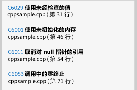
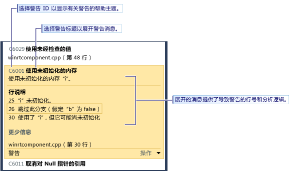

# 使用 Visual Studio 静态代码分析来分析应用商店应用的 C++ 代码质量
[!INCLUDE[vs2017banner](../code-quality/includes/vs2017banner.md)]

  
  
 Visual Studio Express 版本中的代码分析工具可检查代码中是否存在一组常见问题以及违反良好编程习惯的情况。  代码分析警告与编译器错误和警告不同，因为代码分析工具搜索的是虽然有效但仍会为你或使用你代码的其他人员带来问题的特定代码模式。  代码分析还可在代码中找到通过测试难以发现的缺陷。  在开发过程中定期运行代码分析工具可提高所编写的应用程序的质量。  
  
> [!NOTE]
>  在 Visual Studio 旗舰版、Visual Studio 高级专业版和 Visual Studio 专业版中，可使用完整的代码分析工具。  请参阅 MSDN 库中的[使用代码分析工具来分析应用程序质量](http://msdn.microsoft.com/library/dd264897.aspx)。  
  
## 在本主题中  
 可了解：  
  
 [运行代码分析](../test/analyze-cpp-code-quality-of-store-apps-using-visual-studio-static-code-analysis.md#BKMK_Run)  
  
 [分析和解决代码分析警告](../test/analyze-cpp-code-quality-of-store-apps-using-visual-studio-static-code-analysis.md#BKMK_Analyze)  
  
 [禁止显示代码分析警告](../test/analyze-cpp-code-quality-of-store-apps-using-visual-studio-static-code-analysis.md#BKMK_Suppress)  
  
 [搜索和筛选代码分析结果](../test/analyze-cpp-code-quality-of-store-apps-using-visual-studio-static-code-analysis.md#BKMK_Search)  
  
 [C++ 代码分析警告](../test/analyze-cpp-code-quality-of-store-apps-using-visual-studio-static-code-analysis.md#Warnings)  
  
##   运行代码分析  
 若要对 Visual Studio 解决方案运行代码分析，请执行以下操作：  
  
-   在**“生成”**菜单上，选择**“对解决方案运行代码分析”**。  
  
 若要在每次生成项目时自动运行代码分析，请执行以下操作：  
  
1.  在解决方案资源管理器中选择项目名称，然后选择**“属性”**。  
  
2.  在项目属性页中，选择**“代码分析”**，然后选择**“生成时启用适用于 C\/C\+\+ 的代码分析”**。  
  
 这样，解决方案编译后将运行代码分析。  结果将显示在“代码分析”窗口中。  
  
   
  
##   分析和解决代码分析警告  
 若要分析某个具体的警告，请在“代码分析”窗口中选择该警告的标题。  随后该警告将展开，显示有关问题的详细信息。  如果可能，代码分析将显示导致该警告的行号和分析逻辑。  
  
   
  
 展开警告后，将在 Visual Studio 代码编辑器中突出显示导致警告的代码行。  
  
   
  
 了解问题后，可在代码中解决该问题。  然后，重新运行代码分析，以确保“代码分析”窗口中不再显示警告，并确保修复行为不会引发新的警告。  
  
> [!TIP]
>  可从“代码分析”窗口中重新运行代码分析。  选择**“分析”**按钮，然后选择分析的范围。  可对整个解决方案对所选项目重新运行分析。  
  
##   禁止显示代码分析警告  
 有时，你可能会决定不修复代码分析警告。  你可能会觉得与代码的任何真实实现中引发问题的可能性相比，解决警告所需的重新编码工作量过大。  或者，你可能会认为在警告中使用的分析不适合特定的上下文。  可禁止显示个别警告，以使“代码分析”窗口中不再显示这些警告。  
  
 若要禁止显示警告，请执行以下操作：  
  
1.  如果未显示详细信息，可将警告的标题展开。  
  
2.  选择警告底部的**“操作”**链接。  
  
3.  选择**“禁止显示消息”**，然后选择**“在源中”**。  
  
 “禁止显示消息”插入 `#pragma(warning:`*WarningId*`)`，它可禁止显示这行代码的警告。  
  
##   搜索和筛选代码分析结果  
 可搜索冗长的警告消息列表，也可在多项目解决方案中筛选警告。  
  
   
  
##   C\+\+ 代码分析警告  
 代码分析可引发以下有关 C\+\+ 代码的警告：  
  
|规则|说明|  
|--------|--------|  
|[C6001](../code-quality/c6001.md)|使用未初始化的内存|  
|[C6011](../code-quality/c6011.md)|取消引用 Null 指针|  
|[C6029](../code-quality/c6029.md)|未选中的值的使用|  
|[C6053](../code-quality/c6053.md)|来自调用的零终止|  
|[C6059](../code-quality/c6059.md)|不正确的串联|  
|[C6063](../code-quality/c6063.md)|缺少 Format 函数的字符串参数|  
|[C6064](../code-quality/c6064.md)|缺少 Format 函数的整型参数|  
|[C6066](../code-quality/c6066.md)|缺少 Format 函数的指针参数|  
|[C6067](../code-quality/c6067.md)|缺少 Format 函数的字符串指针参数|  
|[C6101](../code-quality/c6101.md)|返回未初始化的内存|  
|[C6200](../code-quality/c6200.md)|索引超出最大缓冲区大小|  
|[C6201](../code-quality/c6201.md)|索引超出最大堆栈缓冲区大小|  
|[C6270](../code-quality/c6270.md)|缺少 Format 函数的浮点型参数|  
|[C6271](../code-quality/c6271.md)|Format 函数的额外参数|  
|[C6272](../code-quality/c6272.md)|Format 函数的非浮点型参数|  
|[C6273](../code-quality/c6273.md)|Format 函数的非整型参数|  
|[C6274](../code-quality/c6274.md)|Format 函数的非字符参数|  
|[C6276](../code-quality/c6276.md)|无效字符串的强制转换|  
|[C6277](../code-quality/c6277.md)|无效 CreateProcess 的调用|  
|[C6284](../code-quality/c6284.md)|Format 函数的无效对象参数|  
|[C6290](../code-quality/c6290.md)|逻辑非和按位与的优先级|  
|[C6291](../code-quality/c6291.md)|逻辑非和按位或的优先级|  
|[C6302](../code-quality/c6302.md)|Format 函数的无效字符串参数|  
|[C6303](../code-quality/c6303.md)|Format 函数的无效宽字符串参数|  
|[C6305](../code-quality/c6305.md)|不匹配的大小和计数的使用|  
|[C6306](../code-quality/c6306.md)|不正确的变量参数函数的调用|  
|[C6328](../code-quality/c6328.md)|可能的参数类型不匹配|  
|[C6385](../code-quality/c6385.md)|读取溢出|  
|[C6386](../code-quality/c6386.md)|写入溢出|  
|[C6387](../code-quality/c6387.md)|无效的参数值|  
|[C6500](../code-quality/c6500.md)|无效的特性属性|  
|[C6501](../code-quality/c6501.md)|冲突的特性属性值|  
|[C6503](../code-quality/c6503.md)|引用不能为 Null|  
|[C6504](../code-quality/c6504.md)|在非指针参数中为 Null|  
|[C6505](../code-quality/c6505.md)|对 Void 类型使用 MustCheck 属性|  
|[C6506](../code-quality/c6506.md)|非指针参数或数组的缓冲区大小|  
|[C6507](http://msdn.microsoft.com/zh-cn/18f88cd1-d035-4403-a6a4-12dd0affcf21)|取消引用零处的 Null 不匹配|  
|[C6508](../code-quality/c6508.md)|常量缓冲区上的写入权限|  
|[C6509](../code-quality/c6509.md)|返回使用的前置条件|  
|[C6510](../code-quality/c6510.md)|在非指针参数中以 Null 结尾的参数|  
|[C6511](../code-quality/c6511.md)|MustCheck 属性必须为 Yes 或 No|  
|[C6513](../code-quality/c6513.md)|没有缓冲区大小的元素大小|  
|[C6514](../code-quality/c6514.md)|缓冲区大小超过数组大小|  
|[C6515](../code-quality/c6515.md)|非指针参数的缓冲区大小|  
|[C6516](../code-quality/c6516.md)|在特性上无属性|  
|[C6517](../code-quality/c6517.md)|有效的不可读缓冲区的大小|  
|[C6518](../code-quality/c6518.md)|不可写的缓冲区的可写入大小|  
|[C6519](http://msdn.microsoft.com/zh-cn/2b6326b0-0539-4d26-8fb1-720114933232)|无效的批注：“NeedsRelease”属性的值必须为 Yes 或 No|  
|[C6521](http://msdn.microsoft.com/zh-cn/e98d0ae3-6f13-47b2-9a15-15d4055af9ef)|取消引用无效大小的字符串|  
|[C6522](../code-quality/c6522.md)|无效大小的字符串类型|  
|[C6523](http://msdn.microsoft.com/zh-cn/11397a31-b224-46b0-afb7-d49ca576a3bb)|无效大小的字符串参数|  
|[C6525](../code-quality/c6525.md)|无效大小字符串的不可访问的位置|  
|[C6526](http://msdn.microsoft.com/zh-cn/59c590c7-0098-4166-a1ac-87f324596002)|无效大小的字符串缓冲区类型|  
|[C6527](../code-quality/c6527.md)|无效的批注：“NeedsRelease”属性可能不可用于 void 类型的值|  
|[C6530](../code-quality/c6530.md)|无法识别的格式字符串样式|  
|[C6540](../code-quality/c6540.md)|对该函数使用属性批注将使其现有的所有 \_\_declspec 批注无效|  
|[C6551](../code-quality/c6551.md)|大小规范无效：表达式不可分析|  
|[C6552](../code-quality/c6552.md)|Deref\= 或 Notref\= 无效：表达式不可分析|  
|[C6701](../code-quality/c6701.md)|该值不是有效的 Yes\/No\/Maybe 值|  
|[C6702](../code-quality/c6702.md)|该值不是字符串值|  
|[C6703](../code-quality/c6703.md)|该值不是一个数字|  
|[C6704](../code-quality/c6704.md)|意外的批注表达式错误|  
|[C6705](../code-quality/c6705.md)|批注参数的预期数量与批注参数的实际数量不匹配|  
|[C6706](../code-quality/c6706.md)|批注的意外批注错误|  
|[C28021](../code-quality/c28021.md)|批注的参数必须为指针型|  
|[C28182](../code-quality/c28182.md)|取消引用 NULL 指针。  该指针包含与另一指针相同的 NULL 值。|  
|[C28202](../code-quality/c28202.md)|非法引用非静态成员|  
|[C28203](../code-quality/c28203.md)|对类成员的不明确的引用。|  
|[C28205](../code-quality/c28205.md)|在非法上下文中使用的 \_Success\_ 或 \_On\_failure\_|  
|[C28206](../code-quality/c28206.md)|若左操作数指向结构，则使用“\-\>”|  
|[C28207](../code-quality/c28207.md)|若左操作数是一个结构，则使用“.”|  
|[C28210](../code-quality/c28210.md)|\_\_on\_failure 上下文的批注不得位于显式的 pre 上下文中|  
|[C28211](../code-quality/c28211.md)|SAL\_context 所需的静态上下文名称|  
|[C28212](../code-quality/c28212.md)|批注所需的指针表达式|  
|[C28213](../code-quality/c28213.md)|\_Use\_decl\_annotations\_ 批注必须在不进行修改的情况下用于引用（在上一个声明中）。|  
|[C28214](../code-quality/c28214.md)|特性参数的名称必须为 p1...p9|  
|[C28215](../code-quality/c28215.md)|不能将 typefix 应用于已包含 typefix 的参数|  
|[C28216](../code-quality/c28216.md)|checkReturn 批注仅应用于特定函数参数的后置条件。|  
|[C28217](../code-quality/c28217.md)|对于函数，批注的参数数目与在文件中找到的数目不匹配|  
|[C28218](../code-quality/c28218.md)|对于函数参数，批注的参数与在文件中找到的参数不匹配|  
|[C28219](../code-quality/c28219.md)|批注中的批注参数所需的枚举成员|  
|[C28220](../code-quality/c28220.md)|批注中的批注参数所需的整数表达式|  
|[C28221](../code-quality/c28221.md)|批注中的参数所需的字符串表达式|  
|[C28222](../code-quality/c28222.md)|批注所需的 \_\_yes、\_\_no 或 \_\_maybe|  
|[C28223](../code-quality/c28223.md)|未找到批注和参数所需的标记\/标识符|  
|[C28224](../code-quality/c28224.md)|批注需要参数|  
|[C28225](../code-quality/c28225.md)|未在批注中找到所需参数的正确数目|  
|[C28226](../code-quality/c28226.md)|批注也不能为 PrimOp（在当前声明中）|  
|[C28227](../code-quality/c28227.md)|批注也不能为 PrimOp（请参阅上一个声明）|  
|[C28228](../code-quality/c28228.md)|批注参数：在批注中不能使用类型|  
|[C28229](../code-quality/c28229.md)|批注不支持参数|  
|[C28230](../code-quality/c28230.md)|参数类型没有成员。|  
|[C28231](../code-quality/c28231.md)|批注仅在数组上有效|  
|[C28232](../code-quality/c28232.md)|pre、post 或 deref 不适用于任何批注|  
|[C28233](../code-quality/c28233.md)|pre、post 或 dere 适用于块|  
|[C28234](../code-quality/c28234.md)|\_\_at 表达式不适用于当前函数|  
|[C28235](../code-quality/c28235.md)|函数无法作为批注单独存在|  
|[C28236](../code-quality/c28236.md)|批注无法在表达式中使用|  
|[C28237](../code-quality/c28237.md)|不再支持参数上的批注|  
|[C28238](../code-quality/c28238.md)|参数上的批注具有多个值：stringValue 和 longValue。  使用 paramn\=xxx|  
|[C28239](../code-quality/c28239.md)|参数上的批注包含两个值 stringValue 或 longValue；paramn\=xxx。  仅使用 paramn\=xxx|  
|[C28240](../code-quality/c28240.md)|参数上的批注包含 param2，但不包含 param1|  
|[C28241](../code-quality/c28241.md)|未识别参数上的函数的批注|  
|[C28243](../code-quality/c28243.md)|参数上函数的批注需要的取消引用次数多于已批注的实际类型所允许的次数|  
|[C28245](../code-quality/c28245.md)|函数的批注将在非成员函数上批注“this”|  
|[C28246](../code-quality/c28246.md)|函数的参数批注与参数的类型不匹配|  
|[C28250](../code-quality/c28250.md)|函数的批注不一致：上一实例发生错误。|  
|[C28251](../code-quality/c28251.md)|函数的批注不一致：该实例发生错误。|  
|[C28252](../code-quality/c28252.md)|函数的批注不一致：参数在此实例中包含另一个批注。|  
|[C28253](../code-quality/c28253.md)|函数的批注不一致：参数在此实例中包含另一个批注。|  
|[C28254](../code-quality/c28254.md)|批注中不支持 dynamic\_cast\<\>\(\)|  
|[C28262](../code-quality/c28262.md)|对于批注，在函数中找到了批注的语法错误|  
|[C28263](../code-quality/c28263.md)|在条件批注中找到内部批注的语法错误|  
|[C28264](http://msdn.microsoft.com/zh-cn/bf6ea983-a06e-4752-a042-747a7dbf338c)|结果列出了必须为常量的值。|  
|[C28267](../code-quality/c28267.md)|在函数中找到了批注的语法错误。|  
|[C28272](../code-quality/c28272.md)|在检查参数时，函数的批注与函数声明不一致|  
|[C28273](../code-quality/c28273.md)|对于函数，线索与函数声明不一致|  
|[C28275](../code-quality/c28275.md)|\_Macro\_value\_ 参数为 null|  
|[C28279](../code-quality/c28279.md)|对于符号，已找到“起始”符号，但没有匹配的“结束”符号|  
|[C28280](../code-quality/c28280.md)|对于符号，已找到“结束”符号，但没有匹配的“起始”符号|  
|[C28282](../code-quality/c28282.md)|格式字符串必须位于前置条件中|  
|[C28285](../code-quality/c28285.md)|对于函数，参数中存在语法错误|  
|[C28286](../code-quality/c28286.md)|对于函数，在其结尾附近出现语法错误|  
|[C28287](../code-quality/c28287.md)|对于函数，\_At\_\(\) 批注中出现语法错误（参数名无法识别）|  
|[C28288](../code-quality/c28288.md)|对于函数，\_At\_\(\) 批注中出现语法错误（参数名无法识别）|  
|[C28289](../code-quality/c28289.md)|对于函数：ReadableTo 或 WritableTo 没有用作参数的限制规范|  
|[C28290](../code-quality/c28290.md)|函数的批注包含的外部对象数量多于实际的参数数量|  
|[C28291](../code-quality/c28291.md)|deref 级别 0 处的 post null\/notnull 对于函数无意义。|  
|[C28300](../code-quality/c28300.md)|运算符的不可兼容类型的表达式操作数|  
|[C28301](../code-quality/c28301.md)|函数的第一个声明中不包含任何批注。|  
|[C28302](../code-quality/c28302.md)|在批注上找到额外的 \_Deref\_ 运算符。|  
|[C28303](../code-quality/c28303.md)|在批注上找到不明确的 \_Deref\_ 运算符。|  
|[C28304](../code-quality/c28304.md)|找到应用于标记的错误放置的 \_Notref\_ 运算符。|  
|[C28305](../code-quality/c28305.md)|在分析标记时发现错误。|  
|[C28350](../code-quality/c28350.md)|批注介绍了无条件适用的情形。|  
|[C28351](../code-quality/c28351.md)|批注介绍了在条件中无法使用动态值（变量）的位置。|