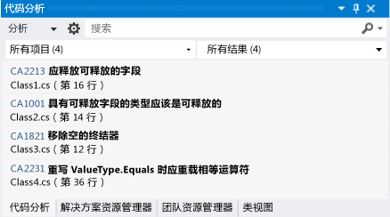
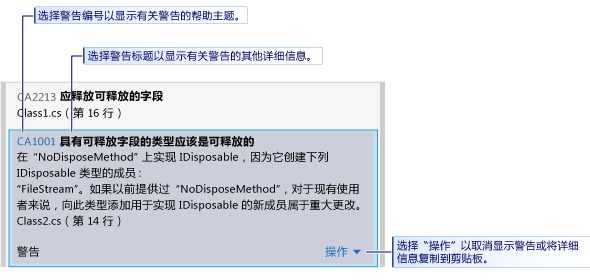
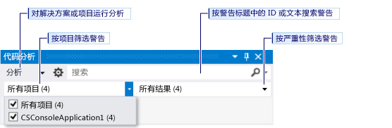

# 使用 Visual Studio 静态代码分析来分析应用商店应用中的 Visual Basic 和 C# 代码质量
[!INCLUDE[vs2017banner](../code-quality/includes/vs2017banner.md)]

  
  
 Visual Studio Express 中的代码分析工具可检查代码中是否存在一组常见缺陷以及违反良好编程习惯的情况。  代码分析警告与编译器错误和警告不同，因为代码分析工具搜索的是虽然有效但仍会为你或使用你代码的其他人员带来问题的特定代码模式。  代码分析还可在代码中找到通过测试难以发现的缺陷。  在开发过程中定期运行代码分析工具可提高所编写的应用程序的质量。  
  
> [!NOTE]
>  在 Visual Studio 旗舰版、Visual Studio 高级专业版和 Visual Studio 专业版中，可使用完整的代码分析功能。  请参阅 MSDN 库中的[使用代码分析工具来分析应用程序质量](http://msdn.microsoft.com/library/dd264897.aspx)。  
  
## 在本主题中  
 可了解：  
  
 [运行代码分析](../test/analyze-visual-basic-and-csharp-code-quality-in-store-apps-using-visual-studio-static-code-analysis.md#BKMK_Run)  
  
 [分析和解决代码分析警告](../test/analyze-visual-basic-and-csharp-code-quality-in-store-apps-using-visual-studio-static-code-analysis.md#BKMK_Analyze)  
  
 [禁止显示代码分析警告](../test/analyze-visual-basic-and-csharp-code-quality-in-store-apps-using-visual-studio-static-code-analysis.md#BKMK_Suppress)  
  
 [搜索和筛选代码分析结果](../test/analyze-visual-basic-and-csharp-code-quality-in-store-apps-using-visual-studio-static-code-analysis.md#BKMK_Search)  
  
 [Visual Basic 和 C# 代码分析警告](../test/analyze-visual-basic-and-csharp-code-quality-in-store-apps-using-visual-studio-static-code-analysis.md#BKMK_Warnings)  
  
##   运行代码分析  
 若要对 Visual Studio 解决方案运行代码分析，请执行以下操作：  
  
-   在**“生成”**菜单上，选择**“对解决方案运行代码分析”**。  
  
 若要在每次生成项目时自动运行代码分析，请执行以下操作：  
  
1.  在解决方案资源管理器中右击项目名称，然后选择**“属性”**。  
  
2.  在项目属性页中，选择**“代码分析”**，然后选中**“生成时启用代码分析\(定义 CODE\_ANALYSIS 常量\)”**。  
  
 这样，解决方案编译后将运行代码分析。  结果将显示在“代码分析”窗口中。  
  
   
  
##   分析和解决代码分析警告  
 若要分析某个具体的警告，请在“代码分析”窗口中单击该警告的标题。  随后该警告将展开，显示有关问题的详细信息。  
  
   
  
 展开警告后，将在 Visual Studio 代码编辑器中突出显示导致警告的代码行。  
  
   
  
 了解问题后，可在代码中解决该问题。  然后，重新运行代码分析，以确保“代码分析”窗口中不再显示警告，并确保修复行为不会引发新的警告。  
  
> [!TIP]
>  可从“代码分析”窗口中重新运行代码分析。  单击**“分析”**按钮，然后选择分析的范围。  可对整个解决方案对所选项目重新运行分析。  
  
##   禁止显示代码分析警告  
 有时，你可能会决定不修复代码分析警告。  你可能会觉得与代码的任何真实实现中引发问题的可能性相比，解决警告所需的重新编码工作量过大。  或者，你可能会认为在警告中使用的分析不适合特定的上下文。  可禁止显示个别警告，以使“代码分析”窗口中不再显示这些警告。  
  
 若要禁止显示警告，请执行以下操作：  
  
1.  如果未显示详细信息，则单击警告的标题以将其展开。  
  
2.  选择警告底部的**“操作”**链接。  
  
3.  指向**“禁止显示消息”**，然后选择**“在源中”**或**“在禁止显示文件中”**。  
  
    -   **“在源中”**在源文件中产生该警告的方法上方插入 `SuppressMessage` 特性。  这样可更容易地发现禁止显示。  
  
    -   **“在禁止显示文件中”**将 `SuppressMessage` 特性添加到项目的 **GlobalSuppressions.cs** 文件。  这样可更容易地管理禁止显示。  注意，添加到 `SuppressMessage` 的 **GlobalSuppression.cs** 特性还针对产生该警告的方法。  该特性并不在全局禁止显示该警告。  
  
     决定在源文件中还是在禁止显示文件中禁止显示警告取决于编码风格和需要。  
  
##   搜索和筛选代码分析结果  
 可搜索冗长的警告消息列表，也可在多项目解决方案中筛选警告。  
  
   
  
 在 [!INCLUDE[vs_dev11_expwin_long](../misc/includes/vs_dev11_expwin_long_md.md)] 中，所有代码分析警告的严重性级别均为“警告”。  
  
##   Visual Basic 和 C\# 代码分析警告  
 代码分析可引发以下警告：  
  
 [CA1001：具有可释放字段的类型应该是可释放的](http://msdn.microsoft.com/library/ms182172.aspx)  
  
 [CA1821：删除空终结器](http://msdn.microsoft.com/library/bb264476.aspx)  
  
 [CA2213：应释放可释放的字段](http://msdn.microsoft.com/library/ms182328.aspx)  
  
 [CA2229：实现序列化构造函数](http://msdn.microsoft.com/library/ms182343.aspx)  
  
 [CA2231：替代 ValueType.Equals 时重载相等运算符](http://msdn.microsoft.com/library/ms182359.aspx)