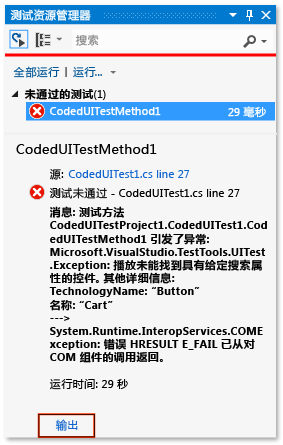
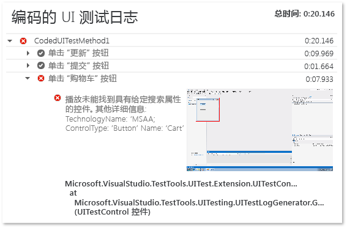

# <a name="analyzing-coded-ui-tests-using-coded-ui-test-logs"></a>使用编码的 UI 测试日志分析编码的 UI 测试
编码的 UI 测试日志筛选并录制关于编码的 UI 测试运行的重要信息。  
  
 **要求**  
  
-   Visual Studio Enterprise  
  
## <a name="why-should-i-do-this"></a>为什么应这样做?  
 这些日志以允许快速调试问题的形式呈现。  
  
## <a name="how-do-i-do-this"></a>如何执行此操作?  
  
### <a name="step-1-enable-logging"></a>步骤 1：启用日志记录  
 根据你的方案，使用以下方法之一启用日志。  
  
-   在测试项目中不存在 App.config 文件的目标 .NET Framework 版本 4  
  
    -   打开 **QTAgent32_40.exe.config** 文件。  
  
         默认情况下，此文件位于 **\<驱动器号>:\Program Files (x86)\Microsoft Visual Studio 12.0\Common7\IDE** 中。  
  
         将 EqtTraceLevel 的值修改为你想要的日志级别。  
  
         保存该文件。  
  
-   在测试项目中不存在 App.config 文件的目标 .NET Framework 版本 4.5  
  
    -   打开 **QTAgent32.exe.config** 文件。  
  
         默认情况下，此文件位于 **\<驱动器号>:\Program Files (x86)\Microsoft Visual Studio 12.0\Common7\IDE** 中。  
  
         将 EqtTraceLevel 的值修改为你想要的日志级别。  
  
         保存该文件。  
  
-   存在于测试项目中的 App.config 文件  
  
    -   在项目中打开 App.config 文件。  
  
         在配置节点下，添加以下代码：  
  
         `<system.diagnostics>     <switches>       <add name="EqtTraceLevel" value="4" />     </switches>  </system.diagnostics>`  
  
-   从测试代码本身启用日志记录  
  
    -   <xref:Microsoft.VisualStudio.TestTools.UITesting.PlaybackSettings.LoggerOverrideState%2A> = HtmlLoggerState.AllActionSnapshot；  
  
### <a name="step-2-run-your-coded-ui-test-and-view-the-log"></a>步骤 2: 运行编码的 UI 测试并查看日志  
 对 **QTAgent32.exe.config** 文件就地运行编码的 UI 测试并对其进行修改时，可在“测试资源管理器”结果中看到一条输出链接。 日志文件不仅在测试失败时生成，而且在跟踪级别设置为“详细”时也会对成功的测试生成。  
  
1.  在“测试”菜单上，选择“窗口”，然后选择“测试资源管理器”。  
  
2.  在“生成”菜单上，选择“生成解决方案”。  
  
3.  在“测试资源管理器”中，选择想要运行的编码的 UI 测试、打开其快捷菜单，然后选择“运行选定测试”。  
  
     自动测试将运行并指示它们是否通过。  
  
    > [!TIP]
    >  若要从“测试”菜单查看测试资源管理器，请指向“Windows”，然后选择“测试资源管理器”。  
  
4.  在“测试资源管理器”结果中选择“输出”链接。  
  
       
  
     这将显示测试的输出，该输出将包括指向操作日志的链接。  
  
       
  
5.  选择 UITestActionLog.html 链接。  
  
     该日志显示在你的 Web 浏览器中。  
  
       
  
## <a name="q--a"></a>问题解答  
  
### <a name="q-what-happened-to-the-enablehtmllogger-key"></a>问：EnableHtmlLogger 密钥发生了什么情况？  
 在 Visual Studio 的早期版本中，针对在编码的 UI 测试中启用 Html 记录器存在另外两个配置设置：  
  
```  
  
<add key="EnableHtmlLogger" value="true"/>  
  
<add key="EnableSnapshotInfo" value="true"/>  
  
```  
  
 从 Visual Studio 2012 之后，这些设置均已弃用。 EqtTraceLevel 是唯一需要修改才能启用 HtmlLogger 的设置。  
  
## <a name="see-also"></a>另请参阅  
 [使用 UI 自动化来测试代码](../test/use-ui-automation-to-test-your-code.md)   
 [如何：从 Microsoft Visual Studio 运行测试](http://msdn.microsoft.com/Library/1a1207a9-2a33-4a1e-a1e3-ddf0181b1046)

