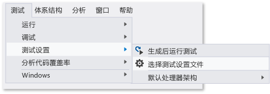

# <a name="configure-unit-tests-by-using-a-runsettings-file"></a>使用 .runsettings 文件配置单元测试
通过使用 *.runsettings 文件，可配置 Visual Studio 中的单元测试。 （文件名并不重要，前提是使用扩展名“.runsettings”。）例如，可以更改将运行测试的 .NET Framework、提供测试结果的目录以及在测试运行期间收集的数据。  
  
 如果不希望执行任何特殊配置，则无需 *.runsettings 文件。 最常见的用途是自定义[代码覆盖率](../test/customizing-code-coverage-analysis.md)。  
  
> [!NOTE]
>  **.runsettings 和 .testsettings**  
>   
>  有两种类型的文件可供配置测试。 *.runsettings 用于单元测试。 \*.testsettings 用于[实验室环境测试](/devops-test-docs/test/specifying-test-settings-for-visual-studio-tests)、Web 性能和负载测试，以及用于自定义某些类型的诊断数据适配器（如 Intellitrace 和事件日志适配器）。  
>   
>  在 2010 之前的 Visual Studio 版本中，还可通过使用 *.testsettings 文件自定义单元测试。 你仍可以这么做，但是测试运行的速度将会比在 \*.runsettings 文件中使用等效配置慢得多。  
  
## <a name="customizing-tests-with-a-runsettings-file"></a>使用 .runsettings 文件自定义测试  
  
1.  将 XML 文件添加到 Visual Studio 解决方案并将其重命名为 test.runsettings。 （文件名并不重要，但扩展名必须是 .runsettings。）  
  
2.  将文件内容替换为 [示例](#example)。  
  
     根据你的需要对其进行编辑。  
  
3.  在“测试”  菜单上，依次选择“测试设置” 、“选择测试设置文件” 。  
  
 通过使用“测试设置”菜单，可在解决方案中创建多个 \*.runsettings 文件，并在不同时间启用或禁用它们。  
  
   
  
##  <a name="example"></a>复制此示例 .runsettings 文件  
 这是典型的 *.runsettings 文件。 文件的每个元素是可选的，因为每个值都有默认值。  
  
```xml  
<?xml version="1.0" encoding="utf-8"?>  
<RunSettings>  
  <!-- Configurations that affect the Test Framework -->  
  <RunConfiguration>  
    <MaxCpuCount>1</MaxCpuCount>  
    <!-- Path relative to solution directory -->  
    <ResultsDirectory>.\TestResults</ResultsDirectory>  
  
    <!-- [x86] | x64    
      - You can also change it from menu Test, Test Settings, Default Processor Architecture -->  
    <TargetPlatform>x86</TargetPlatform>  
  
    <!-- Framework35 | [Framework40] | Framework45 -->  
    <TargetFrameworkVersion>Framework40</TargetFrameworkVersion>  
  
    <!-- Path to Test Adapters -->  
    <TestAdaptersPaths>%SystemDrive%\Temp\foo;%SystemDrive%\Temp\bar</TestAdaptersPaths>  
  </RunConfiguration>  
  
  <!-- Configurations for data collectors -->  
  <DataCollectionRunSettings>  
    <DataCollectors>  
      <DataCollector friendlyName="Code Coverage" uri="datacollector://Microsoft/CodeCoverage/2.0" assemblyQualifiedName="Microsoft.VisualStudio.Coverage.DynamicCoverageDataCollector, Microsoft.VisualStudio.TraceCollector, Version=11.0.0.0, Culture=neutral, PublicKeyToken=b03f5f7f11d50a3a">  
        <Configuration>  
          <CodeCoverage>  
            <ModulePaths>  
              <Exclude>  
                <ModulePath>.*CPPUnitTestFramework.*</ModulePath>  
              </Exclude>  
            </ModulePaths>  
  
            <!-- We recommend you do not change the following values: -->  
            <UseVerifiableInstrumentation>True</UseVerifiableInstrumentation>  
            <AllowLowIntegrityProcesses>True</AllowLowIntegrityProcesses>  
            <CollectFromChildProcesses>True</CollectFromChildProcesses>  
            <CollectAspDotNet>False</CollectAspDotNet>  
  
          </CodeCoverage>  
        </Configuration>  
      </DataCollector>  
  
    </DataCollectors>  
  </DataCollectionRunSettings>  
  
  <!-- Parameters used by tests at runtime -->  
  <TestRunParameters>  
    <Parameter name="webAppUrl" value="http://localhost" />  
    <Parameter name="webAppUserName" value="Admin" />  
    <Parameter name="webAppPassword" value="Password" />  
  </TestRunParameters>  
  
  <!-- Adapter Specific sections -->  
  
  <!-- MSTest adapter -->  
  <MSTest>  
    <MapInconclusiveToFailed>True</MapInconclusiveToFailed>  
    <CaptureTraceOutput>false</CaptureTraceOutput>  
    <DeleteDeploymentDirectoryAfterTestRunIsComplete>False</DeleteDeploymentDirectoryAfterTestRunIsComplete>  
    <DeploymentEnabled>False</DeploymentEnabled>  
    <AssemblyResolution>  
      <Directory Path="D:\myfolder\bin\" includeSubDirectories="false"/>  
    </AssemblyResolution>  
  </MSTest>  
  
</RunSettings>  
```  
  
 .runsettings 文件还可用于配置[代码覆盖率](../test/customizing-code-coverage-analysis.md)。  
  
 本主题的剩余部分将介绍文件内容。  
  
## <a name="edit-your-runsettings-file"></a>编辑 .runsettings 文件  
 该 .runsettings 文件具有以下元素。  
  
### <a name="test-run-configuration"></a>测试运行配置  
  
|节点|默认|值|  
|----------|-------------|------------|  
|`ResultsDirectory`||将在其中放置测试结果的目录。|  
|`TargetFrameworkVersion`|Framework40|Framework35、Framework40、Framework45<br /><br /> 这指定使用哪一版本的单元测试框架来查找并执行测试。 它可能与你在单元测试项目的生成属性中指定的 .NET 平台的版本不同。|  
|`TargetPlatform`|x86|x86、x64|  
|`TreatTestAdapterErrorsAsWarnings`|false|false、true|  
|`TestAdaptersPaths`||TestAdapters 所在目录的一个或多个路径|  
|`MaxCpuCount`|1|它利用计算机上的可用内核，在运行单元测试时控制并行测试执行的程度。  测试执行引擎在每个可用内核上作为单独的进程启动，并为每个内核提供包含要执行的测试的容器，如程序集、DLL 或相关项目。  测试容器即计划单位。  在每个容器中，测试将根据测试框架进行执行。  如果存在多个容器，进程在容器内完成测试执行时，系统会向它们提供下一个可用容器。<br /><br /> MaxCpuCount 可以是：<br /><br /> n，其中 1 <= n <= 内核数：最多将启动 n 个进程<br /><br /> n，其中 n = 任何其他值：启动的进程数将等于计算机上的可用内核数|  
  
### <a name="diagnostic-data-adapters-data-collectors"></a>诊断数据适配器（数据收集器）  
 `DataCollectors` 元素指定诊断数据适配器的设置。 诊断数据适配器用于收集有关测试环境和受测的应用程序的其他信息。 每个适配器都具有默认设置，因此如果不希望使用默认值，只需提供设置。  
  
#### <a name="code-coverage-adapter"></a>代码覆盖率适配器  
 代码覆盖率数据收集器创建应用程序代码的哪些部分已在测试中执行过的日志。 有关自定义代码覆盖率设置的详细信息，请参阅[自定义代码覆盖率分析](../test/customizing-code-coverage-analysis.md)。  
  
#### <a name="other-diagnostic-data-adapters"></a>其他诊断数据适配器  
 代码覆盖率适配器是当前可使用运行设置文件进行自定义的唯一适配器。  
  
 要自定义任何其他类型的诊断数据适配器，则必须使用测试设置文件。 有关详细信息，请参阅[指定 Visual Studio 测试的测试设置](/devops-test-docs/test/specifying-test-settings-for-visual-studio-tests)。  
  
#### <a name="testrunparameters"></a>TestRunParameters  
 TestRunParameters 提供了一种可用于运行时测试的定义变量和值的方法。  
  
### <a name="mstest-run-settings"></a>MSTest 运行设置  
 这些设置特定于运行具有 `[TestMethod]` 特性的测试方法的测试适配器。  
  
|配置|默认|值|  
|-------------------|-------------|------------|  
|ForcedLegacyMode|false|在 Visual Studio 2012 中，已对 MSTest 适配器进行了优化，使其变得更快且更具可伸缩性。 某些行为（如测试的运行顺序）可能不与 Visual Studio 早期版本中的完全一致。 将此值设置为 `true` 可使用旧测试适配器。<br /><br /> 例如，如果为单元测试指定 app.config 文件，则可能会用到此配置。<br /><br /> 我们建议你考虑重构测试以便可以使用较新的适配器。|  
|IgnoreTestImpact|false|当在 MSTest 中或从 Microsoft 测试管理器运行时，测试影响功能会设置受最近更改影响的测试的优先级。 此设置会停用该功能。 有关详细信息，请参阅 [How to: Collect Data to Check Which Tests Should be Run After Code Changes](http://msdn.microsoft.com/Library/2f921ea1-9bb0-4870-a30f-0521fc22cb47)（如何：收集数据来检查在代码更改后应该运行的测试）。|  
|SettingsFile||你可以指定测试设置文件以便与此处的 MS 测试适配器配合使用。 你还可以使用“测试” 、“测试设置” 和“选择测试设置文件” 菜单指定测试设置文件。<br /><br /> 如果指定此值，则还必须将“ForcedlegacyMode”  设置为“true” 。<br /><br /> `<RunSettings>   <MSTest>     <SettingsFile>my.testsettings</SettingsFile>      <ForcedLegacyMode>true</ForcedLegacyMode>    </MSTest> </RunSettings>`|  
|KeepExecutorAliveAfterLegacyRun|false|测试运行完成后，MSTest 将关闭。 任何作为测试的一部分启动的进程也将在此时终止。 如果要使测试执行器保持活动状态，请将此配置设置为 true。<br /><br /> 例如，可以使用此配置让浏览器保持在编码的 UI 测试之间运行。|  
|DeploymentEnabled|true|如果将此配置设置为 false，则不会将已在测试方法中指定的部署项目复制到部署目录中。|  
|CaptureTraceOutput|true|你可以使用 Trace.WriteLine 从测试方法写入调试跟踪。 利用此配置，你可以关闭这些调试跟踪。|  
|DeleteDeploymentDirectoryAfterTestRunIsComplete|true|你可以通过将此值设置为 false 在测试运行后保留部署目录。|  
|MapInconclusiveToFailed|false|如果测试返回无结论的状态，则通常会映射到测试资源管理器中的“已跳过”状态。 如果你希望无结论的测试显示为“失败”，请使用此配置。|  
|InProcMode|false|如果希望测试在与 MS 测试适配器相同的进程中运行，请将此值设置为 true。 此设置将提供较小的性能提升。 但是，如果测试异常退出，那么其他测试将不会继续。|  
|AssemblyResolution|false|查找和执行单元测试时，可以指定其他程序集的路径。  例如，对与测试程序集位于不同目录中的依赖程序集使用这些路径。  若要指定路径，请使用“Directory Path”元素。  路径可以包含环境变量。<br /><br /> `<AssemblyResolution>  <Directory Path>"D:\myfolder\bin\" includeSubDirectories="false"/> </AssemblyResolution>`|  
  
## <a name="see-also"></a>另请参阅  
 [自定义代码覆盖率分析](../test/customizing-code-coverage-analysis.md)   
 [指定 Visual Studio 测试的测试设置](/devops-test-docs/test/specifying-test-settings-for-visual-studio-tests)

