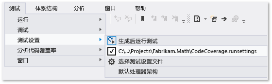
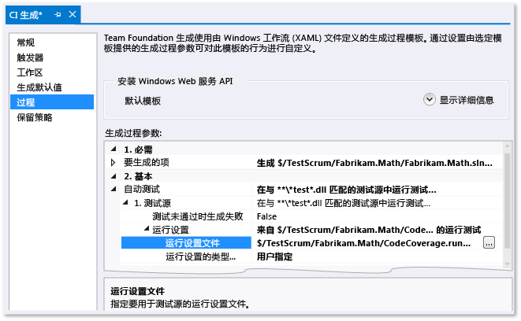

# <a name="customizing-code-coverage-analysis"></a>自定义代码覆盖率分析
默认情况下，Visual Studio Code 覆盖率工具将分析单元测试过程中加载的所有解决方案程序集 (.exe/.dll)。 建议保留此默认设置，因此它在大多数时间很有用。 有关详细信息，请参阅[使用代码覆盖率确定正在测试的代码数量](../test/using-code-coverage-to-determine-how-much-code-is-being-tested.md)。  
  
 在自定义代码覆盖率行为之前，请考虑某些替代项：  
  
-   *我希望代码覆盖率结果中不包含测试代码，只包含应用代码。*  
  
     将 `ExcludeFromCodeCoverage Attribute` 添加到测试类中。  
  
-   *我希望包含属于我的解决方案的程序集。*  
  
     获取这些程序集的 .pdb 文件并将这些文件复制到与程序集 .dll 文件相同的文件夹中。  
  
 若要自定义代码覆盖率行为，请复制[本主题结尾的示例](#sample)，然后使用文件扩展名 .runsettings 将其添加到你的解决方案中。 根据你自己的需求编辑示例，然后在“测试”菜单上，依次选择“测试设置”和“选择测试设置文件”。 本主题的其余部分更详细地介绍了此过程。  
  
## <a name="the-runsettings-file"></a>.runsettings 文件  
 高级代码覆盖率设置在 .runsettings 文件中指定。 这是由单元测试工具使用的配置文件。 建议复制[本主题结尾的示例](#sample)，然后根据你自己的需求编辑示例。  
  
-   *我在 Visual Studio 2010 中使用的 .testsettings 文件经历了什么？*  
  
     在 Visual Studio 2010 中，.testsettings 文件仅适用于基于 MSTest 框架的单元测试。 在 Visual Studio 2012 中，测试工具不仅适用于 MSTest，还适用于类似 NUnit 和 xUnit.net 的其他框架。 .testsettings 文件不适用于这些框架。 .runsettings 文件旨在以一种适用于所有测试框架的方式自定义测试工具。  
  
 若要自定义代码覆盖率，你需要将 .runsettings 文件添加到解决方案中：  
  
1.  将 .xml 文件添加为扩展名为 `.runsettings` 的解决方案项：  
  
     在“解决方案资源管理器”中，从解决方案的快捷菜单中，依次选择“添加”、“新建项”和“XML 文件”。 保存名称以 `CodeCoverage.runsettings` 等结尾的文件  
  
2.  添加本主题结尾的示例中给定的内容，然后按你的需要自定义它，如以下章节所述。  
  
3.  在“测试”菜单上，依次选择“测试设置”、“选择测试设置文件”和文件。  
  
4.  现在，当你运行“分析代码覆盖率”时，此 `.runsettings` 文件将会控制其行为。 不要忘记你必须再次运行代码覆盖率：在运行测试或更新代码时，你之前的覆盖率结果和代码着色不会自动更新。  
  
5.  若要禁用和启用自定义设置，请依次选择“测试”和“测试设置”菜单，然后取消选择或选择文件。  
  
   
  
 可在同一 .runsettings 文件中配置单元测试的其他方面。 有关详细信息，请参阅[单元测试代码](../test/unit-test-your-code.md)。  
  
### <a name="specifying-symbol-search-paths"></a>指定符号搜索路径  
 代码覆盖率需要符号（.pdb 文件）才能确保程序集存在。 对于解决方案生成的程序集，符号文件通常与二进制文件一起出现，且代码覆盖率将自动工作。 但在某些情况下，你可能需要在你的代码覆盖率分析中包含引用的程序集。 在这种情况下，.pdb 文件可能不会与二进制文件相邻，但你可以在 .runsettings 文件中指定符号搜索路径。  
  
```xml  
<SymbolSearchPaths>                
      <Path>\\mybuildshare\builds\ProjectX</Path>  
      <!--More paths if required-->  
</SymbolSearchPaths>  
  
```  
  
> [!WARNING]
>  符号解析可能很耗时，尤其是在使用包含大量程序集的远程文件位置时。 因此，请考虑将远程 .pdb 文件复制到与二进制文件（.dll 和 .exe）相同的本地位置。  
  
### <a name="excluding-and-including"></a>排除和包括  
 你可以从代码覆盖率分析中排除指定的程序集。 例如：  
  
```minterastlib  
<ModulePaths>  
  <Exclude>  
   <ModulePath>Fabrikam.Math.UnitTest.dll</ModulePath>  
   <!-- Add more ModulePath nodes here. -->  
  </Exclude>  
</ModulePaths>  
```  
  
 或者，你也可以指定应包含的程序集。 此方法的一个缺点是，当你将多个程序集添加到解决方案时，必须记住将它们添加到列表：  
  
```minterastlib  
<ModulePaths>  
  <Include>  
   <ModulePath>Fabrikam.Math.dll</ModulePath>  
   <!-- Add more ModulePath nodes here. -->  
  </Include>  
</ModulePaths>  
```  
  
 如果 `<Include>` 为空，那么代码覆盖率会处理已加载且能找到 **.pdb** 文件的所有程序集，与 `<Exclude>` 列表中的子句匹配的项除外。  
  
 `Include` 在 `Exclude` 之前处理。  
  
### <a name="regular-expressions"></a>正则表达式  
 包括和排除节点使用正则表达式。 有关详细信息，请参阅[在 Visual Studio 中使用正则表达式](../ide/using-regular-expressions-in-visual-studio.md)。 正则表达式与通配符不同。 具体而言：  
  
1.  **.\*** 与任意字符组成的字符串匹配  
  
2.  **\\.** 与句点“.”匹配  
  
3.  **\\(   \\)** 与括号“(  )”匹配  
  
4.  **\\\\** 与文件路径分隔符“\\”匹配  
  
5.  **^** 与字符串的开头匹配  
  
6.  **$** 与字符串的结尾匹配  
  
 所有匹配项都不区分大小写。  
  
 例如：  
  
```xml  
<ModulePaths>  
  <Include>  
    <!-- Include all loaded .dll assemblies (but not .exe assemblies): -->  
    <ModulePath>.*\.dll$</ModulePath>  
  </Include>  
  <Exclude>  
    <!-- But exclude some assemblies: -->  
    <ModulePath>.*\\Fabrikam\.MyTests1\.dll$</ModulePath>  
    <!-- Exclude all file paths that contain "Temp": -->  
    <ModulePath>.*Temp.*</ModulePath>   
  </Exclude>  
</ModulePaths>  
  
```  
  
> [!WARNING]
>  如果正则表达式中存在错误（如未转义和不匹配的括号），则不会运行代码覆盖率分析。  
  
### <a name="other-ways-to-include-or-exclude-elements"></a>包括或排除元素的其他方法  
 有关示例，请参阅[本主题结尾的示例](#sample)。  
  
-   `ModulePath` - 按程序集文件路径指定的程序集。  
  
-   `CompanyName` - 按“公司”特性匹配程序集。  
  
-   `PublicKeyToken` - 按公钥标记匹配签名程序集。 例如，若要与所有 Visual Studio 组件和扩展匹配，请使用 `<PublicKeyToken>^B03F5F7F11D50A3A$</PublicKeyToken>`。  
  
-   `Source` - 按在其中定义元素的源文件的路径名称匹配元素。  
  
-   `Attribute` - 与特定属性附加到的元素匹配。 指定特性的全名，包括名称结尾的“Attribute”。  
  
-   `Function` - 按完全限定名匹配过程、函数或方法。  
  
 **与函数名称匹配**  
  
 正则表达式必须与函数的完全限定名匹配，包括命名空间、类名、方法名称和参数列表。 例如，  
  
-   C# 或 Visual Basic：`Fabrikam.Math.LocalMath.SquareRoot(double)`  
  
-   C++：`Fabrikam::Math::LocalMath::SquareRoot(double)`  
  
```xml  
<Functions>  
  <Include>  
    <!-- Include methods in the Fabrikam namespace: -->  
    <Function>^Fabrikam\..*</Function>  
    <!-- Include all methods named EqualTo: -->  
    <Function>.*\.EqualTo\(.*</Function>  
  </Include>  
  <Exclude>  
    <!-- Exclude methods in a class or namespace named UnitTest: -->  
    <Function>.*\.UnitTest\..*</Function>  
  </Exclude>  
</Functions>  
  
```  
  
## <a name="how-to-specify-runsettings-files-while-running-tests"></a>如何在运行测试时指定 .runsettings 文件  
  
### <a name="to-customize-runsettings-in-visual-studio-tests"></a>在 Visual Studio 测试中自定义 runsettings  
 依次选择“测试”、“测试设置”、“选择测试设置文件”和 .runsettings 文件。 该文件将显示在“测试设置”菜单上，你可以选择或取消它。 选择后，每当你使用“分析代码覆盖率”时，都会应用 .runsettings 文件。  
  
### <a name="to-customize-run-settings-in-a-command-line-test"></a>在命令行测试中自定义运行设置  
 若要从命令行运行测试，请使用 vstest.console.exe。 此设置文件是此实用工具的一个参数。 有关详细信息，请参阅[通过命令行使用 VSTest.console](/devops-test-docs/test/using-vstest-console-from-the-command-line)。  
  
1.  启动 Visual Studio 开发人员命令提示符：  
  
     在 Windows 的“开始”上，依次选择“所有程序”、“Microsoft Visual Studio”、“Visual Studio Tools”和“开发人员命令提示”。  
  
2.  运行：  
  
     `vstest.console.exe MyTestAssembly.dll /EnableCodeCoverage /Settings:CodeCoverage.runsettings`  
  
### <a name="to-customize-run-settings-in-a-build-definition"></a>在生成定义中自定义运行设置  
 你可以从团队生成中获取代码覆盖率数据。  
  
   
  
1.  确保签入你的 .runsettings 文件。  
  
2.  在“团队资源管理器”中，打开“生成”，然后添加或编辑生成定义。  
  
3.  在“进程”页中，展开“自动测试”、“测试源”和“运行设置”。 选择 **.runsettings** 文件。  
  
    -   *不过，显示的是“测试程序集”，而不是“测试源”。尝试设置“运行设置”字段时，我只能选择 .testsettings 文件。*  
  
         在“自动测试”下，依次选择“测试程序集”和行尾的“[...]”。 在“添加/编辑测试运行”对话框中，将“测试运行程序”设为“Visual Studio 测试运行程序”。  
  
 结果在生成报告的摘要部分可见。  
  
##  <a name="sample"></a>示例 .runsettings 文件  
 复制此代码并对其进行编辑以满足你自己的需求。 这是默认的 .runsettings 文件。  
  
 （有关 .runsettings 文件的其他用法，请参阅[使用 .runsettings 文件配置单元测试](../test/configure-unit-tests-by-using-a-dot-runsettings-file.md)。）  
  
```xml  
<?xml version="1.0" encoding="utf-8"?>  
<!-- File name extension must be .runsettings -->  
<RunSettings>  
  <DataCollectionRunSettings>  
    <DataCollectors>  
      <DataCollector friendlyName="Code Coverage" uri="datacollector://Microsoft/CodeCoverage/2.0" assemblyQualifiedName="Microsoft.VisualStudio.Coverage.DynamicCoverageDataCollector, Microsoft.VisualStudio.TraceCollector, Version=11.0.0.0, Culture=neutral, PublicKeyToken=b03f5f7f11d50a3a">  
        <Configuration>  
          <CodeCoverage>  
<!--  
Additional paths to search for .pdb (symbol) files. Symbols must be found for modules to be instrumented.  
If .pdb files are in the same folder as the .dll or .exe files, they are automatically found. Otherwise, specify them here.  
Note that searching for symbols increases code coverage runtime. So keep this small and local.  
-->   
<!--             
            <SymbolSearchPaths>                
                   <Path>C:\Users\User\Documents\Visual Studio 2012\Projects\ProjectX\bin\Debug</Path>  
                   <Path>\\mybuildshare\builds\ProjectX</Path>  
            </SymbolSearchPaths>  
-->  
  
<!--  
About include/exclude lists:  
Empty "Include" clauses imply all; empty "Exclude" clauses imply none.  
Each element in the list is a regular expression (ECMAScript syntax). See http://msdn.microsoft.com/library/2k3te2cs.aspx.  
An item must first match at least one entry in the include list to be included.  
Included items must then not match any entries in the exclude list to remain included.  
-->  
  
            <!-- Match assembly file paths: -->  
            <ModulePaths>  
              <Include>  
                <ModulePath>.*\.dll$</ModulePath>  
                <ModulePath>.*\.exe$</ModulePath>  
              </Include>  
              <Exclude>  
                <ModulePath>.*CPPUnitTestFramework.*</ModulePath>  
              </Exclude>  
            </ModulePaths>  
  
            <!-- Match fully qualified names of functions: -->  
            <!-- (Use "\." to delimit namespaces in C# or Visual Basic, "::" in C++.)  -->  
            <Functions>  
              <Exclude>  
                <Function>^Fabrikam\.UnitTest\..*</Function>           
                <Function>^std::.*</Function>  
                <Function>^ATL::.*</Function>  
                <Function>.*::__GetTestMethodInfo.*</Function>  
                <Function>^Microsoft::VisualStudio::CppCodeCoverageFramework::.*</Function>  
                <Function>^Microsoft::VisualStudio::CppUnitTestFramework::.*</Function>  
              </Exclude>  
            </Functions>  
  
            <!-- Match attributes on any code element: -->  
            <Attributes>  
              <Exclude>  
                <!—Don't forget "Attribute" at the end of the name -->  
                <Attribute>^System\.Diagnostics\.DebuggerHiddenAttribute$</Attribute>  
                <Attribute>^System\.Diagnostics\.DebuggerNonUserCodeAttribute$</Attribute>  
                <Attribute>^System\.Runtime\.CompilerServices.CompilerGeneratedAttribute$</Attribute>  
                <Attribute>^System\.CodeDom\.Compiler.GeneratedCodeAttribute$</Attribute>  
                <Attribute>^System\.Diagnostics\.CodeAnalysis.ExcludeFromCodeCoverageAttribute$</Attribute>  
              </Exclude>  
            </Attributes>  
  
            <!-- Match the path of the source files in which each method is defined: -->  
            <Sources>  
              <Exclude>  
                <Source>.*\\atlmfc\\.*</Source>  
                <Source>.*\\vctools\\.*</Source>  
                <Source>.*\\public\\sdk\\.*</Source>  
                <Source>.*\\microsoft sdks\\.*</Source>  
                <Source>.*\\vc\\include\\.*</Source>  
              </Exclude>  
            </Sources>  
  
            <!-- Match the company name property in the assembly: -->  
            <CompanyNames>  
              <Exclude>  
                <CompanyName>.*microsoft.*</CompanyName>  
              </Exclude>  
            </CompanyNames>  
  
            <!-- Match the public key token of a signed assembly: -->  
            <PublicKeyTokens>  
              <!-- Exclude Visual Studio extensions: -->  
              <Exclude>  
                <PublicKeyToken>^B77A5C561934E089$</PublicKeyToken>  
                <PublicKeyToken>^B03F5F7F11D50A3A$</PublicKeyToken>  
                <PublicKeyToken>^31BF3856AD364E35$</PublicKeyToken>  
                <PublicKeyToken>^89845DCD8080CC91$</PublicKeyToken>  
                <PublicKeyToken>^71E9BCE111E9429C$</PublicKeyToken>  
                <PublicKeyToken>^8F50407C4E9E73B6$</PublicKeyToken>  
                <PublicKeyToken>^E361AF139669C375$</PublicKeyToken>  
              </Exclude>  
            </PublicKeyTokens>  
  
            <!-- We recommend you do not change the following values: -->  
            <UseVerifiableInstrumentation>True</UseVerifiableInstrumentation>  
            <AllowLowIntegrityProcesses>True</AllowLowIntegrityProcesses>  
            <CollectFromChildProcesses>True</CollectFromChildProcesses>  
            <CollectAspDotNet>False</CollectAspDotNet>  
  
          </CodeCoverage>  
        </Configuration>  
      </DataCollector>  
    </DataCollectors>  
  </DataCollectionRunSettings>  
</RunSettings>  
  
```  
  
## <a name="see-also"></a>另请参阅  
 [使用代码覆盖率确定受测代码量](../test/using-code-coverage-to-determine-how-much-code-is-being-tested.md)   
 [单元测试代码](../test/unit-test-your-code.md)

