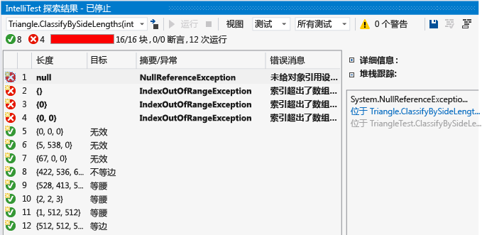
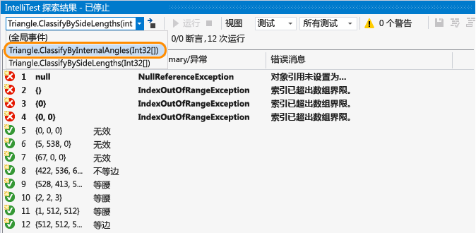
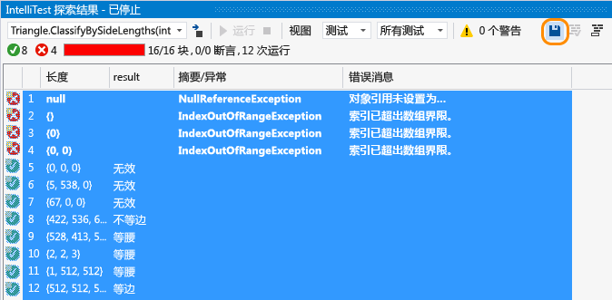
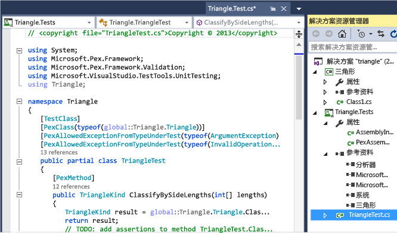
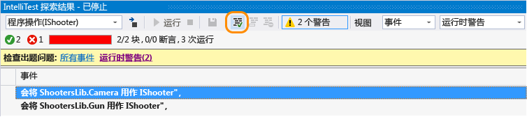
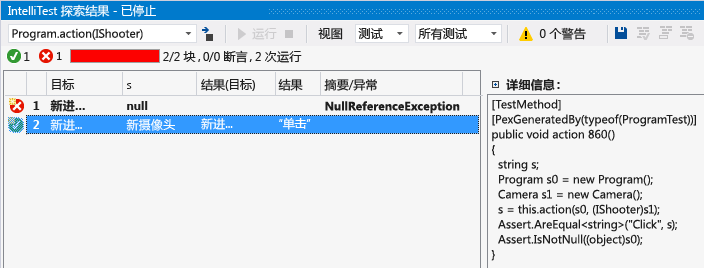

# 使用 IntelliTest 为你的代码生成单元测试
IntelliTest 浏览你的 .NET 代码，以生成测试数据和单元测试套件。 对于代码中的每个语句，将生成执行该语句的测试输入。 为代码中的每个条件分支执行案例分析。 例如，分析 if 语句、断言和可能引发异常的所有操作。 此分析用于为你的每个方法生成参数化单元测试的测试数据，从而创建具有较高代码覆盖率的单元测试。  
  
 当你运行 IntelliTest 时，你可轻松看到哪些测试会失败，并可添加任何必要的代码来修复它们。 你可选择要保存到测试项目中的已生成测试，以提供回归套件。 当你更改代码时，重新运行 IntelliTest，以使生成的测试与你的代码更改同步。  

## 可用性和扩展

“创建 IntelliTest”和“运行 IntelliTest”菜单命令：

* 仅适用于 Visual Studio 2015 或更高版本的企业版。

* 仅支持面向 .NET Framework 的 C# 代码。

* [可扩展](#extend-framework)，支持在 MSTest、MSTest V2、NUnit 和 xUnit format 中发出测试。
  
* 不支持 x64 配置。  
  
## 浏览：使用 IntelliTest 浏览代码并生成单元测试  
 若要生成单元测试，你的类型必须是公共类。 否则，先 [创建单元测试](#NoRun) ，然后再生成它们。  
  
1.  在 Visual Studio 中打开解决方案。 然后打开包含你要测试的方法的类文件。  
  
2.  在代码中右键单击一种方法并选择“运行 IntelliTest”  ，为方法中的代码生成单元测试。  
  
       
  
     IntelliTest 使用不同的输入多次运行你的代码。 每次运行都会在表中表示出来，显示输入测试数据以及产生的输出或异常。  
  
       
  
     要为一个类中的所有公共方法生成单元测试，只需右键单击类而不是特定的方法。 然后选择“运行 IntelliTest” 。 使用“浏览结果”窗口中的下拉列表，显示类中每个方法的单元测试和输入数据。  
  
       
  
     对于通过的测试，检查结果列中报告的结果是否与你对代码的预期要求匹配。 对于失败的测试，根据需要修复你的代码。 然后重新运行 IntelliTest 来验证修复。  
  
## 保留：将单元测试保存为回归套件  
  
1.  选择你要与参数化单元测试一同保存到测试项目中的数据行。  
  
       
  
     你可以查看已创建的测试项目和参数化单元测试，单个单元测试（对应于每个行）保存在测试项目的 .g.cs 文件中，参数化单元测试保存在其对应的 .cs 文件中。 可以从测试资源管理器运行这些单元测试并查看结果，正如手动创建的任何单元测试一样。  
  
       
  
     此外，还向测试项目添加了必要的引用。  
  
     如果方法代码已更改，则重新运行 IntelliTest，以使单元测试与更改同步。  
  
## 帮助：使用 IntelliTest 聚焦代码浏览  
  
1.  如果有更复杂的代码，IntelliTest 可以帮助你聚焦对代码的浏览。 例如，如果你的一个方法包含作为参数的接口，并且有多个类实现该接口，则 IntelliTest 将发现这些类并报告警告。  
  
     查看警告，确定后续操作。  
  
       
  
2.  调查代码并了解要测试的内容后，可修复警告，以选择要用于测试该接口的类。  
  
       
  
     此选择会添加到 PexAssemblyInfo.cs 文件中。  
  
     `[assembly: PexUseType(typeof(Camera))]`  
  
3.  现在，你可重新运行 IntelliTest，以生成参数化单元测试并使用已修复的类测试数据。  
  
       
  
## 指定：使用 IntelliTest 来验证在代码中指定的正确性属性  

指定需要生成的单元测试来验证的输入和输出之间的常规关系。 此规范封装在一个方法中，该方法看似为测试方法，但已被全称量词化。 这就是参数化单元测试方法，并且你所做的任何断言都必须保留 IntelliTest 可以生成的所有可能输入值。  
  
##   问题解答  
  
### 问：是否可以对非托管代码使用 IntelliTest？  

**答：** 不可以，IntelliTest 仅适用于托管代码。  
  
### 问：生成的测试在什么情况下通过，什么情况下失败？  

**答：** 与其他单元测试相同，如果没有异常产生即通过。 如果有任何断言失败，或者测试的代码引发未处理的异常，则失败。  
  
 如果你的一个测试可在引发特定异常的情况下通过，则可根据你在测试方法、测试类或程序集级别的要求设置以下属性之一：  
  
-   **PexAllowedExceptionAttribute**  
  
-   **PexAllowedExceptionFromTypeAttribute**  
  
-   **PexAllowedExceptionFromTypeUnderTestAttribute**  
  
-   **PexAllowedExceptionFromAssemblyAttribute**  
  
### 问：我能否将假设添加到参数化单元测试？  

**答：** 可以，使用假设指定特定方法的单元测试不需要的测试数据。 使用 <xref:Microsoft.Pex.Framework.PexAssume> 类添加假设。 例如，你可以添加类似于以下形式的长度变量不为 null 的假设。  
  
 `PexAssume.IsNotNull(lengths);`  
  
 如果添加了假设并重新运行 IntelliTest，则将删除不再相关的测试数据。  
  
### 问：我能否将断言添加到参数化单元测试？  

**答：** 可以，IntelliTest 将在运行单元测试时检查你在语句中的断言内容是否正确。 使用 <xref:Microsoft.Pex.Framework.PexAssert> 类或测试框架附带的断言 API 来添加断言。 例如，可添加两个变量相等的断言。  
  
 `PexAssert.AreEqual(a, b);`  
  
 如果添加了断言并重新运行 IntelliTest，它将检查断言的有效性，如果断言无效，则测试失败。  
  
###   问：是否可以无需首先运行 IntelliTest 便生成参数化单元测试？  

**答：** 可以，在类或方法中单击右键，然后选择 **创建 IntelliTest**。  
  
   
  
 接受默认格式以生成测试，或更改项目和测试的命名方式。 你可以创建新的测试项目或将你的测试保存到现有项目。  
  
   

  
### 问：是否可以将其他单元测试框架用于 IntelliTest？  

**答：** 可以，请按照下列步骤 [查找和安装其他框架](../test/install-third-party-unit-test-frameworks.md)。
Visual Studio Marketplace 中也提供了测试框架扩展：

* [适用于测试生成器的 NUnit 扩展](https://marketplace.visualstudio.com/items?itemName=NUnitDevelopers.TestGeneratorNUnitextension)
* [适用于测试生成器的 xUnit.net 扩展](https://marketplace.visualstudio.com/items?itemName=BradWilson.xUnitnetTestExtensions)

重新启动 Visual Studio 并重新打开你的解决方案后，在类或方法中单击右键，然后选择 **创建 IntelliTest**。 请在此处选择已安装的框架：  
  
  
  
然后，运行 IntelliTest 以在其相应的 .g.cs 文件中生成单个单元测试。  

  
### 问：是否可以了解有关如何生成测试的详细信息？  

**答：** 可以，要获取高级概述，请阅读此 [博客文章](http://blogs.msdn.com/b/visualstudioalm/archive/2015/07/05/intellitest-one-test-to-rule-them-all.aspx)。

