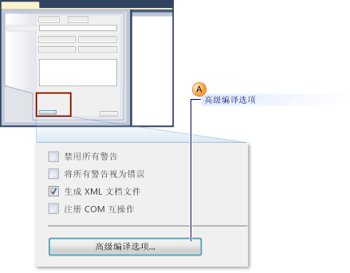
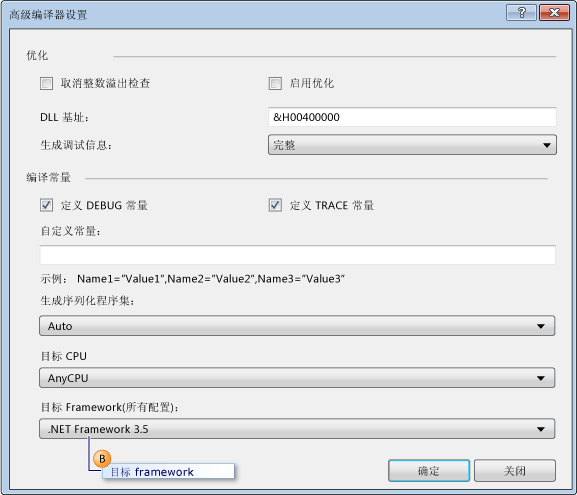
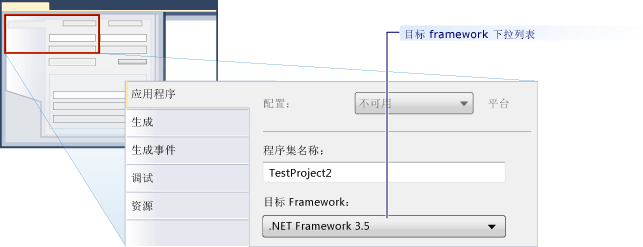

# 如何：配置单元测试以面向 .NET Framework 的早期版本
[!INCLUDE[vs2017banner](../code-quality/includes/vs2017banner.md)]

在 Microsoft Visual Studio 中的测试项目，.NET Framework 的最新版本中，默认情况下设置为目标。  此外，如果要从升级以前版本的 Visual Studio 中测试项目，则升级为面向 .NET Framework 的最新版本。  可以编辑项目属性，你能显示地使项目重定向到 .NET Framework 3.5。  
  
 可以创建以 .NET Framework 的特定版本的单元测试项目。  目标版本绑定 3.5 或更高版本，并且不能是客户端版本。  Visual Studio 针对面向特殊版本的单元测试提供以下基本支持：  
  
-   您可以创建单元测试项目并使其面向 .NET Framework特殊版本。  
  
-   在您的本地计算机上，您可以从 Visual Studio 2010 Service Pack 1 运行面向 .NET Framework特性版本的单元测试。  
  
-   您可以使用 MSTest.exe 从命令提示符运行面向 .NET Framework 特性版本的单元测试。  
  
-   您可以在生成代理（作为生成的一部分）上运行单元测试。  
  
 **测试 SharePoint 应用程序**  
  
 上文列出的功能还支持使用 Visual Studio为 SharePoint 应用程序编写单元测试和集成测试。  [!INCLUDE[crabout](../test/includes/crabout_md.md)]如何使用 Visual Studio[创建 SharePoint 解决方案](/office-dev/office-dev/create-sharepoint-solutions) 来开发 SharePoint 2010 应用程序，请参见 [生成和调试 SharePoint 解决方案](/office-dev/office-dev/building-and-debugging-sharepoint-solutions)、[验证和调试 SharePoint 代码](/office-dev/office-dev/verifying-and-debugging-sharepoint-code)。  
  
 **限制**  
  
 当您使测试项目重定向到使用早期的 .NET Framework 时，存在以下限制：  
  
-   在 .NET Framework 3.5 中，仅包含单元测试的测试项目支持多定向功能。  .NET Framework 3.5 不支持任何其他测试类型，如编码的 UI 或负载测试。  已阻止对单元测试以外的测试类型执行重定向操作。  
  
-   面向 .NET Framework 早期版本的测试执行在默认的主机适配器仅支持。  在 ASP.NET 主机适配器中不支持。  必须在 ASP.NET Development Server 环境中运行的 ASP.NET 应用程序必须与 .NET Framework 目前版本兼容。  
  
-   当您运行支持 .NET Framework 3.5 多定向功能的测试时，将禁用数据收集支持。  您可以使用 Visual Studio 命令行工具来运行代码覆盖率。  
  
-   使用 .NET Framework 3.5 的单元测试不能在远程计算机上运行。  
  
-   不能针对单元测试框架到的早期客户端版本。  
  
### 针对 Visual Basic 单元测试项目重定目标为特定版本的 .NET Framework  
  
1.  创建新的 Visual Basic 单元测试项目。  在**“文件”**菜单上选择**“新建”**，再选择**“项目”**。  
  
     **“新建项目”**对话框随即显示。  
  
2.  在**“已安装的模板”**下，展开**“Visual Basic”**。  选择**“测试”**，然后选择**“测试项目”**模板。  
  
3.  在**“名称”**文本框中，键入 Visual Basic 测试项目的名称，然后选择**“确定”**。  
  
4.  在“解决方案资源管理器”中，在新建Visual Basic测试项目的快捷菜单上选择**“属性”**。  
  
     将显示 Visual Basic 测试项目的属性。  
  
5.  如下图所示，在 **编译** 选项卡选择 **高级编译选项**。  
  
       
  
6.  使用**“目标框架\(所有配置\)”**下拉列表，将目标框架更改为**“.NET Framework 3.5”**或更晚的版本，如下图中的标注 B 所示。  不应指定客户端版本。  
  
       
  
### 针对 Visual C\# 单元测试项目重定目标为特定版本的 .NET Framework  
  
1.  创建新的 Visual C\# 单元测试项目。  在**“文件”**菜单上选择**“新建”**，再选择**“项目”**。  
  
     **“新建项目”**对话框随即显示。  
  
2.  在**“已安装的模板”**下，展开**“Visual C\#”**。  选择**“测试”**，然后选择**“测试项目”**模板。  
  
3.  在**“名称”**文本框中，键入 Visual C\# 测试项目的名称，然后选择**“确定”**。  
  
4.  在“解决方案资源管理器”中，在新建Visual C\#测试项目的快捷菜单上选择**“属性”**。  
  
     将显示 Visual C\# 测试项目的属性。  
  
5.  在**Application**选项卡中选择**Target框架**，然后选择**.NET框架3.5**或更高版本从下拉列表中更改如下图所示的目标framework.。  不应指定客户端版本。  
  
       
  
### 针对 C\+\+\/CLI 单元测试项目重定目标为特定版本的 .NET Framework  
  
1.  创建新的 C\+\+ 单元测试项目。  在**“文件”**菜单上，选择**“新建”**，然后单击**“项目”**。  
  
     **“新建项目”**对话框随即显示。  
  
    > [!WARNING]
    >  若要生成 .NET Framework 的早期版本的 C\+\+\/CLI 单元测试 Visual C\+\+ 时，必须对应使用 Visual Studio 的版本。  例如，若要面向 .NET Framework 3.5，必须安装 [!INCLUDE[vs_orcas_long](../debugger/includes/vs_orcas_long_md.md)] 和 [!INCLUDE[vs_orcas_long](../debugger/includes/vs_orcas_long_md.md)] Service Pack 1。  
  
2.  在**“已安装的模板”**下，展开**“Visual C\+\+”**。  选择**“测试”**，然后选择**“测试项目”**模板。  
  
3.  在**“名称”**文本框中，键入 Visual C\+\+ 测试项目的名称，然后单击**“确定”**。  
  
4.  在“解决方案资源管理器”中，选择新的 Visual C\+\+ 测试项目，然后选择**“卸载项目”**。  
  
5.  在“解决方案资源管理器”中，选择已卸载的 Visual C\+\+ 测试项目，然后选择**“编辑\< 项目名称\>.vcxproj”**。  
  
     .vcxproj 文件将在编辑器中打开。  
  
6.  将 `TargetFrameworkVersion` 设置为 3.5 版或 `PropertyGroup` 的后续版本标记 `"Globals"`。  不应指定客户端版本：  
  
    ```  
    <PropertyGroup Label="Globals">  
        <TargetName>DefaultTest</TargetName>  
        <ProjectTypes>{3AC096D0-A1C2-E12C-1390-A8335801FDAB};{8BC9CEB8-8B4A-11D0-8D11-00A0C91BC942}</ProjectTypes>  
        <ProjectGUID>{CE16D77A-E364-4ACD-948B-1EB6218B0EA3}</ProjectGUID>  
        <TargetFrameworkVersion>3.5</TargetFrameworkVersion>  
        <Keyword>ManagedCProj</Keyword>  
        <RootNamespace>CPP_Test</RootNamespace>  
      </PropertyGroup>  
  
    ```  
  
7.  保存并关闭 .vcxproj 文件。  
  
8.  在解决方案资源管理器中，从新的 Visual C\+\+ 测试项目的快捷菜单中选择 **重新加载项目**。  
  
## 请参阅  
 [针对现有代码创建并运行单元测试](http://msdn.microsoft.com/zh-cn/e8370b93-085b-41c9-8dec-655bd886f173)   
 [创建 SharePoint 解决方案](/office-dev/office-dev/create-sharepoint-solutions)   
 [生成和调试 SharePoint 解决方案](/office-dev/office-dev/building-and-debugging-sharepoint-solutions)   
 [“高级编译器设置”对话框 \(Visual Basic\)](../ide/reference/advanced-compiler-settings-dialog-box-visual-basic.md)