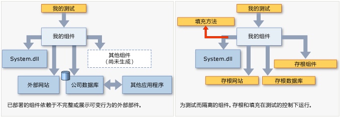

# <a name="isolating-code-under-test-with-microsoft-fakes"></a>用 Microsoft Fakes 隔离测试代码
Microsoft Fakes 将应用的其余部分替换为*存根*或*垫片*，有助于隔离受测代码。 这些是受你的测试控制的小段代码。 通过隔离接受测试的代码，你将会知道，如果测试失败，原因就在这里而不是其他地方。 即使应用程序的其他部分不起作用，存根和填充码也能让你测试代码。  
  
 Fakes 有两种风格：  
  
-   [存根](#stubs)将类替换为可实现同一接口的小型替代项。  若要使用存根，你在设计应用程序时必须让每个组件仅依赖接口，而不依赖其他组件。 （“组件”是指一个类或一起开发和更新的一组类，通常包含在一个程序集中。）  
  
-   [垫片](#shims)在运行时修改应用的编译代码，这样就可以运行测试提供的垫片代码，而不用执行指定的方法调用。 填充码可用于替换对你无法修改的程序集（如 .NET 程序集）的调用。  
  
   
  
 **要求**  
  
-   Visual Studio Enterprise  
  
## <a name="choosing-between-stub-and-shim-types"></a>在存根和填充类型之间进行选择  
 通常，你将 Visual Studio 项目视为一个组件，这是因为你同时开发和更新这些类。 对于该项目对你的解决方案中的其他项目所作的调用或对该项目引用的其他程序集所作的调用，应考虑使用存根和填充码。  
  
 一般原则是，为在 Visual Studio 解决方案中进行的调用使用存根，并为对其他引用的程序集的调用使用填充码。 这是因为在你自己的解决方案中，通过按照存根要求的方式定义接口来分离组件是一个很好的做法。 但是，外部程序集（如 System.dll）通常没有单独的接口定义，因此你必须改用填充码。  
  
 其他需要注意的事项还有：  
  
 **性能。** 填充码运行较慢，因为它们在运行时会重新编写你的代码。 存根没有这项性能开销，与虚方法运行的速度一样快。  
  
 **静态方法和密封类型方法。** 你只能使用存根实现接口。 因此，存根类型不能用于静态方法、非虚方法、密封虚方法、密封类型中的方法，等等。  
  
 **内部类型。** 存根和垫片都能够与可使用程序集特性 <xref:System.Runtime.CompilerServices.InternalsVisibleToAttribute> 访问的内部类型结合使用。  
  
 **私有方法。** 如果方法签名中的所有类型都是可见的，则填充码可替换对私有方法的调用。 存根只能替换可见方法。  
  
 **接口和抽象方法。** 存根提供了可用于测试的接口和抽象方法的实现。 填充码无法检测接口和抽象方法，因为它们没有方法体。  
  
 通常，我们建议使用存根类型来与基本代码中的依赖项隔离。 可以通过隐藏接口后面的组件执行此操作。 填充码类型可用于与不提供可测试的 API 的第三方组件隔离。  
  
##  <a name="stubs"></a>开始使用存根  
 有关更详细的说明，请参阅[使用存根隔离应用的各个部分以供单元测试使用](../test/using-stubs-to-isolate-parts-of-your-application-from-each-other-for-unit-testing.md)。  
  
1.  **注入接口**  
  
     若要使用存根，你在编写要测试的代码时不应明确提及应用程序的其他组件中的类。 “组件”是指一个类或一起开发和更新的多个类，通常包含在一个 Visual Studio 项目中。 应使用接口来声明变量和参数，并且应使用工厂来传入或创建其他组件的实例。 例如，如果 StockFeed 是应用程序的另一个组件中的类，则可以认为以下内容是错误的：  
  
     `return (new StockFeed()).GetSharePrice("COOO"); // Bad`  
  
     相反，应该定义可由另一个组件实现的接口以及可由存根出于测试目实现的接口：  
  
    ```c#  
    public int GetContosoPrice(IStockFeed feed)  
    { return feed.GetSharePrice("COOO"); }  
  
    ```  
  
    ```vb#  
    Public Function GetContosoPrice(feed As IStockFeed) As Integer  
     Return feed.GetSharePrice("COOO")  
    End Function  
  
    ```  
  
2.  **添加 Fakes 程序集**  
  
    1.  在“解决方案资源管理器”中，展开测试项目的引用列表。 如果使用的是 Visual Basic，必须选择“显示所有文件”才能看到引用列表。  
  
    2.  选择对其中定义了接口（例如 IStockFeed）的程序集的引用。 在此引用的快捷菜单上，选择“添加 Fakes 程序集”。  
  
    3.  重新生成解决方案。  
  
3.  在测试中，构建存根的实例并为存根的方法提供代码：  
  
    ```c#  
    [TestClass]  
    class TestStockAnalyzer  
    {  
        [TestMethod]  
        public void TestContosoStockPrice()  
        {  
          // Arrange:  
  
            // Create the fake stockFeed:  
            IStockFeed stockFeed =   
                 new StockAnalysis.Fakes.StubIStockFeed() // Generated by Fakes.  
                     {  
                         // Define each method:  
                         // Name is original name + parameter types:  
                         GetSharePriceString = (company) => { return 1234; }  
                     };  
  
            // In the completed application, stockFeed would be a real one:  
            var componentUnderTest = new StockAnalyzer(stockFeed);  
  
          // Act:  
            int actualValue = componentUnderTest.GetContosoPrice();  
  
          // Assert:  
            Assert.AreEqual(1234, actualValue);  
        }  
        ...  
    }  
    ```  
  
    ```vb#  
    <TestClass()> _  
    Class TestStockAnalyzer  
  
        <TestMethod()> _  
        Public Sub TestContosoStockPrice()  
            ' Arrange:  
            ' Create the fake stockFeed:  
            Dim stockFeed As New StockAnalysis.Fakes.StubIStockFeed  
            With stockFeed  
                .GetSharePriceString = Function(company)  
                                           Return 1234  
                                       End Function  
            End With  
            ' In the completed application, stockFeed would be a real one:  
            Dim componentUnderTest As New StockAnalyzer(stockFeed)  
            ' Act:  
            Dim actualValue As Integer = componentUnderTest.GetContosoPrice  
            ' Assert:  
            Assert.AreEqual(1234, actualValue)  
        End Sub  
    End Class  
  
    ```  
  
     此处最为神奇的就是类 `StubIStockFeed`。 对于所引用程序集中的每个接口，Microsoft Fakes 机制将生成一个存根类。 存根类的名称派生自接口的名称，前缀为“`Fakes.Stub`”，并且在名称后面追加了参数类型名称。  
  
     另外，还会为属性的 getter 和 setter、事件和泛型方法生成存根。 有关详细信息，请参阅[使用存根隔离应用的各个部分以供单元测试使用](../test/using-stubs-to-isolate-parts-of-your-application-from-each-other-for-unit-testing.md)。  
  
##  <a name="shims"></a>开始使用垫片  
 （有关更详细的说明，请参阅[使用垫片将应用与其他程序集相隔离以供单元测试使用](../test/using-shims-to-isolate-your-application-from-other-assemblies-for-unit-testing.md)。）  
  
 假定你的组件包含对 `DateTime.Now` 的调用：  
  
```c#  
// Code under test:  
    public int GetTheCurrentYear()  
    {  
       return DateTime.Now.Year;  
    }  
  
```  
  
 在测试过程中，你希望填充 `Now` 属性，因为每次调用时实际版本都会返回不同的值，从而造成了不便。  
  
 若要使用填充码，你不必修改应用程序代码或以特定方式来编写代码。  
  
1.  **添加 Fakes 程序集**  
  
     在“解决方案资源管理器”中，打开单元测试项目的引用，然后选择对包含要虚设的方法的程序集的引用。 在此示例中，`DateTime` 类位于 **System.dll** 中。  若要查看 Visual Basic 项目中的引用，请选择“显示所有文件”。  
  
     选择“添加 Fakes 程序集”。  
  
2.  **在 ShimsContext 中插入垫片**  
  
    ```c#  
    [TestClass]  
    public class TestClass1  
    {   
            [TestMethod]  
            public void TestCurrentYear()  
            {  
                int fixedYear = 2000;  
  
                // Shims can be used only in a ShimsContext:  
                using (ShimsContext.Create())  
                {  
                  // Arrange:  
                    // Shim DateTime.Now to return a fixed date:  
                    System.Fakes.ShimDateTime.NowGet =   
                    () =>  
                    { return new DateTime(fixedYear, 1, 1); };  
  
                    // Instantiate the component under test:  
                    var componentUnderTest = new MyComponent();  
  
                  // Act:  
                    int year = componentUnderTest.GetTheCurrentYear();  
  
                  // Assert:   
                    // This will always be true if the component is working:  
                    Assert.AreEqual(fixedYear, year);  
                }  
            }  
    }  
  
    ```  
  
    ```vb#  
    <TestClass()> _  
    Public Class TestClass1  
        <TestMethod()> _  
        Public Sub TestCurrentYear()  
            Using s = Microsoft.QualityTools.Testing.Fakes.ShimsContext.Create()  
                Dim fixedYear As Integer = 2000  
                ' Arrange:  
                ' Detour DateTime.Now to return a fixed date:  
                System.Fakes.ShimDateTime.NowGet = _  
                    Function() As DateTime  
                        Return New DateTime(fixedYear, 1, 1)  
                    End Function  
  
                ' Instantiate the component under test:  
                Dim componentUnderTest = New MyComponent()  
                ' Act:  
                Dim year As Integer = componentUnderTest.GetTheCurrentYear  
                ' Assert:   
                ' This will always be true if the component is working:  
                Assert.AreEqual(fixedYear, year)  
            End Using  
        End Sub  
    End Class  
    ```  
  
     填充码类名称是通过在原始类型名称前加上 `Fakes.Shim` 前缀构成的。 在方法名称后面将会追加参数名称。 （无需向 System.Fakes 添加任何程序集引用。）  
  
 前面的示例对一个静态方法使用了填充码。 若要将填充码用于实例方法，请在类型名称和方法名称之间写入 `AllInstances`：  
  
```  
System.IO.Fakes.ShimFile.AllInstances.ReadToEnd = ...  
```  
  
 （没有要引用的“System.IO.Fakes”程序集。 命名空间由填充码创建过程生成。 但可按常规方式使用“using”或“Import”。）  
  
 你还可以为特定实例、构造函数和属性创建填充码。 有关详细信息，请参阅[使用垫片将应用与其他程序集相隔离以供单元测试使用](../test/using-shims-to-isolate-your-application-from-other-assemblies-for-unit-testing.md)。  
  
## <a name="in-this-section"></a>本节内容  
 [使用存根针对单元测试隔离应用程序的各个部分](../test/using-stubs-to-isolate-parts-of-your-application-from-each-other-for-unit-testing.md)  
  
 [使用填充码针对单元测试将应用程序与程序集隔离](../test/using-shims-to-isolate-your-application-from-other-assemblies-for-unit-testing.md)  
  
 [Microsoft Fakes 中的代码生成、编译和命名约定](../test/code-generation-compilation-and-naming-conventions-in-microsoft-fakes.md)

