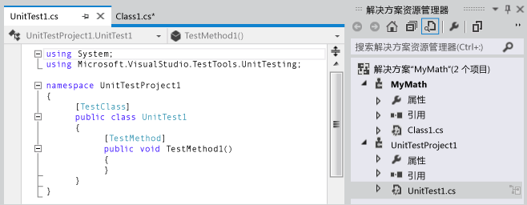
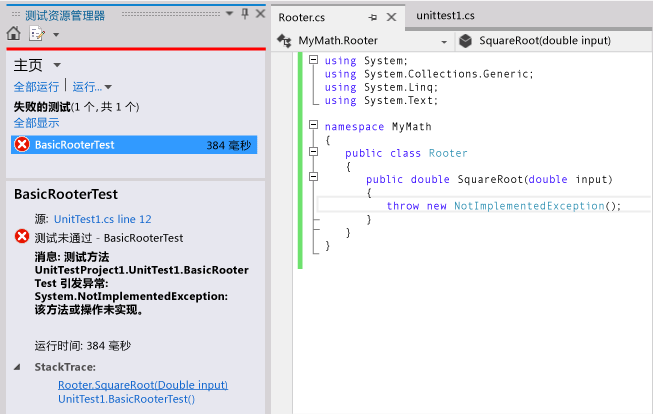
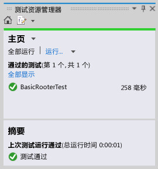
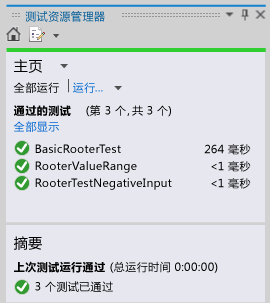

# <a name="quick-start-test-driven-development-with-test-explorer"></a>快速入门：通过测试资源管理器进行测试驱动开发
我们建议你创建单元测试来帮助保持你的代码在众多递进式开发步骤中正确运行。 你可以使用几个框架来编写单元测试，包括第三方开发的一些框架。 某些测试框架专用于不同语言或平台中的测试。 “测试资源管理器”为其中任意框架中的单元测试提供了一个接口。 大多数常用框架都有适配器，你可以为其他框架编写自己的适配器。  
  
 “测试资源管理器”将取代 Visual Studio 早期版本中的单元测试窗口。 其优点包括：  
  
-   使用一个接口运行 .NET 未托管的数据库和其他类型的测试。  
  
-   使用选定的单元测试框架，如 NUnit 或 MSTest 框架。  
  
-   在一个窗口中查看你需要的所有信息。  
  
## <a name="using-test-explorer"></a>使用“测试资源管理器”  
 ")  
  
#### <a name="to-run-unit-tests-by-using-test-explorer"></a>使用“测试资源管理器”运行单元测试  
  
1.  使用你选择的测试框架创建单元测试。  
  
     例如，创建使用 MSTest 框架的测试：  
  
    1.  创建测试项目。  
  
         在 **“新建项目”** 对话框中，展开 **“Visual Basic”**、 **“Visual C#”**或 **“Visual C++”**，然后选择 **“测试”**。  
  
         选择 **“单元测试项目”**。  
  
    2.  将每个单元测试编写为一个方法。 为每个测试方法添加 `[TestMethod]` 特性为前缀。  
  
2.  如果各个测试没有依赖项会阻止其以任意顺序运行，请使用工具栏上的  切换按钮来启用执行并行测试。 这可以显著降低运行所有测试所需的时间。  
  
3.  在菜单栏上，依次选择 **“测试”**、 **“运行单元测试”**、 **“所有测试”**。  
  
     解决方案生成，测试运行。  
  
     “测试资源管理器”将打开并显示结果摘要。  
  
 **若要查看完整测试列表：** 请在任意类别中选择 **“全部显示”** 。  
  
 **若要查看测试结果的详细信息：** 请在“测试资源管理器”中选择该测试以查看详细信息，例如详细信息窗格中的异常消息。  
  
 **若要导航到测试的代码：** 请在“测试资源管理器”中双击该测试或从快捷菜单上选择 **“打开测试”** 。  
  
 **若要调试测试：** 请打开一个或多个测试的快捷菜单，然后选择 **“调试选定的测试”**。  
  
> [!IMPORTANT]
>  显示的结果是最近运行的测试结果。 彩色的结果栏仅显示曾经运行的测试的结果。 例如，你运行过多个测试，其中部分失败，然后仅运行了成功的测试，则结果栏将完全显示绿色。  
  
> [!NOTE]
>  如果未显示任何测试，请确保已安装适配器，将“测试资源管理器”与你使用的测试框架连接起来。 有关更多信息，请参见 [将不同测试框架与“测试资源管理器”配合使用](#frameworks)。  
  
##  <a name="walkthrough"></a>演练：使用单元测试开发方法  
 本演练演示如何使用 Microsoft 单元测试框架开发 C# 语言的受测试方法。 你可以将其轻松改写为其他语言，也可加以调整以使用其他测试框架，例如 NUnit。 有关更多信息，请参见 [使用不同的测试框架](#frameworks)。  
  
#### <a name="creating-the-test-and-method"></a>创建测试和方法  
  
1.  创建 Visual C# 类库项目。 此项目将包含我们希望提供的代码。 在此示例中，该类名为 `MyMath`。  
  
2.  创建测试项目。  
  
    -   在 **“新建项目”** 对话框中，依次选择 **“Visual C#”**、 **“测试”** ，然后选择 **“单元测试项目”**。  
  
           
  
3.  编写基本测试方法。 根据特定输入验证获取的结果：  
  
    ```c#  
  
    [TestMethod]  
    public void BasicRooterTest()  
    {  
      // Create an instance to test:  
      Rooter rooter = new Rooter();  
      // Define a test input and output value:  
      double expectedResult = 2.0;  
      double input = expectedResult * expectedResult;  
      // Run the method under test:  
      double actualResult = rooter.SquareRoot(input);  
      // Verify the result:  
      Assert.AreEqual(expectedResult, actualResult,  
          delta: expectedResult / 100);  
    }  
    ```  
  
4.  从测试中生成方法。  
  
    1.  将光标放在 `Rooter`上，然后在快捷菜单中依次选择 **“生成”**、 **“新类型”**。  
  
    2.  在 **“生成新类型”** 对话框中，将 **“项目”** 设置为类库项目。 在此示例中，设为 `MyMath`。  
  
    3.  将光标放在 `SquareRoot`上，然后在快捷菜单中依次选择 **“生成”**、 **“方法存根”**。  
  
5.  运行单元测试。  
  
    1.  在 **“测试”** 菜单上，依次选择 **“运行单元测试”**、 **“所有测试”**。  
  
         解决方案将生成并运行。  
  
         “测试资源管理器”将打开并显示结果。  
  
         测试显示在 **“失败的测试”**下。  
  
6.  选择测试名称。  
  
     “测试资源管理器”的下半部分将显示测试的详细信息。  
  
7.  选择 **“堆栈跟踪”** 下的项以查看测试失败位置。  
  
   
  
 此时，你已创建了测试和存根，在此基础上进行修改以使测试通过。  
  
#### <a name="after-every-change-make-all-the-tests-pass"></a>在每次更改之后，都要使所有测试通过  
  
1.  在 `MyMath\Rooter.cs`中，改进 `SquareRoot`的代码：  
  
    ```c#  
    public double SquareRoot(double input)  
     {  
       return input / 2;  
     }  
    ```  
  
2.  在“测试资源管理器”中，选择 **“全部运行”**。  
  
     代码将生成，测试运行。  
  
     测试通过。  
  
       
  
#### <a name="add-tests-to-extend-the-range-of-inputs"></a>添加测试以扩展输入的范围  
  
1.  若要提高代码在所有情况下均正常运行的概率，请添加扩大输入值范围的测试。  
  
    > [!TIP]
    >  避免修改已通过的现有测试。 相反，请添加新测试。 仅当用户需求变化时更改现有测试。 此策略有助于确保在扩展代码时不丢失现有功能。  
  
     在测试类中，添加以下测试，其中涉及到一系列输入值：  
  
    ```c#  
    [TestMethod]  
    public void RooterValueRange()  
    {  
      // Create an instance to test:  
      Rooter rooter = new Rooter();  
      // Try a range of values:  
      for (double expectedResult = 1e-8;  
          expectedResult < 1e+8;  
          expectedResult = expectedResult * 3.2)  
      {  
        RooterOneValue(rooter, expectedResult);  
      }  
    }  
  
    private void RooterOneValue(Rooter rooter, double expectedResult)  
    {  
      double input = expectedResult * expectedResult;  
      double actualResult = rooter.SquareRoot(input);  
      Assert.AreEqual(expectedResult, actualResult,  
          delta: expectedResult / 1000);  
    }  
    ```  
  
2.  在“测试资源管理器”中，选择 **“全部运行”**。  
  
     新测试失败，但第一个测试仍然通过。  
  
     若要查找失败位置，请选择失败的测试，然后在“测试资源管理器”的下半部分，选择 **“堆栈跟踪”**顶部的项。  
  
3.  检查所测试的方法，以查明可能出错的地方。 在 `MyMath.Rooter` 类中，重写代码：  
  
    ```  
    public double SquareRoot(double input)  
    {  
      double result = input;  
      double previousResult = -input;  
      while (Math.Abs(previousResult - result) > result / 1000)  
      {  
        previousResult = result;  
        result = result - (result * result - input) / (2 * result);  
      }  
      return result;  
    }  
    ```  
  
4.  在“测试资源管理器”中，选择 **“全部运行”**。  
  
     现在两个测试均通过。  
  
#### <a name="add-tests-for-exceptional-cases"></a>为异常用例添加测试  
  
1.  为负输入添加测试：  
  
    ```c#  
    [TestMethod]  
     public void RooterTestNegativeInputx()  
     {  
         Rooter rooter = new Rooter();  
         try  
         {  
             rooter.SquareRoot(-10);  
         }  
         catch (ArgumentOutOfRangeException e)  
         {  
             return;  
         }  
         Assert.Fail();  
     }  
    ```  
  
2.  在“测试资源管理器”中，选择 **“全部运行”**。  
  
     所测试的方法形成循环，必须手动取消。  
  
3.  选择 **“取消”**。  
  
     测试在 10 秒后停止。  
  
4.  修正方法代码：  
  
    ```c#  
  
    public double SquareRoot(double input)  
    {  
      if (input <= 0.0)   
      {  
        throw new ArgumentOutOfRangeException();  
      }   
    ...  
    ```  
  
5.  在“测试资源管理器”中，选择 **“全部运行”**。  
  
     所有测试均通过。  
  
#### <a name="refactor-without-changing-tests"></a>在不更改测试的情况下重构代码  
  
1.  简化代码，但不要更改测试。  
  
    > [!TIP]
    >   重构是旨在提高代码性能或易理解性的更改。 其目的不在于更改代码的行为，因此不更改测试。  
    >   
    >  我们建议你分开进行功能扩展和重构步骤。 保持测试不变，就能有信心在重构时不意外引入 bug。  
  
    ```c#  
    public class Rooter  
    {  
      public double SquareRoot(double input)  
      {  
        if (input <= 0.0)   
        {  
          throw new ArgumentOutOfRangeException();  
        }  
        double result = input;  
        double previousResult = -input;  
        while (Math.Abs(previousResult - result) > result / 1000)  
        {  
          previousResult = result;  
          result = (result + input / result) / 2;  
          //was: result = result - (result * result - input) / (2*result);  
        }  
        return result;  
      }  
    }  
    ```  
  
2.  选择 **“全部运行”**。  
  
     所有测试仍然通过。  
  
     

