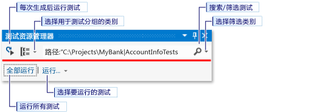
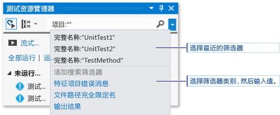

# 对 Visual Studio 中的应用商店应用运行单元测试
本主题描述如何通过使用 Microsoft Visual Studio 中的测试资源管理器运行单元测试  
  
> [!NOTE]
>  本部分中的主题描述了 Visual Studio Express for Windows 8 的功能。 Visual Studio Community、Enterprise. 和 Professional 提供其他适用于单元测试的功能。  
>   
>  -   使用已为 Microsoft 测试资源管理器创建附加设备适配器的任何第三方或开放源代码单元测试框架。 还可为测试分析并显示代码覆盖率信息。  
> -   在每次生成后运行测试。 你也可以使用 Microsoft Fakes（托管代码的隔离框架），通过替换系统和第三方功能的测试代码将你的测试集中于你自己的代码之上。  
>   
>  有关详细信息，请参阅 MSDN 库中的[单元测试代码](../test/unit-test-your-code.md)。  
  
##   主题内容  
 [单元测试框架和测试项目](#BKMK_Unit_test_frameworks_and_test_projects)  
  
 [在测试资源管理器中运行测试](#BKMK_Running_tests_in_Test_Explorer)  
  
-   [运行测试](#BKMK_Running_tests)  
  
 [查看测试结果](#BKMK_Viewing_test_results)  
  
-   [查看测试详细信息](#BKMK_Viewing_test_details)  
  
-   [查看测试方法的源代码](#BKMK_Viewing_the_source_code_of_a_test_method)  
  
 [组织测试列表](#BKMK_Organizing_the_test_list)  
  
-   [对测试进行分组](#BKMK_Grouping_tests)  
  
-   [搜索和筛选测试列表](#BKMK_Searching_and_filtering_the_test_list)  
  
 [调试单元测试](#BKMK_Debugging_unit_tests)  
  
##   单元测试框架和测试项目  
 适用于 Windows 应用商店应用的 Visual Studio Express 包括针对托管和本机 C++ 代码的 Microsoft 单元测试框架。 测试资源管理器可从解决方案的多个测试项目以及从作为生产代码项目的一部分的测试类中运行测试。 测试项目可以是 Visual C++ 或 Visual C# 与 Visual Basic 单元测试框架的任意组合。 当测试中的代码针对 .NET Framework 进行编写时，无论目标代码使用何种语言，均可使用任何 .NET Framework 语言编写测试项目。 本机 C/C++ 代码项目必须使用 C++ 单元测试框架进行测试。  
  
##   在测试资源管理器中运行测试  
 在生成测试项目时，测试将出现在测试资源管理器中。 如果测试资源管理器不可见，请选择 Visual Studio 菜单上的“测试”  ，然后依次选择“Windows” 、“测试资源管理器” 。  
  
   
  
 当你运行、编写以及重新运行测试时，测试资源管理器将在 **“失败的测试”**、 **“通过的测试”**、 **“跳过的测试”** 和 **“未运行的测试”**默认组中显示结果。 你可以更改测试资源管理器对测试进行分组的方式。  
  
 可以从测试资源管理器的工具栏执行查找、组织和运行测试等大部分工作。  
  
   
  
###   运行测试  
 你可以运行解决方案中的所有测试、组中的所有测试或你选择的一组测试。 执行下列操作之一：  
  
-   若要运行解决方案中的所有测试，请选择 **“全部运行”**。  
  
-   若要运行默认组中的所有测试，请选择 **“运行...”** ，然后选择菜单上的组。  
  
-   选择想要运行的各个测试，打开选定测试的快捷菜单，然后选择“运行选定测试”。  
  
 测试运行时，测试资源管理器窗口顶部的“通过/失败”条动态显示。 测试运行结束时，如果所有测试均通过，则“通过/失败”条将变为绿色；如果有测试失败，则变为红色。  
  
##   查看测试结果  
 当你运行、编写以及重新运行测试时，测试资源管理器将在 **“失败的测试”**、 **“通过的测试”**、 **“跳过的测试”** 和 **“未运行的测试”**组中显示结果。 测试运行的摘要显示在测试资源管理器底部的细节窗格中。  
  
###   查看测试详细信息  
 若要查看单个测试的详细信息，请选择该测试。  
  
 测试细节窗格中显示以下信息：  
  
-   源文件名和测试方法的行号。  
  
-   测试的状态。  
  
-   运行测试方法所花的时间。  
  
 如果测试失败，细节窗格中还将显示：  
  
-   测试的单元测试框架返回的消息。  
  
-   测试失败时的堆栈跟踪。  
  
###   查看测试方法的源代码  
 若要在 Visual Studio 编辑器中显示测试方法的源代码，请选择该测试，然后在快捷菜单上选择“打开测试”（键盘：F12）。  
  
##   组织测试列表  
  
###   对测试进行分组  
 默认情况下，测试资源管理器将测试显示为“失败的测试”、“通过的测试”、“跳过的测试”和“未运行的测试”的子节点。  
  
|||  
|-|-|  
||若要按执行它们所花的时间对测试进行分组，请打开“分组方式”列表并选择“持续时间”。 选择“测试结果”以切换到原始分组。|  
  
###  搜索和筛选测试列表  
 当有大量的测试时，可在测试资源管理器搜索框中键入指定的字符串，以按该字符串筛选列表。 在输入搜索字符串之前，可以通过从筛选器列表中进行选择来将筛选器限制为特定类型的字符串。  
  
   
  
##   调试单元测试  
 可以使用测试资源管理器为你的测试启动调试会话。 使用 Visual Studio 调试程序无缝地逐句通过代码将使你在单元测试和所测试项目之间来回反复。 若要开始调试：  
  
1.  在 Visual Studio 编辑器中，在想要调试的一个或多个测试方法中设置断点。  
  
    > [!NOTE]
    >  因为测试方法可以按任何顺序运行，请在想要调试的所有测试方法中设置断点。  
  
2.  在测试资源管理器中，选择测试方法，然后选择快捷菜单上的“调试选定的测试”。  
  
 有关该调试器的详细信息，请参阅[在 Visual Studio 中进行调试](../debugger/debugging-in-visual-studio.md)。

