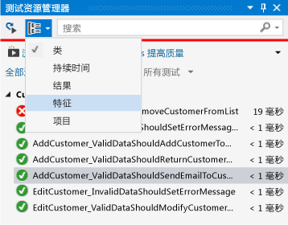
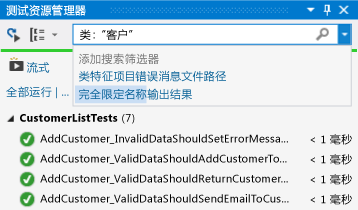
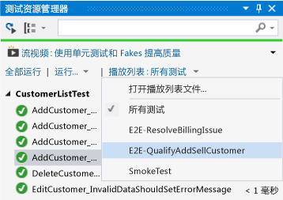

# <a name="run-unit-tests-with-test-explorer"></a>使用测试资源管理器运行单元测试
使用测试资源管理器从 Visual Studio 或第三方单元测试项目中运行单元测试、将测试分组到类别中、筛选测试列表以及创建、保存和运行测试的播放列表。 你还可以调试测试并分析测试性能和代码覆盖率。  
  
##  <a name="BKMK_Contents"></a> 内容  
 [单元测试框架和测试项目](#BKMK_Unit_test_frameworks_and_test_projects)  
  
 [在测试资源管理器中运行测试](#BKMK_Run_tests_in_Test_Explorer)  
  
 [查看测试结果](#BKMK_View_test_results)  
  
 [分组和筛选测试列表](#BKMK_Group_and_filter_the_test_list)  
  
 [创建自定义播放列表](#BKMK_Create_custom_playlists)  
  
 [调试并分析单元测试](#BKMK_Debug_and_analyze_unit_tests)  
  
 [外部资源](#BKMK_External_resources)  
  
##  <a name="BKMK_Unit_test_frameworks_and_test_projects"></a> 单元测试框架和测试项目  
 Visual Studio 包含适用于托管和本机代码的 Microsoft 单元测试框架。 但是，测试资源管理器还可以运行任何单元测试框架，只要该框架实现了测试资源管理器适配器。 若要详细了解如何安装第三方单元测试框架，请参阅[安装第三方单元测试框架](../test/install-third-party-unit-test-frameworks.md)  
  
 测试资源管理器可从解决方案的多个测试项目以及从作为生产代码项目的一部分的测试类中运行测试。 测试项目可以使用不同的单元测试框架。 如果待测试的代码是为 .NET Framework 编写的，则可以面向 .NET Framework 的任何语言编写测试项目，而不考虑目标代码的语言。 本机 C/C++ 代码项目必须使用 C++ 单元测试框架进行测试。  
  
  [目录](#BKMK_Contents)  
  
##  <a name="BKMK_Run_tests_in_Test_Explorer"></a>在测试资源管理器中运行测试  
 [运行测试](#BKMK_Run_tests) **&#124;** [每次生成后运行测试](#BKMK_Run_tests_after_every_build)  
  
 在生成测试项目时，测试将出现在测试资源管理器中。 如果测试资源管理器不可见，请选择 Visual Studio 菜单上的“测试”  ，然后依次选择“Windows” 、“测试资源管理器” 。  
  
   
  
 当你运行、编写以及重新运行测试时，测试资源管理器将在 **“失败的测试”**、 **“通过的测试”**、 **“跳过的测试”** 和 **“未运行的测试”**默认组中显示结果。 你可以更改测试资源管理器对测试进行分组的方式。  
  
 你可以从测试资源管理器的工具栏执行查找、组织和运行测试等大部分工作。  
  
   
  
  [目录](#BKMK_Contents)  
  
###  <a name="BKMK_Run_tests"></a>运行测试  
 你可以运行解决方案中的所有测试、组中的所有测试或你选择的一组测试。 执行下列操作之一：  
  
-   若要运行解决方案中的所有测试，请选择 **“全部运行”**。  
  
-   若要运行默认组中的所有测试，请选择 **“运行...”** ，然后选择菜单上的组。  
  
-   选择你希望运行的各个测试，打开选定测试的上下文菜单，然后选择 **“运行选定的测试”**。  
  
-   如果各个测试没有依赖项会阻止其以任意顺序运行，请使用工具栏上的  切换按钮来启用执行并行测试。 这可以显著降低运行所有测试所需的时间。  
  
 测试运行时，测试资源管理器窗口顶部的“通过/失败”条动态显示。 测试运行结束时，如果所有测试均通过，则“通过/失败”条将变为绿色；如果有测试失败，则变为红色。  
  
  [目录](#BKMK_Contents)  
  
###  <a name="BKMK_Run_tests_after_every_build"></a>每次生成后运行测试  
  
> [!WARNING]
>  Visual Studio Enterprise 支持在每次生成后运行单元测试。  
  
|||  
|-|-|  
||若要在每个本地生成后运行你的单元测试，请在标准菜单上选择 **“测试”** ，然后在测试资源管理器工具栏上选择 **“生成后运行测试”** 。|  
  
  [目录](#BKMK_Contents)  
  
##  <a name="BKMK_View_test_results"></a>查看测试结果  
 [查看测试详细信息](#BKMK_View_test_details) **&#124;** [查看测试方法的源代码](#BKMK_View_the_source_code_of_a_test_method)  
  
 当你运行、编写以及重新运行测试时，测试资源管理器将在 **“失败的测试”**、 **“通过的测试”**、 **“跳过的测试”** 和 **“未运行的测试”**组中显示结果。 测试运行的摘要显示在测试资源管理器底部的细节窗格中。  
  
###  <a name="BKMK_View_test_details"></a> 查看测试详细信息  
 若要查看单个测试的详细信息，请选择该测试。  
  
   
  
 测试细节窗格中显示以下信息：  
  
-   源文件名和测试方法的行号。  
  
-   测试的状态。  
  
-   运行测试方法所花的时间。  
  
 如果测试失败，细节窗格中还将显示：  
  
-   测试的单元测试框架返回的消息。  
  
-   测试失败时的堆栈跟踪。  
  
  [目录](#BKMK_Contents)  
  
###  <a name="BKMK_View_the_source_code_of_a_test_method"></a>查看测试方法的源代码  
 若要在 Visual Studio 编辑器中显示测试方法的源代码，请选择该测试，然后在上下文菜单中选择 **“打开测试”** （键盘：按 F12）。  
  
  [目录](#BKMK_Contents)  
  
##  <a name="BKMK_Group_and_filter_the_test_list"></a>分组和筛选测试列表  
 [分组测试列表](#BKMK_Grouping_the_test_list) **&#124;** [按特征分组](#BKMK_Group_by_traits) **&#124;** [搜索和筛选测试列表](#BKMK_Search_and_filter_the_test_list)  
  
 通过测试资源管理器，可以将测试分组到预定义类别中。 在测试资源管理器中运行的大多数单元测试框架允许你定义自己的类别和类别/值对，以便对测试进行分组。 此外还可以通过匹配字符串和测试属性来筛选测试列表。  
  
###  <a name="BKMK_Grouping_the_test_list"></a>分组测试列表  
 若要更改测试的组织方式，请依次选择“分组依据”按钮  旁边的向下箭头和新分组条件。  
  
   
  
### <a name="test-explorer-groups"></a>测试资源管理器组  
  
|Group|描述|  
|-----------|-----------------|  
|**持续时间**|按执行时间对测试进行分组： **“快速”**、 **“中速”**和 **“慢速”**。|  
|**结果**|按执行结果对测试进行分组： **“失败的测试”**、 **“跳过的测试”**、 **“通过的测试”**。|  
|**特征**|按你定义的类别/值对对测试进行分组。 用于指定特征类别和值的语法由单元测试框架定义。|  
|**Project**|按项目名称对测试进行分组。|  
  
  [目录](#BKMK_Contents)  
  
###  <a name="BKMK_Group_by_traits"></a>按特征分组  
 特征通常是类别名称/值对，但也可以是单个类别。 特性可以分配给由单元测试框架标识为测试方法的方法。 单元测试框架可以定义特征类别。 你可以向特征类别添加值，以便定义自己的类别名称/值对。 用于指定特征类别和值的语法由单元测试框架定义。  
  
 **适用于托管代码的 Microsoft 单元测试框架中的特征**  
  
 在适用于托管应用的 Microsoft 单元测试框架中，在  <xref:Microsoft.VisualStudio.TestTools.UnitTesting.TestPropertyAttribute> 属性中定义特征名称/值对。 测试框架还包括以下预定义特征：  
  
|特征|描述|  
|-----------|-----------------|  
|<xref:Microsoft.VisualStudio.TestTools.UnitTesting.OwnerAttribute>|“所有者”类别由单元测试框架定义，并要求你提供所有者的字符串值。|  
|<xref:Microsoft.VisualStudio.TestTools.UnitTesting.PriorityAttribute>|“优先级”类别由单元测试框架定义，并要求你提供优先级的整数值。|  
|<xref:Microsoft.VisualStudio.TestTools.UnitTesting.TestCategoryAttribute>|你可以通过 TestCategory 属性提供类别而不提供值。 由 TestCategory 属性定义的类别也可以是 TestProperty 属性的类别。|  
|<xref:Microsoft.VisualStudio.TestTools.UnitTesting.TestPropertyAttribute>|你可以通过 TestProperty 属性定义特征类别/值对。|  
  
 **适用于 C++ 的 Microsoft 单元测试框架中的特征**  
  
 若要定义特性，请使用 `TEST_METHOD_ATTRIBUTE` 宏。 例如，若要定义名为 `TEST_MY_TRAIT`的特性：  
  
```cpp  
#define TEST_MY_TRAIT(traitValue) TEST_METHOD_ATTRIBUTE(L"MyTrait", traitValue)  
```  
  
 在单元测试中使用已定义的特征：  
  
```  
BEGIN_TEST_METHOD_ATTRIBUTE(Method1)  
    TEST_OWNER(L"OwnerName")  
    TEST_PRIORITY(1)  
    TEST_MY_TRAIT(L"thisTraitValue")  
END_TEST_METHOD_ATTRIBUTE()  
  
TEST_METHOD(Method1)  
{     
    Logger::WriteMessage("In Method1");  
    Assert::AreEqual(0, 0);  
}  
```  
  
### <a name="c-trait-attribute-macros"></a>C++ 特征特性宏  
  
|宏|描述|  
|-----------|-----------------|  
|`TEST_METHOD_ATTRIBUTE(attributeName, attributeValue)`|使用 TEST_METHOD_ATTRIBUTE 宏定义特性。|  
|`TEST_OWNER(ownerAlias)`|使用预定义的“所有者”特征来指定测试方法的所有者。|  
|`TEST_PRIORITY(priority)`|使用预定义的“优先级”特征向测试方法分配相对优先级。|  
  
  [目录](#BKMK_Contents)  
  
###  <a name="BKMK_Search_and_filter_the_test_list"></a>搜索和筛选测试列表  
 你可以使用测试资源管理器筛选器来限制你所查看和运行项目中的测试方法。  
  
 在测试资源管理器搜索框中键入字符串并选择 Enter 时，测试列表被筛选为仅显示完全限定名包含该字符串的测试。  
  
 按其他条件进行筛选：  
  
1.  打开搜索框右侧的下拉列表。  
  
2.  选择新条件。  
  
3.  在引号中输入筛选值。  
  
   
  
> [!NOTE]
>  搜索不区分大小，并将指定字符串与条件值的任何部分匹配。  
  
|限定符|描述|  
|---------------|-----------------|  
|**特征**|搜索特征类别和值的匹配项。 用于指定特征类别和值的语法由单元测试框架定义。|  
|**Project**|搜索测试项目名称的匹配项。|  
|**错误消息**|搜索由失败的断言返回的用户定义错误消息的匹配项。|  
|**文件路径**|搜索测试源文件的完全限定文件名的匹配项。|  
|**完全限定名**|搜索测试命名空间、类和方法的完全限定文件名的匹配项。|  
|**输出**|搜索写入标准输出 (stdout) 或标准错误 (stderr) 的用户定义错误消息。 用于指定输出消息的语法由单元测试框架定义。|  
|**结果**|搜索测试资源管理器类别名的匹配项： **“失败的测试”**、 **“跳过的测试”**、 **“通过的测试”**。|  
  
 若要排除筛选结果的一个子集，请使用以下语法：  
  
```  
FilterName:"Criteria" -FilterName:"SubsetCriteria"  
```  
  
 例如，  
  
```  
FullName:"MyClass" - FullName:"PerfTest"  
```  
  
 返回名称中包含“MyClass”的所有测试，名称中包含“PerfTest”的测试除外。  
  
  [目录](#BKMK_Contents)  
  
##  <a name="BKMK_Create_custom_playlists"></a>创建自定义播放列表  
 你可以创建和保存想要作为组运行或查看的测试列表。 当你选择播放列表时，列表中的测试将显示在“测试资源管理器”中。 你可以将一个测试添加到多个播放列表，并且当你选择默认的 **“所有测试”** 播放列表时，项目中的所有测试都可用。  
  
   
  
 **若要创建播放列表**，请在测试资源管理器中选择一个或多个测试。 在上下文菜单中，依次选择 **“添加到播放列表”**、 **“新建播放列表”**。 保存具有该名称的文件，并定位到你在 **“创建新的播放列表”** 对话框中指定的位置。  
  
 **若要将测试添加到播放列表**，请在测试资源管理器中选择一个或多个测试。 在上下文菜单中，选择 **“添加到播放列表”**，然后选择你希望将测试添加到的播放列表。  
  
 **若要打开播放列表**，请从 Visual Studio 菜单中选择“测试播放列表”，然后从“最近使用的播放列表”列表中选择，或选择“打开播放列表”以指定播放列表的名称和位置。  
  
 如果各个测试没有依赖项会阻止其以任意顺序运行，请使用工具栏上的  切换按钮来启用执行并行测试。 这可以显著降低运行所有测试所需的时间。  
  
  [目录](#BKMK_Contents)  
  
##  <a name="BKMK_Debug_and_analyze_unit_tests"></a>调试和分析单元测试  
 [调试单元测试](#BKMK_Debug_unit_tests) **&#124;** [诊断测试方法性能问题](#BKMK_Diagnose_test_method_performance_issues) **&#124;** [分析单元测试代码覆盖率](#BKMK_Analyzeunit_test_code_coverage)  
  
###  <a name="BKMK_Debug_unit_tests"></a>调试单元测试  
 可以使用测试资源管理器为你的测试启动调试会话。 使用 Visual Studio 调试程序无缝地逐句通过代码将使你在单元测试和所测试项目之间来回反复。 若要开始调试：  
  
1.  在 Visual Studio 编辑器中，在想要调试的一个或多个测试方法中设置断点。  
  
    > [!NOTE]
    >  因为测试方法可以按任何顺序运行，请在你想要调试的所有测试方法中设置断点。  
  
2.  在测试资源管理器中，选择测试方法，然后选择上下文菜单中的 **“调试选定的测试”** 。  
  
 有关该调试器的详细信息，请参阅[在 Visual Studio 中进行调试](../debugger/debugging-in-visual-studio.md)。  
  
  [目录](#BKMK_Contents)  
  
###  <a name="BKMK_Diagnose_test_method_performance_issues"></a>诊断测试方法性能问题  
 若要诊断测试方法花费过多时间的原因，请在测试资源管理器中选择该方法，然后在上下文菜单中选择“配置文件”。 请参阅[性能资源管理器](../profiling/performance-explorer.md)。  
  
###  <a name="BKMK_Analyzeunit_test_code_coverage"></a>分析单元测试代码覆盖率  
  
> [!NOTE]
>  单元测试代码覆盖率仅在 Visual Studio Enterprise 中可用。  
  
 你可以使用 Visual Studio 代码覆盖率工具确定你的单元测试实际测试的产品代码量。 你可以在选定的测试上或解决方案中的所有测试上运行代码覆盖率。  
  
 在解决方案中为测试方法运行代码覆盖率：  
  
1.  在 Visual Studio 菜单上选择 **“测试”** ，然后选择 **“分析代码覆盖率”**。  
  
2.  从子菜单中选择下列命令之一：  
  
    -   **选定的测试** 运行你在测试资源管理器中选择的测试方法。  
  
    -   **所有测试** 在解决方案中运行所有测试方法。  
  
 代码覆盖率结果窗口显示行、函数、类、命名空间和模块执行的产品代码块的百分比。  
  
 有关详细信息，请参阅[使用代码覆盖率确定正在测试的代码数量](../test/using-code-coverage-to-determine-how-much-code-is-being-tested.md)。  
  
  [目录](#BKMK_Contents)  
  
##  <a name="BKMK_External_resources"></a>外部资源  
  
###  <a name="BKMK_Guidance"></a> 指导  
 [使用 Visual Studio 2012 测试连续交付 - 第 2 章：单元测试：测试内部](http://go.microsoft.com/fwlink/?LinkID=255188)  
  
## <a name="see-also"></a>另请参阅  
 [单元测试代码](../test/unit-test-your-code.md)   
 [将单元测试作为 64 位进程运行](../test/run-a-unit-test-as-a-64-bit-process.md)
