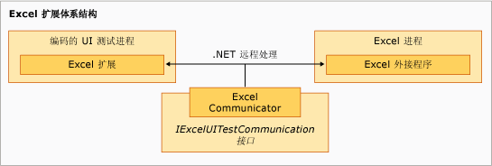

# 用于 Excel 的编码的 UI 测试扩展示例
此示例的扩展组件在 [!INCLUDE[vsprvs](../code-quality/includes/vsprvs_md.md)] 编码的 UI 测试进程中运行，某种程度上和底层的 `ExtensionPackage` 类组成层次结构。 `TechnologyManager`、`ActionFilter` 和 `PropertyProvider` 类在下一层，而控件元素位于顶层。  
  
   
Excel 扩展体系结构  
  
## 扩展点  
 这些类代表在该示例中实现的用于为 [!INCLUDE[ofprexcel](../test/includes/ofprexcel_md.md)] 启用编码的 UI 测试的扩展点。  
  
### ExtensionPackage  
 继承自 <xref:Microsoft.VisualStudio.TestTools.UITest.Extension.UITestExtensionPackage> 类，这是编码的 UI 测试扩展插件的入口点。 实现此抽象类使编码的 UI 测试框架可以从内部访问自定义的 UI 测试技术管理器、UI 测试属性提供程序，以及用于测试新的 UI 的 UI 测试操作筛选器。 有关详细信息，请参阅 [ExtensionPackage 类](../test/sample-excel-extension-extensionpackage-class.md)。  
  
### TechnologyManager  
 继承自 <xref:Microsoft.VisualStudio.TestTools.UITest.Extension.UITechnologyManager> 类，该类提供用于测试录制和播放的技术管理器。 有关详细信息，请参阅 [TechnologyManager 类](../test/sample-excel-extension-technologymanager-class.md)。  
  
### ActionFilter  
 继承自 <xref:Microsoft.VisualStudio.TestTools.UITest.Common.UITestActionFilter> 类，该类提供将相似的测试操作结果聚合到单个测试结果的基类。 有关详细信息，请参阅 [ActionFilter 类](../test/sample-excel-extension-actionfilter-class.md)。  
  
### 技术元素  
 继承自 <xref:Microsoft.VisualStudio.TestTools.UITest.Extension.UITechnologyElement> 类的基类，它提供 UI 测试中可以录制和播放的技术元素的基础。 有关详细信息，请参阅[元素类](../test/sample-excel-extension-element-classes.md)。  
  
### PropertyProvider  
 继承自 <xref:Microsoft.VisualStudio.TestTools.UITesting.UITestPropertyProvider> 类，该类提供支持 UI 元素的属性用于测试录制和播放的基类。 有关详细信息，请参阅 [PropertyProvider 类](../test/sample-excel-extension-propertyprovider-class.md)。  
  
## 另请参阅  
 <xref:Microsoft.VisualStudio.TestTools.UITesting.UITestPropertyProvider>   
 <xref:Microsoft.VisualStudio.TestTools.UITest.Extension.UITechnologyElement>   
 <xref:Microsoft.VisualStudio.TestTools.UITest.Common.UITestActionFilter>   
 <xref:Microsoft.VisualStudio.TestTools.UITest.Extension.UITestExtensionPackage>   
 [ExtensionPackage 类](../test/sample-excel-extension-extensionpackage-class.md)   
 [TechnologyManager 类](../test/sample-excel-extension-technologymanager-class.md)   
 [ActionFilter 类](../test/sample-excel-extension-actionfilter-class.md)   
 [Element 类](../test/sample-excel-extension-element-classes.md)   
 [PropertyProvider 类](../test/sample-excel-extension-propertyprovider-class.md)

