# <a name="test-windows-uwp-and-81-phone-apps-with-coded-ui-tests"></a>使用编码的 UI 测试来测试 Windows UWP 和 Phone 8.1 应用

此演练展示了如何为在移动设备或仿真器上运行的 UWP 应用和基于 XAML 的 Phone 8.1 应用创建 UI 测试。  

## <a name="create-a-simple-windows-phone-app"></a>创建简单的 Windows Phone 应用  
  
1.  使用 Visual C# 或 Visual Basic 模板，为空白的 Windows Phone 应用创建新项目。  
  
     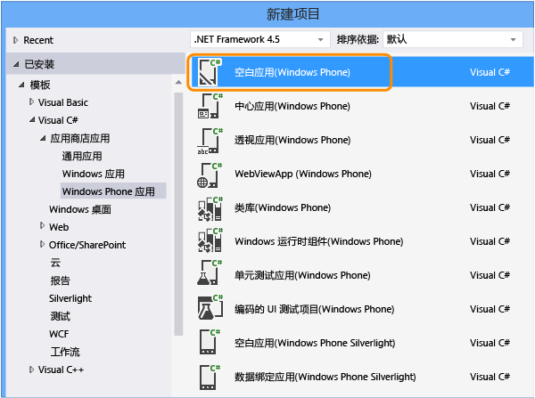  
  
2.  在解决方案资源管理器中，打开 MainPage.xaml。 从工具箱中，将按钮控件和文本框控件拖动到设计图面。  
  
       
  
3.  在“属性”窗口中命名该按钮控件。  
  
     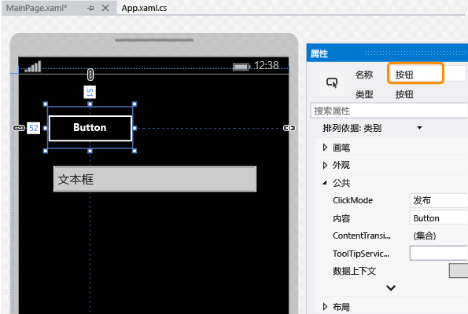  
  
4.  命名该文本框控件。  
  
     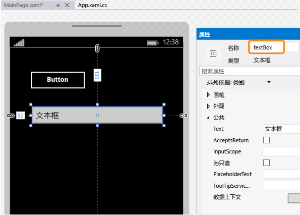  
  
5.  在设计图面上，双击该按钮控件并添加以下代码：  
  
    ```c#  
    private void button_Click_1(object sender, RoutedEventArgs e)  
    {  
        this.textBox.Text = this.button.Name;  
    }  
  
    ```  
  
    ```vb#  
    Public NotInheritable Class MainPage  
        Inherits Page  
  
        Private Sub button_Click(sender As Object, e As RoutedEventArgs) Handles Button.Click  
            Me.textBox.Text = Me.button.Name  
        End Sub  
    End Class  
    ```  
  
6.  按 F5，在模拟器中运行 Windows Phone 应用并且验证其是否工作。  
  
     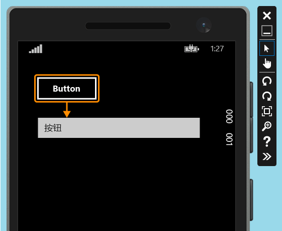  
  
7.  退出模拟器。  
  
## <a name="deploy-the-windows-phone-app"></a>部署 Windows Phone 应用  
  
1.  必须先部署应用，之后编码的 UI 测试才可映射该应用的控件。  
  
     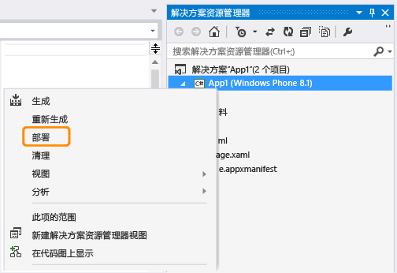  
  
     仿真程序将启动。 该应用现在可用于测试。  
  
     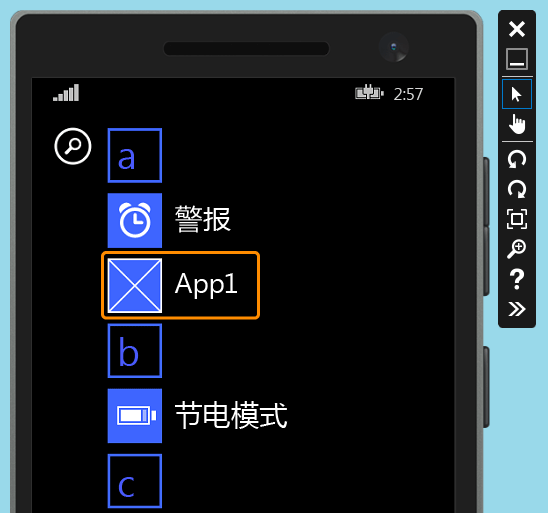  
  
     在你创建编码的 UI 测试时，请保持模拟器运行。  
  
## <a name="create-a-coded-ui-test-for-the-windows-phone-app"></a>为 Windows Phone 应用创建编码的 UI 测试  

[如何为通用 Windows 平台 (UWP) 应用创建编码的 UI 测试？](#uwpapps)
  
1.  将新的编码 UI 测试项目添加到包含 Windows Phone 应用的解决方案。  
  
     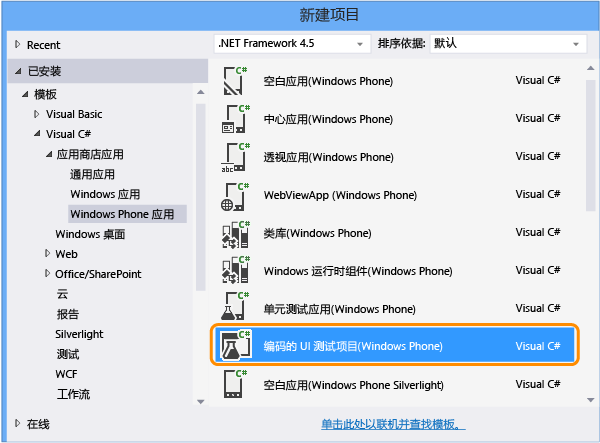  
  
2.  选择使用十字线工具编辑 UI 映射。  
  
       
  
3.  使用十字线工具选择该应用，然后复制应用的 AutomationId 属性值，稍后该值将用于在测试中启动应用。  
  
     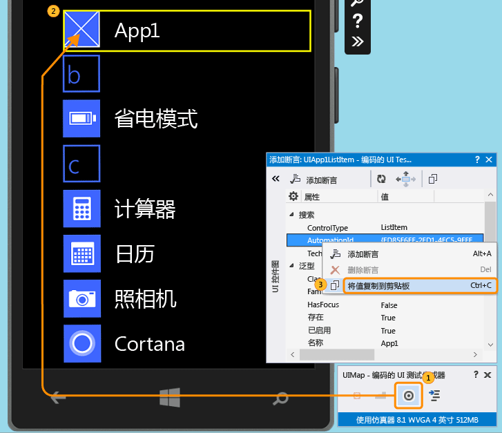  
  
4.  在模拟器中，启动该应用并使用十字线工具来选择按钮控件。 然后将按钮控件添加到 UI 控件图。  
  
     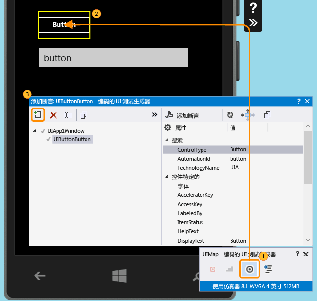  
  
5.  若要将文本框控件添加到 UI 控件图，请重复上一个步骤。  
  
     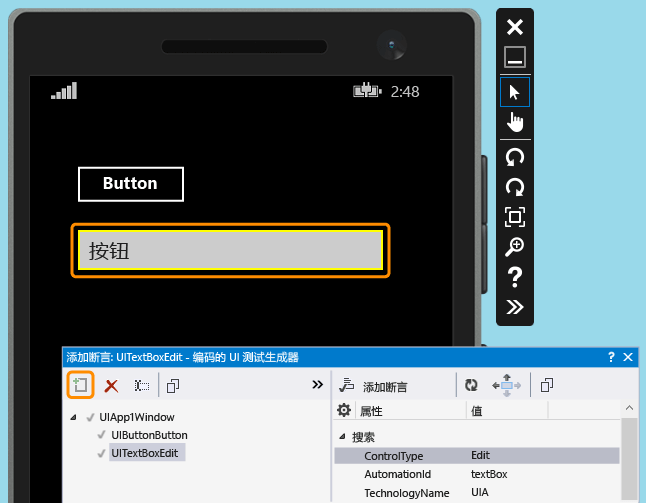  
  
6.  生成代码以创建用于 UI 控件映射的更改的代码。  
  
     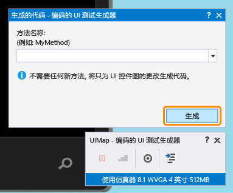  
  
7.  使用十字线工具选择文本框控件，然后选择 **“文本”** 属性。  
  
     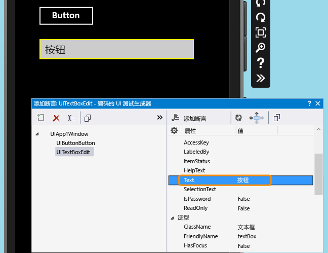  
  
8.  添加断言。 将在测试中使用它以验证该值是否正确。  
  
     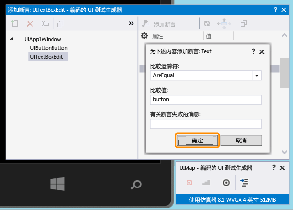  
  
9. 为断言方法添加并生成代码。  
  
     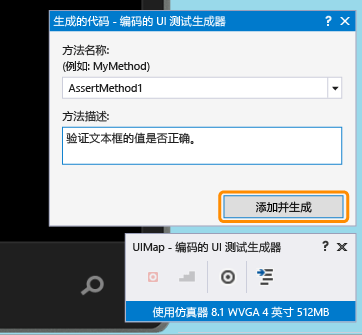  
  
10. **Visual C#**  
  
     在解决方案资源管理器中，打开 UIMap.Designer.cs 文件以查看你刚为断言方法和控件添加的代码。  
  
     **Visual Basic**  
  
     在解决方案资源管理器中，打开 CodedUITest1.vb 文件。 在 CodedUITestMethod1() 测试方法代码中，右击对断言方法（该方法为自动添加的 `Me.UIMap.AssertMethod1()` ）的调用并选择“转到定义” 。 这将在代码编辑器中打开 UIMap.Designer.vb 文件，因此可以查看你为断言方法和控件添加的代码。  
  
    > [!WARNING]
    >  请不要直接修改 UIMap.designer.cs 或 UIMap.Designer.vb 文件。 如果执行此操作，则在每次生成测试时都将覆盖对该文件所做的更改。  
  
     **断言方法**  
  
    ```c#  
    public void AssertMethod1()  
    {  
        #region Variable Declarations  
        XamlEdit uITextBoxEdit = this.UIApp1Window.UITextBoxEdit;  
        #endregion  
  
        // Verify that the 'Text' property of 'textBox' text box equals 'button'  
        Assert.AreEqual(this.AssertMethod1ExpectedValues.UITextBoxEditText, uITextBoxEdit.Text);  
    }  
    ```  
  
    ```vb#  
    Public Sub AssertMethod1()  
        Dim uITextBoxEdit As XamlEdit = Me.UIApp1Window.UITextBoxEdit  
  
        'Verify that the 'Text' property of 'textBox' text box equals 'button'  
        Assert.AreEqual(Me.AssertMethod1ExpectedValues.UITextBoxEditText, uITextBoxEdit.Text)  
    End Sub  
    ```  
  
     **控件**  
  
    ```c#  
    #region Properties  
    public virtual AssertMethod1ExpectedValues AssertMethod1ExpectedValues  
    {  
        get  
        {  
            if ((this.mAssertMethod1ExpectedValues == null))  
            {  
                this.mAssertMethod1ExpectedValues = new AssertMethod1ExpectedValues();  
            }  
            return this.mAssertMethod1ExpectedValues;  
        }  
    }  
  
    public UIApp1Window UIApp1Window  
    {  
        get  
        {  
            if ((this.mUIApp1Window == null))  
            {  
                this.mUIApp1Window = new UIApp1Window();  
            }  
            return this.mUIApp1Window;  
        }  
    }  
    #endregion  
  
    #region Fields  
    private AssertMethod1ExpectedValues mAssertMethod1ExpectedValues;  
  
    private UIApp1Window mUIApp1Window;  
    #endregion  
    ```  
  
    ```vb#  
    #Region "Properties"  
    Public ReadOnly Property UIButtonButton() As XamlButton  
        Get  
            If (Me.mUIButtonButton Is Nothing) Then  
                Me.mUIButtonButton = New XamlButton(Me)  
                Me.mUIButtonButton.SearchProperties(XamlButton.PropertyNames.AutomationId) = "button"  
            End If  
            Return Me.mUIButtonButton  
        End Get  
    End Property  
  
    Public ReadOnly Property UITextBoxEdit() As XamlEdit  
        Get  
            If (Me.mUITextBoxEdit Is Nothing) Then  
                Me.mUITextBoxEdit = New XamlEdit(Me)  
                Me.mUITextBoxEdit.SearchProperties(XamlEdit.PropertyNames.AutomationId) = "textBox"  
            End If  
            Return Me.mUITextBoxEdit  
        End Get  
    End Property  
    #End Region  
  
    #Region "Fields"  
    Private mUIButtonButton As XamlButton  
  
    Private mUITextBoxEdit As XamlEdit  
    #End Region  
    ```  
  
11. 在“解决方案资源管理器”中，打开 CodedUITest1.cs 或 CodedUITest1.vb 文件。 针对运行测试所需的操作，你现在可以将代码添加到 CodedUTTestMethod1 方法。 使用已添加到 UIMap 的控件来添加代码：  
  
    1.  使用你之前复制到剪贴板的自动化 ID 属性启动 Windows Phone 应用：  
  
        ```c#  
        XamlWindow myAppWindow = XamlWindow.Launch("ed85f6ff-2fd1-4ec5-9eef-696026c3fa7b_cyrqexqw8cc7c!App");  
        ```  
  
        ```vb#  
        XamlWindow.Launch("ed85f6ff-2fd1-4ec5-9eef-696026c3fa7b_cyrqexqw8cc7c!App");  
        ```  
  
    2.  添加手势以点击按钮控件：  
  
        ```c#  
        Gesture.Tap(this.UIMap.UIApp1Window.UIButtonButton);  
        ```  
  
        ```vb#  
        Gesture.Tap(Me.UIMap.UIApp1Window.UIButtonButton)  
        ```  
  
    3.  验证对已自动生成的断言方法的调用是否发生在启动应用和按钮上的点击手势之后：  
  
        ```c#  
        this.UIMap.AssertMethod1();  
        ```  
  
        ```vb#  
        Me.UIMap.AssertMethod1()  
        ```  
  
     添加代码后，CodedUITestMethod1 测试方法应如下所示：  
  
    ```c#  
    [TestMethod]  
    public void CodedUITestMethod1()  
    {  
        // To generate code for this test, select "Generate Code for Coded UI Test" from the shortcut menu and select one of the menu items.  
  
        // Launch the app.  
        XamlWindow myAppWindow = XamlWindow.Launch("ed85f6ff-2fd1-4ec5-9eef-696026c3fa7b_cyrqexqw8cc7c!App");  
  
        // Tap the button.  
        Gesture.Tap(this.UIMap.UIApp1Window.UIButtonButton);  
  
        this.UIMap.AssertMethod1();  
    }  
    ```  
  
    ```vb#  
    <CodedUITest>  
    Public Class CodedUITest1  
  
        <TestMethod()>  
        Public Sub CodedUITestMethod1()  
            '              
            ' To generate code for this test, select "Generate Code for Coded UI Test" from the shortcut menu and select one of the menu items.  
            '  
            ' Launch the app.  
            XamlWindow.Launch("ed85f6ff-2fd1-4ec5-9eef-696026c3fa7b_cyrqexqw8cc7c!App")  
  
            '// Tap the button.  
            Gesture.Tap(Me.UIMap.UIApp1Window.UIButtonButton)  
  
            Me.UIMap.AssertMethod1()  
        End Sub  
    ```  
  
## <a name="run-the-coded-ui-test"></a>运行编码的 UI 测试  
  
1.  生成你的测试，然后使用测试资源管理器运行该测试。  
  
     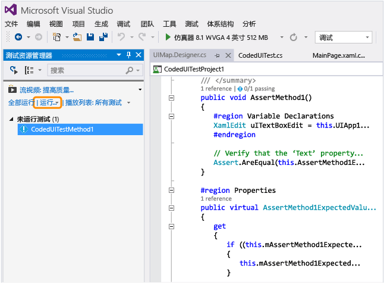  
  
     此时 Windows Phone 应用启动，点按按钮操作完成，然后会使用断言方法填充并验证文本框的 Text 属性。  
  
     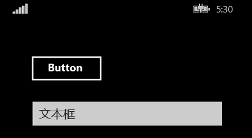  
  
     测试完成后，测试资源管理器确认该测试已通过。  
  
     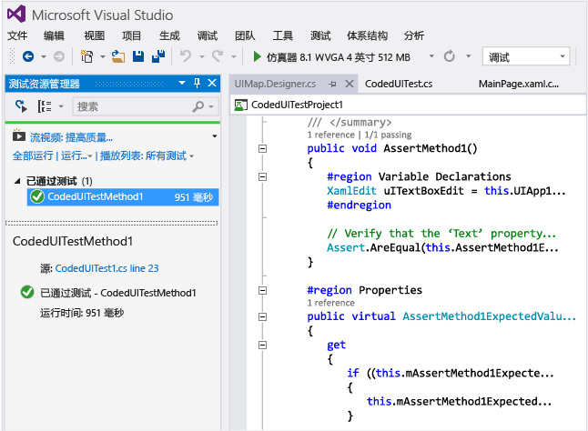  
  
##  <a name="TestingPhoneAppsCodedUI_DataDriven"></a> 在 Windows Phone 应用上使用数据驱动的编码的 UI 测试  
 若要测试不同的条件，编码的 UI 测试可以使用不同的数据集多次运行。  
  
 适用于 Windows Phone 的数据驱动的编码 UI 测试使用测试方法中的 DataRow 特性定义。 在以下示例中，x 和 y 为测试的第一次迭代使用值 1 和 2，为第二次迭代使用值 -1 和 -2。  
  
```  
[DataRow(1, 2, DisplayName = "Add positive numbers")]  
[DataRow(-1, -2, DisplayName = "Add negative numbers")]  
[TestMethod]  
public void DataDrivingDemo_MyTestMethod(int x, int y)  
  
```  
  
## <a name="q--a"></a>问题解答  
  
### <a name="q-do-i-have-to-deploy-the-windows-phone-app-in-the-emulator-in-order-to-map-ui-controls"></a>问：为了映射 UI 控件，我是否必须在模拟器中部署 Windows Phone 应用？  
 **答**：是的，编码的 UI 测试生成器需要运行模拟器并且将应用部署到该模拟器。 否则，它会引发一条错误消息，说明未能找到运行的模拟器。  
  
###  <a name="TestingPhoneAppsCodedUI_EmulatorDevice"></a> 问：测试是否只能在模拟器上执行，或者我还可以使用物理设备？  
 **答**：支持任一选项。 通过更改模拟器类型或选择设备工具栏中的设备，选择测试执行的目标。 如果选择“设备”，则 Phone Blue 设备需连接到一个计算机 USB 端口。  
  
 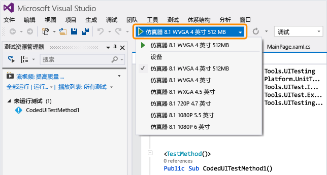  
  
### <a name="q-why-dont-i-see-the-option-to-record-my-coded-ui-test-in-the-generate-code-for-a-coded-ui-test-dialog"></a>问：为什么在“生成编码的 UI 测试的代码”对话框中看不到用于记录编码的 UI 测试的选项？  
 **答**：Windows Phone 应用不支持录制选项。  
  
### <a name="q-can-i-create-a-coded-ui-test-for-my-windows-phone-apps-based-on-winjs-silverlight-or-html5"></a>问：我是否能为基于 WinJS、Silverlight 或 HTML5 的 Windows Phone 应用创建编码的 UI 测试？  
 **答**：否，仅支持基于 XAML 的应用。  
  
### <a name="q-can-i-create-coded-ui-tests-for-my-windows-phone-apps-on-a-system-that-is-not-running-windows-81-or-windows-10"></a>问：我是否能在未运行 Windows 8.1 或 Windows 10 的系统上为 Windows Phone 应用创建编码的 UI 测试？  
 **答**：否，编码的 UI 测试项目模板仅适用于 Windows 8.1 和 Windows 10。 若要为通用 Windows 平台 (UWP) 应用创建自动化项，需要 Windows 10。  

<a name="uwpapps"></a>  
### <a name="q-how-do-i-create-coded-ui-tests-for-universal-windows-platform-uwp-apps"></a>问：如何为通用 Windows 平台 (UWP) 应用创建编码的 UI 测试？  
 **答**：根据要在其中测试 UWP 应用的平台，通过以下方式之一创建编码的 UI 测试项目：  
  
-   在本地计算机上运行的 UWP 应用将作为应用商店应用运行。 若要对此进行测试，必须使用 **“编码的 UI 测试项目(Windows)”** 模板。 若要在创建新项目时查找此模板，请转到“Windows” 、“通用”  节点。 或转到 **“Windows”**、 **“Windows 8”**、 **“Windows”** 节点。  
  
-   在移动设备或仿真器上运行的 UWP 应用将作为 Phone 应用进行运行。 若要对此进行测试，必须使用 **“编码的 UI 测试项目(Windows Phone)”** 模板。 若要在创建新项目时查找此模板，请转到“Windows” 、“通用”  节点。 或转到 **“Windows”**、 **“Windows 8”**、 **“Windows Phone”** 节点。  
  
 创建项目后，将测试创作为与之前保持相同。  
  
### <a name="q-can-i-select-controls-that-are-outside-the-emulator"></a>问：我是否可以选择模拟器外部的控件？  
 **答**：否，生成器将不会检测它们。  
  
### <a name="q-can-i-use-the-coded-ui-test-builder-to-map-controls-using-a-physical-phone-device"></a>问：我是否可以使用编码的 UI 测试生成器来映射使用物理手机设备的控件？  
 **答**：否，如果应用已部署到模拟器，生成器只能映射 UI 元素。  
  
### <a name="q-why-cant-i-modify-the-code-in-the-uimapdesigner-file"></a>问：为什么无法修改 UIMap.Designer 文件中的代码？  
 **答**：每次使用“UIMap - 编码的 UI 测试生成器”生成代码时，都将覆盖在 UIMapDesigner.cs 文件中所做的任何代码更改。 如果必须修改录制的方法，则必须将其复制到 UIMap.cs 文件并对其重命名。 UIMap.cs 文件可用于重写 UIMapDesigner.cs 文件中的方法和属性。 必须在 Coded UITest.cs 文件中删除对原始方法的引用，并将其替换为重命名的方法名称。  
  
### <a name="q-can-i-run-a-coded-ui-test-on-my-windows-phone-app-from-the-command-line"></a>问：我是否可以从命令行对 Windows Phone 应用运行编码的 UI 测试？  
 **答**：是，你使用 runsettings 文件来指定用于测试执行的目标设备。 例如：  
  
 vstest.console.exe "pathToYourCodedUITestDll" /settings:devicetarget.runsettings  
  
 示例 runsettings 文件：  
  
```  
<?xml version="1.0" encoding="utf-8"?>  
<RunSettings>  
<MSPhoneTest>  
<!--to specify test execution on device, use a TargetDevice option as follows-->  
<TargetDevice>Device</TargetDevice>  
<!--to specify an emulator instead, use a TargetDevice option like below-->  
<!--<TargetDevice>Emulator 8.1 WVGA 4 inch 512MB</TargetDevice>-->  
</MSPhoneTest>  
</RunSettings>  
```  
  
### <a name="q-what-are-the-differences-between-coded-ui-tests-for-xaml-based-windows-store-apps-and-windows-phone-apps"></a>问：针对基于 XAML 的 Windows 应用商店应用和 Windows Phone 应用的编码的 UI 测试有什么区别？  
 **答**：以下是一些主要区别：  
  
|功能|Windows 应用商店应用程序|Windows Phone 应用|  
|-------------|------------------------|------------------------|  
|运行测试的目标|本地或远程计算机。 当你使用自动测试用例运行测试时，可以指定远程计算机。 请参阅 [在 Microsoft 测试管理器中实现测试用例自动化](/devops-test-docs/test/automate-a-test-case-in-microsoft-test-manager)。|模拟器或设备。 请参阅本主题中的 [问：是否测试只能在模拟器上执行，或者我还可以使用物理设备？](#TestingPhoneAppsCodedUI_EmulatorDevice) 。|  
|从命令行执行|指定目标无需设置文件。|指定目标需要 Runsettings 文件。|  
|针对 Shell 控件的专用类|<xref:Microsoft.VisualStudio.TestTools.UITesting.DirectUIControls.DirectUIControl>|<xref:Microsoft.VisualStudio.TestTools.UITesting.UITestControl>|  
|在 XAML 应用中的 WebView 控件|如果你使用 Html* 专用类与 HTML 元素进行交互则受支持。 请参阅<xref:Microsoft.VisualStudio.TestTools.UITesting.HtmlControls>。|不支持。|  
|从 MTM 执行自动测试|支持。|不支持。|  
|数据驱动的测试|有关使用外部数据源和使用测试方法中 DataSource 特性的信息，请参阅 [数据驱动的测试](../test/creating-a-data-driven-coded-ui-test.md) 。|使用测试方法中的 DataRow 特性将数据指定为内联。 请参阅本主题中的 [对 Windows Phone 应用使用数据驱动的编码 UI 测试](#TestingPhoneAppsCodedUI_DataDriven) 。|  
  
 若要了解 Windows 应用商店应用的编码的 UI 测试，请参阅[使用编码的 UI 测试来测试 Windows UWP 和应用商店 8.1 应用](../test/test-windows-store-8-1-apps-with-coded-ui-tests.md)。  
  
## <a name="external-resources"></a>外部资源  
 Microsoft Visual Studio Application Lifecycle Management 博客： [使用编码的 UI 测试基于 XAML 的 Windows Phone 应用](http://blogs.msdn.com/b/visualstudioalm/archive/2014/04/05/using-coded-ui-to-test-xaml-based-windows-phone-apps.aspx?PageIndex=2#comments)  
  
## <a name="see-also"></a>另请参阅  
 [使用 UI 自动化来测试代码](../test/use-ui-automation-to-test-your-code.md)

