# <a name="test-windows-uwp-and-81-store-apps-with-coded-ui-tests"></a>使用编码的 UI 测试来测试 Windows UWP 和应用商店 8.1 应用

本演练展示了如何为 UWP 应用和基于 XAML 的应用商店 8.1 应用创建 UI 测试。 
  
## <a name="create-a-simple-windows-store-app"></a>创建简单的 Windows 应用商店应用  
  
1.  如果你想要针对基于 XAML 的 Windows 应用商店应用运行编码的 UI 测试，你必须 [设置可标识每个控件的唯一的自动化属性](../test/set-a-unique-automation-property-for-windows-store-controls-for-testing.md)。  
  
     在 **“工具”** 菜单上，指向 **“选项”** ，然后依次选择 **“文本编辑器”**、 **“XAML”**和 **“其他”**。  
  
     选中复选框以在创建时自动命名交互元素。  
  
     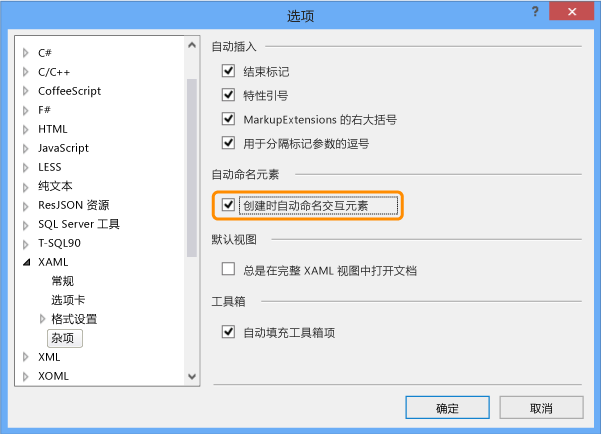  
  
2.  使用 Visual C# 或 Visual Basic 模板，为基于 XAML 的空白 Windows 应用商店应用创建新项目。  
  
     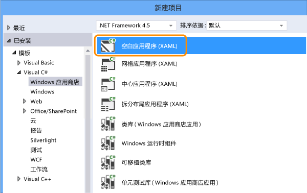  
  
3.  在解决方案资源管理器中，打开 MainPage.xaml。 从工具箱中，将按钮控件和文本框控件拖动到设计图面。  
  
     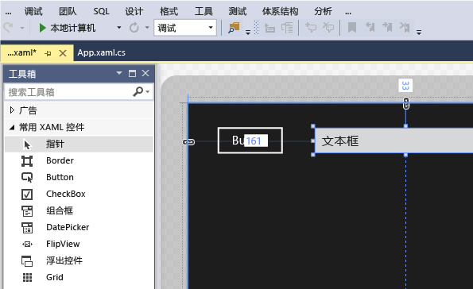  
  
4.  双击该按钮控件，然后添加以下代码：  
  
    ```c#  
    private void button_Click_1(object sender, RoutedEventArgs e)  
    {  
        this.textBox.Text = this.button.Name;  
    }  
  
    ```  
  
    ```vb#  
    Public NotInheritable Class MainPage  
        Inherits Page  
  
        Private Sub button_Click(sender As Object, e As RoutedEventArgs) Handles Button.Click  
            Me.textBox.Text = Me.button.Name  
        End Sub  
    End Class  
    ```  
  
5.  按 F5 以运行你的 Windows 应用商店应用。  
  
## <a name="create-and-run-a-coded-ui-test-for-the-windows-store-app"></a>为 Windows 应用商店应用创建并运行编码的 UI 测试  

[如何为通用 Windows 平台 (UWP) 应用创建编码的 UI 测试？](#uwpapps)
  
1.  为 Windows 应用商店应用创建新编码的 UI 测试项目。  
  
       
  
2.  选择使用十字线工具编辑 UI 映射。  
  
       
  
3.  在编码的 UI 测试生成器中使用十字线工具以选择应用磁贴、右键单击 **“AutomationId”** ，然后选择 **“将值复制到剪贴板”**。 稍后将剪贴板中的值用于编写操作以启动可供测试的应用。  
  
     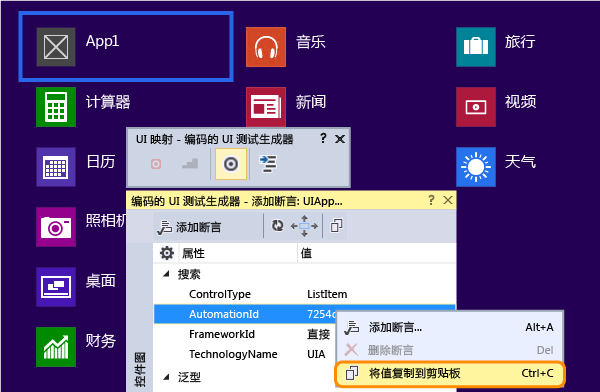  
  
4.  在运行的 Windows 应用商店应用中，使用十字线工具以选择按钮控件和文本框控件。 在添加每个控件后，请在编码的 UI 测试生成器工具栏中选择 **“将控件添加到 UI 控件图”** 按钮。  
  
     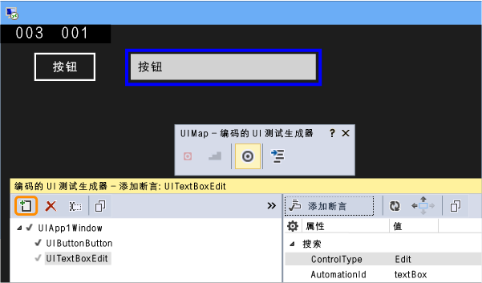  
  
5.  在编码的 UI 测试生成器工具栏中选择 **“生成代码”** 按钮，然后选择 **“生成”** 来为对 UI 控件图所做的更改创建代码。  
  
     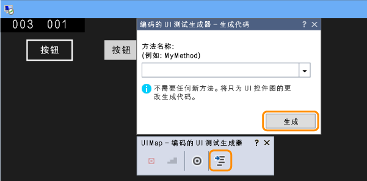  
  
6.  选择按钮以在文本框中设置值。  
  
     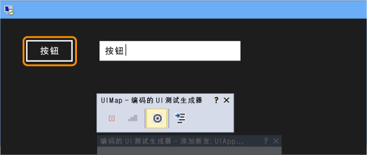  
  
7.  使用十字线工具选择文本框控件，然后选择 **“文本”** 属性。  
  
     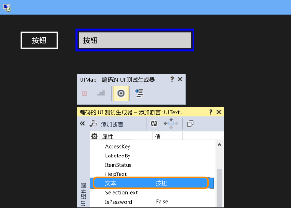  
  
8.  添加断言。 将在测试中使用它以验证该值是否正确。  
  
     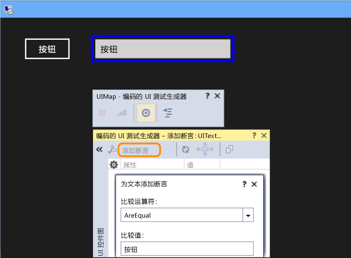  
  
9. 为断言添加并生成代码。  
  
       
  
10. **Visual C#**  
  
     在“解决方案资源管理器”中，打开 UIMap.Designer.cs 文件，以查看为断言方法和控件添加的代码。  
  
     **Visual Basic**  
  
     在“解决方案资源管理器”中，打开 CodedUITest1.vb 文件，然后在 CodedUITestMethod1() 测试方法代码中，右键单击对已自动添加了 `Me.UIMap.AssertMethod1()` 断言方法的调用，然后选择 **“转到定义”**。 这将在代码编辑器中打开 UIMap.Designer.vb 文件，因此你可以查看为断言方法和控件添加的代码。  
  
    > [!WARNING]
    >  请不要直接修改 UIMap.designer.cs 或 UIMap.Designer.vb 文件。 如果执行此操作，则在每次生成测试时都将覆盖对该文件所做的更改。  
  
     **断言方法**  
  
    ```c#  
    public void AssertMethod1()  
    {  
        #region Variable Declarations  
        XamlEdit uITextBoxEdit = this.UIApp1Window.UITextBoxEdit;  
        #endregion  
  
        // Verify that the 'Text' property of 'textBox' text box equals 'button'  
        Assert.AreEqual(this.AssertMethod3ExpectedValues.UITextBoxEditText, uITextBoxEdit.Text);  
    }  
    ```  
  
    ```vb#  
    Public Sub AssertMethod1()  
        Dim uITextBoxEdit As XamlEdit = Me.UIApp2Window.UITextBoxEdit  
  
        'Verify that the 'Text' property of 'textBox' text box equals 'button'  
        Assert.AreEqual(Me.AssertMethod1ExpectedValues.UITextBoxEditText, uITextBoxEdit.Text)  
    End Sub  
    ```  
  
     **控件**  
  
    ```c#  
    #region Properties  
    public XamlButton UIButtonButton  
    {  
        get  
        {  
            if ((this.mUIButtonButton == null))  
            {  
                this.mUIButtonButton = new XamlButton(this);  
                #region Search Criteria  
                this.mUIButtonButton.SearchProperties[XamlButton.PropertyNames.AutomationId] = "button";  
                this.mUIButtonButton.WindowTitles.Add("App1");  
                #endregion  
            }  
            return this.mUIButtonButton;  
        }  
    }  
  
    public XamlEdit UITextBoxEdit  
    {  
        get  
        {  
            if ((this.mUITextBoxEdit == null))  
            {  
                this.mUITextBoxEdit = new XamlEdit(this);  
                #region Search Criteria  
                this.mUITextBoxEdit.SearchProperties[XamlEdit.PropertyNames.AutomationId] = "textBox";  
                this.mUITextBoxEdit.WindowTitles.Add("App1");  
                #endregion  
            }  
            return this.mUITextBoxEdit;  
        }  
    }  
    #endregion  
  
    #region Fields  
    private XamlButton mUIButtonButton;  
  
    private XamlEdit mUITextBoxEdit;  
    #endregion  
    ```  
  
    ```vb#  
    #Region "Properties"  
    Public ReadOnly Property UIButtonButton() As XamlButton  
        Get  
            If (Me.mUIButtonButton Is Nothing) Then  
                Me.mUIButtonButton = New XamlButton(Me)  
                Me.mUIButtonButton.SearchProperties(XamlButton.PropertyNames.AutomationId) = "button"  
                Me.mUIButtonButton.WindowTitles.Add("App2")  
            End If  
            Return Me.mUIButtonButton  
        End Get  
    End Property  
  
    Public ReadOnly Property UITextBoxEdit() As XamlEdit  
        Get  
            If (Me.mUITextBoxEdit Is Nothing) Then  
                Me.mUITextBoxEdit = New XamlEdit(Me)  
                Me.mUITextBoxEdit.SearchProperties(XamlEdit.PropertyNames.AutomationId) = "textBox"  
                Me.mUITextBoxEdit.WindowTitles.Add("App2")  
            End If  
            Return Me.mUITextBoxEdit  
        End Get  
    End Property  
    #End Region  
  
    #Region "Fields"  
    Private mUIButtonButton As XamlButton  
  
    Private mUITextBoxEdit As XamlEdit  
    #End Region  
    ```  
  
11. 在“解决方案资源管理器”中，打开 CodedUITest1.cs 或 CodedUITest1.vb 文件。 针对使用已添加到 UIMap 的控件运行测试所需的操作，你现在可以将代码添加到 CodedUTTestMethod1 方法：  
  
    1.  使用你之前复制到剪贴板的自动化 ID 属性启动 Windows 应用商店应用：  
  
        ```c#  
        XamlWindow.Launch("8ebca7c4-effe-4c86-9998-068daccee452_cyrqexqw8cc7c!App")  
        ```  
  
        ```vb#  
        XamlWindow myAppWindow = XamlWindow.Launch("7254db3e-20a7-424e-8e05-7c4dabf4f28d_cyrqexqw8cc7c!App");  
        ```  
  
    2.  添加手势以点击按钮控件：  
  
        ```c#  
        Gesture.Tap(this.UIMap.UIApp1Window. UIButtonButton);  
        ```  
  
        ```vb#  
        Gesture.Tap(Me.UIMap.UIApp2Window. UIButtonButton)  
        ```  
  
    3.  验证对已自动生成的断言方法的调用是否发生在启动应用和按钮上的点击手势之后：  
  
        ```c#  
        this.UIMap.AssertMethod1();  
        ```  
  
        ```vb#  
        Me.UIMap.AssertMethod1()  
        ```  
  
     添加代码后，CodedUITestMethod1 测试方法应如下所示：  
  
    ```c#  
    [TestMethod]  
    public void CodedUITestMethod1()  
    {  
        // To generate code for this test, select "Generate Code for Coded UI Test" from the shortcut menu and select one of the menu items.  
  
        // Launch the app.  
        XamlWindow myAppWindow = XamlWindow.Launch("7254db3e-20a7-424e-8e05-7c4dabf4f28d_cyrqexqw8cc7c!App");  
  
        // Tap the button.  
        Gesture.Tap(this.UIMap.UIApp1Window.UIButtonButton);  
  
        this.UIMap.AssertMethod1();  
    }  
    ```  
  
    ```vb#  
    <CodedUITest(CodedUITestType.WindowsStore)>  
    Public Class CodedUITest1  
  
        <TestMethod()>  
        Public Sub CodedUITestMethod1()  
            '              
            ' To generate code for this test, select "Generate Code for Coded UI Test" from the shortcut menu and select one of the menu items.  
            '  
  
            ' Launch the app.  
            XamlWindow.Launch("8ebca7c4-effe-4c86-9998-068daccee452_cyrqexqw8cc7c!App")  
  
            '// Tap the button.  
            Gesture.Tap(Me.UIMap.UIApp2Window.UIButtonButton)  
  
            Me.UIMap.AssertMethod1()  
        End Sub  
    ```  
  
12. 生成你的测试，然后使用测试资源管理器运行该测试。  
  
     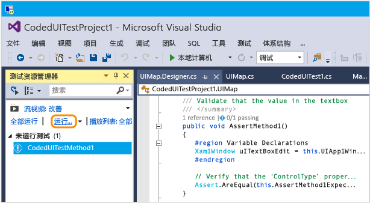  
  
     此时 Windows 应用商店应用启动，点击按钮操作完成，然后会使用断言方法填充并验证文本框的 Text 属性。  
  
     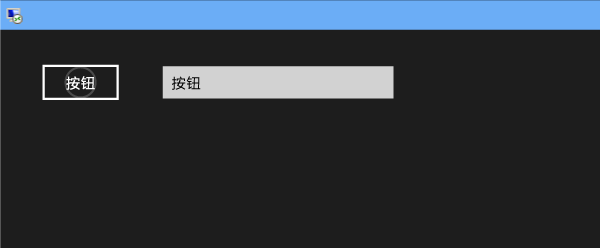  
  
     完成测试后，测试资源管理器将显示通过了该测试。  
  
     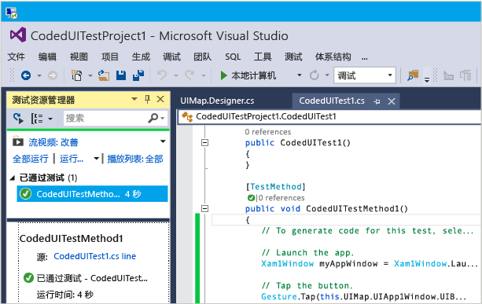  
  
## <a name="q--a"></a>问题解答  
  
#### <a name="q-why-dont-i-see-the-option-to-record-my-coded-ui-test-in-the-generate-code-for-a-coded-ui-test-dialog"></a>问：为什么在“生成编码的 UI 测试的代码”对话框中看不到用于记录编码的 UI 测试的选项？**  
  
**答**：Windows 应用商店应用不支持记录选项。  
  
#### <a name="q-can-i-create-a-coded-ui-test-for-my-windows-store-apps-based-on-winjs"></a>问：我能否为基于 WinJS 的 Windows 应用商店应用创建编码的 UI 测试？**  

**答**：否，仅支持基于 XAML 的应用。  
  
#### <a name="q-can-i-create-coded-ui-tests-for-my-windows-store-apps-on-a-system-that-is-not-running-windows-81-or-windows-10"></a>问：我能否在未运行 Windows 8.1 或 Windows 10 的系统上为 Windows 应用商店应用创建编码的 UI 测试？**  
  
**答**：否，编码的 UI 测试项目模板仅适用于 Windows 8.1 和 Windows 10。 若要为通用 Windows 平台 (UWP) 应用创建自动化项，需要 Windows 10。  

<a name="uwpapps"></a>  
#### <a name="q-how-do-i-create-coded-ui-tests-for-universal-windows-platform-uwp-apps"></a>问：如何为通用 Windows 平台 (UWP) 应用创建编码的 UI 测试？**  
  
**答**：根据要在其中测试 UWP 应用的平台，通过以下方式之一创建编码的 UI 测试项目：  
  
- 在本地计算机上运行的 UWP 应用将作为应用商店应用运行。 若要对此进行测试，必须使用 **“编码的 UI 测试项目(Windows)”** 模板。 若要在创建新项目时查找此模板，请转到“Windows” 、“通用”  节点。 或转到 **“Windows”**、 **“Windows 8”**、 **“Windows”** 节点。  
  
- 在移动设备或仿真器上运行的 UWP 应用将作为 Phone 应用进行运行。 若要对此进行测试，必须使用 **“编码的 UI 测试项目(Windows Phone)”** 模板。 若要在创建新项目时查找此模板，请转到“Windows” 、“通用”  节点。 或转到 **“Windows”**、 **“Windows 8”**、 **“Windows Phone”** 节点。  
  
创建项目后，将测试创作为与之前保持相同。  
  
#### <a name="q-why-cant-i-modify-the-code-in-the-uimapdesigner-file"></a>问：为什么无法修改 UIMap.Designer 文件中的代码？**  
  
**答**：每次使用“UIMap - 编码的 UI 测试生成器”生成代码时，都将覆盖在 UIMapDesigner.cs 文件中所做的任何代码更改。 如果必须修改录制的方法，则必须将其复制到 UIMap.cs 文件并对其重命名。 UIMap.cs 文件可用于重写 UIMapDesigner.cs 文件中的方法和属性。 必须在 Coded UITest.cs 文件中删除对原始方法的引用，并将其替换为重命名的方法名称。  
  
## <a name="see-also"></a>另请参阅  
 [使用 UI 自动化来测试代码](../test/use-ui-automation-to-test-your-code.md)   
 [为 Windows 应用商店控件设置唯一的自动化属性以进行测试](../test/set-a-unique-automation-property-for-windows-store-controls-for-testing.md)

