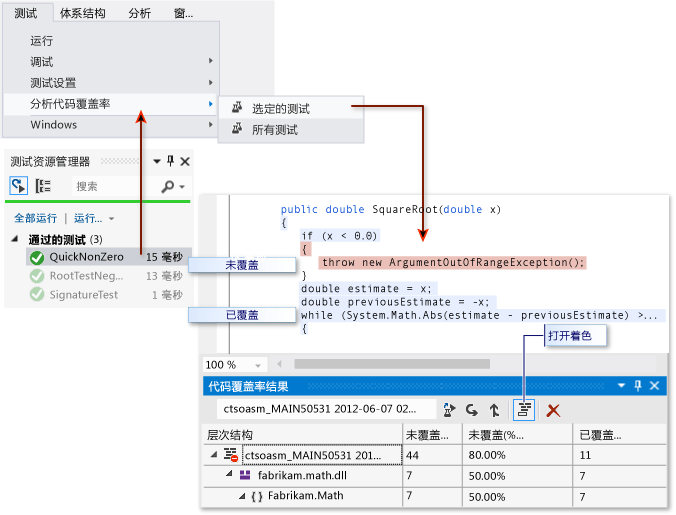

# <a name="using-code-coverage-to-determine-how-much-code-is-being-tested"></a>使用代码覆盖率确定所测试的代码量
若要确定正在由编码的测试（例如单元测试）实际进行测试的项目代码的比例，则可以使用 Visual Studio 的代码覆盖率功能。 若要有效防止 Bug，测试应作用于或“覆盖”你的大部分代码。  
  
 可将代码覆盖率分析应用于托管 (CLI) 和非托管（本机）代码。  
  
 代码覆盖率是使用测试资源管理器运行测试方法时的一个选项。 结果表将显示在各个程序集、类和方法中运行的代码的百分比。 此外，源编辑器将显示已测试的代码。  
  
   
  
 **要求**  
  
-   Visual Studio Enterprise  
  
### <a name="to-analyze-code-coverage-on-unit-tests-in-test-explorer"></a>分析测试资源管理器中的单元测试的代码覆盖率  
  
1.  在“测试”菜单上，选择“分析代码覆盖率”。  
  
2.  若要查看已运行的行，请选择**显示代码覆盖率着色**。  
  
     若要更改颜色或使用加粗，请依次选择“工具”、“选项”、“环境”、“字体和颜色”和“显示其设置：文本编辑器”。 在“显示项”下，调整覆盖率项。  
  
3.  如果结果显示覆盖率较低，请调查代码的哪些部分没有执行测试，并编写更多测试来覆盖它们。 开发团队通常以大约 80% 的代码覆盖率为目标。 在某些情况下，较低的覆盖率是可接受的。 例如，当某代码是从标准模板生成时，可接受较低的覆盖率。  
  
> [!TIP]
>  若要获得准确的结果：  
>   
>  -   确保关闭编译器优化。  
>   
>      如果要处理非托管（本机）代码，请使用调试版本。  
> -   确保为每个程序集生成 .pdb（符号）文件。  
>   
>  如果没有获得预期的结果，请参阅[代码覆盖率疑难解答](../test/troubleshooting-code-coverage.md)。 。 不要忘记在更新代码后再次运行代码覆盖率。 在修改代码后或运行测试时，覆盖率结果和代码着色不会自动更新。  
  
## <a name="reporting-in-blocks-or-lines"></a>报告块或行  
 代码覆盖率将以块为单位计数。 块是恰好有一个入口点和出口点的一段代码。  在测试运行期间，如果程序的控制流通过某个块，则将该块计为“已覆盖”。 块的使用次数对结果没有影响。  
  
 还可以通过在表标题中选择“添加/移除列”来按行显示结果。 如果测试运行执行了任何代码行中的所有代码块，则将该代码行计为一行。 如果某个行包含一些已执行的代码块和一些未执行的代码块，则将此行将计为部分行。  
  
 某些用户更喜欢行计数，因为百分比与你在源代码中看到的段的大小更为对应。 一个很长的计算块即使占用多行，也将计为一行。  
  
## <a name="managing-code-coverage-results"></a>托管代码覆盖率结果  
 “代码覆盖率结果”窗口通常显示最新运行的结果。 如果更改了测试数据或每次只运行一部分测试，结果将会变化。  
  
 “代码覆盖率”窗口也可用来查看以前的结果或在其他计算机上获取的结果。  
  
 你可以合并多个运行的结果，例如来自使用不同的测试数据的运行的结果。  
  
-   **若要查看以前的结果集**，请从下拉菜单中选择它。 该菜单将会显示一个临时列表。打开新的解决方案时，将会清除该列表。  
  
-   **若要查看以前的会话中的结果**，请选择“导入代码覆盖率结果”，导航到解决方案的 TestResults 文件夹，然后导入 .coverage 文件。  
  
     如果源代码自 .coverage 文件生成之后已更改，则覆盖率着色可能不正确。  
  
-   **若要使结果可作为文本读取**，请选择“导出代码覆盖率结果”。 这将生成可使用其他工具处理或在邮件中轻松发送的可读的 .coveragexml 文件。  
  
-   **若要将结果发送给其他人**，请发送 .coverage 文件或导出的 .coveragexml 文件。 他们随后可以导入该文件。 如果他们具有相同版本的源代码，还可以看到覆盖率着色。  
  
## <a name="merging-results-from-different-runs"></a>合并不同运行的结果  
 在某些情况下，将根据测试数据来使用代码中的不同块。 因此，你可能需要组合来自不同的测试运行的结果。  
  
 例如，假设你在运行某个测试（输入为“2”）时发现某个特定函数已被覆盖了 50%。 当你第二次运行该测试（输入为“-2”）时，你在覆盖着色视图中发现该函数的另外 50% 也被覆盖。 现在，你合并来自这两个测试运行的结果，报告和覆盖率着色视图显示该函数已经 100% 被覆盖。  
  
 为此，请使用**合并代码覆盖率结果**。 你可以选择最近的运行或导入的结果的任意组合。 如果要组合导出的结果，则必须先将其导入。  
  
 使用“导出代码覆盖率结果”可保存合并操作的结果。  
  
### <a name="limitations-in-merging"></a>有关合并的限制  
  
-   如果你合并不同版本的代码中的覆盖率数据，结果将单独显示，但不会合并。 若要获取完全合并的结果，请使用相同的代码生成，并且仅更改测试数据。  
  
-   如果你合并一个先导出然后导入的结果文件，则只能按行查看结果，而不能按块查看结果。 使用“添加/移除列”命令可显示行数据。  
  
-   如果你合并来自 ASP.NET 项目的测试的结果，则将显示各个测试的结果，而不是合并的测试的结果。 这只适用于 ASP.NET 项目本身：任何其他程序集的结果都将合并。  
  
## <a name="excluding-elements-from-the-code-coverage-results"></a>从代码覆盖率结果中排除元素  
 例如，如果代码是从文本模板生成的，则你可能希望从覆盖率分数中排除代码中的特定元素。 将特性 `System.Diagnostics.CodeAnalysis.ExcludeFromCodeCoverage` 添加到以下任一代码元素：类、结构、方法、属性、属性 setter 或 getter、事件。 请注意，排除某个类并不会排除它的派生类。  
  
 例如:  
  
```c#  
  
using System.Diagnostics.CodeAnalysis;   
...  
public class ExampleClass1  
{   
    [ExcludeFromCodeCoverage]  
    void ExampleMethod() {...}  
  
    [ExcludeFromCodeCoverage] // exclude property  
    int ExampleProperty1   
    { get {...} set{...}}  
  
    int ExampleProperty2  
    {  
        get  
        {  
            ...  
        }  
        [ExcludeFromCodeCoverage] // exclude setter  
        set  
        {  
            ...  
        }  
    }  
  
}  
[ExcludeFromCodeCoverage]  
class ExampleClass2 { ... }  
  
```  
  
```vb#  
Imports System.Diagnostics.CodeAnalysis  
  
Class ExampleClass1          
    <ExcludeFromCodeCoverage()>  
    Public Sub ExampleSub1()  
        ...  
    End Sub  
  
    ' Exclude property  
    < ExcludeFromCodeCoverage()>  
    Property ExampleProperty1 As Integer  
        ...  
    End Property  
  
    ' Exclude setter  
    Property ExampleProperty2 As Integer  
        Get  
            ...  
        End Get  
        <ExcludeFromCodeCoverage()>  
        Set(ByVal value As Integer)  
            ...  
        End Set  
    End Property  
End Class  
  
<ExcludeFromCodeCoverage()>  
Class ExampleClass2  
...  
End Class  
  
```  
  
```cpp#  
// A .cpp file compiled as managed (CLI) code.  
using namespace System::Diagnostics::CodeAnalysis;  
...  
public ref class ExampleClass1  
{  
  public:  
    [ExcludeFromCodeCoverage]  
    void ExampleFunction1() { ... }  
  
    [ExcludeFromCodeCoverage]  
    property int ExampleProperty2 {...}  
  
    property int ExampleProperty2 {  
      int get() { ... }  
     [ExcludeFromCodeCoverage]  
      void set(int value) { ...  }  
   }  
  
}  
  
[ExcludeFromCodeCoverage]  
public ref class ExampleClass2  
{ ... }  
  
```  
  
### <a name="excluding-elements-in-native-c-code"></a>排除本机 C++ 代码中的元素  
 若要排除 C++ 代码中的非托管（本机）元素：  
  
```cpp  
  
#include <CodeCoverage\CodeCoverage.h>  
...  
  
// Exclusions must be compiled as unmanaged (native):  
#pragma managed(push, off)  
  
// Exclude a particular function:  
ExcludeFromCodeCoverage(Exclusion1, L"MyNamespace::MyClass::MyFunction");  
  
// Exclude all the functions in a particular class:  
ExcludeFromCodeCoverage(Exclusion2, L"MyNamespace::MyClass2::*");  
  
// Exclude all the functions generated from a particular template:   
ExcludeFromCodeCoverage(Exclusion3, L"*::MyFunction<*>");  
  
// Exclude all the code from a particular .cpp file:  
ExcludeSourceFromCodeCoverage(Exclusion4, L"*\\unittest1.cpp");  
  
// After setting exclusions, restore the previous managed/unmanaged state:  
#pragma managed(pop)  
  
```  
  
 使用以下宏：  
  
 `ExcludeFromCodeCoverage(` *ExclusionName* `, L"` *FunctionName* `");`  
  
 `ExcludeSourceFromCodeCoverage(` *ExclusionName* `, L"` *SourceFilePath* `");`  
  
-   *ExclusionName* 是唯一名称。  
  
-   *FunctionName* 是完全限定的函数名。 它可能包含通配符。 例如，若要排除某个类的所有函数，应编写 `MyNamespace::MyClass::*`  
  
-   *SourceFilePath* 是 .cpp 文件的本地或 UNC 路径。 它可能包含通配符。 以下示例将排除特定目录中的所有文件：`\\MyComputer\Source\UnitTests\*.cpp`  
  
-   `#include <CodeCoverage\CodeCoverage.h>`  
  
-   将对排除宏的调用放在全局命名空间中，而不是放在任何命名空间或类中。  
  
-   你可以将排除放在单元测试代码文件或应用程序代码文件中。  
  
-   必须通过设置编译器选项或使用 `#pragma managed(off)` 将排除编译为非托管（本机）代码。  
  
> [!NOTE]
>  若要排除 C++/CLI 代码中的函数，应对函数应用特性 `[System::Diagnostics::CodeAnalysis::ExcludeFromCodeCoverage]`。 这与 C# 中的做法相同。  
  
### <a name="including-or-excluding-additional-elements"></a>包括或排除其他元素  
 仅对已加载并且在 .dll 或 .exe 文件所在相同目录中有可用的 .pdb 文件的程序集执行代码覆盖率分析。 因此，在某些情况下，可以通过获取适当的 .pdb 文件的副本来扩展包含的一组程序集。  
  
 你可以通过编写 .runsettings 文件来加强控制为代码覆盖率分析选择哪些程序集和元素。 例如，你可以排除特定类型的程序集，而不必向它们的类添加特性。 有关详细信息，请参阅[自定义代码覆盖率分析](../test/customizing-code-coverage-analysis.md)。  
  
## <a name="analyzing-code-coverage-in-the-build-service"></a>分析生成服务中的代码覆盖率  
 签入代码时，你的测试以及其他团队成员的所有其他测试将在生成服务器中运行。 （如果还没有对此进行设置，请参阅 [Run tests in your build process](http://msdn.microsoft.com/Library/d05743a1-c5cf-447e-bed9-bed3cb595e38)（在生成过程中运行测试）。）对生成服务分析代码覆盖率很有用，因为这样能提供整个项目中的覆盖率的最新、最全面的情报。 它还包含你不常在开发计算机上运行的自动系统测试和其他编码的测试。  
  
1.  在“团队资源管理器”中，打开“生成”，然后添加或编辑生成定义。  
  
2.  在“进程”页中，展开“自动测试”、“测试源”和“运行设置”。 将“运行设置文件的类型”设为“已启用代码覆盖率”。  
  
     如果你有多个测试源定义，请对每个定义重复此步骤。  
  
    -   但是，没有名为“运行设置文件的类型”的字段。  
  
         在“自动测试”下，选择“测试程序集”，然后选择行尾的省略号按钮“[...]”。 在“添加/编辑测试运行”对话框的“测试运行程序”下，选择“Visual Studio 测试运行程序”。  
  
   
  
 生成运行后，代码覆盖率结果将附加到测试运行并显示在生成摘要中。  
  
## <a name="analyzing-code-coverage-in-a-command-line"></a>分析命令行上的代码覆盖率  
 若要从命令行运行测试，请使用 vstest.console.exe。 代码覆盖率是此实用工具的一个选项。 有关详细信息，请参阅 [VSTest.Console.exe 命令行选项](/devops-test-docs/test/vstest-console-exe-command-line-options)。  
  
1.  启动 Visual Studio 开发人员命令提示符：  
  
     在 Windows 的“开始”菜单上，依次选择“所有程序”、“Microsoft Visual Studio”、“Visual Studio Tools”和“开发人员命令提示”。  
  
2.  运行：  
  
     `vstest.console.exe MyTestAssembly.dll /EnableCodeCoverage`  
  
## <a name="troubleshooting"></a>疑难解答  
 如果看不到代码覆盖率结果，请参阅[代码覆盖率疑难解答](../test/troubleshooting-code-coverage.md)。  
  
## <a name="external-resources"></a>外部资源  
  
### <a name="guidance"></a>指导  
 [使用 Visual Studio 2012 对连续交付进行测试 - 第 2 章：单元测试：测试内部](http://go.microsoft.com/fwlink/?LinkID=255188)  
  
## <a name="see-also"></a>另请参阅  
 [自定义代码覆盖率分析](../test/customizing-code-coverage-analysis.md)   
 [代码覆盖率疑难解答](../test/troubleshooting-code-coverage.md)   
 [单元测试代码](../test/unit-test-your-code.md)
