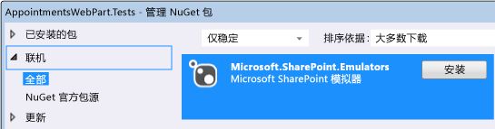
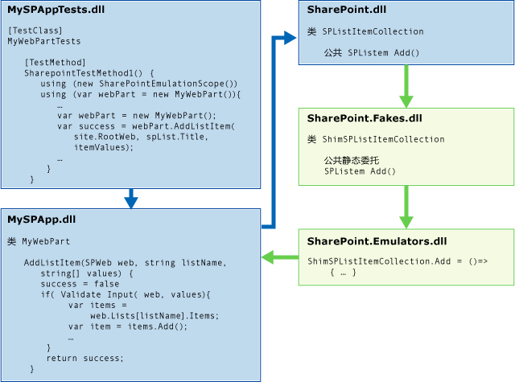
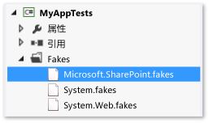
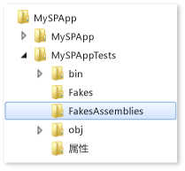

# <a name="using-emulators-to-isolate-unit-tests-for-sharepoint-2010-applications"></a>使用模拟器分离 Sharepoint 2010 应用程序的单元测试
Microsoft.SharePoint.Emulators 包提供了一组帮助你对 Microsoft SharePoint 2010 应用程序创建独立单元测试的库。 仿真器使用 [Microsoft Fakes](../test/isolating-code-under-test-with-microsoft-fakes.md) 隔离框架中的[垫片](../test/using-shims-to-isolate-your-application-from-other-assemblies-for-unit-testing.md)来创建轻型内存中对象，以模仿 SharePoint API 的最常见对象和方法。 当未仿真 SharePoint 方法，或者当你想要更改仿真程序的默认行为时，可以通过创建 Fakes 填充码来提供所需的结果。  
  
 现有测试方法和类可以轻松转换为在仿真程序上下文中运行。 此功能允许你创建两用测试。 两用测试可以在针对实际 SharePoint API 的整体测试与使用仿真程序的独立单元测试之间切换。  
  
##  <a name="BKMK_In_this_topic"></a> 主题内容  
 [要求](#BKMK_Requirements)  
  
 [AppointmentsWebPart 示例](#BKMK_The_AppointmentsWebPart_example)  
  
 [转换现有测试](#BKMK_Converting_an_existing_test)  
  
-   [将仿真器包添加到测试项目](#BKMK_Adding_the_Emulators_package_to_a_test_project)  
  
-   [运行启用了仿真的测试方法](#BKMK__Running_a_test_method_in_the_emulation_context)  
  
 [创建两用类和方法](#BKMK_Creating_dual_use_classes_and_methods)  
  
 [使用 TestInitialize 和 TestCleanup 特性创建两用测试类](#BKMK_Using_TestInitialize_and_TestCleanup_attributes_to_create_a_dual_use_test_class)  
  
 [处理未仿真的 SharePoint 方法](#BKMK_Handling_non_emulated_SharePoint_methods)  
  
 [有关从头开始编写仿真测试的概述](#BKMK_Writing_emulation_tests_from_scratch__and_a_summary)  
  
 [示例](#BKMK_Example)  
  
 [仿真的 SharePoint 类型](#BKMK_Emulated_SharePoint_types)  
  
##  <a name="BKMK_Requirements"></a>要求  
  
-   Microsoft SharePoint 2010（SharePoint 2010 服务器或 SharePoint 2010 Foundation）  
  
-   Microsoft Visual Studio Enterprise  
  
-   Microsoft SharePoint 仿真程序 NuGet 包  
  
 你还应该熟悉一下 [Visual Studio 中的单元测试基础知识](../test/unit-test-basics.md)以及 [Microsoft Fakes](../test/isolating-code-under-test-with-microsoft-fakes.md) 的一些知识。  
  
##  <a name="BKMK_The_AppointmentsWebPart_example"></a>AppointmentsWebPart 示例  
 AppointmentsWebPart 允许你查看和管理 SharePoint 约会列表。  
  
   
  
 我们将在此示例中测试 Web 部件的两种方法：  
  
-   `ScheduleAppointment` 方法验证传递到该方法的列表项值，并在指定 SharePoint 网站上的列表中创建一个新条目。  
  
-   `GetAppointmentsForToday` 方法返回今天的约会详细信息。  
  
 [主题内容](#BKMK_In_this_topic)  
  
##  <a name="BKMK_Converting_an_existing_test"></a>转换现有测试  
 在 SharePoint 组件中方法的典型测试中，测试方法在 SharePoint Foundation 中创建一个临时站点，并将 SharePoint 组件添加到待测试代码所需的站点。 然后测试方法创建并运用组件的实例。 在测试结束时，该站点被撤销。  
  
 待测试代码的 `ScheduleAppointment` 方法可能是为该组件编写的第一批方法中的一个：  
  
```  
// method under test  
public bool ScheduleAppointment(SPWeb web, string listName, string name,   
    string phone, string email, string age, DateTime date, out string errorMsg)  
{  
    errorMsg = string.Empty;  
    var badFormat = this.checkInput(name, phone, email, age);  
    if (badFormat)  
    {  
        errorMsg = "Bad Format";  
        return false;  
    }  
    var exists = this.CheckDuplicate(listName, web, name, phone, email, age, date);  
    if (exists)  
    {  
        errorMsg = "Item already exists";  
        return false;  
    }  
    SPListItemCollection items = web.Lists[listName].Items;  
    // create item and populate fields  
    SPListItem item = items.Add();  
    item["Name"] = name;  
    item["Phone"] = phone;  
    item["Email"] = email;  
    item["Age"] = age;  
    item["Date"] = date.ToString("D");  
    item.Update();  
    return true;  
}  
  
```  
  
 `ScheduleAppointment` 方法中功能的第一个测试可能如下所示：  
  
```csharp  
  
[TestMethod]  
public void ScheduleAppointmentReturnsTrueWhenNewAppointmentIsCreated()  
{  
    using( var site = new SPSite("http://localhost"))  
    using (var webPart = new BookAnAppointmentWebPart())  
    {  
        // Arrange  
        string errorMsg = string.Empty;  
        DateTime date = DateTime.Now;  
        SPList list = AddListToSiteHelper(site);  
  
        // Act  
        bool success = webPart.ScheduleAppointment(site.RootWeb, list.Title,  
            "Raisa Pokrovskaya", "425-555-0163", "raisa@outlook.com", "55", date,   
            out errorMsg);  
        list.Delete();  
  
        // Assert  
        Assert.IsTrue(success);  
    }  
}  
```  
  
 虽然此测试方法不验证 `ScheduleAppointment` 方法是否正确向列表添加了新的条目，但相对于代码特定行为的测试而言，它更像 Web 部件的整体测试。 对 SharePoint 和 SharePoint API 的外部依赖关系可能会导致测试失败，失败原因并不在于 `ScheduleAppointment` 方法中的用户代码。 创建和销毁 SharePoint 站点的开销还可能导致测试非常慢，从而导致测试作为编码进程的常规部分运行。 为每个测试方法执行站点的建立和破坏只会构成创建高效开发人员单元测试的问题。  
  
 Microsoft SharePoint 仿真程序为你提供了一组对象和方法“加倍”，以模仿最常见 SharePoint API 的行为。 仿真方法是不需要运行 SharePoint 的 SharePoint API 的轻量实现。 通过使用 Microsoft Fakes 将对 SharePoint API 的调用绕到 SharePoint 仿真程序的方法加倍，你可以隔离测试并确保正测试所需的代码。 当调用非仿真 SharePoint 方法时，可以使用 Fakes 直接创建所需的行为。  
  
 [主题内容](#BKMK_In_this_topic)  
  
###  <a name="BKMK_Adding_the_Emulators_package_to_a_test_project"></a>将仿真器包添加到测试项目  
 将 SharePoint 仿真程序添加到测试项目：  
  
1.  在解决方案资源管理器中选择测试项目。  
  
2.  选择快捷菜单中的“管理 NuGet 包...”。  
  
3.  在“联机”分类中搜索“`Microsoft.SharePoint.Emulators`”，然后选择“安装”。  
  
   
  
 [主题内容](#BKMK_In_this_topic)  
  
###  <a name="BKMK__Running_a_test_method_in_the_emulation_context"></a>运行启用了仿真的测试方法  
 安装包会向项目添加对所需库的引用。 为便于在现有测试类中使用仿真程序，请添加命名空间 `Microsoft.SharePoint.Emulators` 和 `Microsoft.QualityTools.Testing.Emulators`。  
  
 若要在测试方法中支持仿真，请将方法主体包装到创建`SharePointEmulationScope` 对象的 `using` 语句中。 例如:  
  
```csharp  
  
[TestMethod]  
public void ScheduleAppointmentReturnsTrueWhenNewAppointmentIsCreated()  
{  
    // create the emulation scope with a using statement  
    using (new SharePointEmulationScope())  
    using( var site = new SPSite("http://localhost"))  
    using (var webPart = new BookAnAppointmentWebPart())  
    {  
        // Arrange  
        string errorMsg = string.Empty;  
        DateTime date = DateTime.Now;  
        SPList list = AddListToSiteHelper(site);  
  
        // Act  
        bool success = webPart.ScheduleAppointment(site.RootWeb, list.Title,  
            "Raisa Pokrovskaya", "425-555-0163", "raisa@outlook.com", "55", date,   
            out errorMsg);  
        list.Delete();  
  
        // Assert  
        Assert.IsTrue(success);  
    }  
}  
  
```  
  
 执行测试方法时，仿真程序运行时将调用 Microsoft Fakes 以将代码动态注入 SharePoint 方法，从而将对这些方法的调用转移到 Microsoft.SharePoint.Fakes.dll 中声明的委托。 Microsoft.SharePoint.Emulators.dll 实现仿真方法的委托，以非常接近地模拟实际的 SharePoint 行为。 当测试方法或待测试的组件调用 SharePoint 方法时，导致的行为将是仿真。  
  
   
  
 [主题内容](#BKMK_In_this_topic)  
  
##  <a name="BKMK_Creating_dual_use_classes_and_methods"></a>创建两用类和方法  
 若要创建可同时用于针对实际 SharePoint API 的整体测试以及使用仿真程序的独立单元测试的方法，请使用重载构造函数 `SharePointEmulationScope(EmulationMode)` 包装你的测试方法代码。 `EmulationMode` 枚举的两个值指定作用域是否使用仿真程序 (`EmulationMode.Enabled`) 或作用域是否使用 SharePoint API (`EmulationMode.Passthrough`)。  
  
 例如，下面的示例演示如何将上一个测试修改为两用：  
  
```csharp  
  
// class level field specifies emulation mode  
private const EmulationMode emulatorMode = EmulationMode.Enabled;  
  
[TestMethod]  
public void ScheduleAppointmentReturnsTrueWhenNewAppointmentIsCreated()  
{  
    // emulation scope determined by emulatorMode  
    using( SharePointEmulationScope(emulatorMode))  
    using( var site = new SPSite("http://localhost"))  
    using (var webPart = new BookAnAppointmentWebPart())  
    {  
        // Arrange  
        string errorMsg = string.Empty;  
        DateTime date = DateTime.Now;  
        SPList list = AddListToSiteHelper(site);  
  
        // Act  
        bool success = webPart.ScheduleAppointment(site.RootWeb, list.Title,  
            "Raisa Pokrovskaya", "425-555-0163", "raisa@outlook.com", "55", date,   
            out errorMsg);  
        list.Delete();  
  
        // Assert  
        Assert.IsTrue(success);  
    }  
}  
```  
  
 [主题内容](#BKMK_In_this_topic)  
  
##  <a name="BKMK_Using_TestInitialize_and_TestCleanup_attributes_to_create_a_dual_use_test_class"></a>使用 TestInitialize 和 TestCleanup 特性创建两用测试类  
 如果你在使用 `SharePointEmulationScope` 的类中运行全部或大部分测试，则可以利用类级别技术来设置仿真模式。  
  
-   使用 <xref:Microsoft.VisualStudio.TestTools.UnitTesting.TestInitializeAttribute> 和 <xref:Microsoft.VisualStudio.TestTools.UnitTesting.TestCleanupAttribute> 特性化的测试类方法可以创建和销毁该作用域。  
  
-   在类级别设置 `EmulationMode` 可以让你在 `EmulationMode.Enabled` 与 `EmulationMode.Passthrough` 之间自动进行模式更改。  
  
 使用 `[TestInitialize]` 特性化的类方法在每个测试方法开始时运行，而使用 `[TestCleanup]` 特性化的方法在每个测试方法结束时运行。 你可以在类级别为 `SharePointEmulationScope` 对象声明一个私有字段，在 `TestInitialize` 特性化方法中对该私有字段进行初始化，然后释放 `TestCleanup` 特性化方法中的对象。  
  
 你可以使用选定的任何方法来自动化 `EmulationMode` 的选择内容。 其中一种方法是通过使用预处理器指令来检查某个符号是否存在。 例如，若要在使用仿真程序的类中运行测试方法，可以在测试项目文件或生成命令行上定义诸如 `USE_EMULATION` 的符号。 如果该符号已定义，则声明类级别 `EmulationMode` 常量并将其设置为 `Enabled`。 否则，将该常量设置为 `Passthrough`。  
  
 下面是一个演示如何使用预处理器指令以及 `TestInitialize` 和 `TestCleanup` 特性化方法来设置仿真模式的测试类示例。  
  
```csharp  
//namespace declarations  
...  
  
namspace MySPAppTests   
{  
    [TestClass]  
    public class BookAnAppointmentWebPartTests  
    {  
  
        // emulationScope is a class level field  
        private SharePointEmulationScope emulationScope;  
  
        // preprocessor directives determine the value of emulatorMode  
        #if USE_EMULATIONprivate const EmulationMode emulatorMode = EmulationMode.Enabled;#elseprivate const EmulationMode emulatorMode = EmulationMode.Passthrough;#endif  
  
        // InitializeTest sets the emulation scope at the beginning of each test method  
        [TestInitialize]public void InitializeTest(){this.emulationScope = new SharePointEmulationScope(emulatorMode);}  
  
        // CleanupTest disposes the emulation scope at the end of each test method  
        [TestCleanup]public void CleanupTest(){this.emulationScope.Dispose();}  
  
        [TestMethod]  
        public void ScheduleAppointmentReturnsTrueWhenNewAppointmentIsCreated()  
        {  
            // remove the SharePointEmulationScope using statement from the method  
            using( var site = new SPSite("http://localhost"))  
            using (var webPart = new BookAnAppointmentWebPart())  
            {  
                // Arrange  
                string errorMsg = string.Empty;  
                DateTime date = DateTime.Now;  
                SPList list = AddListToSiteHelper(site);  
  
                // Act  
                bool success = webPart.ScheduleAppointment(site.RootWeb, list.Title,  
                    "Raisa Pokrovskaya", "425-555-0163", "raisa@outlook.com", "55", date,   
                    out errorMsg);  
                list.Delete()  
  
                // Assert  
                Assert.IsTrue(success);  
            }  
        }  
  
        ...// More tests  
  
    }  
}  
  
```  
  
 [主题内容](#BKMK_In_this_topic)  
  
##  <a name="BKMK_Handling_non_emulated_SharePoint_methods"></a>处理未仿真的 SharePoint 方法  
 并非所有 SharePoint 类型都是仿真的，并非某些仿真类型中的所有方法都是仿真的。 如果待测试的代码调用非仿真 SharePoint 方法，该方法将引发 `NotSupportedException` 异常。 发生异常时，需要添加该 SharePoint 方法的 Fakes 填充码。  
  
 **设置 Sharepoint Fakes**  
  
 显式调用 Microsoft Fakes 填充码：  
  
1.  如果希望填充非仿真 SharePoint 类，请编辑 Microsoft.SharePoint.fakes 文件并将该类添加到已填充类的列表。 请参阅 [Microsoft Fakes 中的代码生成、编译和命名约定](../test/code-generation-compilation-and-naming-conventions-in-microsoft-fakes.md)的[配置存根和垫片的代码生成](http://msdn.microsoft.com/library/hh708916.aspx#bkmk_configuring_code_generation_of_stubs)部分。  
  
       
  
2.  安装 Microsoft SharePoint 仿真程序包后，如果你已编辑 Microsoft.SharePoint.Fakes 文件，请重新生成测试项目至少一次。 生成项目会在磁盘上的项目根文件夹下创建并填充 **FakesAssembly** 文件夹。  
  
       
  
3.  添加对 **FakesAssembly** 文件夹中 **Microsoft.SharePoint.14.0.0.0.Fakes.dll** 程序集的引用。  
  
4.  （可选）向测试类添加 `Microsoft.QualityTools.Testing.Fakes`、`Microsoft.SharePoint.Fakes` 以及要使用的 `Microsoft.SharePoint.Fakes` 的任何嵌套命名空间的命名空间指令。  
  
 **实现 SharePoint 方法的垫片委托**  
  
 在我们的示例项目中，`GetAppointmentsForToday` 方法调用 [SPList.GetItems(SPQuery)](http://msdn.microsoft.com/library/ms457534.aspx) SharePoint API 方法。  
  
```csharp  
// method under test  
public string GetAppointmentsForToday(string listName, SPWeb web)  
{  
    SPList list = web.Lists[listName];  
    DateTime today = DateTime.Now;  
    var listQuery = new SPQuery{Query = String.Format("<Where><Eq><FieldRef Name='Date'/>" +"<Value Type='Text'>{0}</Value>" +"</Eq></Where>", today.ToString("D"))};  
    var result = new System.Text.StringBuilder();  
    foreach (SPListItem item in list.GetItems(listQuery))  
    {  
        result.AppendFormat("Name: {0}, Phone: {1}, Email: {2}, Age: {3}, Date: {4}\n",   
            item["Name"], item["Phone"], item["Email"], item["Age"], item["Date"]);  
    }  
    return result.ToString();  
}  
  
```  
  
 已重载 `GetItems` 方法的 `SPList.GetItems(SPQuery)` 版本是非仿真的。 因此，仅将 `GetAppointmentsForToday` 的现有测试包装到 `SharePoint.Emulation.Scope` 中将失败。 若要创建工作测试，必须编写返回要测试其结果的 Fakes 委托 `ShimSPList.GetItemsSPQuery` 的实现。  
  
 下面是实现 Fakes 委托的现有测试方法 `GetAppointmentsForTodayReturnsOnlyTodaysAppointments` 的修改。 所需的更改在注释中标识：  
  
> [!IMPORTANT]
>  如果在 `EmulationMode.Passthrough` 上下文中运行测试，则显式创建 Fakes 填充码的测试方法将引发 `ShimNotSupported` 异常。 若要避免此问题，请使用一个变量来设置 `EmulationMode` 值，并将任何 Fakes 代码包装到测试该值的 `if` 语句中。  
  
```csharp  
// class level field to set emulation mode  
private const EmulationMode emulatorMode = EmulationMode.Enabled  
  
[TestMethod]  
public void GetAppointmentsForTodayReturnsOnlyTodaysAppointments()  
{  
  
    // create the emulation scope with a using statement  
    using (var emulationScope = new SharePointEmulationScope(emulatorMode))  
    using( var site = new SPSite("http://localhost"))  
    using (var webPart = new BookAnAppointmentWebPart())  
    {  
        // Arrange  
        DateTime date = DateTime.Now;  
        SPList list = AddListToSiteHelper(site);  
        // insert 2 items into list  
        AddItemsToListHelper(list, new string[] {"Raisa Pokrovskaya", "425-555-0163",  
            "raisa@outlook.com", "55", date.ToString("D") });  
        AddItemsToListHelper(list, new string[] {"Francis Totten", "313-555-0100",  
            "francis@contoso.com", "42", date.AddDays(1).ToString("D") });  
  
        // use Fakes shims only if emulation is enabled  
        if (emulatorMode == EmulationMode.Enabled){var sList = new ShimSPList(list);sList.GetItemsSPQuery = (query) =>{var shim = new ShimSPListItemCollection();shim.Bind(new[] { list.Items[0] });return shim.Instance;}}  
  
        // Act  
        string result = webPart.GetAppointmentsForToday(list.Title, site.RootWeb);  
        list.Delete();  
  
        // Assert  
        Assert.IsTrue(result.Contains(String.Format(  
            "Name: Raisa Pokrovskaya, Phone: 425-555-0163, Email: raisa@outlook.com," +  
            "Age: 55, Date: {0}", date.ToString("D"))));  
        Assert.IsFalse(result.Contains("Name: Francis Totten"));  
    }  
}  
  
```  
  
 在此方法中，我们首先测试是否支持仿真。 如果是，我们将为 `SPList` 列表创建一个 Fakes 填充码对象，然后创建一个方法并将其分配给其 `GetItemsSPQuery` 委托。 委托使用 Fakes `Bind` 方法将正确的列表项添加到返回到调用方的 `ShimSPListItemCollection`。  
  
 [主题内容](#BKMK_In_this_topic)  
  
##  <a name="BKMK_Writing_emulation_tests_from_scratch__and_a_summary"></a>有关从头开始编写仿真测试的概述  
 虽然前述章节中介绍的创建仿真和两用测试的技术假设你要转换现有测试，但你也可以使用这些技术来从头开始编写测试。 下面的列表总结了这些技术：  
  
-   若要在测试项目中使用仿真程序，请向项目添加 Microsoft.SharePoint.Emulators NuGet 包。  
  
-   若要在测试方法中使用仿真程序，请在方法的开头创建 `SharePointEmulationScope` 对象。 将模拟支持的所有 SharePoint API，直到作用域被释放。  
  
-   按针对实际 SharePoint API 一样的方式编写测试代码。 仿真上下文自动将对 SharePoint 方法的调用绕到其仿真程序。  
  
-   并非所有 SharePoint 对象都是仿真的，并非某些仿真对象中的所有方法都是仿真的。 使用非仿真对象或方法时将引发 `NotSupportedException` 异常。 发生这种情况时，请为该方法显式创建 Fakes 填充码委托，以返回所需的行为。  
  
-   若要创建两用测试，请使用 `SharePointEmulationScope(EmulationMode)` 构造函数来创建仿真作用域对象。 `EmulationMode` 值指定 SharePoint 调用是仿真的还是针对实际 SharePoint 站点执行的。  
  
-   如果测试类中的全部或大部分测试方法都在仿真上下文中执行，则可以使用类级别的 `TestInitialize` 特性化方法来创建 `SharePointEmulationScope` 对象，使用类级别的字段来设置仿真模式。 这将帮助你实现仿真模式更改的自动化。 然后，使用 `TestCleanup` 特性化方法来释放作用域对象。  
  
 [主题内容](#BKMK_In_this_topic)  
  
##  <a name="BKMK_Example"></a> 示例  
 下面是最后一个示例，示例中整合了上述的 SharePoint 仿真程序技术：  
  
```csharp  
using System;   
//other namespace declarations  
...   
// code under test  
using MySPApps;  
using Microsoft.SharePoint;  
// unit testing and emulators  
using Microsoft.VisualStudio.TestTools.UnitTesting;  
using Microsoft.QualityTools.Testing.Emulators;  
using Microsoft.SharePoint.Emulators;  
// explicit Fakes shims  
using Microsoft.QualityTools.Testing.Fakes;  
using Microsoft.SharePoint.Fakes  
  
namspace MySPAppTests   
{  
    [TestClass]  
    public class BookAnAppointmentWebPartTests  
    {  
  
        // emulationScope is a class level field  
        private SharePointEmulationScope emulationScope;  
  
        // preprocessor directives determine the value of emulatorMode  
        #if USE_EMULATION  
            private const EmulationMode emulatorMode = EmulationMode.Enabled;  
        #else  
            private const EmulationMode emulatorMode = EmulationMode.Passthrough;  
        #endif  
  
        // InitializeTest sets the emulation scope at the beginning of each test method  
        [TestInitialize]  
        public void InitializeTest()  
        {  
            this.emulationScope = new SharePointEmulationScope(emulatorMode);  
        }  
  
        // CleanupTest disposes the emulation scope at the end of each test method  
        [TestCleanup]  
        public void Cleanup()  
        {  
            this.emulationScope.Dispose();  
        }  
  
        [TestMethod]  
        public void ScheduleAppointmentReturnsTrueWhenNewAppointmentIsCreated()  
        {  
            // remove the SharePointEmulationScope using statement from the method  
            using( var site = new SPSite("http://localhost"))  
            using (var webPart = new BookAnAppointmentWebPart())  
            {  
                // Arrange  
                string errorMsg = string.Empty;  
                DateTime date = DateTime.Now;  
                SPList list = AddListToSiteHelper(site);  
  
                // Act  
                bool success = webPart.ScheduleAppointment(site.RootWeb, list.Title,  
                    "Raisa Pokrovskaya", "425-555-0163", "raisa@outlook.com", "55", date,   
                    out errorMsg);  
                list.Delete()  
  
                // Assert  
                Assert.IsTrue(success);  
            }  
        }  
  
        [TestMethod]  
        public void GetAppointmentsForTodayReturnsOnlyTodaysAppointments()  
        {  
  
            // remove the SharePointEmulationScope using statement from the method  
            using( var site = new SPSite("http://localhost"))  
            using (var webPart = new BookAnAppointmentWebPart())  
            {  
                // Arrange  
                DateTime date = DateTime.Now;  
                SPList list = AddListToSiteHelper(site);  
                // insert 2 items into list  
                AddItemsToListHelper(list, new string[] {"Raisa Pokrovskaya", "425-555-0163",  
                    "raisa@outlook.com", "55", date.ToString("D") });  
                AddItemsToListHelper(list, new string[] {"Francis Totten", "313-555-0100",  
                    "francis@contoso.com", "42", date.AddDays(1).ToString("D") });  
  
                // use Fakes shims only if emulation is enabled  
                if (emulatorMode == EmulationMode.Enabled)  
                {  
                    var sList = new ShimSPList(list);  
  
                    sList.GetItemsSPQuery = (query) =>  
                    {  
                        var shim = new ShimSPListItemCollection();  
                        shim.Bind(new[] { list.Items[0] });  
                        return shim.Instance;  
                    }  
                }  
  
                // Act  
                string result = webPart.GetAppointmentsForToday(list.Title, site.RootWeb);  
                list.Delete();  
  
                // Assert  
                Assert.IsTrue(result.Contains(String.Format(  
                    "Name: Raisa Pokrovskaya, Phone: 425-555-0163, Email: raisa@outlook.com," +  
                    "Age: 55, Date: {0}", date.ToString("D"))));  
                Assert.IsFalse(result.Contains("Name: Francis Totten"));  
            }  
        }  
  
        ...// More tests  
  
    }  
}  
  
```  
  
##  <a name="BKMK_Emulated_SharePoint_types"></a>仿真的 SharePoint 类型  
 [Microsoft.SharePoint.SPField](http://msdn.microsoft.com/library/Microsoft.SharePoint.SPField)  
  
 [Microsoft.SharePoint.SPFieldIndex](http://msdn.microsoft.com/library/Microsoft.SharePoint.SPFieldIndex)  
  
 [Microsoft.SharePoint.SPFieldIndexCollection](http://msdn.microsoft.com/library/Microsoft.SharePoint.SPFieldIndexCollection)  
  
 [Microsoft.SharePoint.SPFieldLink](http://msdn.microsoft.com/library/Microsoft.SharePoint.SPFieldLink)  
  
 [Microsoft.SharePoint.SPFieldLinkCollection](http://msdn.microsoft.com/library/Microsoft.SharePoint.SPFieldLinkCollection)  
  
 [Microsoft.SharePoint.SPFieldUrlValue](http://msdn.microsoft.com/library/Microsoft.SharePoint.SPFieldUrlValue)  
  
 [Microsoft.SharePoint.SPFile](http://msdn.microsoft.com/library/Microsoft.SharePoint.SPFile)  
  
 [Microsoft.SharePoint.SPFileCollection](http://msdn.microsoft.com/library/Microsoft.SharePoint.SPFileCollection)  
  
 [Microsoft.SharePoint.SPFolder](http://msdn.microsoft.com/library/Microsoft.SharePoint.SPFolder)  
  
 [Microsoft.SharePoint.SPFolderCollection](http://msdn.microsoft.com/library/Microsoft.SharePoint.SPFolderCollection)  
  
 [Microsoft.SharePoint.SPItem](http://msdn.microsoft.com/library/Microsoft.SharePoint.SPItem)  
  
 [Microsoft.SharePoint.SPItemEventDataCollection](http://msdn.microsoft.com/library/Microsoft.SharePoint.SPItemEventDataCollection)  
  
 [Microsoft.SharePoint.SPItemEventProperties](http://msdn.microsoft.com/library/Microsoft.SharePoint.SPItemEventProperties)  
  
 [Microsoft.SharePoint.SPList](http://msdn.microsoft.com/library/Microsoft.SharePoint.SPList)  
  
 [Microsoft.SharePoint.SPListCollection](http://msdn.microsoft.com/library/Microsoft.SharePoint.SPListCollection)  
  
 [Microsoft.SharePoint.SPListEventProperties](http://msdn.microsoft.com/library/Microsoft.SharePoint.SPListEventProperties)  
  
 [Microsoft.SharePoint.SPListItem](http://msdn.microsoft.com/library/Microsoft.SharePoint.SPListItem)  
  
 [Microsoft.SharePoint.SPListItemCollection](http://msdn.microsoft.com/library/Microsoft.SharePoint.SPListItemCollection)  
  
 [Microsoft.SharePoint.SPQuery](http://msdn.microsoft.com/library/Microsoft.SharePoint.SPQuery)  
  
 [Microsoft.SharePoint.SPRoleAssignment](http://msdn.microsoft.com/library/Microsoft.SharePoint.SPRoleAssignment)  
  
 [Microsoft.SharePoint.SPRoleAssignmentCollection](http://msdn.microsoft.com/library/Microsoft.SharePoint.SPRoleAssignmentCollection)  
  
 [Microsoft.SharePoint.SPSecurableObject](http://msdn.microsoft.com/library/Microsoft.SharePoint.SPSecurableObject)  
  
 [Microsoft.SharePoint.SPSecurity](http://msdn.microsoft.com/library/Microsoft.SharePoint.SPSecurity)  
  
 [Microsoft.SharePoint.SPSite](http://msdn.microsoft.com/library/Microsoft.SharePoint.SPSite)  
  
 [Microsoft.SharePoint.SPUser](http://msdn.microsoft.com/library/Microsoft.SharePoint.SPUser)  
  
 [Microsoft.SharePoint.SPUserCollection](http://msdn.microsoft.com/library/Microsoft.SharePoint.SPUserCollection)  
  
 [Microsoft.SharePoint.SPView](http://msdn.microsoft.com/library/Microsoft.SharePoint.SPView)  
  
 [Microsoft.SharePoint.SPViewCollection](http://msdn.microsoft.com/library/Microsoft.SharePoint.SPViewCollection)  
  
 [Microsoft.SharePoint.SPViewContext](http://msdn.microsoft.com/library/Microsoft.SharePoint.SPViewContext)  
  
 [Microsoft.SharePoint.SPWeb](http://msdn.microsoft.com/library/Microsoft.SharePoint.SPWeb)  
  
 [Microsoft.SharePoint.SPWebCollection](http://msdn.microsoft.com/library/Microsoft.SharePoint.SPWebCollection)  
  
 [主题内容](#BKMK_In_this_topic)  
  
## <a name="see-also"></a>另请参阅  
 [单元测试代码](../test/unit-test-your-code.md)   
 [使用编码的 UI 测试来测试 SharePoint 2010 应用](../test/testing-sharepoint-2010-applications-with-coded-ui-tests.md)   
 [SharePoint 2010 和 2013 应用程序的 Web 性能和负载测试](/devops-test-docs/test/web-performance-and-load-testing-sharepoint-2010-and-2013-applications)   
 [开发 SharePoint 解决方案](/office-dev/office-dev/developing-sharepoint-solutions)

