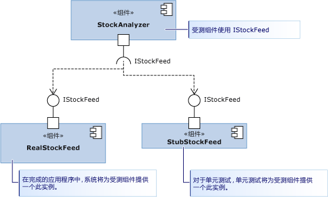

# <a name="using-stubs-to-isolate-parts-of-your-application-from-each-other-for-unit-testing"></a>使用存根针对单元测试隔离应用程序的各个部分
*存根类型*是 Microsoft Fakes 框架提供的两种技术之一，方便你轻松地将受测组件与它调用的其他组件隔离开来。 存根是一小段代码，用来在测试期间替代另一个组件。 使用存根的好处在于它能返回一致的结果，使测试更易于编写。 而且，即使在其他组件无法工作的情况下，你也可以运行这些测试。  
  
 有关 Fakes 的概述和快速入门指南，请参阅[使用 Microsoft Fakes 隔离受测代码](../test/isolating-code-under-test-with-microsoft-fakes.md)。  
  
 若要使用存根，你必须编写只使用接口而不使用类的组件，以便引用应用程序的其他部分。 这是一个很好的设计做法，因为它可以在一个部分进行更改，而没有太多必要对其他部分进行更改。 在测试时，它使你可以用存根替代实际组件。  
  
 在关系图中，StockAnalyzer 组件是我们要测试的组件。 它通常使用另一个组件，即 RealStockFeed 组件。 但是，每次调用 RealStockFeed 的方法时，RealStockFeed 都返回不同的结果，这使得很难测试 StockAnalyzer。  测试期间，我们将它替换为另一个类 - StubStockFeed。  
  
   
  
 由于存根依赖于你以这种方式构建代码的能力，因此你通常使用存根隔离应用程序的各个部分。 若要将它与不受你控制的其他程序集（如 System.dll）隔离开，你通常应使用填充码。 请参阅[使用垫片将应用与其他程序集相隔离以供单元测试使用](../test/using-shims-to-isolate-your-application-from-other-assemblies-for-unit-testing.md)。  
  
 **要求**  
  
-   Visual Studio Enterprise  
  
## <a name="in-this-topic"></a>主题内容  
  
-   [如何使用存根](#how)  
  
    -   [依赖项注入设计](#Dependency)  
  
    -   [生成存根](#GeneratingStubs)  
  
    -   [编写包含存根的测试](#WriteTest)  
  
    -   [验证参数值](#mocks)  
  
-   [用于各种类型成员的存根](../test/using-stubs-to-isolate-parts-of-your-application-from-each-other-for-unit-testing.md#BKMK_Stub_basics)  
  
    -   [方法](../test/using-stubs-to-isolate-parts-of-your-application-from-each-other-for-unit-testing.md#BKMK_Methods)  
  
    -   [属性](../test/using-stubs-to-isolate-parts-of-your-application-from-each-other-for-unit-testing.md#BKMK_Properties)  
  
    -   [事件](../test/using-stubs-to-isolate-parts-of-your-application-from-each-other-for-unit-testing.md#BKMK_Events)  
  
    -   [泛型方法](../test/using-stubs-to-isolate-parts-of-your-application-from-each-other-for-unit-testing.md#BKMK_Generic_methods)  
  
    -   [虚类的存根](../test/using-stubs-to-isolate-parts-of-your-application-from-each-other-for-unit-testing.md#BKMK_Partial_stubs)  
  
-   [调试存根](../test/using-stubs-to-isolate-parts-of-your-application-from-each-other-for-unit-testing.md#BKMK_Debugging_stubs)  
  
-   [存根限制](../test/using-stubs-to-isolate-parts-of-your-application-from-each-other-for-unit-testing.md#BKMK_Stub_limitation)  
  
-   [更改存根的默认行为](../test/using-stubs-to-isolate-parts-of-your-application-from-each-other-for-unit-testing.md#BKMK_Changing_the_default_behavior_of_stubs)  
  
##  <a name="How"></a>如何使用存根  
  
###  <a name="Dependency"></a>依赖项注入设计  
 若要使用存根，则必须将应用程序设计为使不同的组件不相互依赖，而只依赖接口定义。 各个组件在运行时连接在一起，而不是在编译时进行耦合。 这种模式可帮助制作可靠且易于更新的软件，因为更改往往不会跨组件边界传播。 即使未使用存根，也建议采用此模式。 若要编写新代码，采用[依赖项注入](http://en.wikipedia.org/wiki/Dependency_injection)模式会很容易。 如果要为现有软件编写测试，你可能必须重构它。 如果这样做可行，则可以考虑改用填充码。  
  
 让我们通过一个有趣的示例（关系图中的示例）开始此讨论。 类 StockAnalyzer 读取股票价格并生成一些有趣的结果。 它具有一些公共方法，我们要测试这些方法。 为简单起见，我们只讨论其中的一个方法，即，一个非常简单的、用于报告特定股票的当前价格的方法。 我们希望编写该方法的单元测试。 下面是测试的初稿：  
  
```csharp  
[TestMethod]  
public void TestMethod1()  
{  
    // Arrange:  
    var analyzer = new StockAnalyzer();  
    // Act:  
    var result = analyzer.GetContosoPrice();  
    // Assert:  
    Assert.AreEqual(123, result); // Why 123?  
}  
```  
  
```vb  
<TestMethod()> Public Sub TestMethod1()  
    ' Arrange:  
    Dim analyzer = New StockAnalyzer()  
    ' Act:  
    Dim result = analyzer.GetContosoPrice()  
    ' Assert:  
    Assert.AreEqual(123, result) ' Why 123?  
End Sub  
```  
  
 此测试的一个问题显而易见：股票价格时刻在变化，因此断言通常会失败。  
  
 另一个问题可能是，StockAnalyzer 使用的 StockFeed 组件仍处于开发阶段。 下面是接受测试的方法的代码的初稿：  
  
```csharp  
public int GetContosoPrice()  
{  
    var stockFeed = new StockFeed(); // NOT RECOMMENDED  
    return stockFeed.GetSharePrice("COOO");  
}  
```  
  
```vb  
Public Function GetContosoPrice()  
    Dim stockFeed = New StockFeed() ' NOT RECOMMENDED  
    Return stockFeed.GetSharePrice("COOO")  
End Function  
```  
  
 按照现在的情况来说，此方法可能无法编译或可能引发异常，因为针对 StockFeed 类的工作尚未完成。  
  
 接口注入同时解决了这两个问题。  
  
 接口注入应用了以下规则：  
  
-   应用程序的所有组件的代码始终不应该显式引用另一个组件中的类（无论是在声明中还是在 `new` 语句中）。 相反，应使用接口声明变量和参数。 组件实例只应由组件的容器创建。  
  
     在本例中，“组件”指的是一个类或你同时开发和更新的一组类。 通常，组件是一个 Visual Studio 项目中的代码。 分离一个组件中的类不太重要，因为它们是同时更新的。  
  
     从相对稳定的平台（如 System.dll）的类中分离你的组件也不是那么重要。 为所有这些类编写接口将使你的代码显得杂乱。  
  
 因此，可以使用类似下面的接口从 StockFeed 中分离 StockAnalyzer 代码，从而对其进行改进：  
  
```csharp  
public interface IStockFeed  
{  
    int GetSharePrice(string company);  
}  
  
public class StockAnalyzer  
{  
    private IStockFeed stockFeed;  
    public Analyzer(IStockFeed feed)  
    {  
        stockFeed = feed;  
    }  
    public int GetContosoPrice()  
    {  
        return stockFeed.GetSharePrice("COOO");  
    }  
}  
```  
  
```vb  
Public Interface IStockFeed  
    Function GetSharePrice(company As String) As Integer  
End Interface  
  
Public Class StockAnalyzer  
    ' StockAnalyzer can be connected to any IStockFeed:  
    Private stockFeed As IStockFeed  
    Public Sub New(feed As IStockFeed)  
        stockFeed = feed  
    End Sub    
    Public Function GetContosoPrice()  
        Return stockFeed.GetSharePrice("COOO")  
    End Function  
End Class  
  
```  
  
 在本示例中，将在构造 StockAnalyzer 时为其传递 IStockFeed 的实现。 在完成的应用程序中，初始化代码将执行以下连接：  
  
```  
analyzer = new StockAnalyzer(new StockFeed())  
```  
  
 执行此连接有更灵活的方式。 例如，StockAnalyzer 可以接受可在不同的条件下实例化 IStockFeed 的不同实现的工厂对象。  
  
###  <a name="GeneratingStubs"></a>生成存根  
 已经将要测试的类与它使用的其他组件分离。 分离不但使应用程序更加可靠和灵活，还让你能够将接受测试的组件连接到接口的存根实现以便进行测试。  
  
 你只需用常规方式将存根编写为类即可。 但是，Microsoft Fakes 提供了一个更灵活的方式来为每个测试创建最合适的存根。  
  
 若要使用存根，必须先从接口定义生成存根类型。  
  
##### <a name="adding-a-fakes-assembly"></a>添加 Fakes 程序集  
  
1.  在“解决方案资源管理器”中，展开单元测试项目的“引用”。  
  
    -   如果使用的是 Visual Basic，必须选择解决方案资源管理器工具栏中的“显示所有文件”才能看到引用列表。  
  
2.  选择包含要为其创建存根的接口定义的程序集。  
  
3.  选择快捷菜单中的“添加 Fakes 程序集”。  
  
###  <a name="WriteTest"></a>编写包含存根的测试  
  
```csharp  
[TestClass]  
class TestStockAnalyzer  
{  
    [TestMethod]  
    public void TestContosoStockPrice()  
    {  
      // Arrange:  
  
        // Create the fake stockFeed:  
        IStockFeed stockFeed =   
             new StockAnalysis.Fakes.StubIStockFeed() // Generated by Fakes.  
                 {  
                     // Define each method:  
                     // Name is original name + parameter types:  
                     GetSharePriceString = (company) => { return 1234; }  
                 };  
  
        // In the completed application, stockFeed would be a real one:  
        var componentUnderTest = new StockAnalyzer(stockFeed);  
  
      // Act:  
        int actualValue = componentUnderTest.GetContosoPrice();  
  
      // Assert:  
        Assert.AreEqual(1234, actualValue);  
    }  
    ...  
}  
```  
  
```vb  
<TestClass()> _  
Class TestStockAnalyzer  
  
    <TestMethod()> _  
    Public Sub TestContosoStockPrice()  
        ' Arrange:  
        ' Create the fake stockFeed:  
        Dim stockFeed As New StockAnalysis.Fakes.StubIStockFeed  
        With stockFeed  
            .GetSharePriceString = Function(company)  
                                       Return 1234  
                                   End Function  
        End With  
        ' In the completed application, stockFeed would be a real one:  
        Dim componentUnderTest As New StockAnalyzer(stockFeed)  
        ' Act:  
        Dim actualValue As Integer = componentUnderTest.GetContosoPrice  
        ' Assert:  
        Assert.AreEqual(1234, actualValue)  
    End Sub  
End Class  
  
```  
  
 此处最为神奇的就是类 `StubIStockFeed`。 对于所引用的程序集中的每个公共类型，Microsoft Fakes 机制将生成一个存根类。 存根类的名称派生自接口的名称，前缀为“`Fakes.Stub`”，并且在名称后面追加了参数类型名称。  
  
 另外，还会为属性的 getter 和 setter、事件和泛型方法生成存根。  
  
###  <a name="mocks"></a>验证参数值  
 你可以验证，当你的组件对另一个组件进行调用时，它是否传递正确的值。 你可以在存根中放置一个断言，或者也可以存储值并在测试的主体中验证它。 例如:   
  
```csharp  
[TestClass]  
class TestMyComponent  
{  
  
    [TestMethod]  
    public void TestVariableContosoPrice()  
    {  
     // Arrange:  
        int priceToReturn;  
        string companyCodeUsed;  
        var componentUnderTest = new StockAnalyzer(new StubIStockFeed()  
            {  
               GetSharePriceString = (company) =>   
                  {   
                     // Store the parameter value:  
                     companyCodeUsed = company;  
                     // Return the value prescribed by this test:  
                     return priceToReturn;  
                  };  
            };  
        // Set the value that will be returned by the stub:  
        priceToReturn = 345;  
  
     // Act:  
        int actualResult = componentUnderTest.GetContosoPrice();  
  
     // Assert:  
        // Verify the correct result in the usual way:  
        Assert.AreEqual(priceToReturn, actualResult);  
  
        // Verify that the component made the correct call:  
        Assert.AreEqual("COOO", companyCodeUsed);  
    }  
...}  
  
```  
  
```vb  
<TestClass()> _  
Class TestMyComponent  
    <TestMethod()> _  
    Public Sub TestVariableContosoPrice()  
        ' Arrange:  
        Dim priceToReturn As Integer  
        Dim companyCodeUsed As String = ""  
        Dim stockFeed As New StockAnalysis.Fakes.StubIStockFeed()  
        With stockFeed  
            ' Implement the interface's method:  
            .GetSharePriceString = _  
                Function(company)  
                    ' Store the parameter value:  
                    companyCodeUsed = company  
                    ' Return a fixed result:  
                    Return priceToReturn  
                End Function  
        End With  
        ' Create an object to test:  
        Dim componentUnderTest As New StockAnalyzer(stockFeed)  
        ' Set the value that will be returned by the stub:  
        priceToReturn = 345  
  
        ' Act:  
        Dim actualResult As Integer = componentUnderTest.GetContosoPrice()  
  
        ' Assert:  
        ' Verify the correct result in the usual way:  
        Assert.AreEqual(priceToReturn, actualResult)  
        ' Verify that the component made the correct call:  
        Assert.AreEqual("COOO", companyCodeUsed)  
    End Sub  
...  
End Class  
```  
  
##  <a name="BKMK_Stub_basics"></a>用于各种类型成员的存根  
  
###  <a name="BKMK_Methods"></a> 方法  
 如示例中所述，可以通过将委托附加到存根类的实例对方法进行存根处理。 存根类型的名称是从方法名称和参数名称派生而来的。 例如，假定有以下 `IMyInterface` 接口和 `MyMethod` 方法：  
  
```csharp  
// application under test  
interface IMyInterface   
{  
    int MyMethod(string value);  
}  
```  
  
 我们将存根附加到始终返回 1 的 `MyMethod`：  
  
```csharp  
// unit test code  
  var stub = new StubIMyInterface ();  
  stub.MyMethodString = (value) => 1;  
  
```  
  
 如果你没有为某个函数提供存根，Fakes 将生成一个返回返回类型的默认值的函数。 对于数字，默认值为 0，而对于类类型，默认值为 `null` (C#) 或 `Nothing` (Visual Basic)。  
  
###  <a name="BKMK_Properties"></a>属性  
 属性 getter 和 setter 作为单独的委托公开，可分别进行存根处理。 例如，考虑 `Value` 的 `IMyInterface` 属性：  
  
```csharp  
// code under test  
interface IMyInterface   
{  
    int Value { get; set; }  
}  
  
```  
  
 我们将委托附加到 `Value` 的 getter 和 setter 以模拟一个自动属性：  
  
```csharp  
// unit test code  
int i = 5;  
var stub = new StubIMyInterface();  
stub.ValueGet = () => i;  
stub.ValueSet = (value) => i = value;  
  
```  
  
 如果没有为属性的 setter 或 getter 提供存根方法，Fakes 将生成一个存储值的存根，以便让存根属性像简单变量一样工作。  
  
###  <a name="BKMK_Events"></a> 事件  
 事件将作为委托字段公开。 因此，已可通过调用事件支持字段引发已进行存根处理的事件。 让我们考虑以下要进行存根处理的接口：  
  
```csharp  
// code under test  
interface IWithEvents   
{  
    event EventHandler Changed;  
}  
```  
  
 若要引发 `Changed` 事件，我们只需调用支持委托：  
  
```csharp  
// unit test code  
  var withEvents = new StubIWithEvents();  
  // raising Changed  
  withEvents.ChangedEvent(withEvents, EventArgs.Empty);  
  
```  
  
###  <a name="BKMK_Generic_methods"></a>泛型方法  
 通过为方法的每个必需的实例化提供委托可以对泛型方法进行存根处理。 例如，假定有以下包含泛型方法的接口：  
  
```csharp  
// code under test  
interface IGenericMethod   
{  
    T GetValue<T>();  
}  
```  
  
 可以编写对 `GetValue<int>` 实例化进行存根处理的测试：  
  
```csharp  
// unit test code  
[TestMethod]  
public void TestGetValue()   
{  
    var stub = new StubIGenericMethod();  
    stub.GetValueOf1<int>(() => 5);  
  
    IGenericMethod target = stub;  
    Assert.AreEqual(5, target.GetValue<int>());  
}  
```  
  
 如果代码是为了调用具有任何其他实例化的 `GetValue<T>`，存根将只调用行为。  
  
###  <a name="BKMK_Partial_stubs"></a>虚类的存根  
 在前面的示例中，已从接口生成存根。 还可以从具有虚拟或抽象成员的类生成存根。 例如：  
  
```csharp  
// Base class in application under test  
    public abstract class MyClass  
    {  
        public abstract void DoAbstract(string x);  
        public virtual int DoVirtual(int n)  
        { return n + 42; }  
        public int DoConcrete()  
        { return 1; }  
    }  
```  
  
 在从此类生成的存根中，可以为 DoAbstract() 和 DoVirtual() 设置委托方法，但不能为 DoConcrete() 设置委托方法。  
  
```csharp  
// unit test  
  var stub = new Fakes.MyClass();  
  stub.DoAbstractString = (x) => { Assert.IsTrue(x>0); };  
  stub.DoVirtualInt32 = (n) => 10 ;  
  
```  
  
 如果没有为虚方法提供委托，Fakes 可以提供默认行为，也可以调用基类中的方法。 若要调用基方法，请设置 `CallBase` 属性：  
  
```csharp  
// unit test code  
var stub = new Fakes.MyClass();  
stub.CallBase = false;  
// No delegate set - default delegate:  
Assert.AreEqual(0, stub.DoVirtual(1));  
  
stub.CallBase = true;  
//No delegate set - calls the base:  
Assert.AreEqual(43,stub.DoVirtual(1));  
```  
  
##  <a name="BKMK_Debugging_stubs"></a>调试存根  
 存根类型旨在提供顺畅的调试体验。 默认情况下，系统会指示调试程序单步执行所有生成的代码，因此，它应该直接单步执行到附加到存根的自定义成员实现。  
  
##  <a name="BKMK_Stub_limitation"></a>存根限制  
  
1.  不支持使用指针的方法签名。  
  
2.  无法对密封类或静态方法进行存根处理，因为存根类型依赖于虚方法调度。 对于这种情况，请按照[使用垫片将应用与其他程序集相隔离以供单元测试使用](../test/using-shims-to-isolate-your-application-from-other-assemblies-for-unit-testing.md)所述，使用垫片类型。  
  
##  <a name="BKMK_Changing_the_default_behavior_of_stubs"></a>更改存根的默认行为  
 每个生成的存根类型都包含 `IStubBehavior` 接口的一个实例（通过 `IStub.InstanceBehavior` 属性）。 只要客户端调用没有附加自定义委托的成员，系统就会调用该行为。 如果该行为尚未设置，它将使用 `StubsBehaviors.Current` 属性返回的实例。 默认情况下，此属性将返回引发 `NotImplementedException` 异常的行为。  
  
 可以通过设置任何存根实例的 `InstanceBehavior` 属性来随时更改该行为。 例如，以下代码片段将更改一个不执行任何操作或返回返回类型的默认值 `default(T)` 的行为：  
  
```csharp  
// unit test code  
var stub = new StubIFileSystem();  
// return default(T) or do nothing  
stub.InstanceBehavior = StubsBehaviors.DefaultValue;  
```  
  
 还可以通过设置 `StubsBehaviors.Current` 属性，为所有尚未设置行为的存根对象全局更改行为：  
  
```csharp  
// unit test code  
//change default behavior for all stub instances  
//where the behavior has not been set  
StubBehaviors.Current =   
    BehavedBehaviors.DefaultValue;  
```  
  
## <a name="external-resources"></a>外部资源  
  
### <a name="guidance"></a>指导  
 [使用 Visual Studio 2012 测试连续交付 - 第 2 章：单元测试：测试内部](http://go.microsoft.com/fwlink/?LinkID=255188)  
  
## <a name="see-also"></a>另请参阅  
 [用 Microsoft Fakes 隔离测试代码](../test/isolating-code-under-test-with-microsoft-fakes.md)

