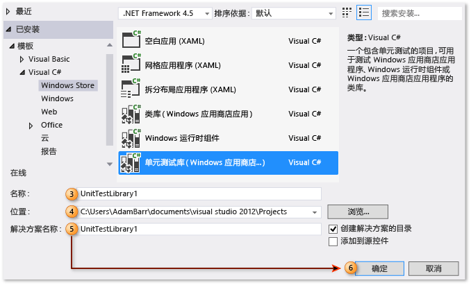
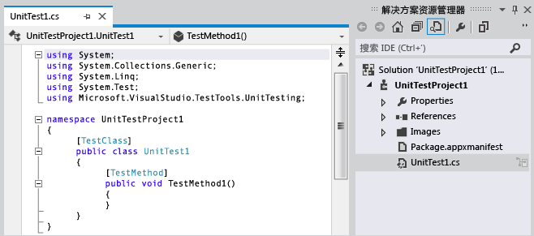
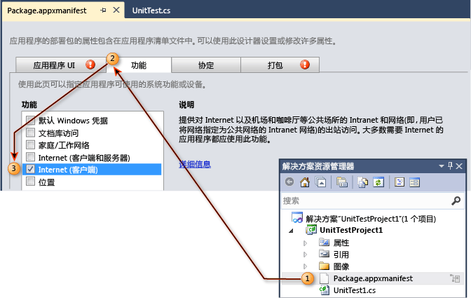
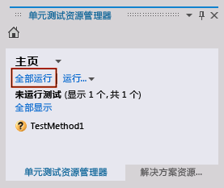
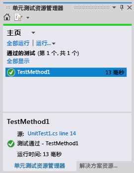

# 演练：为 Windows 应用商店应用程序创建和运行单元测试
Visual Studio 支持对托管的 [!INCLUDE[win8_appname_long](../debugger/includes/win8_appname_long_md.md)]应用进行单元测试，并包括 Visual C#、Visual Basic 和 Visual C++ 的单元测试库模板。  
  
> [!TIP]
>  有关开发 [!INCLUDE[win8_appname_long](../debugger/includes/win8_appname_long_md.md)] 应用的详细信息，请参阅 [Windows 应用商店应用入门](http://go.microsoft.com/fwlink/?LinkID=241410)。  
  
 Visual Studio 提供以下单元测试功能：  
  
-   [创建单元测试项目](#CreateAndRunUnitTestWin8Tailored_Create)  
  
-   [编辑单元测试项目清单](#CreateAndRunUnitTestWin8Tailored_Manifest)  
  
-   [单元测试编码](#CreateAndRunUnitTestWin8Tailored_Code)  
  
-   [运行单元测试](#CreateAndRunUnitTestWin8Tailored_Run)  
  
 以下过程描述为托管的 Windows 8 [!INCLUDE[win8_appname_long](../debugger/includes/win8_appname_long_md.md)]应用创建、运行和调试单元测试的步骤。  
  
## 先决条件  
 Visual Studio  
  
##  创建单元测试项目  
  
#### 为 Windows 应用商店应用创建单元测试项目  
  
1.  从 **“文件”** 菜单中选择 **“新建项目”**。  
  
     此时将显示“新建项目”对话框。  
  
2.  在“模板”之下，选择要用以创建单元测试的编程语言，然后选择关联的 [!INCLUDE[win8_appname_long](../debugger/includes/win8_appname_long_md.md)]单元测试库。 例如，选择 **“Visual C#”** ，然后选择 **“Windows 应用商店”**，再选择 **“单元测试库(Windows 应用商店应用)”**。  
  
    > [!NOTE]
    >  Visual Studio 包括 Visual C#、Visual Basic 和 Visual C++ 的单元测试库模板。  
  
3.  （可选）在“名称”文本框中，输入要用于 [!INCLUDE[win8_appname_long](../debugger/includes/win8_appname_long_md.md)]单元测试项目的名称。  
  
4.  （可选）通过在 **“位置”** 文本框中输入路径，或选择 **“浏览”** 按钮，修改项目的创建路径。  
  
5.  （可选）在 **“解决方案”** 名称文本框中，输入要用于解决方案的名称。  
  
6.  保持选中 **“创建解决方案的目录”** 选项并选择 **“确定”** 按钮。  
  
       
  
     “解决方案资源管理器”中将填充新的 [!INCLUDE[win8_appname_long](../debugger/includes/win8_appname_long_md.md)]单元测试项目，代码编辑器中显示标题为“UnitTest1”的默认单元测试。  
  
       
  
##  编辑单元测试项目清单  
 可能需要编辑单元测试项目的清单以提供所需的功能，才能运行应用程序。  
  
#### 编辑单元测试项目的 Windows 应用商店应用程序清单文件  
  
1.  在解决方案资源管理器中的新 [!INCLUDE[win8_appname_long](../debugger/includes/win8_appname_long_md.md)] 单元测试项目中，右键单击 Package.appxmanifest 文件并选择“打开”。  
  
     “清单设计器”将显示以便进行编辑。  
  
2.  在“清单设计器”中，选择 **“功能”** 选项卡。  
  
3.  在 **“功能”**下面的列表中，选择你的单元测试和所测试代码需要具备的功能。 例如，单元测试及其测试的代码需要具备访问 Internet 的功能，那么请选中 **“Internet”** 复选框。  
  
    > [!NOTE]
    >  所选功能只应包括 [!INCLUDE[win8_appname_long](../debugger/includes/win8_appname_long_md.md)]单元测试正常运行所需的功能。 这些功能完全不必包含不属于所测试 [!INCLUDE[win8_appname_long](../debugger/includes/win8_appname_long_md.md)]应用的功能，一般应是为所测试 [!INCLUDE[win8_appname_long](../debugger/includes/win8_appname_long_md.md)]应用指定的功能的子集。  
  
     有关详细信息，请参阅 [Configure a Windows 8.1 app package by using the manifest designer](http://msdn.microsoft.com/Library/24c58b7f-9c6d-41c3-b385-c1e8497d5b2d)（使用清单设计器配置 Windows 8.1 应用包）。  
  
       
  
##  单元测试编码  
  
#### Windows 应用商店应用单元测试编码  
  
1.  在“代码编辑器”中，编辑单元测试并添加测试所需的断言和逻辑。  
  
     有关详细信息，请参阅 MSDN Library 中的 [使用 Assert 类](http://go.microsoft.com/fwlink/?LinkID=224991) 。  
  
##  运行单元测试  
  
#### 生成解决方案并在“测试资源管理器”中运行单元测试  
  
1.  在 **“测试”** 菜单中，选择 **“窗口”**，然后选择 **“测试资源管理器”**。  
  
     “测试资源管理器”将显示，而不会列出你的测试。  
  
2.  从 **“生成”** 菜单中选择 **“生成解决方案”**。  
  
     现在，你的单元测试已列出。  
  
    > [!NOTE]
    >  必须生成解决方案，才能在“测试资源管理器”中更新单元测试列表。  
  
    > [!WARNING]
    >  Visual Studio 已知问题：生成测试项目之前，必须打开“测试资源管理器”。  
  
3.  在“测试资源管理器”中，选择你创建的单元测试。  
  
    > [!TIP]
    >  “测试资源管理器”在 **“源:”**旁边提供指向源代码的链接。  
  
4.  选择 **“全部运行”**。  
  
       
  
    > [!TIP]
    >  可以选择资源管理器中列出的一个或多个单元测试，然后右击并选择 **“运行选定测试”**。  
    >   
    >  此外，你也可以选择 **“调试所选测试”**、 **“打开测试”**，并使用 **“属性”** 选项。  
    >   
    >    
  
     单元测试将运行。 完成后，“测试资源管理器”会显示测试状态、运行时间并提供指向源的链接。  
  
       
  
## 外部资源  
  
### 视频  
 [第 9 频道：对使用 XAML 编写的 Windows 应用商店应用进行单元测试](http://go.microsoft.com/fwlink/?LinkId=226285)  
  
### 论坛  
 [Visual Studio 单元测试](http://go.microsoft.com/fwlink/?LinkId=224477)  
  
### MSDN Library  
 [MSDN 库 - 为现有代码创建和运行单元测试 (Visual Studio 2010)](http://go.microsoft.com/fwlink/?LinkID=223683)  
  
## 另请参阅  
 [使用 Visual Studio 测试应用商店应用](../test/testing-store-apps-with-visual-studio.md)   
 [使用 Team Foundation Build 生成并测试 Windows 应用商店应用](http://msdn.microsoft.com/Library/d0ca17bb-deae-4f3d-a18d-1a99bebceaa9)

