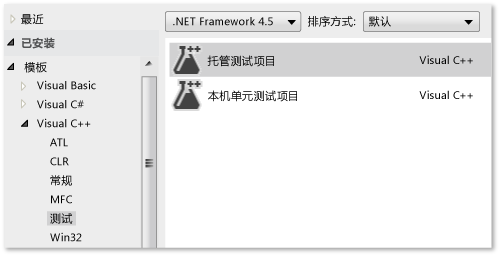
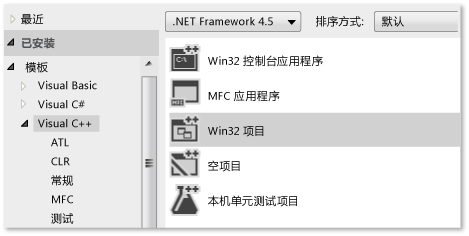
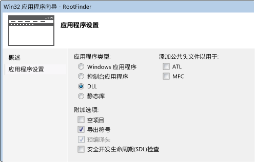
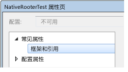
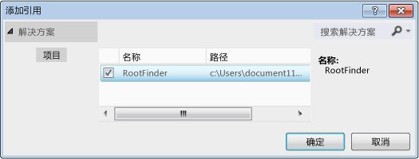
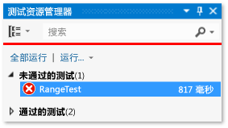
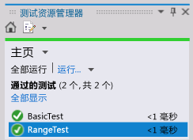
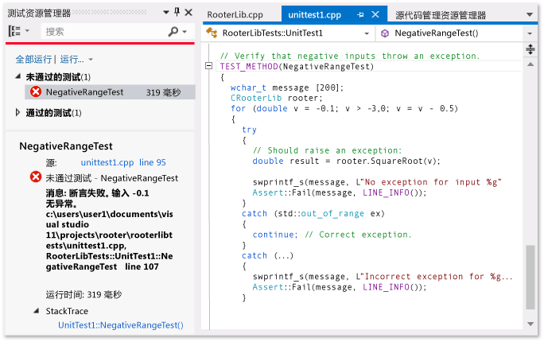
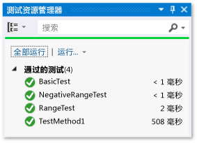

# <a name="writing-unit-tests-for-cc-with-the-microsoft-unit-testing-framework-for-c"></a>用 Microsoft 适用于 C++ 的单元测试框架编写 C/C++ 单元测试
在 Visual Studio 中，你可以为用 C++ 编写的托管代码创建单元测试。 非托管代码有时称为本机代码。  
  
 下面的过程包含基本的入门信息。 后面的部分提供一个更详细地描述各步骤的演练。  
  
### <a name="to-write-unit-tests-for-an-unmanaged-code-dll"></a>为非托管代码 DLL 编写单元测试  
  
1.  使用“本机测试项目”  模板为测试创建一个单独的 Visual Studio 项目。  
  
     项目包含一些示例测试代码。  
  
2.  使 DLL 可供测试项目访问：  
  
    -   `#include` 包含 DLL 外部访问函数声明的 `.h` 文件。  
  
         `.h` 文件应包含用 `_declspec(dllimport)` 标记的函数声明。 或者，可以使用 DEF 文件导出方法。 有关详细信息，请参阅[导入和导出](/visual-cpp/build/importing-and-exporting)。  
  
         单元测试仅可以访问从所测试 DLL 导出的函数。  
  
    -   将 DLL 项目添加到测试项目的引用中：  
  
         在测试项目中的“属性”  中，展开“通用属性” 、“框架和引用” ，然后选择“添加引用” 。  
  
3.  在测试项目中，按照以下方式使用 TEST 宏和 Assert 类，创建测试类和测试方法：  
  
    ```cpp  
    #include "stdafx.h"  
    #include <CppUnitTest.h>  
    #include "..\MyProjectUnderTest\MyCodeUnderTest.h"  
    using namespace Microsoft::VisualStudio::CppUnitTestFramework;  
    TEST_CLASS(TestClassName)  
    {  
    public:  
      TEST_METHOD(TestMethodName)  
      {  
        // Run a function under test here.  
        Assert::AreEqual(expectedValue, actualValue, L"message", LINE_INFO());  
      }  
    }  
    ```  
  
    -   `Assert` 包含几个可用于验证测试结果的静态函数。  
  
    -   `LINE_INFO()` 参数是可选的。 在没有 PDB 文件的情况下，它允许测试运行程序标识未通过测试的位置。  
  
    -   还可以编写测试设置和清理方法。 有关详细信息，请打开 `TEST_METHOD` 宏的定义，并阅读 CppUnitTest.h 中的注释  
  
    -   你无法嵌套测试类。  
  
4.  使用测试资源管理器运行测试：  
  
    1.  在 **“查看”** 菜单中，依次选择 **“其他窗口”**、 **“测试资源管理器”**。  
  
    2.  生成 Visual Studio 解决方案。  
  
    3.  在“测试资源管理器”中，选择 **“全部运行”**。  
  
    4.  在测试资源管理器中更详细地调查任何测试：  
  
        1.  选择测试名称以查看更多详细信息，例如，失败消息和堆栈跟踪。  
  
        2.  打开测试名称（例如，通过双击打开），转到失败位置或测试代码。  
  
        3.  在测试的快捷菜单中，选择“调试所选测试”  以在调试器中运行测试。  
  
##  <a name="walkthrough"></a>演练：使用测试资源管理器开发非托管 DLL  
 你可以调整此演练，以便开发自己的 DLL。 主要步骤如下所示：  
  
1.  [创建本机单元测试项目](#unitTestProject)。 这些测试是通过你开发的 DLL 在单独项目中创建的。  
  
2.  [创建 DLL 项目](#createDllProject)。 此演练将创建一个新 DLL，但测试现有 DLL 的过程类似。  
  
3.  [使 DLL 函数对测试可见](#coupleProjects)。  
  
4.  [以迭代方式扩大测试](#iterate)。 建议使用“红-绿-重构”循环，其中代码开发由测试来主导。  
  
5.  [调试失败测试](#debug)。 可以在调试模式下运行测试。  
  
6.  [在保持测试不变时重构](#refactor)。 重构是指改善代码的结构，而不更改其外部行为。 你可以通过重构来提高代码的性能、扩展性或可读性。 由于目的不是更改行为，因此，在对代码进行重构更改时不会更改测试。 测试有助于确保重构时不引入 Bug。 因此，和未进行测试相比，你可以更有信心地做出这些更改。  
  
7.  [检查覆盖率](https://msdn.microsoft.com/en-us/library/fc8hec9e.aspx)。 单元测试在执行更多代码时更加有用。 可以查看测试使用了哪些代码部分。  
  
8.  [将单元与外部资源隔离](https://msdn.microsoft.com/library/hh549174.aspx)。 通常，DLL 依赖于你开发的系统的其他组件，例如其他 DLL、数据库或远程子系统。 在测试每个单元时，使之与它的依赖项相隔离非常有用。 外部组件可能会降低测试的运行速度。 在开发期间，其他组件可能不完整。  
  
###  <a name="unitTestProject"></a> 创建本机单元测试项目  
  
1.  在“文件”  菜单上，选择“新建” 、“项目” 。  
  
     在对话框中，展开“已安装” 、“模板” 、“Visual C++” 、“测试” 。  
  
     选择“本机测试项目”  模板。  
  
     在本演练中，该测试项目的名称为 `NativeRooterTest`。  
  
       
  
2.  在新项目中，检查 **unittest1.cpp**  
  
       
  
     请注意：  
  
    -   每个测试都使用 `TEST_METHOD(YourTestName){...}`来定义。  
  
         你不必编写常规函数签名。 签名由宏 TEST_METHOD 来创建。 该宏将生成一个返回 void 的实例函数。 它还将生成返回有关测试方法的信息的静态函数。 此信息允许测试资源管理器查找方法。  
  
    -   使用 `TEST_CLASS(YourClassName){...}`将测试方法分组为各个类。  
  
         当测试运行时，将为每个测试类创建一个实例。 测试方法以未指定的顺序进行调用。 可以定义在每个模块、类或方法之前和之后调用的特殊方法。  
  
3.  验证测试是否可在资源管理器中运行：  
  
    1.  插入某些测试代码：  
  
        ```cpp  
        TEST_METHOD(TestMethod1)  
        {  
        Assert::AreEqual(1,1);  
        }  
        ```  
  
         请注意， `Assert` 类提供了几个可以用来验证测试方法结果的静态方法。  
  
    2.  在“测试”  菜单中，选择“运行”  -&gt;“全部测试” 。  
  
         将生成并运行测试。  
  
         此时将显示测试资源管理器。  
  
         测试显示在“通过的测试” 下方。  
  
           
  
###  <a name="createDllProject"></a> 创建非托管 DLL 项目  
  
1.  使用“Win32 项目”  模板，创建“Visual C++”  项目。  
  
     在本演练中，该项目的名称为 `RootFinder`。  
  
       
  
2.  在 Win32 应用程序向导中，选择“DLL”  和“导出符号”  。  
  
     “导出符号”  选项生成可用来声明导出方法的便利宏。  
  
       
  
3.  在主体 .h 文件中声明导出函数：  
  
       
  
     声明符 `__declspec(dllexport)` 会导致类的公共和受保护成员在 DLL 外可见。 有关详细信息，请参阅 [Using dllimport and dllexport in C++ Classes](/visual-cpp/cpp/using-dllimport-and-dllexport-in-cpp-classes)。  
  
4.  在主体 .cpp 文件中，添加最小的函数体：  
  
    ```cpp  
    // Find the square root of a number.  
    double CRootFinder::SquareRoot(double v)  
    {  
      return 0.0;  
    }  
    ```  
  
###  <a name="coupleProjects"></a> 将测试项目耦合到 DLL 项目  
  
1.  将 DLL 项目添加到测试项目的项目引用中：  
  
    1.  打开一个测试项目的属性，选择“通用属性” 、“框架和引用” 。  
  
           
  
    2.  选择“添加新引用” 。  
  
         在“添加引用”  对话框中，选择 DLL 项目并选择“添加” 。  
  
           
  
2.  在主体单元测试 .cpp 文件中，将 DLL 代码的 .h 文件包括在内：  
  
    ```cpp  
    #include "..\RootFinder\RootFinder.h"  
    ```  
  
3.  添加使用导出函数的基本测试：  
  
    ```cpp  
    TEST_METHOD(BasicTest)  
    {  
    CRootFinder rooter;  
    Assert::AreEqual(  
    // Expected value:  
    0.0,   
    // Actual value:  
    rooter.SquareRoot(0.0),   
    // Tolerance:  
    0.01,  
    // Message:  
    L"Basic test failed",  
    // Line number - used if there is no PDB file:  
    LINE_INFO());  
    }  
    ```  
  
4.  生成解决方案。  
  
     新测试出现在测试资源管理器中。  
  
5.  在“测试资源管理器”中，选择 **“全部运行”**。  
  
       
  
 你已设置测试和代码项目，并已验证可运行测试（运行测试项目中的函数）。 现在可以开始编写实际测试和代码。  
  
###  <a name="iterate"></a> 以迭代方式增加测试并使它们通过  
  
1.  添加新测试：  
  
    ```cpp  
    TEST_METHOD(RangeTest)  
    {  
      CRootFinder rooter;  
      for (double v = 1e-6; v < 1e6; v = v * 3.2)  
      {  
        double actual = rooter.SquareRoot(v*v);  
        Assert::AreEqual(v, actual, v/1000);  
      }  
    }  
    ```  
  
    > [!TIP]
    >  建议你不更改已通过的测试。 相反，请添加新测试，更新代码，使测试通过，然后添加其他测试，依此类推。  
    >   
    >  当用户更改其要求时，请禁用不再正确的测试。 编写新测试，并以相同的增量方式使他们每次运行一个。  
  
2.  生成解决方案，然后在测试资源管理器中选择“全部运行” 。  
  
     新未通过测试。  
  
       
  
    > [!TIP]
    >  验证每个测试是否在编写之后立即失败。 这有助于避免编写从不失败的测试这一易犯错误。  
  
3.  增强测试代码，以便新测试通过：  
  
    ```cpp  
    #include <math.h>  
    ...  
    double CRootFinder::SquareRoot(double v)  
    {  
      double result = v;  
      double diff = v;  
      while (diff > result/1000)  
      {  
        double oldResult = result;  
        result = result - (result*result - v)/(2*result);  
        diff = abs (oldResult - result);  
      }  
      return result;  
    }  
    ```  
  
4.  生成解决方案，然后在测试资源管理器中选择“全部运行” 。  
  
     两个测试均通过。  
  
       
  
    > [!TIP]
    >  通过一次添加一个测试来开发代码。 确保每次迭代后所有的测试都会通过。  
  
###  <a name="debug"></a> 调试失败测试  
  
1.  添加另一个测试：  
  
    ```cpp  
  
    #include <stdexcept>  
    ...  
    // Verify that negative inputs throw an exception.  
    TEST_METHOD(NegativeRangeTest)  
    {  
      wchar_t message[200];  
      CRootFinder rooter;  
      for (double v = -0.1; v > -3.0; v = v - 0.5)  
      {  
        try   
        {  
          // Should raise an exception:  
          double result = rooter.SquareRoot(v);  
  
          _swprintf(message, L"No exception for input %g", v);  
          Assert::Fail(message, LINE_INFO());  
        }  
        catch (std::out_of_range ex)  
        {  
          continue; // Correct exception.  
        }  
        catch (...)  
        {  
          _swprintf(message, L"Incorrect exception for %g", v);  
          Assert::Fail(message, LINE_INFO());  
        }  
      }  
    }  
    ```  
  
2.  生成解决方案并选择“全部运行” 。  
  
3.  打开（或双击）失败的测试。  
  
     失败的断言会突出显示。 失败消息会显示在测试资源管理器的详细信息窗格中。  
  
       
  
4.  若要查看未通过测试的原因，请单步调试函数：  
  
    1.  在 SquareRoot 函数的开始处设置一个断点。  
  
    2.  在失败测试的快捷菜单上，选择“调试所选测试” 。  
  
         当在断点处停止运行时，请单步调试代码。  
  
5.  在你开发的函数中插入代码：  
  
    ```cpp  
  
    #include <stdexcept>  
    ...  
    double CRootFinder::SquareRoot(double v)  
    {  
        // Validate parameter:  
        if (v < 0.0)   
        {  
          throw std::out_of_range("Can't do square roots of negatives");  
        }  
  
    ```  
  
6.  现在所有测试均通过。  
  
       
  
> [!TIP]
>  如果各个测试没有防止其以任何顺序运行的依赖项，则可使用工具栏上的 切换按钮来打开并行测试执行。 这可以显著降低运行所有测试所需的时间。  
  
###  <a name="refactor"></a> 在不更改测试的情况下重构代码  
  
1.  简化 SquareRoot 函数中的核心计算：  
  
    ```  
    // old code:  
    //   result = result - (result*result - v)/(2*result);  
    // new code:  
         result = (result + v/result)/2.0;  
  
    ```  
  
2.  生成解决方案并选择“全部运行” ，以确保未引入错误。  
  
    > [!TIP]
    >  良好的单元测试组可以让你确信在更改代码时不会引入 Bug。  
    >   
    >  将重构更改与其他更改分开。  
  
## <a name="next-steps"></a>后续步骤  
  
-   **隔离。** 大多数 DLL 依赖其他子系统，如数据库和其他 DLL。 这些其他组件通常并行开发。 若要允许在其他组件尚不可用时执行单元测试，你必须替代模拟或  
  
-   **版本验证测试。** 可以每隔固定时间在团队的生成服务器上执行测试。 这可以确保在集成多名团队成员的工作时不会引入 Bug。  
  
-   **签入测试。** 在每个团队成员向源代码管理签入代码之前，您可以强制执行某些测试。 这通常是一组完整版本验证测试中的一部分。  
  
     也可以强制实施最低级别的代码覆盖率。  
  
## <a name="see-also"></a>另请参阅  
 [向现有的 C++ 应用程序添加单元测试](../test/unit-testing-existing-cpp-applications-with-test-explorer.md)   
 [使用 Microsoft.VisualStudio.TestTools.CppUnitTestFramework](../test/using-microsoft-visualstudio-testtools-cppunittestframework.md)   
 [托管/非托管代码互操作性概述](http://msdn.microsoft.com/library/ms973872.aspx)   
 [调试本机代码](../debugger/debugging-native-code.md)   
 [演练：创建和使用动态链接库 (C++)](http://msdn.microsoft.com/Library/3ae94848-44e7-4955-bbad-7d40f493e941)   
 [导入和导出](/visual-cpp/build/importing-and-exporting)
