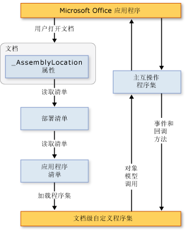

# 文档级自定义项的体系结构
  [!INCLUDE[vs_dev12](../vsto/includes/vs-dev12-md.md)] 包括用于为 Microsoft Office Word 和 Microsoft Office Excel 创建文档级自定义项的项目。 本主题介绍文档级自定义项的以下方面：  
  
-   [了解自定义项](#UnderstandingCustomizations)  
  
-   [自定义项的组成部分](#Components)  
  
-   [自定义项如何与 Microsoft Office 应用程序协同工作](#HowCustomizationsWork)  
  
 [!INCLUDE[appliesto_alldoc](../vsto/includes/appliesto-alldoc-md.md)]  
  
 有关创建文档级自定义项的一般信息，请参阅 [Office 解决方案开发概述 &#40;VSTO&#41;](../vsto/office-solutions-development-overview-vsto.md)、[Word 文档级自定义项编程入门](../vsto/getting-started-programming-document-level-customizations-for-word.md)和 [Excel 文档级自定义项编程入门](../vsto/getting-started-programming-document-level-customizations-for-excel.md)。  
  
##   了解自定义项  
 使用 Visual Studio 中的 Office 开发人员工具生成文档级自定义项时，会创建一个与特定文档关联的托管代码程序集。 带有链接程序集的文档或工作簿被认为具有托管代码扩展。 有关更多信息，请参见[设计和创建 Office 解决方案](../vsto/designing-and-creating-office-solutions.md)。  
  
 当用户打开文档时，Microsoft Office 应用程序会加载程序集。 加载程序集后，自定义项将能在文档处于打开状态时对事件做出响应。 自定义项也可以调入对象模型，以便在文档处于打开状态时自动化和扩展应用程序，并且自定义项可以使用 [!INCLUDE[dnprdnshort](../sharepoint/includes/dnprdnshort-md.md)] 中的任何类。  
  
 程序集通过应用程序的主互操作程序集与应用程序的 COM 组件进行通信。 有关详细信息，请参阅 [Office 主互操作程序集](../vsto/office-primary-interop-assemblies.md) 和 [Office 解决方案开发概述 &#40;VSTO&#41;](../vsto/office-solutions-development-overview-vsto.md)。  
  
 如果用户同时打开多个文档级自定义项，则会在不同的应用程序域中加载每个程序集。 这意味着，一个行为不正确的解决方案不会导致其他解决方案失败。 文档级自定义项设计为与单个应用程序域中的单个文档协同工作。 它们并不会用于跨文档通信。 有关应用程序域的详细信息，请参阅[应用程序域](../Topic/Application%20Domains.md)。  
  
> [!NOTE]  
>  对于使用 Visual Studio 中的 Office 开发人员工具创建的文档级自定义项，仅当应用程序由最终用户启动时才会使用它。 例如，如果通过使用自动化以编程方式启动应用程序，则自定义项可能无法按预期方式工作。  
  
### 设计时和运行时体验  
 了解文档级自定义项的体系结构有助于了解设计解决方案和运行解决方案的体验。  
  
#### 设计时  
 设计时体验包括以下步骤：  
  
1.  开发人员在 [!INCLUDE[vsprvs](../sharepoint/includes/vsprvs-md.md)] 中创建文档级项目。 该项目包括文档和在该文档后端运行的程序集。 该文档可以是已存在的文档（多半由设计人员创建），也可以是随项目创建的新文档。  
  
2.  设计人员（无论是创建项目的开发人员还是其他人员）为最终用户创建文档的外观。  
  
#### 运行时间  
 运行时体验包括下列步骤：  
  
1.  最终用户打开具有托管代码扩展的文档或工作簿。  
  
2.  文档或工作簿加载已编译的程序集。  
  
3.  当用户在文档或工作簿中工作时，程序集对事件做出响应。  
  
#### 从开发人员和最终用户的角度进行比较  
 因为开发人员主要在 [!INCLUDE[vsprvs](../sharepoint/includes/vsprvs-md.md)] 中工作，而最终用户在 Word 或 Excel 中工作，所以可通过两种方式来了解文档级自定义项。  
  
|开发人员的角度|最终用户的角度|  
|-------------|-------------|  
|开发人员使用 [!INCLUDE[vsprvs](../sharepoint/includes/vsprvs-md.md)] 编写 Word 和 Excel 可以访问的代码。   尽管看上去可能像是开发人员正在创建一个运行 Word 或 Excel 的可执行文件，但这一过程的实际工作方式却不是这样的。 文档与一个程序集关联，并包含指向该程序集的指针。 打开文档时，Word 或 Excel 会定位该程序集并针对所有已处理的事件运行代码。|使用该解决方案的人员只需像打开任何其他 Microsoft Office 文件一样打开文档或工作簿（或根据模板创建新文档）即可。   程序集在文档或工作簿中提供自定义项，例如使用当前数据自动填充它，或显示对话框以请求输入信息。|  
  
### 文档级自定义项支持的文档格式  
 在创建自定义项项目时，可以选择想要在项目中使用的文档的格式。 有关详细信息，请参阅[如何：在 Visual Studio 中创建 Office 项目](../vsto/how-to-create-office-projects-in-visual-studio.md)。  
  
 下表列出了可在 Excel 和 Word 的文档级自定义项中使用的文档格式。  
  
|Excel|字|  
|-----------|-------|  
|Excel 工作簿 \(.xlsx\)   启用宏的 Excel 工作簿 \(.xlsm\)   Excel 二进制工作簿 \(.xlsb\)   Excel 97\-2003 工作簿 \(.xls\)   Excel 模板 \(.xltx\)   启用宏的 Excel 模板 \(.xltm\)   Excel 97\-2003 模板 \(.xlt\)|Word 文档 \(.docx\)   启用宏的 Word 文档 \(.docm\)   Word 97\-2003 文档 \(.doc\)   Word 模板 \(.dotx\)   启用宏的 Word 模板 \(.dotm\)   Word 97\-2003 模板 \(.dot\)|  
  
 只应为格式受支持的文档设计托管代码扩展。 否则，在应用程序中打开文档时，可能无法引发某些事件。 例如，如果将托管代码扩展与保存为 Excel XML 电子表格格式或网页（.htm；.html）格式的工作簿一起使用，则不会引发 <xref:Microsoft.Office.Tools.Excel.Workbook.Open> 事件。  
  
### 对具有 .xml 文件扩展名的 Word 文档的支持  
 文档级项目模板不允许基于下列文件格式创建项目：  
  
-   Word XML 文档 \(\*xml\)。  
  
-   Word 2003 XML 文档 \(\*xml\)。  
  
 如果希望最终用户在这些文件格式中使用自定义项，请生成并部署使用上表中指定的某个受支持文件格式的自定义项。 安装该自定义项后，最终用户可以用 Word XML 文档 \(\*xml\) 格式或 Word 2003 XML 文档 \(\*xml\) 格式保存文档，并且自定义项将继续按预期方式工作。  
  
##   自定义项的组成部分  
 自定义项的主要组成部分是文档和程序集。 除了这些组成部分外，还有一些其他部件在 Microsoft Office 应用程序发现并加载自定义项的过程中扮演着重要角色。  
  
### 部署清单和应用程序清单  
 自定义项使用部署清单和应用程序清单来标识和加载自定义项程序集的最新版本。 部署清单指向当前应用程序清单。 应用程序清单指向自定义项程序集，并指定要在该程序集中执行的入口点类。 有关详细信息，请参阅[Office 解决方案中的应用程序和部署清单](../vsto/application-and-deployment-manifests-in-office-solutions.md)。  
  
### Visual Studio Tools for Office Runtime  
 若要运行使用 Visual Studio 中的 Office 开发人员工具创建的文档级自定义项，最终用户计算机必须安装 [!INCLUDE[vsto_runtime](../vsto/includes/vsto-runtime-md.md)]。[!INCLUDE[vsto_runtime](../vsto/includes/vsto-runtime-md.md)] 包括用于加载自定义项程序集的非托管组件，同时还包括一组托管程序集。 这些托管程序集提供自定义项代码用于自动化和扩展主机应用程序的对象模型。  
  
 有关更多信息，请参见[Visual Studio Tools for Office Runtime 概述](../vsto/visual-studio-tools-for-office-runtime-overview.md)。  
  
##   自定义项如何与 Microsoft Office 应用程序协同工作  
 当用户打开属于 Microsoft Office 自定义项的文档时，应用程序将使用链接到文档的部署清单来查找并加载自定义项程序集的最新版本。 部署清单的位置存储在名为 \_AssemblyLocation 的自定义文档属性中。 标识此位置的字符串在生成解决方案时插入该属性中。  
  
 部署清单指向应用程序清单，后者随后指向最新的程序集。 有关更多信息，请参见[Office 解决方案中的应用程序和部署清单](../vsto/application-and-deployment-manifests-in-office-solutions.md)。  
  
 下图展示了文档级自定义项的基本体系结构。  
  
   
  
> [!NOTE]  
>  在面向 [!INCLUDE[net_v40_short](../sharepoint/includes/net-v40-short-md.md)] 的 Office 解决方案中，解决方案通过使用嵌入解决方案程序集中的主互操作程序集 \(PIA\) 类型信息调入主机应用程序的对象模型，而不直接调入 PIA。 有关详细信息，请参阅[设计和创建 Office 解决方案](../vsto/designing-and-creating-office-solutions.md)。  
  
### 加载过程  
 当用户打开属于 Microsoft Office 解决方案的文档时，将执行以下步骤。  
  
1.  Microsoft Office 应用程序检查自定义文档属性，以确定是否有与文档关联的托管代码扩展。 有关更多信息，请参见[自定义文档属性概述](../vsto/custom-document-properties-overview.md)。  
  
2.  如果存在托管代码扩展，则应用程序将加载 VSTOEE.dll，后者将加载 VSTOLoader.dll。 这些非托管 DLL 是 Visual Studio 2010 Tools for Office Runtime 的加载程序组件。 有关详细信息，请参阅[Visual Studio Tools for Office Runtime 概述](../vsto/visual-studio-tools-for-office-runtime-overview.md)。  
  
3.  VSTOLoader.dll 加载 [!INCLUDE[dnprdnshort](../sharepoint/includes/dnprdnshort-md.md)] 并启动 [!INCLUDE[vsto_runtime](../vsto/includes/vsto-runtime-md.md)] 的托管部分。  
  
4.  如果从本地计算机以外的位置打开文档，[!INCLUDE[vsto_runtime](../vsto/includes/vsto-runtime-md.md)] 将验证文档的位置是否位于该特定 Office 应用程序的“信任中心设置”中的“受信任位置”列表中。 如果文档位置不在受信任位置中，自定义项将不会得到信任，并且加载过程将在此处停止。  
  
5.  [!INCLUDE[vsto_runtime](../vsto/includes/vsto-runtime-md.md)] 将安装解决方案（如果尚未安装），下载最新的应用程序和部署清单，并执行一系列安全检查。 有关详细信息，请参阅[保护 Office 解决方案的安全](../vsto/securing-office-solutions.md)。  
  
6.  如果自定义项受信任，可以运行，则 [!INCLUDE[vsto_runtime](../vsto/includes/vsto-runtime-md.md)] 将使用部署清单和应用程序清单来检查程序集更新。 如果集有新版本的程序集可用，则运行时会将新版本的程序集下载到客户端计算机上的 [!INCLUDE[ndptecclick](../vsto/includes/ndptecclick-md.md)] 缓存中。 有关更多信息，请参见[部署 Office 解决方案](../vsto/deploying-an-office-solution.md)。  
  
7.  [!INCLUDE[vsto_runtime](../vsto/includes/vsto-runtime-md.md)] 将创建一个要在其中加载自定义项程序集的新应用程序域。  
  
8.  [!INCLUDE[vsto_runtime](../vsto/includes/vsto-runtime-md.md)] 将自定义项程序集加载到应用程序域中。  
  
9. [!INCLUDE[vsto_runtime](../vsto/includes/vsto-runtime-md.md)] 将在自定义项程序集中调用 **Startup** 事件处理程序。 有关详细信息，请参阅[Office 项目中的事件](../vsto/events-in-office-projects.md)。  
  
## 请参阅  
 [Visual Studio 中 Office 解决方案的体系结构](../vsto/architecture-of-office-solutions-in-visual-studio.md)   
 [VSTO 外接程序的体系结构](../vsto/architecture-of-vsto-add-ins.md)   
 [Visual Studio Tools for Office Runtime 概述](../vsto/visual-studio-tools-for-office-runtime-overview.md)   
 [保护 Office 解决方案的安全](../vsto/securing-office-solutions.md)   
 [设计和创建 Office 解决方案](../vsto/designing-and-creating-office-solutions.md)   
 [自定义文档属性概述](../vsto/custom-document-properties-overview.md)   
 [文档级自定义项中的缓存数据](../vsto/cached-data-in-document-level-customizations.md)  
  
  