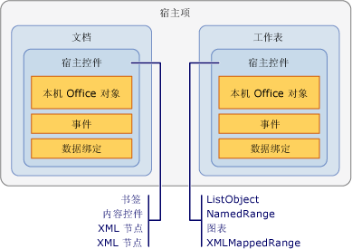

# 宿主项和宿主控件概述
  宿主项和宿主控件是帮助向通过使用 Visual Studio 中的 Office 开发工具创建的 Office 解决方案提供编程模型的类型。 宿主项和宿主控件与基于 COM 的 Microsoft Office Word 和 Microsoft Office Excel 的对象模型交互，但更像与托管对象（如 Windows 窗体控件）进行交互。  
  
 [!INCLUDE[appliesto_controls](../vsto/includes/appliesto-controls-md.md)]  
  
## 宿主项  
 宿主项是位于 Office 项目中的对象模型层次结构顶部的类型。[!INCLUDE[vsto_runtime](../vsto/includes/vsto-runtime-md.md)] 为 Word 和 Excel 解决方案定义了以下宿主项：  
  
-   <xref:Microsoft.Office.Tools.Word.Document>  
  
-   <xref:Microsoft.Office.Tools.Excel.Workbook>  
  
-   <xref:Microsoft.Office.Tools.Excel.Worksheet>  
  
-   <xref:Microsoft.Office.Tools.Excel.ChartSheet>  
  
 上述每种类型扩展了存在于本机 Word 或 Excel 对象模型的对象，称为*本机 Office 对象*。 例如，<xref:Microsoft.Office.Tools.Word.Document> 宿主项扩展了 Word 的主互操作程序集中定义的 <xref:Microsoft.Office.Interop.Word.Document> 对象。  
  
 宿主项通常具有与相应的 Office 对象相同的基本功能，但增强了以下功能：  
  
-   承载托管控件（包括宿主控件和 Windows 窗体控件）的功能。  
  
-   更丰富的事件模型。 本机 Word 和 Excel 对象模型中的某些文档、工作簿和工作表事件仅在应用程序级引发。 主机项可提供这些文档级事件，因此，更易于处理特定文档的事件。  
  
### 了解文档级项目中的宿主项  
 在文档级项目中，宿主项提供了代码的入口点，并且它们的设计器可帮助你开发解决方案。  
  
 <xref:Microsoft.Office.Tools.Word.Document> 和 <xref:Microsoft.Office.Tools.Excel.Worksheet> 宿主项具有作为文档或工作表的可视表示形式的关联设计器，例如 Windows 窗体设计器。 你可以使用此设计器直接在 Word 或 Excel 中修改文档或工作表的内容，以及将控件拖动到设计图面上。 有关详细信息，请参阅 [文档宿主项](../vsto/document-host-item.md) 和 [工作表宿主项](../vsto/worksheet-host-item.md)。  
  
 <xref:Microsoft.Office.Tools.Excel.Workbook> 宿主项并不会充当具有用户界面的控件的容器。 相反，此宿主项的设计器充当组件栏，这使你可以将一个组件（如 <xref:System.Data.DataSet>拖动到其设计图面上。 有关详细信息，请参阅[工作簿宿主项](../vsto/workbook-host-item.md)。  
  
 宿主项不能在文档级项目中以编程方式创建。 请改用 `ThisDocument``ThisWorkbook` 或 `Sheet`*n* 类，Visual Studio 会在设计时间在你的项目中自动生成这些类。 这些生成的类派生自宿主项，并提供代码的入口点。 有关更多信息，请参见[宿主项和宿主控件的编程限制](../vsto/programmatic-limitations-of-host-items-and-host-controls.md)。  
  
### 了解 VSTO 外接程序项目中的宿主项  
 在创建 VSTO 外接程序时，默认情况下你没有访问任何宿主项的权限。 但是，可以在运行时在 Word 和 Excel VSTO 加载项中生成 <xref:Microsoft.Office.Tools.Word.Document>、<xref:Microsoft.Office.Tools.Excel.Workbook> 和 <xref:Microsoft.Office.Tools.Excel.Worksheet> 宿主项。  
  
 生成宿主项后，可以执行诸如向文档添加控件等任务。 有关更多信息，请参见[在运行时在 VSTO 外接程序中扩展 Word 文档和 Excel 工作簿](../vsto/extending-word-documents-and-excel-workbooks-in-vsto-add-ins-at-run-time.md)。  
  
## 宿主控件  
 宿主控件扩展了 Word 和 Excel 对象模型中的各种用户界面 \(UI\) 对象，例如 Microsoft.Office.Interop.Word.ContentControl 和 <xref:Microsoft.Office.Interop.Excel.Range> 对象。  
  
 以下宿主控件可用于 Excel 项目：  
  
-   [Chart 控件](../vsto/chart-control.md)  
  
-   [ListObject 控件](../vsto/listobject-control.md)  
  
-   [NamedRange 控件](../vsto/namedrange-control.md)  
  
-   [XmlMappedRange 控件](../vsto/xmlmappedrange-control.md)  
  
 以下宿主控件可用于 Word 项目：  
  
-   [Bookmark 控件](../vsto/bookmark-control.md)  
  
-   [内容控件](../vsto/content-controls.md)  
  
-   [XMLNode 控件](../vsto/xmlnode-control.md)  
  
-   [XMLNodes 控件](../vsto/xmlnodes-control.md)  
  
 添加到 Office 文档的宿主控件的行为类似于本机的 Office 对象；但是，宿主控件具有包括事件和数据绑定功能的附加功能。 例如，要捕获 Excel 中的本机 <xref:Microsoft.Office.Interop.Excel.Range> 对象的事件时，必须首先处理工作表的更改事件。 然后必须确定 <xref:Microsoft.Office.Interop.Excel.Range> 中是否发生了更改。 与此相反，<xref:Microsoft.Office.Tools.Excel.NamedRange> 宿主控件具有可直接处理的 <xref:Microsoft.Office.Tools.Excel.NamedRange.Change> 事件。  
  
 宿主项和宿主控件之间的关系非常类似于 Windows 窗体和 Windows 窗体控件之间的关系。 就像你将文本框控件置于 Windows 窗体上，将 <xref:Microsoft.Office.Tools.Excel.NamedRange> 控件置于 <xref:Microsoft.Office.Tools.Excel.Worksheet> 宿主项上。 下图显示宿主项和宿主控件之间的关系。  
  
   
  
 您还可以通过将 Windows 窗体控件添加到 Word 和 Excel 文档图面，从而在 Office 解决方案中使用 Windows 窗体控件。 有关更多信息，请参见[Office 文档上的 Windows 窗体控件概述](../vsto/windows-forms-controls-on-office-documents-overview.md)。  
  
> [!NOTE]  
>  不支持将宿主控件或 Windows 窗体控件添加到 Word 子文档。  
  
### 将宿主控件添加到你的文档  
 在文档级项目中，你可以在设计时通过以下方式将宿主控件添加到 Word 文档或 Excel 工作表：  
  
-   在设计时按与添加本机对象相同的方式将宿主控件添加到你的文档。  
  
-   将宿主控件从“工具箱”拖动到文档和工作表。 Excel 宿主控件位于 Excel 项目中的“Excel 控件”选项卡，Word 宿主控件位于 Word 项目中的“Word 控件”选项卡。  
  
-   将宿主控件从“数据源”窗口拖动到文档和工作表。 这使你能够添加已绑定到数据的控件。 有关详细信息，请参阅[将数据绑定到 Office 解决方案中的控件](../vsto/binding-data-to-controls-in-office-solutions.md)。  
  
 在文档级别和 VSTO 外接程序项目中，可以在运行时将某些宿主控件添加到文档。 有关详细信息，请参阅[在运行时向 Office 文档添加控件](../vsto/adding-controls-to-office-documents-at-run-time.md)。  
  
 有关如何将宿主控件添加到文档的详细信息，请参阅以下主题：  
  
-   [如何：向工作表添加 Chart 控件](../vsto/how-to-add-chart-controls-to-worksheets.md)  
  
-   [如何：向工作表添加 ListObject 控件](../vsto/how-to-add-listobject-controls-to-worksheets.md)  
  
-   [如何：向工作表添加 NamedRange 控件](../vsto/how-to-add-namedrange-controls-to-worksheets.md)  
  
-   [如何：向工作表添加 XMLMappedRange 控件](../vsto/how-to-add-xmlmappedrange-controls-to-worksheets.md)  
  
-   [如何：向 Word 文档添加书签控件](../vsto/how-to-add-bookmark-controls-to-word-documents.md)  
  
-   [如何：向 Word 文档添加内容控件](../vsto/how-to-add-content-controls-to-word-documents.md)  
  
-   [如何：向 Word 文档添加 XMLNode 控件](../vsto/how-to-add-xmlnode-controls-to-word-documents.md)  
  
-   [如何：向 Word 文档添加 XMLNodes 控件](../vsto/how-to-add-xmlnodes-controls-to-word-documents.md)  
  
### 命名宿主控件  
 将宿主控件从“工具箱”拖动到文档时，将自动使用末端尾号递增的控件类型对该控件命名。 例如，书签命名为 **bookmark1**、**bookmark2**，依此类推。 如果使用 Word 或 Excel 的本机功能来添加控件，你可以在创建此控件时指定特定名称。 也可以通过在“属性”窗口更改“名称”属性的值来重命名你的控件。  
  
> [!NOTE]  
>  不能使用保留字来命名宿主控件。 例如，如果你将 <xref:Microsoft.Office.Tools.Excel.NamedRange> 控件添加到工作表，并将名称更改为 **System**，生成项目时将出现错误。  
  
### 删除宿主控件  
 在文档级项目中，你可以通过选择 Excel 工作表或 Word 文档上的控件，然后“删除”键，在设计时删除宿主控件。 但是，在 Excel 中必须使用“定义名称”对话框来删除 <xref:Microsoft.Office.Tools.Excel.NamedRange> 控件。  
  
 如果在设计时向文档添加宿主控件，则不应在运行时以编程方式删除它，因为下次在代码中尝试使用控件时，将引发异常。 宿主控件的 `Delete` 方法仅删除在运行时添加到文档的宿主控件。 如果调用在设计时创建的宿主控件的 `Delete` 方法，将引发异常。  
  
 例如，如果以编程方式添加到工作表，则 <xref:Microsoft.Office.Tools.Excel.NamedRange.Delete%2A> 方法 <xref:Microsoft.Office.Tools.Excel.NamedRange> 仅成功删除 <xref:Microsoft.Office.Tools.Excel.NamedRange>，这被称为动态创建宿主控件。 也可以通过将控件名称传递到 <xref:Microsoft.Office.Tools.Excel.Worksheet.Controls%2A> 或 <xref:Microsoft.Office.Tools.Word.Document.Controls%2A> 属性的 `Remove` 方法来删除动态创建的宿主控件。 有关详细信息，请参阅[在运行时向 Office 文档添加控件](../vsto/adding-controls-to-office-documents-at-run-time.md)。  
  
 如果最终用户在运行时从文档中删除宿主控件，该解决方案可能会以意外的方式失败。 你可以使用 Word 和 Excel 中的文档保护功能来防止删除宿主控件。 有关详细信息，请参阅[Office 开发示例和演练](../vsto/office-development-samples-and-walkthroughs.md)。  
  
> [!NOTE]  
>  请不要在文档或工作表的 `Shutdown` 事件处理程序过程中以编程方式删除控件。 发生 `Shutdown` 事件时，UI 元素将不再可用。 如果要在应用程序关闭之前删除控件，请将你的代码添加到另一个事件处理程序中，如 `BeforeClose` 或 `BeforeSave`。  
  
### 针对宿主控件事件进行编程  
 宿主控件扩展 Office 对象的一种方法是通过添加事件。 例如，在 Excel 中的 <xref:Microsoft.Office.Interop.Excel.Range> 对象和在 Word 中的 <xref:Microsoft.Office.Interop.Word.Bookmark> 对象不具有事件，但 [!INCLUDE[vsto_runtime](../vsto/includes/vsto-runtime-md.md)] 通过添加可编程事件来扩展这些对象。 你可以用访问 Windows 窗体上控件的事件的方式对这些事件进行访问和编码：通过 Visual Basic 中的事件下拉列表和 C\# 中的事件属性页。 有关更多信息，请参见[演练：根据 NamedRange 控件的事件进行编程](../vsto/walkthrough-programming-against-events-of-a-namedrange-control.md)。  
  
> [!NOTE]  
>  不应将 Excel 中 <xref:Microsoft.Office.Interop.Excel.Application> 对象的 <xref:Microsoft.Office.Interop.Excel._Application.EnableEvents%2A> 属性设置为 **false**。 将此属性设置为 **false** 可防止 Excel 引发任何事件，包括宿主控件的事件。  
  
## 请参阅  
 [宿主项和宿主控件的编程限制](../vsto/programmatic-limitations-of-host-items-and-host-controls.md)   
 [VSTO 外接程序编程](../vsto/programming-vsto-add-ins.md)   
 [对文档级自定义项进行编程](../vsto/programming-document-level-customizations.md)   
 [使用扩展对象实现 Word 自动化](../vsto/automating-word-by-using-extended-objects.md)   
 [使用扩展对象实现 Excel 自动化](../vsto/automating-excel-by-using-extended-objects.md)   
 [Office 文档上的控件](../vsto/controls-on-office-documents.md)   
 [将数据绑定到 Office 解决方案中的控件](../vsto/binding-data-to-controls-in-office-solutions.md)  
  
  