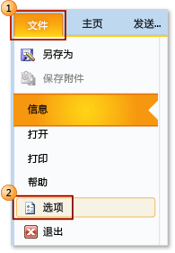
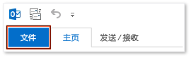
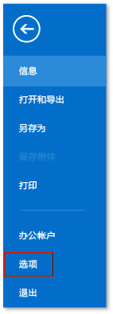
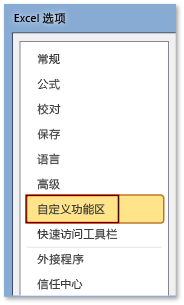
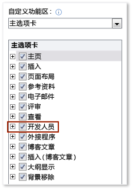

# 如何：在功能区上显示“开发人员”选项卡
  若要访问 Office 应用程序功能区中的**“开发工具”**选项卡，你必须将它配置为显示该选项卡，因为它在默认情况下不会出现。  例如，如果要向 Word 的文档级自定义项添加一个 <xref:Microsoft.Office.Tools.Word.GroupContentControl>，则必须显示该选项卡。  
  
> [!NOTE]  
>  本指南仅适用于 Office 2010 或更高版本的应用程序。  如果要在 2007 Microsoft Office System 中显示此选项卡，请参见本主题的以下版本：[如何：在功能区上显示“开发工具”选项卡](http://msdn.microsoft.com/library/bb608625(v=vs.90).aspx)。  
  
 [!INCLUDE[appliesto_ribbon](../vsto/includes/appliesto-ribbon-md.md)]  
  
> [!NOTE]  
>  Access 没有**“开发工具”**选项卡。  
  
### 显示“开发工具”选项卡  
  
1.  启动本主题支持的任何 Office 应用程序。  请参见本主题前面部分的**适用于：**说明。  
  
2.  在**“文件”**选项卡上，选择**“选项”**按钮。  
  
     下图显示 Office 2010 中的**“文件”**选项卡和**“选项”**按钮。  
  
       
  
     下图显示 Office 2013 中的**“文件”**选项卡。  
  
       
  
     下图显示 Office 2013 中的**“选项”**按钮卡。  
  
       
  
3.  在*“ApplicationName* **选项”**对话框中，选择**“自定义功能区”**按钮。  
  
     下图显示 Excel 2010 中的**“选项”**对话框和**“自定义功能区”**按钮。  此按钮的位置在本主题顶部附近“适用于”部分中列出的所有其他应用程序中是类似的。  
  
       
  
4.  在主选项卡的列表中，选中**“开发工具”**复选框。  
  
     下图显示 Word 2010 和 [!INCLUDE[Word_15_short](../vsto/includes/word-15-short-md.md)] 中的**“开发工具”**复选框。  此复选框的位置在本主题顶部附近“适用于”部分中列出的所有其他应用程序中是类似的。  
  
       
  
5.  选择**“确定”**按钮关闭**“选项”**对话框。  
  
## 请参阅  
 [Office UI 自定义](../vsto/office-ui-customization.md)  
  
  