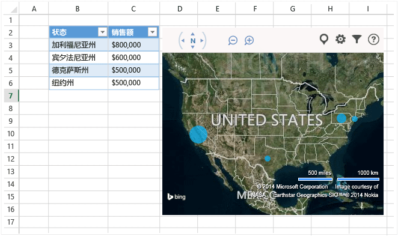

# Visual Studio 中的 Office 和 SharePoint 开发
  可以通过创建用户从 [Office 应用商店](https://store.office.com/)或组织目录中下载的轻量级应用程序或外接程序来扩展 Microsoft Office 和 SharePoint，或者通过创建用户在计算机上安装的基于 .NET Framework 的解决方案来扩展。  
  
 本主题内容：  
  
-   [创建 Office 和 SharePoint 的外接程序](#Apps)  
  
-   [创建一个 VSTO 外接程序](#Add-ins)  
  
-   [创建 SharePoint 解决方案](#Solutions)  
  
##   创建 Office 和 SharePoint 的外接程序  
 Office 2013 和 SharePoint 2013 引入了一个新的外接程序模型，有助于生成、分发和货币化那些扩展 Office 和 SharePoint 的外接程序。  这些外接程序可以在 Office 或 SharePoint 内在线运行，用户可以从多种设备上与它们进行交互。  
  
 了解如何使用全新 [Office 外接程序模型](https://msdn.microsoft.com/library/office/jj220082.aspx)来扩展你的用户的 Office 体验。  
  
 与 VSTO 外接程序和解决方案相比，这些外接程序的需求量很小，几乎可以使用任何 Web 编程技术（例如 HTML5、JavaScript、CSS3 和 XML）生成。  若要开始，请使用 Visual Studio 中的 Office 开发人员工具，或使用代码名为“Napa Office 365 开发工具”的基于 Web 的轻量级工具，通过这些工具，可以创建项目、编写代码并在浏览器中运行外接程序。  
  
   
  
 **了解更多信息**  
  
|到|查看|  
|-------|--------|  
|了解有关 Napa Office 365 开发工具的详细信息。|[Napa Office 365 开发工具](https://msdn.microsoft.com/library/dn974046.aspx)|  
  
### 生成 Office 外接程序  
 若要扩展 Office 的功能，可生成 Office 外接程序。 它基本上是一个托管在 Office 应用程序（如 Excel、Word、Outlook 和 PowerPoint）中的网页。 你的应用程序可以将功能添加到文档、工作表、电子邮件、约会、演示文稿和项目中。  
  
 你可以在 Office 应用商店出售你的应用程序。  借助 [Office 应用商店](https://store.office.com/)，可以轻松将你的外接程序货币化、管理更新和跟踪遥测。 你也可以通过 SharePoint 中或 Exchange 服务器上的应用程序目录向用户发布你的应用程序。  
  
 以下适用于 Office 的应用程序会在 Bing 地图中显示工作表数据。  
  
   
  
 **了解更多信息**  
  
|到|查看|  
|-------|--------|  
|了解有关 Office 外接程序的详细信息，然后生成一个外接程序。|[Office 外接程序](http://msdn.microsoft.com/office/dn448457)|  
|比较你可用于扩展 Office 的不同方式，然后决定应该使用应用还是 Office 外接程序。|[Office 外接程序、VSTO 和 VBA 的路线图](http://blogs.msdn.com/b/officeapps/archive/2013/06/18/roadmap-for-apps-for-office-vsto-and-vba.aspx)|  
|了解有关 Napa Office 365 开发工具的详细信息。|[Napa Office 365 开发工具](https://msdn.microsoft.com/library/dn974046.aspx)|  
  
### 生成 SharePoint 外接程序  
 若要为你的用户扩展 SharePoint，可生成 SharePoint 外接程序。 适用于 SharePoint 的应用程序是一个可满足用户或业务需求的小且易于使用的独立应用程序。  
  
 可以在 [Office 应用商店](https://store.office.com/)中出售适用于 SharePoint 的应用程序。 也可以通过 SharePoint 中的外接程序目录向用户发布你的外接程序。  网站所有者可以在其 SharePoint 网站上安装、升级和卸载你的外接程序，而无需场服务器或网站集管理员的帮助。  
  
 下例介绍了有助于用户管理商业伙伴的适用于 SharePoint 的应用程序。  
  
   
  
 **了解更多信息**  
  
|到|查看|  
|-------|--------|  
|了解有关 SharePoint 外接程序的详细信息，然后生成一个外接程序。|[SharePoint 外接程序](https://msdn.microsoft.com/library/office/fp179930.aspx)|  
|比较 SharePoint 外接程序和传统的 SharePoint 解决方案。|[SharePoint 外接程序与 SharePoint 解决方案相比较](http://msdn.microsoft.com/library/office/jj163114.aspx)|  
|选择是生成 SharePoint 外接程序还是 SharePoint 解决方案。|[在 SharePoint 外接程序和 SharePoint 解决方案之间做出选择](https://msdn.microsoft.com/library/office/jj163114.aspx)|  
|了解有关 Napa Office 365 开发工具的详细信息。|[Napa Office 365 开发工具](https://msdn.microsoft.com/library/dn974046.aspx)|  
  
##   创建一个 VSTO 外接程序  
 创建 VSTO 外接程序以面向 Office 2007 或 Office 2010，或者扩展 Office 2013 和 Office 2016，实现 Office 外接程序无法实现的功能。 VSTO 外接程序只能在桌面上运行。 用户必须安装 VSTO 外接程序，因此要对其进行部署并提供支持通常就更加困难。  但是，VSTO 外接程序可以与 Office 更紧密地集成。 例如，可以向 Office 功能区添加选项卡和控件并执行高级自动化任务，例如合并文档或修改图表。 你可以借助 .NET Framework 并使用 C\# 和 Visual Basic 与 Office 对象进行交互。  
  
 以下示例是关于 VSTO 外接程序的功能介绍。 该 VSTO 外接程序向 PowerPoint 添加了多个功能区控件、一个自定义任务窗格和一个对话框。  
  
   
  
 **了解更多信息**  
  
|到|读取|  
|-------|--------|  
|比较可用于扩展 Office 的不同方式，然后决定应该使用 VSTO 外接程序还是 Office 外接程序。|[Office 外接程序、VSTO 和 VBA 的路线图](http://blogs.msdn.com/b/officeapps/archive/2013/06/18/roadmap-for-apps-for-office-vsto-and-vba.aspx)|  
|创建一个 VSTO 外接程序。|[使用 Visual Studio 的 VSTO 外接程序生成](https://msdn.microsoft.com/library/jj620922.aspx)|  
  
##   创建 SharePoint 解决方案  
 创建 SharePoint 解决方案以面向 SharePoint Foundation 2010 和 SharePoint Server 2010，或者采用 SharePoint 外接程序无法实现的其他方式扩展 SharePoint 2013 和 SharePoint 2016。  
  
 SharePoint 解决方案需要内部部署的 SharePoint 场服务器。 管理员必须安装它们，而且由于是在 SharePoint 中执行解决方案，因此可能会影响服务器性能。 但是，解决方案提供了对 SharePoint 对象更深层次的访问。 此外，当你构建 SharePoint 解决方案时，你可以借助 .NET Framework 并使用 C\# 和 Visual Basic 与 SharePoint 对象进行交互。  
  
 **了解更多信息**  
  
|到|查看|  
|-------|--------|  
|比较 SharePoint 解决方案与 SharePoint 外接程序。|[SharePoint 外接程序与 SharePoint 解决方案相比较](http://msdn.microsoft.com/library/office/jj163114.aspx)|  
|创建 SharePoint 解决方案。|[创建 SharePoint 解决方案](../sharepoint/create-sharepoint-solutions.md)|  
  
  