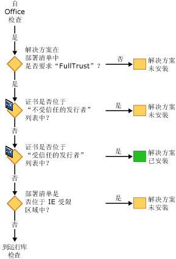
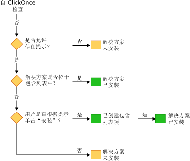

# 保护 Office 解决方案的安全
  Office 解决方案的安全模型涉及以下几项技术：[!INCLUDE[vsto_runtime](../vsto/includes/vsto-runtime-md.md)]、[!INCLUDE[ndptecclick](../vsto/includes/ndptecclick-md.md)]、Microsoft Office 中的信任中心以及 Internet Explorer 受限站点区域。 以下各节介绍不同安全功能的工作方式：  
  
-   [向 Office 解决方案授予信任](#GrantingTrustToSolutions)  
  
-   [向文档授予信任](#GrantingTrustToDocuments)  
  
-   [在使用 Windows Installer 时授予信任](#GrantingTrustWindowsInstaller)  
  
-   [Office 解决方案的特定安全注意事项](#Security)  
  
-   [开发过程中的安全性](#SecurityDuringDeployment)  
  
-   [Visual Studio Tools for Office Runtime](#VisualStudioToolsForOfficeRuntime)  
  
 [!INCLUDE[appliesto_all](../vsto/includes/appliesto-all-md.md)]  
  
##   向 Office 解决方案授予信任  
 向 Office 解决方案授予信任信任意味着修改每个最终用户的安全策略，以便基于以下证据信任 Office 解决方案：  
  
-   用于对部署清单进行签名的证书。  
  
-   部署清单的 URL。  
  
 有关详细信息，请参阅[向 Office 解决方案授予信任](../vsto/granting-trust-to-office-solutions.md)。  
  
##   向文档授予信任  
 文档级自定义项要求文档位于被指定为可信位置的目录中。  有关详细信息，请参阅[向文档授予信任](../vsto/granting-trust-to-documents.md)。  
  
##   在使用 Windows Installer 时授予信任  
 可使用 Windows Installer 创建 MSI 文件以将 Office 解决方案安装到 Program Files 目录，此操作需要管理员权限。  对于 Program Files 目录中的 Office 解决方案，Visual Studio 2010 Tools for Office Runtime 将这些 Office 解决方案视为受信任的，但不显示 ClickOnce 信任提示。  
  
##   Office 解决方案的特定安全注意事项  
 [!INCLUDE[net_v40_short](../sharepoint/includes/net-v40-short-md.md)]、[!INCLUDE[net_v45](../vsto/includes/net-v45-md.md)] 和 Microsoft Office 提供的安全功能有助保护 Office 解决方案免受各种可能的安全威胁。  有关详细信息，请参阅 [Office 解决方案的特定安全注意事项](../vsto/specific-security-considerations-for-office-solutions.md)。  
  
##   开发过程中的安全性  
 为了简化开发过程，Visual Studio 设置了每次生成项目时在计算机上运行和调试解决方案所需的安全策略。  在某些方案中，可能需要采取其他安全措施来开发项目。  
  
### 文档级解决方案  
 如果要开发以下类型的项目，则必须将文档的完全限定的路径添加到 Microsoft Office 应用程序中的可信位置列表：  
  
-   位于网络文件共享（如 *\\\\服务器名\\共享名*）上的文档级解决方案。  
  
-   使用 .doc 或.docm 文件的 Word 文档级解决方案。  
  
 在向可信位置列表中添加文档位置时，请包括子目录，或者专门包括调试和生成文件夹。  有关详细信息，请参阅 Microsoft Office Online 帮助文章[创建、删除或更改文件的可信位置](https://support.office.com/en-au/article/Create-remove-or-change-a-trusted-location-for-your-files-f5151879-25ea-4998-80a5-4208b3540a62)。  
  
### 临时证书  
 如果不存在签名证书，则 Visual Studio 会创建一个临时证书。  只应在开发过程中使用此临时证书，在部署时应该购买正式证书。  
  
 该临时证书是在首次生成 Office 项目之后生成的。  因为项目在添加证书时被标记为已更改，所以下次按 F5 时，会重新生成该项目。  
  
 在经过一段时间后，可能会有很多临时证书，因此应不定期地清除临时证书。  
  
##   Visual Studio Tools for Office Runtime  
 [!INCLUDE[vsto_runtime](../vsto/includes/vsto-runtime-md.md)] 能够对发布者的身份以及授予自定义项的权限进行验证。  它通过一系列安全检查来验证这些权限。  
  
### 自定义加载过程中的安全性  
 加载文档级自定义项时，[!INCLUDE[vsto_runtime](../vsto/includes/vsto-runtime-md.md)] 始终检查文档是否位于可信位置列表中。  此外，运行时还会检查解决方案是否在应用程序清单中请求 FullTrust。 在加载自定义项的过程中，它不再执行其他安全检查。  
  
### 安装过程中的安全检查顺序  
 安装或更新 Office 解决方案时，[!INCLUDE[vsto_runtime](../vsto/includes/vsto-runtime-md.md)]会按特定顺序执行一组安全检查，以便做出信任决定。  仅当运行时确定解决方案受信任时，才会安装或更新解决方案。  
  
 可以通过以下四种方式之一来启动安装过程：运行安装程序、打开部署清单、打开 Microsoft Office 应用程序宿主或运行 VSTOInstaller.exe。  
  
 第一项安全检查仅适用于文档级解决方案。  文档级解决方案的文档必须位于可信位置。  如果文档位于远程网络文件共享上，或者具有 .doc 或.docm 文件扩展名，则必须将该文档的位置添加到可信位置列表中。  有关详细信息，请参阅[向文档授予信任](../vsto/granting-trust-to-documents.md)。  
  
   
  
 接下来的一组安全检查来自于 [!INCLUDE[vsto_runtime](../vsto/includes/vsto-runtime-md.md)] 和 ClickOnce。  若要通过这些检查，Office 解决方案必须请求 FullTrust 权限，使用“不受信任的发步者”列表中未列出的证书签名，并且位于 Internet Explorer 受限区域以外的位置。  如果证书位于“受信任的发布者”列表中，则会立即安装解决方案。  否则，如果解决方案通过所有这些检查，则会继续进行最后一组检查。  
  
   
  
 如果允许 [!INCLUDE[ndptecclick](../vsto/includes/ndptecclick-md.md)] 信任提示并且尚未向解决方案授予信任，则运行时将允许最终用户做出信任决定。  如果用户向解决方案授予信任，则会向用户包含列表中添加一项。  用户包含列表中的所有解决方案都具有完全信任，可以安装和运行。  
  
 从 Visual Studio 2010 开始，如果使用 Windows Installer \(MSI\) 将 Office 解决方案安装到 Program Files 目录，则会跳过包含列表。  有关详细信息，请参阅[使用包含列表信任 Office 解决方案](../vsto/trusting-office-solutions-by-using-inclusion-lists.md)。  
  
   
  
## 请参阅  
 [向 Office 解决方案授予信任](../vsto/granting-trust-to-office-solutions.md)   
 [向文档授予信任](../vsto/granting-trust-to-documents.md)   
 [使用包含列表信任 Office 解决方案](../vsto/trusting-office-solutions-by-using-inclusion-lists.md)   
 [如何：配置包含列表安全性](../vsto/how-to-configure-inclusion-list-security.md)   
 [如何：对 Office 解决方案进行签名](../vsto/how-to-sign-office-solutions.md)   
 [Office 解决方案安全性疑难解答](../vsto/troubleshooting-office-solution-security.md)   
 [Office 解决方案的应用程序清单](../vsto/application-manifests-for-office-solutions.md)   
 [Office 解决方案的部署清单](../vsto/deployment-manifests-for-office-solutions.md)   
 [ClickOnce 参考](../deployment/clickonce-reference.md)   
 [部署 Office 解决方案](../vsto/deploying-an-office-solution.md)  
  
  