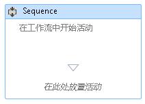
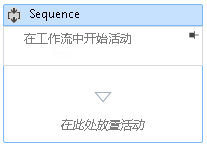

# 如何：在工作流设计器中给工作流添加备注
为方便创建更大、更复杂的工作流，[!INCLUDE[net_v45](../ide/includes/net_v45_md.md)] 允许开发人员在设计器中将批注添加到以下类型的项：  
  
-   <xref:System.Activities.Activity>  
  
-   <xref:System.Activities.Statements.State>  
  
-   <xref:System.Activities.Statements.Transition>  
  
-   从 <xref:System.Activities.Statements.FlowNode> 中派生的类  
  
-   <xref:System.Activities.Variable>  
  
-   <xref:System.Activities.Argument>  
  
> [!IMPORTANT]
>  批注的内容作为纯文本保存到与工作流关联的 XAML 文件，并可能被其他人读取。 将敏感信息输入批注时要谨慎。  
  
### 在设计器中将批注添加到活动  
  
1.  在工作流设计器中，右键单击设计器，然后选择工作流中的项**批注**，**添加批注**。  
  
2.  在提供的空白处添加批注的文本。  
  
3.  该项将显示批注图标。 将鼠标悬停在批注图标上将显示批注的文本。  
  
       
  
### 在活动设计器中显示批注  
  
1.  与活动设计器，它具有批注显示在活动外，单击**Pin**中批注装饰器图标。  
  
2.  批注将显示在活动设计器中。 在下面的屏幕快照中，活动设计器中显示批注“工作流中的开始活动”。  
  
       
  
3.  若要显示的活动设计器外部批注，请将鼠标悬停在活动的设计器中的批注区域，然后单击**取消固定**图标  
  
       
  
### 显示或隐藏所有批注  
  
1.  右键单击一个有批注的活动。 选择**批注**，**显示所有批注**。  
  
2.  所有批注将显示在活动设计器中。  
  
3.  若要显示的活动设计器之外的所有批注，右键单击该活动并选择**批注**，**隐藏所有批注**。  
  
### 编辑或删除活动的批注  
  
1.  右键单击一个有批注的活动。  
  
2.  选择**批注**，**编辑批注**或**删除批注**。  
  
3.  将打开批注以进行编辑或删除。  
  
4.  若要同时删除所有批注，请右键单击工作流设计器，然后选择**批注**，**都删除所有批注**。  
  
### 添加、编辑和删除变量或自变量的批注  
  
1.  右键单击某个变量或参数，然后选择“添加批注”。  
  
2.  输入批注的文本。 该变量或参数将显示一个批注图标。  
  
3.  右键单击有批注的某个变量或参数。 选择“编辑批注”。  
  
4.  将打开批注以进行编辑。  
  
5.  右键单击有批注的某个变量或参数。 选择“删除批注”。  
  
6.  将删除该批注。