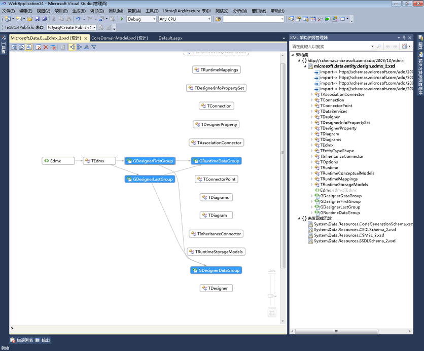
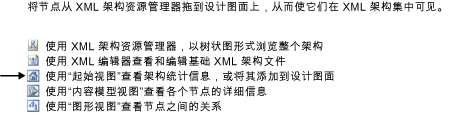

# 图形视图
[!INCLUDE[vs2017banner](../code-quality/includes/vs2017banner.md)]

图形视图提供全局架构节点的图形表示形式以及节点间的关系。请注意，图形视图不允许更改设计图面上架构集的布局。图形视图还包括 XML 架构设计器工具栏和痕迹栏。  
  
 下图显示的是图形视图，其设计图面上有六个全局节点。  
  
   
  
## 设计图面  
 图形视图的设计图面显示 [XML 架构设计器工作区](../xml-tools/xml-schema-designer-workspace.md)的内容。如果工作区包含来自架构集的任何全局节点，则这些节点会显示在图形视图的设计图面上，并会在具有关系的节点之间绘制箭头。  
  
 双击图形视图中的节点会打开 XML 编辑器。  
  
 若要从工作区中删除所选节点，请使用 XSD 设计器工具栏或 Delete 键。  
  
 如果设计图面为空，则会显示 XML 编辑器、XML 架构资源管理器和水印。“水印”是指向所有 XSD 设计器视图的链接的列表。  
  
   
  
 如果架构集有错误，则列表的末尾会显示以下文本：“请使用‘错误列表’查看和修复架构集中的错误”\[Use the Error List to view and fix the errors in the set\]。  
  
## 痕迹栏  
 图形视图底部的痕迹栏显示所选节点在架构集中所处的位置。如果选择了多个项，则痕迹栏将为空。  
  
## 上下文菜单  
 下表介绍了图形视图的设计图面上所有节点的可用选项。  
  
|选项|说明|  
|--------|--------|  
|**在 XML 架构资源管理器中显示**|将焦点置于架构资源管理器上，并突出显示架构集节点。|  
|**在图形视图中显示**|切换到图形视图（灰显）。|  
|**生成示例 XML**|仅可用于全局元素。生成全局元素的示例 XML 文件。|  
|**清空工作区**|清空工作区和设计图面。|  
|**从工作区中删除**|从工作区和设计图面中删除所选节点。|  
|**删除工作区中所有内容，所选内容除外**|从工作区和设计图面中删除未选择的节点。|  
|**将关系图导出为图像…**|将设计图面保存到 XPS 文件。|  
|**全选**|选择设计图面上的所有节点。|  
|**查看代码**|在 XML 编辑器中打开包含所选节点的文件。在 XML 架构资源管理器中选定的项也会在 XML 编辑器中选定。|  
|**属性窗口**|打开**“属性”**窗口（如果其尚未打开）。此窗口显示有关节点的信息。|  
  
 除了上述常用选项之外，全局元素的上下文菜单还拥有以下选项：  
  
|选项|说明|  
|--------|--------|  
|**添加类型定义**|将基类型添加到关系图中。|  
|**添加所有引用**|添加引用相应元素的所有节点，并绘制箭头以指示节点之间的关系。|  
|**添加替换组成员**|添加所有替换组成员。如果元素为替换组的头或成员，则此选项会显示在视图中。|  
|**生成示例 XML**|生成全局元素的示例 XML 文件。|  
  
 除了上述常用选项之外，全局简单类型和全局复杂类型的上下文菜单还拥有以下选项：  
  
|选项|说明|  
|--------|--------|  
|**添加基类型**|如果所选类型是从全局类型派生的，则添加所选类型的基类型。|  
|**添加所有引用**|添加所选类型的所有引用。其中包括所选类型和从所选类型派生的各种类型的元素和特性。|  
|**添加所有派生类型**|添加从所选类型直接和间接派生的所有类型。|  
|**添加所有上级**|添加所有父（基）类型。|  
  
 除了上述常用选项之外，全局组和特性组的上下文菜单还拥有以下选项：  
  
|选项|说明|  
|--------|--------|  
|**添加所有引用**|添加引用相应组的所有节点，并绘制箭头以指示节点之间的关系。|  
|**添加所有成员**|添加相应组的所有成员，并绘制箭头以指示成员之间的关系。|  
  
 除了上述常用选项之外，全局特性的上下文菜单还拥有以下选项：  
  
|选项|说明|  
|--------|--------|  
|**添加所有引用**|添加引用相应组的所有节点，并绘制箭头以指示节点之间的关系。|  
  
## 属性窗口  
 使用此上下文菜单可初始打开**“属性”**窗口。默认情况下，**“属性”**窗口显示在 Visual Studio 的右下角。单击“内容模型视图”中呈现的节点时，该节点的属性将显示在**“属性”**窗口中。  
  
## XSD 工具栏  
 当图形视图处于活动状态时，会启用以下 XSD 工具栏按钮。  
  
   
  
|选项|说明|  
|--------|--------|  
|**显示起始视图**|切换到[起始视图](../xml-tools/start-view.md)。可使用键盘快捷方式 **Ctrl\+1** 访问此视图。|  
|**显示内容模型视图**|切换到[内容模型视图](../xml-tools/content-model-view.md)。可使用键盘快捷方式 **Ctrl\+2** 访问此视图。|  
|**显示图形视图**|切换到[图形视图](../xml-tools/graph-view.md)。可使用键盘快捷方式 **Ctrl\+3** 访问此视图。|  
|**清空工作区**|清空工作区和设计图面。|  
|**从工作区中删除**|从工作区和设计图面中删除所选节点。|  
|**删除工作区中所有内容，所选内容除外**|从工作区和设计图面中删除未选择的节点。会在内容模型视图和图形视图中启用此选项。|  
|**从左到右**|将图形视图中的布局更改为节点的从左到右分层表示形式。可使用键盘快捷方式 **Alt\+向右键**访问此视图。|  
|**从右到左**|将图形视图中的布局更改为节点的从右到左分层表示形式。可使用键盘快捷方式 **Alt\+向左键**访问此选项。|  
|**从上到下**|将图形视图中的布局更改为节点的从上到下分层表示形式。可使用键盘快捷方式 **Alt\+向下键**访问此选项。|  
|**从下到上**|将图形视图中的布局更改为节点的从下到上分层表示形式。可使用键盘快捷方式 **Alt\+向上键**访问此选项。|  
  
## 平移\/滚动  
 可通过以下方法平移设计图面：使用滚动条，或在按住 Ctrl 键的同时单击并拖动鼠标。如果使用单击并拖动鼠标的方法平移设计图面，光标将更改为指向四个方向的十字箭头。  
  
## 撤消\/重做  
 在图形视图中，为以下操作启用了撤消\/重做功能：  
  
-   通过拖放操作添加单个节点。  
  
-   从架构资源管理器或起始视图查询的搜索结果窗口中添加多个节点。  
  
-   删除单个或多个节点。  
  
## 缩放  
 图形视图的右下角提供了缩放功能。  
  
 可通过以下方法控制缩放功能：  
  
-   当鼠标悬停在图形视图的图面上时，按住 Ctrl 键的同时滚动鼠标滚轮。  
  
-   使用滑块控件。滑块显示当前缩放级别。  
  
 当选择缩放滑块、将鼠标悬停在其上或将 Ctrl 与鼠标滚轮结合使用进行缩放时，缩放滑块是不透明的；在其他任何情况下，它均是透明的。  
  
## XML 编辑器集成  
 可通过以下方法在图形视图和 XML 编辑器之间来回切换：单击某个节点，然后使用“查看代码”上下文菜单。  
  
 如果在 XML 编辑器中对架构集进行更改，则相应的更改会在图形视图中同步。有关更多信息，请参见[与 XML 编辑器的集成](../xml-tools/integration-with-xml-editor.md)。  
  
## 请参阅  
 [设计图面](../xml-tools/xml-schema-designer-workspace.md)