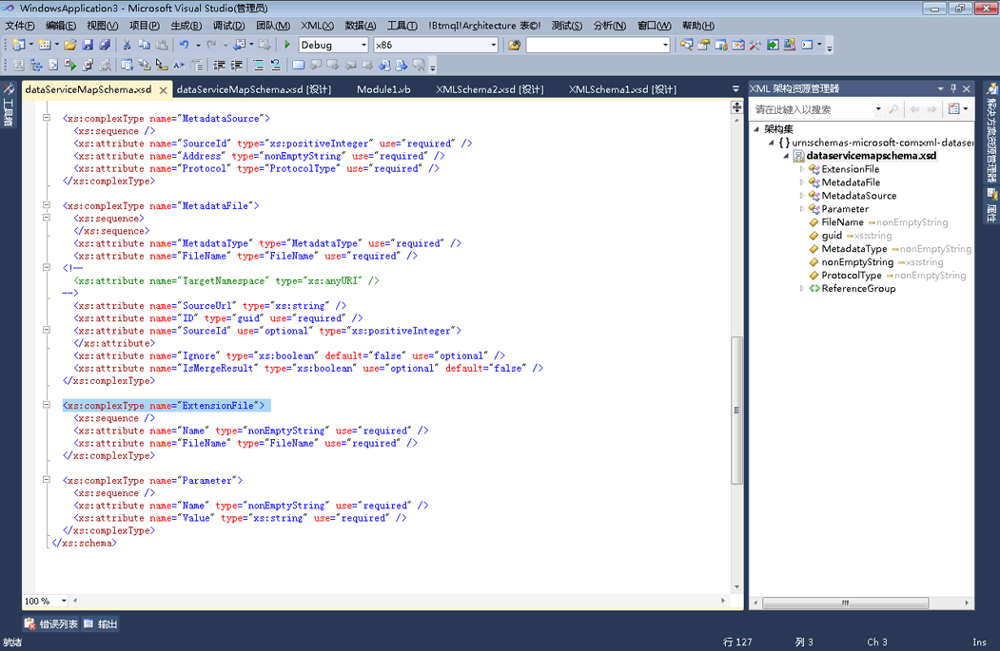

# XML 文本与 XML 架构资源管理器的集成
Visual Basic 支持 XML 文本，这意味着，你可以将 XML 片段合并直接到 Visual Basic 代码。 有关详细信息，请参阅[XML 文本概述](http://go.microsoft.com/fwlink/?LinkId=140325)。  
  
 如果 Visual Basic 项目中的 XSD 文件包括一个 XML 文本，则可以在 XML 架构资源管理器中查看 XML 架构集。 若要查看与 XML 文本关联的架构集，在 XML 文本或导入的 XML 命名空间中的 XML 节点上右键单击并选择**在架构资源管理器中显示**。  
  
   
  
 此操作将并行打开 XML 架构资源管理器和 Visual Basic 文件。  
  
 
  
## 请参阅  
[如何：将 XML 架构设计器用于 XML 文本](../xml-tools/how-to-use-the-xml-schema-designer-with-xml-literals.md)