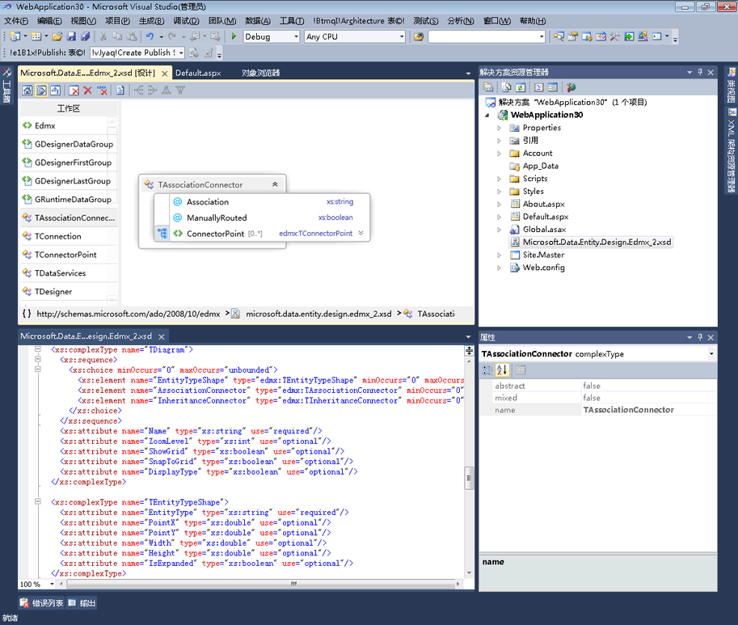

# 与 XML 编辑器的集成
XML 编辑器中集成了 XML 架构设计器。 如果你修改 XSD 文件在 XML 编辑器中，此更改将反映在[XML 架构资源管理器](../xml-tools/xml-schema-explorer.md)。 如果你有[图形视图](../xml-tools/graph-view.md)或[内容模型视图](../xml-tools/content-model-view.md)打开，更改也会反映在存在。 可通过以下方法在 XML 架构设计器和 XML 编辑器之间导航：  
  
-   在 XML 编辑器中，右键单击某个节点并选择**在 XML 架构资源管理器中显示**。  
  
-   在图形视图和 XML 架构资源管理器中，双击某个节点，或右键单击某个节点并选择**查看代码**。 在内容模型视图中，右键单击某个节点并选择**查看代码**。  
  
以下屏幕快照显示了在 XML 架构资源管理器中打开的 XML 架构。 XML 架构资源管理器在树视图中显示架构集。 XML 编辑器显示当前在 XML 架构资源管理器中处于活动状态的节点的文本视图。  
  
  
  
有时，在 XML 编辑器中和在图形设计器中并行查看代码是很有帮助的。 若要同时查看这两个文件，右键单击任意位置在 XML 编辑器中，然后选择**视图设计器**。 在 Visual Studio Windows 菜单中，选择**新水平 （或垂直） 选项卡组**。  
  
  
  
## 另请参阅  
 [XML 架构资源管理器](../xml-tools/xml-schema-explorer.md)