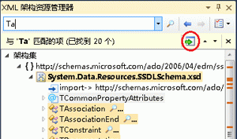

# 搜索架构集
[!INCLUDE[vs2017banner](../code-quality/includes/vs2017banner.md)]

使用 XML 架构资源管理器可以通过下列方式搜索架构集：  
  
-   关键字搜索。  
  
-   特定于架构的搜索。  
  
## 关键字搜索  
 可通过在 XML 架构资源管理器工具栏的**“搜索架构集”\[Search SchemaSet\]**文本框中输入子字符串来执行关键字搜索。  
  
   
  
 XML 架构资源管理器在架构集中搜索以下内容：  
  
-   与指定关键字匹配的任何 `name` 或 `ref` 特性。这样，您可以按名称来查找元素、特性、类型等。  
  
-   包括语句的 `schemaLocation` 特性。  
  
-   导入语句的 `namespace` 特性。  
  
## 特定于架构的搜索  
 XML 架构资源管理器中还包含一些内置搜索，可使用 XML 架构资源管理器的上下文菜单访问这些搜索。有关可用上下文菜单的更多信息，请参见 [上下文菜单](../xml-tools/context-menus-xml-schema-explorer.md)。还可从起始视图执行特定于架构的搜索；有关更多信息，请参见[起始视图](../xml-tools/start-view.md)主题中的“架构集详细信息”一节。  
  
## 显示和导航搜索结果  
 完成搜索后，摘要结果窗格会添加到工具栏中，其中显示搜索的结果。搜索结果还会突出显示在 XML 架构资源管理器中，并用垂直滚动条上的刻度标记。可通过以下方式导航搜索结果：使用 XML 架构资源管理器工具栏的摘要结果窗格上的**“转至下一搜索结果”**和**“转至前一搜索结果”**按钮；使用键盘键 F3 和 Shift\+F3；或单击滚动条上的刻度线。  
  
 可通过单击摘要结果窗格上的**“将突出显示的节点添加到工作区”**按钮来将搜索结果添加到工作区中。  
  
   
  
## 清除搜索结果  
 若要清除搜索结果，请单击 XML 架构资源管理器搜索工具栏的摘要结果窗格上的**“x”**按钮。  
  
## 请参阅  
 [XML 架构资源管理器](../xml-tools/xml-schema-explorer.md)