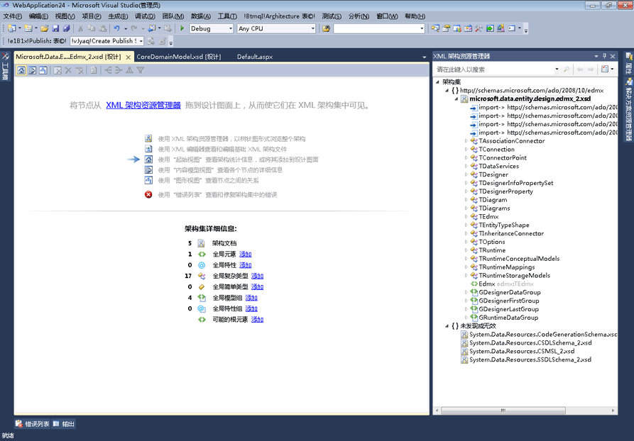

# 起始视图
起始视图是 XML 架构 (XSD) 设计器的启动点。 创建新的 XSD 文件时，您将最初看到起始视图。  
  
 起始视图包含两个主要部分，*水印*和**架构集详细信息**窗格。 起始视图还包括在所有 XSD 设计器视图中都可用的工具栏。  
  
   
  
## 水印  
 水印窗格包含指向所有 XSD 设计器视图、XML 编辑器和 XML 架构资源管理器的链接的列表。 如果架构集有错误，则列表的末尾会显示以下文本：“请使用‘错误列表’查看和修复架构集中的错误”[Use the Error List to view and fix the errors in the set]。  
  
## 架构集详细信息  
 **架构集详细信息**窗格列出全局架构节点类型，并显示每个类型的架构中有多少个实例。 你可以使用**添加**要将新节点添加到工作区中的节点类型旁边的链接。  
  
## Toolbar  
 您可以在起始视图间进行导航[内容模型视图](../xml-tools/content-model-view.md)和[图形视图](../xml-tools/graph-view.md)从 XML 架构设计器工具栏。  
  
   
  
 当起始视图处于活动状态时，会在 XSD 设计器工具栏中启用以下按钮：  
  
|选项|描述|  
|------------|-----------------|  
|**显示起始视图**|切换到起始视图。 此视图可以通过使用键盘快捷方式访问： **CTRL + 1**。|  
|**显示内容模型视图**|切换到内容模型视图。 此视图可以通过使用键盘快捷方式访问： **CTRL + 2**。|  
|**显示关系图视图**|切换到图形视图。 此视图可以通过使用键盘快捷方式访问： **CTRL + 3**。|  
  
## 另请参阅  
 [XML 架构资源管理器](../xml-tools/xml-schema-explorer.md)   
 [图形视图](../xml-tools/graph-view.md)   
 [内容模型视图](../xml-tools/content-model-view.md)   
 [XML 编辑器](../xml-tools/xml-editor.md)