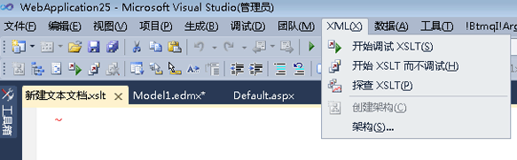

# XSLT 探查器
[!INCLUDE[vs2017banner](../code-quality/includes/vs2017banner.md)]

XSLT 探查器是一个性能分析探查器工具，可帮助您开发和调试 XSLT 文档。开发人员可使用 XSLT 探查器来创建详细的 XSLT 性能报告，从而对 XSLT 代码中与性能相关的问题进行衡量和评估。XSLT 探查器包含 XSL 和 XSLT 样式表优化的有用提示，这对需要最佳性能的基于 XSLT 的应用程序必不可少。  
  
 XSLT 探查器是 Visual Studio 2010 的一部分，可通过 Visual Studio 的**“XML”**菜单来访问。  
  
   
  
 XSLT 探查器最初是作为 Visual Studio 2008 的外接程序而引入的。有关更多信息，请参见 [Visual Studio 2008 年 2 月社区技术预览中的 XSLT 探查器](http://go.microsoft.com/fwlink/?LinkId=142987)网页（可能为英文网页）上的“相关资源”部分。  
  
> [!NOTE]
>  Visual Studio 2010 中的有些屏幕显示可能会与这些文档中介绍的不同，因为自 Visual Studio 2008 开始，一些可视元素已发生更改。  
  
## 请参阅  
 [演练：XSLT 探查器](../xml-tools/walkthrough-xslt-profiler.md)