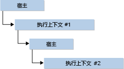

# <a name="hosting-the-javascript-runtime"></a>承载 JavaScript 运行时
JavaScript 运行时 (JsRT) API 采用基于标准并被 Microsoft Edge 和 Internet Explorer 使用的 Chakra JavaScript 引擎，为 Windows 操作系统上运行的桌面、Windows 应用商店和服务器端应用程序提供了一种在应用程序中添加脚本功能的途径。 凡是在计算机中安装 Internet Explorer 11.0 版的 Windows 10 以及其他 Windows 操作系统版本都提供这些 API。 有关更多信息，请参见 [Reference (JavaScript Runtime)](../chakra-hosting/reference-javascript-runtime.md)。 有关在 Windows 应用商店应用中使用 JsRT 的信息，请参阅 [JsRT and the Universal Windows Platform](#Windows)。  
  
> [!NOTE]
>  本文档假定用户熟悉 JavaScript 语言并可运用此语言完成常规工作。  
  
## <a name="concepts"></a>概念  
 明白这样一个事实，即如何使用 JsRT API 托管 JavaScript 引擎的方式取决于两个关键概念：运行时和执行上下文。  
  
 “运行时”  表示完整的 JavaScript 执行环境。 所创建的每个运行时都有自己的独立垃圾回收堆，默认情况下，还拥有自己的实时 (JIT) 编译器线程和垃圾回收器 (GC) 线程。 *执行上下文* 代表的 JavaScript 环境拥有自己不同于其他执行上下文的 JavaScript 全局对象。 一个运行时可以包含多个执行上下文，在此类情况下，所有执行上下文共享与该运行时关联 JIT 编译器和的 GC 线程。  
  
 运行时表示单个执行线程。 在特定线程上，一次只能有一个运行时处于活动状态，并且运行时一次只能在一个线程上处于活动状态。 运行时采取线程租用方式，因此当前没有在线程中处于活动状态的运行时（即未运行任何 JavaScript 代码或响应来自主机的任何调用）可由尚未存在活动运行时的线程使用。  
  
 执行上下文绑定到特定运行时并执行该运行时中的代码。 与运行时不同，多个执行上下文可以同时在一个线程中处于活动状态。 因此，主机可以调入某个执行上下文，该执行上下文可回调主机，并且主机可以调入不同的执行上下文。  
  
   
  
 实际上，除非托管需要在独立的环境中运行代码，否则可以使用单个执行上下文。 同样，除非托管需要同时运行代码的多个部分，否则一个运行时就足够了。  
  
## <a name="memory-management"></a>内存管理  
 JavaScript 是一种垃圾回收语言，因此在使用由其他语言编写的 JsRT API 时必须注意若干事项。  
  
 需要注意的主要事项在于，JavaScript 垃圾回收器只能发现对两个位置的值引用：其运行时堆和堆栈。 因此，垃圾回收器始终能够发现对另一个 JavaScript 值内或堆栈局部变量中存储的 JavaScript 值的引用。 但是，在其他位置（如主机或系统托管的堆）存储的引用将不会被垃圾回收器发现，并且可能导致提前回收仍在由主机使用的值。  
  
> [!IMPORTANT]
>  某些语言编译器（如 Visual Studio C++ 编译器）会尽可能将优化掉局部变量。 如果引用 JavaScript 值的局部变量需要保留这些值，则必须注意确保此类变量位于堆栈上。  
  
 如果对 JavaScript 值的引用将存储在垃圾回收器不可见的位置，主机必须手动添加和移除使用 JsRT API 的引用。  
  
## <a name="exception-handling"></a>异常处理  
 如果脚本执行期间发生 JavaScript 异常，系统会将包含的运行时置于异常状态。 在异常状态下，无法运行任何代码，所有 API 调用都会失败并显示错误代码 `JsErrorInExceptionState` ，直至主机使用 `JsGetAndClearException` API 检索并清除异常。 如果主机从 JavaScript 回调返回，而没有清除运行时的异常状态，则一旦控制权传递回 JavaScript 引擎，将再次引发 JavaScript 异常。 这样，主机可将运行时设置为异常状态并从主机回调返回，从而使主机回调“引发”JavaScript 异常。  
  
 主机不能使其自己的内部异常通过主机回调传播，任何回调方法必须捕获所有主机异常，才能向运行时返回控制权。  
  
## <a name="runtime-resource-usage"></a>运行时资源使用方式  
 JsRT API 公开了一系列方法来监控和修改运行时使用资源的方式。 它们通常分为以下类别：  
  
-   **线程使用方式**。 默认情况下，每个运行时都将创建专用的 JIT 编译器线程和专用的 GC 线程来服务于该运行时。 如果创建的运行时带有 `JsRuntimeAttributeDisableBackgroundWork` 标志，则在运行时线程中执行 JIT 和 GC 作业，而不是为每项作业创建单独的后台线程。 主机还提供对 `JsCreateRuntime` 调用的线程服务回调，这样即可以它认为合适的任何方式来计划 JIT 和 GC 作业。  
  
-   **内存使用率**。 有几种方法可用于监控和修改运行时使用内存的方式。 如果运行时长时间运行，主机可以在创建运行时指定 `JsRuntimeAttributeEnableIdleProcessing` 标志，并在主机处于空闲状态时调用 `JsIdle` 。 这样，引擎就可以推迟一些内存清理和簿记工作，直到主机空闲下来。  
  
     主机可以通过调用 `JsSetRuntimeBeforeCollectCallback`监控垃圾回收。 通过调用 `JsSetRuntimeMemoryAllocationCallback`，它还可以监控由堆进行的分配。 请注意，此 API 不会在每次 JavaScript 分配时都进行回调，而只在运行时堆需要分配更多的空间时才进行回调。 内存分配回调可以拒绝请求，这将触发垃圾回收，如果内存不可用，则在运行时中触发内存不足错误。  
  
     主机还可以调用 `JsSetRuntimeMemoryLimit` 为一个运行时所能使用的内存量设置一个限制。 当运行时达到限制时，它将触发垃圾回收，如果内存不可用，则运行时将引发内存不足错误。  
  
-   **脚本中断与评估**。 主机可以调用 `JsDisableRuntimeExecution` 来停止运行时中执行的操作。 主机可随时从任意线程执行此调用。 由于脚本终止取决于是否到达插入代码中的保护点，因此脚本可能不会准时终止，但是不久之后将会终止。 默认情况下，为谨慎起见，终止保护点被放置在生成的代码中，并且可能不包括每一种情况，例如无限循环。 如果创建的运行时带有 `JsRuntimeAttributeAllowScriptInterrupt` 标志，则会导致运行时通常以较小的性能开销成本插入对无限循环的检查。  
  
     如果主机希望禁止 JIT 编译器生成本机代码，可以指定 `JsRuntimeAttributeDisableNativeCodeGeneration` 标志。 主机还可以通过指定 `JsRuntimeAttributeDisableEval` 标志来禁止脚本以动态方式运行自身。  
  
## <a name="debugging-and-profiling"></a>调试和分析  
 JsRT API 通过活动脚本技术支持调试和分析。  
  
 从 Windows 10 开始，Chakra JavaScript 引擎支持旧引擎和 Edge 引擎，并且也可以面向 JsRT（请参阅[面向 Edge 和旧引擎](../chakra-hosting/targeting-edge-vs-legacy-engines-in-jsrt-apis.md)获取详细信息）。 利用旧引擎在 Visual Studio 中调试脚本与利用 Microsoft Edge 引擎调试脚本有所不同。 使用旧引擎时，主机需要提供 [IDebugApplication 接口](../winscript/reference/idebugapplication-interface.md)指针，该指针可以从 [IProcessDebugManager 接口](../winscript/reference/iprocessdebugmanager-interface.md)实例中获取。 使用 Edge 引擎时， `IDebugApplication` 被弃用，并且 Chakra 引擎能够通过 Visual Studio 调试器启用本机和脚本调试功能，而无需从用户处实现 `IDebugApplication` 。  
  
 若要使脚本能够在执行上下文中可调试，Chakra 引擎必须切换到使用效率较低的代码执行方法。 同样，可调试的代码的运行速度通常比非可调试的代码慢。 因此，使用旧引擎时，主机可以选择通过 `IDebugApplication` 提供 `JsCreateContext`指针，以便从最开始的上下文执行开始调试，也可以等待，直到需要调试时再调用 `JsStartDebugging`。 使用 Edge 引擎时， `JsCreateContext` 不会再采用 `IDebugApplication` 参数，因此，只有调用 `JsStartDebugging` 之后才可调用脚本。 在使用 Visual Studio 调试时，必须启用“脚本”调试器选项。  
  
 执行上下文中的 JavaScript 代码可以通过以下两种方式之一中进行分析。 命令行 Visual Studio 探查器 (vsperf.exe) 可用于 Windows 8.1 和更高版本，并可通过 /js 开关生成一份针对应用程序中运行的 JavaScript 代码的报告。 主机也可以直接调用 `JsStartProfiling` 和 `JsStopProfiling` 并提供回调来自己执行分析。 主机还可以通过调用 `JsEnumerateHeap`检查垃圾回收堆的状态。 JsRT 中的分析与在旧引擎和在 Edge 引擎中的工作方式相同。 但是，JsRT 分析 API（`JsStartProfiling`、`JsStopProfiling``JsEnumerateHeap` 和 `JsIsEnumeratingHeap`）不适用于通用 Windows 应用。  
  
<a name="Windows"></a>   
## <a name="jsrt-and-the-universal-windows-platform"></a>JsRT 和通用 Windows 平台  
 JsRT API 可用于将脚本功能添加到通用 Windows 应用中。 使用 JsRT API 的通用 Windows 应用将需要面向 Edge JSRT API，以面向 Edge Chakra 引擎。 有关详细信息，请参阅[面向 JsRT API 中的 Microsoft Edge 引擎和旧引擎](../chakra-hosting/targeting-edge-vs-legacy-engines-in-jsrt-apis.md)。 完整的 JsRT API 可适用于通用 Windows 应用，但分析和堆枚举支持除外（不支持`JsStartProfiling`、 `JsStopProfiling`、 `JsEnumerateHeap`和 `JsIsEnumeratingHeap` ）。  
  
 在通过 Edge JsRT API [公开 API 命名空间后，JsRT 还允许脚本以本机方式访问任何](https://msdn.microsoft.com/en-us/library/windows/apps/br211377.aspx) 通用 Windows 平台 (UWP) API `JsProjectWinRTNamespace`。 虽然通用 Windows 应用程序除了投影必要的命名空间外不需要进行设置，但在经典 (Win32) Windows 应用程序中，则需要利用 `JsSetProjectionEnqueueCallback` 启用 COM 初始化的委托发送机制来启用事件和异步 API。 下面的 Win32 示例利用异步 UWP API 创建 http 客户端以便从 Uri 中获取内容：  
  
```cpp  
typedef struct _jsCall {  
    JsProjectionCallback jsCallback;  
    JsProjectionCallbackContext jsContext;  
    HANDLE event;  
} jsCall;  
  
// Set up delegated pumping mechanism; not necessary in UWP applications.  
jsCall outstandingCall = {};  
CoInitializeEx(nullptr, COINIT_MULTITHREADED);  
JsSetProjectionEnqueueCallback([](JsProjectionCallback jsCallback,   
JsProjectionCallbackContext jsContext, void *callbackState) {  
    jsCall* call = (jsCall*)callbackState;  
    call->jsCallback = jsCallback;  
    call->jsContext = jsContext;  
    SetEvent(call->event);  
    },  
&outstandingCall);  
HANDLE event = CreateEventEx(NULL, NULL, CREATE_EVENT_MANUAL_RESET, EVENT_ALL_ACCESS);  
outstandingCall.event = event;  
  
// Project necessary namespaces.  
JsProjectWinRTNamespace(L"Windows.Foundation");  
JsProjectWinRTNamespace(L"Windows.Web");  
  
// Get content from an Uri.  
JsRunScript(L"var uri = new Windows.Foundation.Uri(\"http://somedatasource.com\"); " \  
    L"var httpClient = new Windows.Web.Http.HttpClient();" \  
    L"httpClient.getStringAsync(uri).done(function (content) { " \  
    L"    // do something with the string content " \    
    L"}, onError); " \  
    L"function onError(reason) { " \  
    L"    // error handling " \        
    L"}",   
    currentSourceContext, L"", &result);  
  
// Wait for async call to come in and then execute; not necessary in UWP applications.  
WaitForSingleObjectEx(outstandingCall.event, 10000, FALSE) == WAIT_OBJECT_0;  
outstandingCall.jsCallback(outstandingCall.jsContext);  
  
```  
  
## <a name="see-also"></a>另请参阅  
 [JavaScript 运行时示例应用](http://go.microsoft.com/fwlink/p/?LinkID=306674&clcid=0x409)   
 [引用（JavaScript 运行时）](../chakra-hosting/reference-javascript-runtime.md)   
 [JavaScript 运行时承载](../chakra-hosting/javascript-runtime-hosting.md)